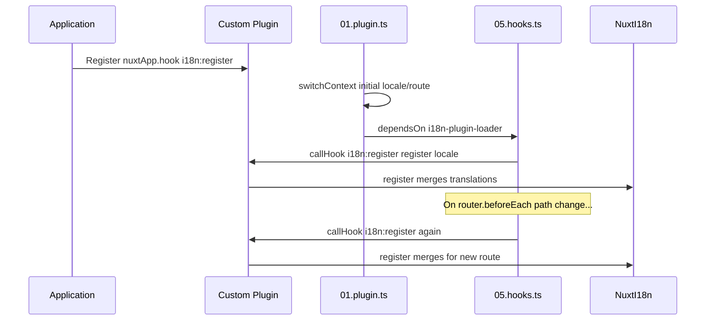

Nuxt I18n Micro exposes three app-level hooks on `nuxtApp` for reacting to translation loading and locale switches. Register listeners with `nuxtApp.hook(name, handler)` inside a Nuxt plugin.

| Hook                        | Fires                                                                                    | Purpose                                                             |
| --------------------------- | ---------------------------------------------------------------------------------------- | ------------------------------------------------------------------- |
| `i18n:register`             | After the loader is ready, and again on relevant navigation                              | Register additional translations for the active locale              |
| `i18n:beforeLocaleSwitch`   | Just before a locale switch begins                                                       | Inspect or short-circuit the switch, run pre-switch side effects    |
| `i18n:afterLocaleSwitch`    | Once the new locale is active and its chunks are loaded                                  | Persist analytics, refetch data, trigger transitions                |

The hooks plugin (`05.hooks.ts`, `dependsOn: ['i18n-plugin-loader']`) fires these after `01.plugin.ts` has finished loading the initial route.

Set `hooks: false` in `nuxt.config` to disable them entirely (see [Configuration — `hooks`](/guides/configuration#hooks) and [module options → Registration](/api/module-options#registration)).

## `i18n:register`

The `i18n:register` hook enables dynamic addition of translations to your app's i18n context. Use it to integrate new translations from any source, at any time.

### Signature

```ts
nuxtApp.hook(
  'i18n:register',
  (register: (translations: Translations, locale?: string) => void, locale: string) => void | Promise<void>
)
```

- **`register`**: a function you call with new translations to merge them into the active dictionary.
  - **`translations`** (`Translations`): key/value pairs to merge, organized per the `Translations` interface.
  - **`locale`** (`string`, optional): the locale code to register the translations under. Defaults to the current one.
- **`locale`** (`string`): the locale that just became active, provided by the event.

### When it fires

1. **Once on startup**, after the main i18n plugin (`01.plugin.ts`) has loaded translations for the initial route.
2. **On navigation**, in `router.beforeEach` when the path changes, or on every navigation when `strategy: 'no_prefix'`.

### Example

```typescript
// plugins/i18n-register.ts
export default defineNuxtPlugin((nuxtApp) => {
  nuxtApp.hook('i18n:register', async (register, locale) => {
    register(
      {
        greeting: 'Hello',
        farewell: 'Goodbye',
      },
      locale,
    )
  })
})
```

### Sequence



### Loading translations from external sources

The most common use of `i18n:register` is loading translations from a source other than the file system, for example a CMS, an API, or a JSON module. Register a plugin that hooks the event and returns the loaded data:

```typescript
// plugins/extend-locales.ts
import { defineNuxtPlugin } from '#app'

export default defineNuxtPlugin(async (nuxtApp) => {
  const loadTranslations = async (lang: string) => {
    try {
      const translations = await import(`../locales/${lang}.json`)
      return translations.default
    }
    catch (error) {
      console.error(`Error loading translations for language: ${lang}`, error)
      return null
    }
  }

  nuxtApp.hook('i18n:register', async (register, locale) => {
    const translations = await loadTranslations(locale)
    if (translations) {
      register(translations, locale)
    }
  })
})
```

If you ship this as part of a Nuxt module, register the plugin from your module setup:

```javascript
addPlugin({
  src: resolve('./plugins/extend-locales'),
})
```

## `i18n:beforeLocaleSwitch`

Fires just before the module switches locales, whether the switch was triggered by `$switchLocale`, a URL change, or the initial page load with a redirect.

### Signature

```ts
nuxtApp.hook(
  'i18n:beforeLocaleSwitch',
  (payload: { oldLocale: string; newLocale: string; initial: boolean; context: NuxtApp }) => void | Promise<void>
)
```

- **`oldLocale`**: locale currently active.
- **`newLocale`**: locale the app is about to switch to.
- **`initial`**: `true` when the switch is the initial locale selection at app startup, `false` for subsequent switches.
- **`context`**: the current `NuxtApp` instance.

### Example

```typescript
// plugins/analytics-locale.ts
export default defineNuxtPlugin((nuxtApp) => {
  nuxtApp.hook('i18n:beforeLocaleSwitch', ({ oldLocale, newLocale, initial }) => {
    if (initial) return
    console.log(`Switching locale: ${oldLocale} → ${newLocale}`)
  })
})
```

<Note>
  This hook runs before translations for the new locale are loaded. Do not call `$t()` in the handler expecting new-locale keys yet, use `i18n:afterLocaleSwitch` for that.
</Note>

## `i18n:afterLocaleSwitch`

Fires once the new locale is active and its translations are available.

### Signature

```ts
nuxtApp.hook(
  'i18n:afterLocaleSwitch',
  (payload: { oldLocale: string; newLocale: string; initial: boolean; context: NuxtApp }) => void | Promise<void>
)
```

The payload has the same shape as `i18n:beforeLocaleSwitch`.

### Example

```typescript
// plugins/analytics-locale.ts
export default defineNuxtPlugin((nuxtApp) => {
  nuxtApp.hook('i18n:afterLocaleSwitch', async ({ newLocale }) => {
    await $fetch('/api/analytics/locale', {
      method: 'POST',
      body: { locale: newLocale },
    })
  })
})
```

Common uses:

- Refetching user data or feature flags that depend on locale.
- Emitting analytics events for locale changes.
- Refreshing external widgets or third-party embeds that hold their own locale.

## Related

- [Module options → Registration](/api/module-options#registration): disable the hooks plugin with `hooks: false`.
- [Custom language detection](/guides/custom-language-detection): plug into locale resolution before the switch happens.
- [Methods → `$switchLocale`](/api/methods#switchlocale): the runtime entry point that triggers these hooks.
