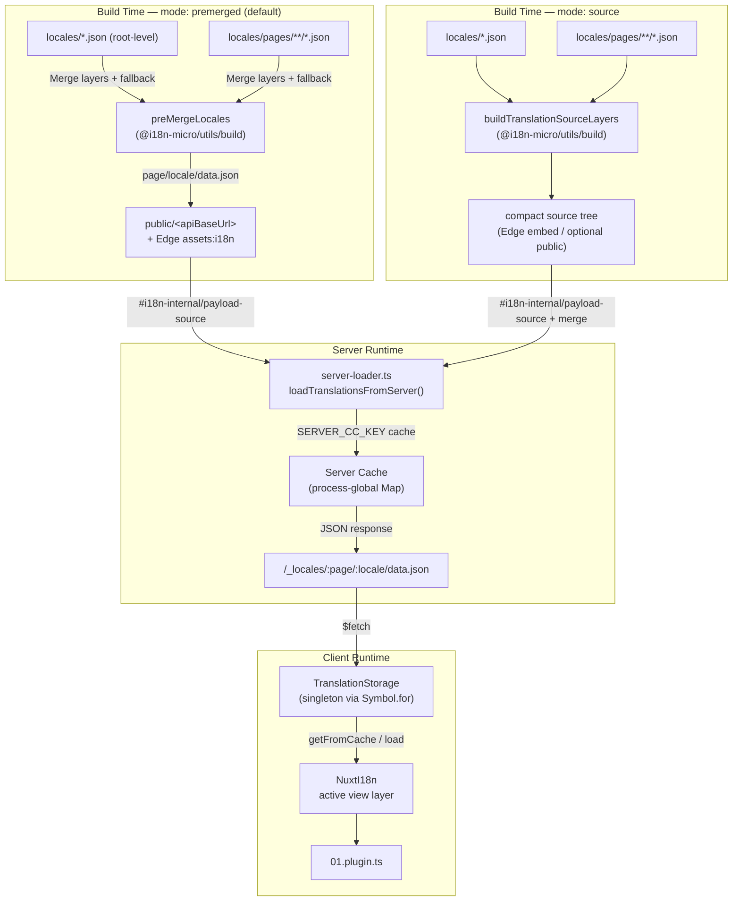

# 🗄️ معمارية ذاكرة الترجمة والتخزين المؤقت

## 📖 نظرة عامة

يستخدم Nuxt I18n Micro v3 معمارية تخزين مؤقت متعددة الطبقات للترجمات. يعتمد تحميل الحمولة على `translationPayloads.mode`:

- **`premerged`** (الافتراضي) — تُدمج ملفات الجذر والصفحة والاحتياط والطبقة في وقت البناء عبر `@i18n-micro/utils/build` في `\{page\}/\{locale\}/data.json`
- **`source`** — تُحفظ ملفات المصدر المضغوطة لدمج وقت التشغيل عبر `@i18n-micro/utils/source-loader` و `@i18n-micro/utils/merge-source` (تُضمّنها Edge في `serverAssets` لـ Nitro؛ يقرأها Node من `public/` عند نسخها)

توضّح هذه الصفحة كيف تعمل ذاكرة التخزين المؤقت المدمجة وكيفية توسيعها لحالات الاستخدام المخصصة (أدوات المسؤول، واجهات API الخارجية، إبطال ذاكرة التخزين المؤقت).

## 📊 نظرة عامة على المعمارية

### تدفّق البيانات



## 🧱 المكوّنات الأساسية

### 1. `TranslationStorage` (العميل + الخادم)

**الملف**: `src/runtime/utils/storage.ts`

فئة مفردة توفّر تخزين ترجمة موحداً لكل من العميل والخادم. تستخدم `Symbol.for('__NUXT_I18N_STORAGE_CACHE__')` على `globalThis` لضمان وجود نسخة واحدة فقط، حتى عند تحميل حزم متعددة.

**الدوال الرئيسية:**

| الدالة                              | الوصف                                                            |
| ----------------------------------- | ---------------------------------------------------------------- |
| `getFromCache(locale, routeName?)`  | فحص متزامن: يُرجع البيانات المخزّنة في الذاكرة، أو `null`            |
| `load(locale, routeName?, options)` | تحميل غير متزامن مع تخزين مؤقت: يفحص ذاكرة التخزين المؤقت أولاً، ثم يجلب عبر `$fetch` |
| `clear()`                           | يمسح ذاكرة التخزين المؤقت بأكملها                                                |

**تنسيق مفتاح ذاكرة التخزين المؤقت**: `\{locale\}:\{routeName\}` (مثل `en:index` و `fr:about`)

```typescript
import { translationStorage } from '../utils/storage'

// Synchronous cache check
const cached = translationStorage.getFromCache('en', 'index')

// Async load (with automatic caching)
const result = await translationStorage.load('en', 'index', {
  apiBaseUrl: '_locales',
  baseURL: '/',
  dateBuild: '2024-01-01',
})
// result.data — merged translations
// result.cacheKey — cache key used
```

### ⚙️ كسر ذاكرة التخزين المؤقت الحتمي (`i18n.dateBuild`)

افتراضياً، تُولّد هذه الوحدة `dateBuild` أثناء وقت البناء باستخدام `Date.now()`. تُضمَّن بعد ذلك في `#build/i18n.strategy.mjs` المُولَّد وتُستخدم كمعامل استعلام (`?v=...`) لإبطال ذاكرات التخزين المؤقت لجلب الترجمة بعد إعادة البناء.

إذا كنت بحاجة إلى بناءات قابلة للتكرار (على سبيل المثال، لتحسين معدلات إصابة ذاكرة التخزين المؤقت للأجزاء في عمليات النشر المتدحرجة)، اضبط قيمة مستقرة في `nuxt.config`:

```ts
export default defineNuxtConfig({
  i18n: {
    // Any stable string/number (git SHA, CI build number, release tag, etc.)
    dateBuild: process.env.GIT_SHA ?? 'local-dev',
  },
})
```

### 2. `loadTranslationsFromServer()` (على الخادم فقط)

**الملف**: `src/runtime/server/utils/server-loader.ts`

يحمّل الترجمات للغة/صفحة ويخزّن النتيجة المدموجة مؤقتاً في خريطة `CacheControl` عامة للعملية مفتوحة على `@i18n-micro/hmr/cache-keys` (`SERVER_CC_KEY`).

السلوك: يحمّل SSR من `#i18n-internal/payload-source` — **Node** `readFile` تحت `public/<apiBaseUrl>` (`\{page\}/\{locale\}/data.json` في وضع premerged)، **Edge** `assets:i18n`. يقرأ `premerged` ملفاً واحداً؛ يدمج `source` الجذر/الصفحة/الاحتياط عبر `@i18n-micro/utils/source-loader`.

```typescript
import { loadTranslationsFromServer } from '../server/utils/server-loader'

// Returns { data: Translations, json: string }
const { data, json } = await loadTranslationsFromServer('en', 'index')
```

### 3. تحميل العميل (بدون تضمين HTML)

**لا** تُكتب القواميس في `nuxtApp.payload`. يحتفظ الخادم بها في الذاكرة لعرض SSR؛
تنتظر إضافة العميل `switchContext`، التي تحمّل `/\{apiBaseUrl\}/:page/:locale/data.json`
(نفس الوضع الافتراضي مثل `@nuxtjs/i18n` مع `experimental.preload: false`).

يحتفظ `NuxtI18n` بقاموس طبقة العرض النشط المستخدم بواسطة `$t()` و `$has()`. يبدّل `NuxtTranslationLoader` سياق اللغة/المسار ويدمج الأجزاء في تلك الطبقة.

### 4. مسار API للخادم

**المسار**: `/_locales/\{page\}/\{locale\}/data.json`

**الملف**: `src/runtime/server/routes/i18n.ts`

يخدم مسار Nitro هذا الترجمات المدموجة لوضع الحمولة النشط. يستدعي `loadTranslationsFromServer()` ويُرجع النتيجة كـ JSON.

في الإنتاج، يضبط أيضاً:

```http
Cache-Control: public, max-age={httpCacheDuration}, immutable
```

القيمة الافتراضية لـ `httpCacheDuration` هي `31536000` (سنة واحدة). هذا آمن لأن العملاء يطلبون الحمولات مع كسر ذاكرة التخزين المؤقت `?v=\{dateBuild\}`. اضبط `httpCacheDuration: 0` لحذف الترويسة. لا تُطبَّق الترويسة في وضع التطوير.

## 📥 التوسيع: تحميل الترجمة المخصص

### القراءة من ذاكرة التخزين المؤقت (مسار الخادم)

```ts
// server/api/i18n/load-cache.[post].ts
import { defineEventHandler, readBody } from 'h3'
import { loadTranslationsFromServer } from '#imports'

export default defineEventHandler(async (event) => {
  const { page, locale } = await readBody<{ page: string; locale: string }>(event)
  const { data } = await loadTranslationsFromServer(locale, page)
  return { locale, page, data }
})
```

### تحديث الترجمات (الملف + إبطال ذاكرة التخزين المؤقت)

```ts
// server/api/i18n/update.[post].ts
import { defineEventHandler, readBody, createError } from 'h3'
import { join } from 'node:path'
import { readFile, writeFile } from 'node:fs/promises'
import { deepMergeTranslations } from '@i18n-micro/utils/deep-merge'

export default defineEventHandler(async (event) => {
  const { path, updates } = await readBody<{ path: string; updates: Record<string, unknown> }>(event)

  if (!path || !updates) {
    throw createError({ statusCode: 400, statusMessage: 'Missing path or updates' })
  }

  const fullPath = join('locales', path)
  let existing: Record<string, unknown> = {}

  try {
    const content = await readFile(fullPath, 'utf-8')
    existing = JSON.parse(content) as Record<string, unknown>
  } catch {
    // File does not exist — create new
  }

  const merged = deepMergeTranslations(existing, updates)
  await writeFile(fullPath, JSON.stringify(merged, null, 2), 'utf-8')

  return { success: true, path, updated: merged }
})
```


## 🧹 مسح ذاكرة التخزين المؤقت

### مسح ذاكرة التخزين المؤقت برمجياً (العميل)

استخدم دالة `$clearCache` المدمجة:

```vue
<script setup>
const { $clearCache } = useNuxtApp()

// Clears both TranslationStorage and plugin-level cache
$clearCache()
</script>
```

### سلوك ذاكرة التخزين المؤقت على الخادم

ذاكرة التخزين المؤقت من جانب الخادم (`loadTranslationsFromServer`) عامة للعملية وتستمر حتى:

- إعادة تشغيل عملية الخادم
- اكتشاف نشر جديد (قيمة `dateBuild` مختلفة)

بالنسبة لبيئات serverless، كل بدء بارد يحصل على ذاكرة تخزين مؤقت جديدة.

## ⚙️ تكوين Serverless

بالنسبة لبيئات serverless (Cloudflare Workers و AWS Lambda)، تستخدم ذاكرة التخزين المؤقت المدمجة كائنات `Map` داخل الذاكرة. لا حاجة إلى تكوين تخزين خارجي لذاكرة التخزين المؤقت للترجمة نفسها.

ومع ذلك، قد يحتاج تخزين Nitro لملفات الترجمة المصدرية إلى تكوين:

```ts
export default defineNuxtConfig({
  nitro: {
    storage: {
      // Only needed if default file-system storage is unavailable
      'assets:server': {
        driver: 'cloudflare-kv-binding',
        binding: 'MY_KV_NAMESPACE',
      },
    },
  },
})
```

## 💡 الاختلافات الرئيسية عن v2

| الجانب           | v2                            | v3                                                                       |
| ---------------- | ----------------------------- | ------------------------------------------------------------------------ |
| ذاكرة التخزين المؤقت للعميل | `useStorage('cache')`         | مفرد `TranslationStorage` (Symbol.for على globalThis)                |
| نقل SSR     | تكوين وقت التشغيل                | أجزاء كاملة عبر `payload.data` (استخدم v3.0 `useState`)                    |
| ذاكرة التخزين المؤقت للخادم     | تخزين ذاكرة التخزين المؤقت في Nitro           | `Map` عامة للعملية عبر `Symbol.for`                                    |
| منطق الدمج      | من جانب العميل                   | وقت البناء (`premerged`) أو وقت التشغيل (`source`) عبر `@i18n-micro/utils/*` |
| تنسيق مفتاح ذاكرة التخزين المؤقت | `i18n:merged:\{page\}:\{locale\}` | `\{locale\}:\{routeName\}`                                                   |

## 📚 ذات صلة

- [دليل الأداء](/guides/performance) — كيف يؤثّر التخزين المؤقت على الأداء
- [الترجمات من جانب الخادم](/guides/server-side-translations) — استخدام الترجمات في مسارات الخادم
- [نشر Firebase](/guides/firebase) — اعتبارات ذاكرة التخزين المؤقت الخاصة بالنشر
