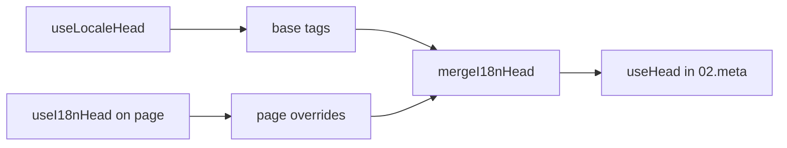

# الـ Composable `useI18nHead`

يتيح لك `useI18nHead` تخصيص وسوم SEO لـ i18n **لكل صفحة** دون الحاجة إلى إضافة meta مخصصة. عندما يكون `meta: true`، تدمج الوحدة مدخلك فوق ناتج [`useLocaleHead`](/api/composables/use-locale-head).

الحالات النموذجية:

- **مقالات CMS / المدونة** — بعض اللغات فقط مترجمة؛ تختلف عناوين URL البديلة لكل لغة (شرائح أو مسارات مختلفة).
- **URL أصلي ديناميكي** — يجب أن يطابق URL الأصلي URL المقال من API، وليس `$switchLocalePath`.
- **Open Graph إضافية** — `og:title` و `og:description` و `og:image` جنباً إلى جنب مع `og:locale` / `og:url` المولّدين تلقائياً.
- **تحكّم جزئي** — احتفظ بـ URL الأصلي و `og:url` المولّدين بواسطة الوحدة، لكن استبدل `hreflang` و `og:locale:alternate` فقط.

---

## التوقيع

{/* generated:symbol:useI18nHead — do not edit; run `pnpm run docs:generate` */}

```ts
useI18nHead(input?: MaybeRefOrGetter<I18nHeadInput | null>): { pageHead: any; resetPageHead: () => void }
```

سجّل تجاوزات على مستوى الصفحة لوسوم i18n SEO head.
مدموجة فوق ناتج `useLocaleHead` بواسطة إضافة `02.meta`.

| المعامل | النوع | الوصف |
| --- | --- | --- |
| `input` *(اختياري)* | `MaybeRefOrGetter<I18nHeadInput \| null>` |  |

{/* /generated:symbol:useI18nHead */}

## كيف يتلاءم في خط الأنابيب



تستدعي `useI18nHead` في مكوّن صفحة. تطبّق إضافة `02.meta` التجاوزات بعد كل `updateMeta()` (تغيير المسار و `$setI18nRouteParams` و `page:finish` على العميل).

---

## المثال 1 — مقال مع ترجمات في بعض اللغات فقط

نمط شائع: تُرجع API اللغات الموجودة وعناوين URL المطلقة أو النسبية لها.

```ts
interface Article {
  title: string
  slug: string
  /** Locale code → page URL (absolute or site-relative) */
  locales: Record<string, string>
}
```

```vue
<script setup lang="ts">
const route = useRoute()
const { data: article } = await useFetch<Article>(`/api/articles/${route.params.slug}`)

const localeCodes = computed(() => Object.keys(article.value?.locales ?? {}))

useI18nHead(() => {
  if (!article.value) return null

  return {
    meta: [
      { property: 'og:title', content: article.value.title },
      { property: 'og:type', content: 'article' },
    ],
    replace: {
      hreflang: localeCodes.value.map((locale) => ({
        rel: 'alternate',
        hreflang: locale,
        href: article.value!.locales[locale]!,
      })),
      ogAlternates: localeCodes.value,
    },
  }
})
</script>
```

يأخذ `ogAlternates` **رموز اللغات** من تكوين `i18n.locales` الخاص بك. تُحلّ قيم `og:locale:alternate` عبر `locale.og` أو `iso` (صيغة Open Graph `en_US`).

---

## المثال 2 — مقال مع شرائح لكل لغة (`$defineI18nRoute` + `$setI18nRouteParams`)

عندما تُبنى عناوين URL من قوالب مسار مترجمة ومعاملات ديناميكية:

```vue
<script setup lang="ts">
const { $defineI18nRoute, $setI18nRouteParams } = useNuxtApp()
const route = useRoute()

const { data: article } = await useFetch(`/api/articles/${route.params.slug}`)

$defineI18nRoute({
  localeRoutes: {
    en: '/blog/[slug]',
    de: '/de/blog/[slug]',
    fr: '/fr/blog/[slug]',
  },
})

if (article.value) {
  $setI18nRouteParams({
    en: { slug: article.value.slugEn },
    de: { slug: article.value.slugDe },
    fr: { slug: article.value.slugFr },
  })

  const availableLocales = article.value.availableLocales as string[]

  useI18nHead({
    meta: [{ property: 'og:title', content: article.value.title }],
    replace: {
      hreflang: availableLocales.map((locale) => ({
        rel: 'alternate',
        hreflang: locale,
        href: article.value!.urls[locale],
      })),
      ogAlternates: availableLocales,
    },
  })
}
</script>
```

ستدرج البدائل المولّدة بواسطة الوحدة **جميع** اللغات المُكوَّنة. يحصر `replace.hreflang` الوسوم على اللغات التي لها ترجمة فعلياً.

---

## المثال 3 — `x-default` مخصص لعنوان URL مقال اللغة الافتراضية

افتراضياً، يشير `x-default` إلى URL اللغة الافتراضية من `$switchLocalePath`. للمقالات، وجّهه إلى URL الترجمة الافتراضية:

```vue
<script setup lang="ts">
const { $defaultLocale } = useNuxtApp()
const article = await loadArticle()

const defaultLocale = $defaultLocale() ?? 'en'
const defaultHref = article.locales[defaultLocale]

useI18nHead({
  replace: {
    hreflang: Object.entries(article.locales).map(([locale, href]) => ({
      rel: 'alternate',
      hreflang: locale,
      href,
    })),
    xDefault: defaultHref ? { rel: 'alternate', hreflang: 'x-default', href: defaultHref } : false,
    ogAlternates: Object.keys(article.locales),
  },
})
</script>
```

---

## المثال 4 — استبدال URL الأصلي و `og:url` من بيانات API

عندما يجب أن يطابق URL الأصلي URL مُقدَّم من CMS (متعدد النطاقات أو مسار مخصص أو URL مطلق مُبنى مسبقاً):

```vue
<script setup lang="ts">
const article = await loadArticle()
const canonical = article.canonicalUrl // e.g. https://www.example.com/en/blog/my-post

useI18nHead({
  replace: {
    canonical,
    ogUrl: canonical,
    hreflang: buildAlternateLinks(article),
    ogAlternates: Object.keys(article.locales),
  },
  meta: [
    { property: 'og:title', content: article.title },
    { name: 'description', content: article.excerpt },
  ],
})
</script>
```

---

## المثال 5 — احتفظ بـ URL الأصلي / `og:url` التلقائيَّين، استبدل البدائل فقط

إذا كانا `$switchLocalePath` + `$setI18nRouteParams` ينتجان بالفعل URL أصلي و `og:url` صحيحين، استبدل وسوم الاكتشاف فقط:

```vue
<script setup lang="ts">
const article = await loadArticle()

useI18nHead({
  replace: {
    hreflang: buildAlternateLinks(article),
    ogAlternates: Object.keys(article.locales),
  },
})
</script>
```

---

## المثال 6 — head كامل لصفحة تفاصيل محتوى (meta + روابط)

نمط مشابه لتقسيم "meta الصفحة" و"الروابط البديلة" إلى مساعدات منفصلة — مجموعة في استدعاء واحد:

```vue
<script setup lang="ts">
const article = await loadArticle()
const alternates = Object.entries(article.locales).map(([locale, href]) => ({
  rel: 'alternate' as const,
  hreflang: locale,
  href: normalizeSeoUrl(href), // strip ?query and #hash if needed
}))

useI18nHead({
  meta: [
    { property: 'og:title', content: article.title },
    { property: 'og:description', content: article.description },
    { property: 'og:image', content: article.imageUrl },
    { name: 'twitter:card', content: 'summary_large_image' },
    { name: 'twitter:title', content: article.title },
  ],
  replace: {
    canonical: article.canonicalUrl,
    ogUrl: article.canonicalUrl,
    hreflang: alternates,
    ogAlternates: Object.keys(article.locales),
  },
})
</script>
```

```ts
/** Remove query and hash — useful when CMS URLs must be clean for SEO */
function normalizeSeoUrl(href: string): string {
  try {
    const url = new URL(href, 'https://placeholder.local')
    url.search = ''
    url.hash = ''
    return href.startsWith('http') ? url.href : `${url.pathname}`
  } catch {
    return href.split(/[?#]/)[0] ?? href
  }
}
```

---

## المثال 7 — نوعان من المحتوى، نفس النمط (الأخبار مقابل الأدلة)

نفس شكل API، أسماء مسار مختلفة — أعد استخدام مساعد صغير:

```ts
// composables/useArticleHead.ts
import type { I18nHeadInput } from '@i18n-micro/types'

interface LocalizedContent {
  title: string
  locales: Record<string, string>
  canonicalUrl?: string
}

export function buildArticleHead(content: LocalizedContent): I18nHeadInput {
  const localeCodes = Object.keys(content.locales)
  const canonical = content.canonicalUrl ?? content.locales.en

  return {
    meta: [{ property: 'og:title', content: content.title }],
    replace: {
      canonical,
      ogUrl: canonical,
      hreflang: localeCodes.map((locale) => ({
        rel: 'alternate',
        hreflang: locale,
        href: content.locales[locale]!,
      })),
      ogAlternates: localeCodes,
    },
  }
}
```

```vue
<!-- pages/blog/[slug].vue -->
<script setup lang="ts">
const article = await loadArticle()
useI18nHead(buildArticleHead(article))
</script>
```

```vue
<!-- pages/guides/[slug].vue -->
<script setup lang="ts">
const guide = await loadGuide()
useI18nHead(buildArticleHead(guide))
</script>
```

---

## المثال 8 — عطّل البدائل المدمجة، قدّم قائمتك الخاصة

يعادل تعطيل مولّد hreflang في الوحدة وتمرير قائمة مخصصة (بدون مجموعات بديلة مكررة):

```vue
<script setup lang="ts">
const article = await loadArticle()

useI18nHead({
  disable: ['hreflang', 'x-default', 'og-alternates'],
  link: Object.entries(article.locales).map(([locale, href]) => ({
    rel: 'alternate',
    hreflang: locale,
    href,
  })),
  replace: {
    ogAlternates: Object.keys(article.locales),
  },
})
</script>
```

أو فضّل `replace.hreflang` بدون `disable` — يستبدل جميع روابط `rel="alternate"` في خطوة واحدة.

---

## المثال 9 — صفحة هبوط: فقط OG إضافية، احتفظ بجميع وسوم i18n

```vue
<script setup lang="ts">
const { t } = useI18n()

useI18nHead({
  meta: [
    { property: 'og:title', content: t('landing.ogTitle') },
    { property: 'og:description', content: t('landing.ogDescription') },
  ],
})
</script>
```

---

## المثال 10 — صفحة منتج: عطّل hreflang لتجربة لغة واحدة

```vue
<script setup lang="ts">
useI18nHead({
  disable: ['hreflang', 'x-default'],
  // canonical, og:locale, og:url still generated
})
</script>
```

---

## المثال 11 — تحديثات تفاعلية بعد الجلب من جانب العميل

```vue
<script setup lang="ts">
const article = ref<Article | null>(null)

onMounted(async () => {
  article.value = await $fetch('/api/articles/latest')
})

useI18nHead(() => {
  if (!article.value) return null
  return {
    meta: [{ property: 'og:title', content: article.value.title }],
    replace: {
      hreflang: Object.entries(article.value.locales).map(([locale, href]) => ({
        rel: 'alternate',
        hreflang: locale,
        href,
      })),
    },
  }
})
</script>
```

يُحدَّث head عند `page:finish` وعندما تتغيّر حالة `pageHead`.

---

## المثال 12 — أصل HTTPS خلف وكيل عكسي

إذا كنت قد حللت سابقاً composable "أصل عام" لعناوين URL أصلية / بديلة مطلقة، استخدم تكوين الوحدة بدلاً منه:

```ts
// nuxt.config.ts
export default defineNuxtConfig({
  i18n: {
    meta: true,
    // undefined = origin from current request (multi-domain friendly)
    metaBaseUrl: undefined,
    metaTrustForwardedHost: true,
    metaTrustForwardedProto: true,
  },
})
```

ثم مرّر **مسارات أو عناوين URL كاملة** في `replace.hreflang` / `replace.canonical`. تستخدم الوحدة `useRequestURL` مع `X-Forwarded-Host` / `X-Forwarded-Proto` على SSR.

---

## مرجع API

### `meta`

وسوم `<meta>` إضافية. يُزال التكرار عبر `id` أو `property` أو `name`.

### `link`

وسوم `<link>` إضافية. يُزال التكرار عبر `id` أو `rel` + `hreflang`.

### `htmlAttrs`

مدمجة في سمات `<html>` من `useLocaleHead` (`lang` و `dir`).

### `replace`

| المفتاح            | النوع                      | التأثير                                         |
| -------------- | ------------------------- | ---------------------------------------------- |
| `canonical`    | `string \| false`         | استبدال أو إزالة الرابط الأصلي               |
| `hreflang`     | `I18nHeadLink[] \| false` | استبدال أو إزالة جميع روابط `rel="alternate"`  |
| `xDefault`     | `I18nHeadLink \| false`   | استبدال أو إزالة `hreflang="x-default"`       |
| `ogLocale`     | `string \| false`         | استبدال أو إزالة `og:locale`                  |
| `ogUrl`        | `string \| false`         | استبدال أو إزالة `og:url`                     |
| `ogAlternates` | `string[] \| false`       | إعادة بناء `og:locale:alternate` لرموز اللغات |

### `disable`

| القيمة           | يزيل                                  |
| --------------- | ---------------------------------------- |
| `hreflang`      | روابط اللغات البديلة (وليس `x-default`) |
| `x-default`     | رابط `hreflang="x-default"`              |
| `canonical`     | الرابط الأصلي                            |
| `og`            | `og:locale` و `og:url`                   |
| `og-alternates` | وسوم `og:locale:alternate`               |
| `html`          | `lang` / `dir` على `<html>`              |

---

## `useLocaleHead` مقابل `useI18nHead`

| Composable      | النطاق                | متى تستخدم                                |
| --------------- | -------------------- | ------------------------------------------ |
| `useLocaleHead` | عام / head يدوي | `meta: false` وإعداد `useHead` مخصص كامل |
| `useI18nHead`   | تجاوزات لكل صفحة   | `meta: true` وتخصيص صفحات محددة     |

عندما يكون `meta: true`، لا تحتاج **إلى** `useLocaleHead` في الصفحات التي تستخدم `useI18nHead` فقط.

---

## الانتقال من إضافة i18n head مخصصة

تحتفظ العديد من المشاريع بإضافة مخصصة تقوم بما يلي:

- تدمج الروابط البديلة الخاصة بالصفحة من حالة مشتركة؛
- تُصفّي مدخلات `hreflang` الإقليمية المكررة؛
- تُطبّع قيم `og:locale`؛
- تجرّد سلاسل الاستعلام من عناوين URL الخاصة بـ SEO.

يمكنك استبدال ذلك بـ `useI18nHead` في كل صفحة محتوى واستخدام إعدادات الوحدة الافتراضية.

| النهج السابق                                     | مع `useI18nHead`                                   |
| ----------------------------------------------------- | ---------------------------------------------------- |
| حالة مشتركة + "أي اللغات موجودة لهذا المقال" | `replace: \{ ogAlternates: localeCodes \}`             |
| مساعد منفصل يبني روابط `rel="alternate"`      | `replace: \{ hreflang: links \}`                       |
| إضافة مخصصة تدمج حالة الصفحة في head            | دمج مدمج في `02.meta`                          |
| "أصل عام" مخصص لعناوين URL المطلقة              | `metaBaseUrl` + ترويسات مُرسلة (راجع المثال 12)   |
| `og:locale` مختصر (`en` بدلاً من `en_US`)           | اضبط `locale.og` أو استخدم `iso` → `en_US` (بروتوكول OG) |

**`hreflang` من `iso`:** تُصدر كل لغة بديلاً واحداً بـ `hreflang = iso || code`. لا يُستخدم `code` التوجيه أبداً عندما يكون `iso` مضبوطاً (يتجنّب الوسوم غير الصالحة مثل `hreflang="mx"`). اختر احتياطيات اللغة الأساسية (`es-ES` → أيضاً `es`) مع `hreflangBaseLanguage: true` — مشتقة من `iso` وليس `code`. للقوائم المخصصة كلياً، استخدم `replace.hreflang`.

**JSON-LD:** لا يولّد `useI18nHead` بيانات منظمة. احتفظ بـ `useHead(\{ script: [...] \})` أو مساعد JSON-LD مخصص جنباً إلى جنب.

---

## راجع أيضاً

- [دليل SEO](/guides/seo) — توليد Meta التلقائي والتجاوزات على مستوى الصفحة
- [`useLocaleHead`](/api/composables/use-locale-head) — واجهة API منخفضة المستوى لـ head
