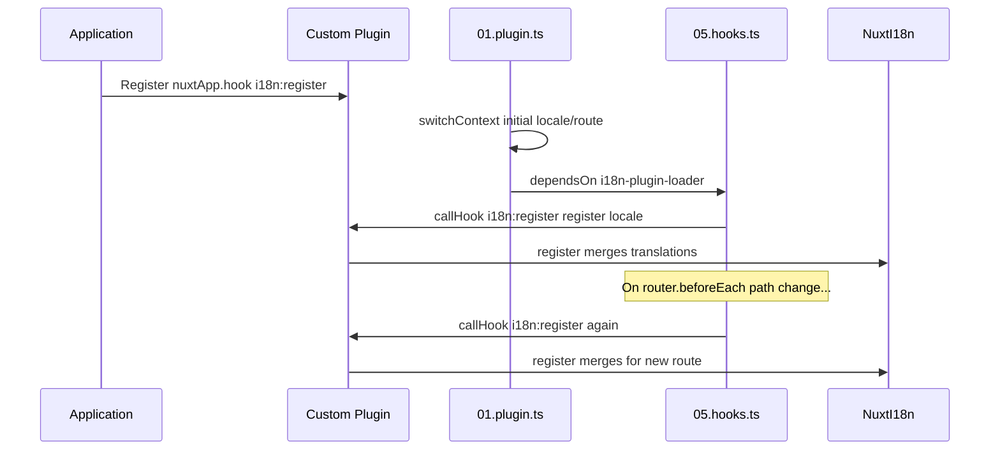

# 📢 الأحداث

## 🔄 `i18n:register`

يُمكّن الحدث `i18n:register` في `Nuxt I18n Micro` من إضافة الترجمات ديناميكياً إلى سياق i18n الخاص بتطبيقك، مما يجعل عملية التدويل سلسة ومرنة. يسمح لك هذا الحدث بدمج ترجمات جديدة عند الحاجة، مما يعزز قدرات ترجمة تطبيقك.

### 📝 تفاصيل الحدث

- **الغرض**:
  - يسمح بدمج ترجمات إضافية ديناميكياً في المجموعة الحالية للغة محددة.

- **الحمولة**:
  - **`register`**:
    - دالة يوفّرها الحدث وتأخذ وسيطين:
      - **`translations`** (`Translations`):
        - كائن يحتوي على أزواج مفتاح-قيمة تمثّل الترجمات، منظّم وفقاً لواجهة `Translations`.
      - **`locale`** (`string`, اختياري):
        - رمز اللغة (مثل `'en'` أو `'ru'`) التي سُجّلت لها الترجمات. القيمة الافتراضية هي اللغة التي يوفّرها الحدث إذا لم يُحدَّد.

- **السلوك**:
  - عند التشغيل، تدمج دالة `register` الترجمات الجديدة في السياق الحالي للغة المحددة، محدّثةً الترجمات المتاحة عبر التطبيق.

### ⏱️ متى يُطلق

تستدعي إضافة hooks للوحدة (`05.hooks.ts` مع `dependsOn: ['i18n-plugin-loader']`) `nuxtApp.callHook('i18n:register', …)`:

1. **مرة واحدة عند بدء التشغيل** — بعد أن تحمّل إضافة i18n الرئيسية (`01.plugin.ts`) الترجمات للمسار الأولي
2. **عند التنقّل** — في `router.beforeEach` عند تغيّر المسار، أو في كل تنقّل عندما تكون `strategy: 'no_prefix'`

سجّل مستمعك في إضافة Nuxt عادية باستخدام `nuxtApp.hook('i18n:register', …)`. تعمل إضافة hooks بعد جاهزية المُحمّل، لذا يُستدعى رد نداءك عندما تحتاج الترجمات إلى التوسيع.

اضبط `hooks: false` في `nuxt.config` لتعطيل استدعاءات `i18n:register` التلقائية (راجع [التكوين — `hooks`](/guides/configuration#hooks)).

### 💡 مثال على الاستخدام

يوضّح المثال التالي كيفية استخدام حدث `i18n:register` لإضافة الترجمات ديناميكياً:

```typescript
nuxt.hook('i18n:register', async (register: (translations: unknown, locale?: string) => void, locale: string) => {
  register(
    {
      greeting: 'Hello',
      farewell: 'Goodbye',
    },
    locale,
  )
})
```

### 🛠️ الشرح



- **إطلاق الحدث**:
  - تُطلق إضافة hooks (`05.hooks.ts`) الحدث `i18n:register` بعد جاهزية المُحمّل الرئيسي وعند عمليات التنقّل ذات الصلة.

- **إضافة الترجمات**:
  - يسجّل المثال ترجمات إنجليزية لـ `"greeting"` و `"farewell"`.
  - تدمج دالة `register` هذه الترجمات في المجموعة الحالية للغة المُقدَّمة.

### 🔗 الفوائد الرئيسية

- **التحديثات الديناميكية**:
  - حدّث الترجمات أو أضف ترجمات جديدة بسهولة دون الحاجة إلى إعادة نشر تطبيقك بأكمله.

- **مرونة الترجمة**:
  - يدعم تعديلات الترجمة في الوقت الفعلي بناءً على احتياجات المستخدم أو التطبيق.

باستخدام حدث `i18n:register`، يمكنك ضمان بقاء استراتيجية ترجمة تطبيقك مرنة وقابلة للتكيف، مما يعزز تجربة المستخدم بشكل عام.

---

## 🛠️ تعديل الترجمات باستخدام الإضافات

لتعديل الترجمات ديناميكياً في تطبيق Nuxt الخاص بك، يُوصى باستخدام الإضافات. توفّر الإضافات طريقة منظّمة للتعامل مع تحديثات الترجمة، خاصةً عند العمل مع الوحدات أو ملفات الترجمة الخارجية.

### **تسجيل الإضافة**

إذا كنت تستخدم وحدة، فسجّل الإضافة حيث ستحدث تعديلات الترجمة بإضافتها إلى تكوين وحدتك:

```javascript
addPlugin({
  src: resolve('./plugins/extend_locales'),
})
```

يسجّل هذا الإضافة الموجودة في `./plugins/extend_locales`، والتي ستتعامل مع التحميل والتسجيل الديناميكي للترجمات.

### **تنفيذ الإضافة**

في الإضافة، يمكنك إدارة تعديلات اللغة. إليك مثالاً على التنفيذ في إضافة Nuxt:

```typescript
import { defineNuxtPlugin } from '#app'

export default defineNuxtPlugin(async (nuxtApp) => {
  // Function to load translations from JSON files and register them
  const loadTranslations = async (lang: string) => {
    try {
      const translations = await import(`../locales/${lang}.json`)
      return translations.default
    } catch (error) {
      console.error(`Error loading translations for language: ${lang}`, error)
      return null
    }
  }

  // Hook into the 'i18n:register' event to dynamically add translations
  // eslint-disable-next-line @typescript-eslint/ban-ts-comment
  // @ts-expect-error
  nuxtApp.hook('i18n:register', async (register: (translations: unknown, locale?: string) => void, locale: string) => {
    const translations = await loadTranslations(locale)
    if (translations) {
      register(translations, locale)
    }
  })
})
```

### 📝 شرح تفصيلي

1. **تحميل الترجمات**:

- تستورد دالة `loadTranslations` ملفات الترجمة ديناميكياً بناءً على اللغة. من المتوقع أن تكون الملفات في مجلد `locales` ومسمّاة وفقاً لرموز اللغات (مثل `en.json` و `de.json`).
- عند التحميل الناجح، تُعاد الترجمات؛ وإلا يُسجَّل خطأ.

2. **تسجيل الترجمات**:

- تتصل الإضافة بحدث `i18n:register` باستخدام `nuxtApp.hook`.
- عند إطلاق الحدث، تُستدعى دالة `register` مع الترجمات المُحمَّلة واللغة المقابلة.
- يدمج هذا الترجمات الجديدة في سياق i18n للغة المحددة، محدّثاً الترجمات المتاحة عبر التطبيق.

### 🔗 فوائد استخدام الإضافات لتعديلات الترجمة

- **فصل الاهتمامات**:
  - غلّف منطق الترجمة بشكل منفصل عن شيفرة التطبيق الرئيسية، مما يجعل الإدارة والصيانة أسهل.

- **ديناميكية وقابلة للتوسّع**:
  - من خلال التحميل والتسجيل الديناميكي للترجمات، يمكنك تحديث المحتوى دون الحاجة إلى إعادة نشر التطبيق بالكامل، وهو مفيد بشكل خاص للتطبيقات ذات المحتوى المتعدد اللغات أو المُحدَّث بشكل متكرر.

- **مرونة ترجمة معزّزة**:
  - تسمح الإضافات لك بتعديل أو توسيع الترجمات حسب الحاجة، مما يوفّر استراتيجية ترجمة أكثر قابلية للتكيّف والاستجابة تلبّي تفضيلات المستخدم أو متطلبات العمل.

باتباع هذا النهج، يمكنك توسيع وتعديل ترجمة تطبيقك بكفاءة من خلال عملية منظّمة وقابلة للصيانة باستخدام الإضافات، مما يحافظ على تكيّف التدويل مع الاحتياجات المتغيّرة ويحسّن تجربة المستخدم بشكل عام.
