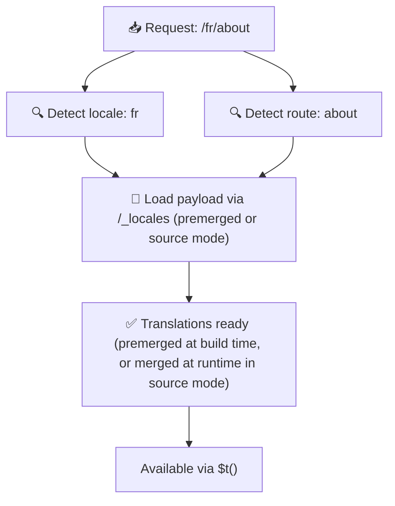

# 📂 دليل هيكل المجلدات

## 📖 مقدمة

يعد تنظيم ملفات الترجمة بفعالية أمرًا أساسيًا للحفاظ على نظام تدويل (i18n) قابل للتوسّع وفعّال. يبسّط `Nuxt I18n Micro` هذه العملية من خلال تقديم نهج واضح لإدارة الترجمات على مستوى الجذر والخاصة بالصفحات. سيرشدك هذا الدليل خلال هيكل المجلدات الموصى به ويوضّح كيفية تعامل `Nuxt I18n Micro` مع هذه الترجمات.

## 🗂️ هيكل المجلدات الموصى به

ينظّم `Nuxt I18n Micro` الترجمات في ملفات على مستوى الجذر وملفات خاصة بالصفحات داخل مجلد `pages`. مع `translationPayloads.mode: 'premerged'` (الافتراضي)، تُدمج ترجمات المستوى الجذر تلقائيًا في كل ملف صفحة أثناء البناء، لذلك تحتوي كل صفحة على مجموعة كاملة من الترجمات دون عبء دمج في وقت التشغيل.

مع `mode: 'source'`، تبقى ملفات المصدر منفصلة في أصول Nitro وتُدمج في وقت التشغيل عبر مسار `/_locales`. اطّلع على [إخراج حمولة بدون خادم](/guides/performance#serverless-payload-output).

### 🔧 الهيكل الأساسي

فيما يلي مثال أساسي لهيكل المجلدات الذي يجب اتباعه:

```text
locales/
├── pages/
│   ├── index/
│   │   ├── en.json
│   │   ├── fr.json
│   │   └── ar.json
│   ├── about/
│   │   ├── en.json
│   │   ├── fr.json
│   │   └── ar.json
├── en.json
├── fr.json
└── ar.json

```

### 📄 شرح الهيكل

#### 1. 🌍 ملفات الترجمة على مستوى الجذر

- **المسار:** `/locales/\{locale\}.json` (مثل `/locales/en.json`)
- **الغرض:** تحتوي هذه الملفات على ترجمات مشتركة عبر التطبيق بأكمله (قوائم التنقل، الرؤوس، التذييلات، إلخ). مع `mode: 'premerged'` (الافتراضي)، تُدمج تلقائيًا في كل ملف خاص بالصفحة أثناء البناء، لذلك يُعيد الخادم ملفًا واحدًا مبنيًا مسبقًا لكل صفحة.

  **مثال المحتوى (`/locales/en.json`):**

  ```json
  {
    "menu": {
      "home": "Home",
      "about": "About Us",
      "contact": "Contact"
    },
    "footer": {
      "copyright": "© 2024 Your Company"
    }
  }
  ```

#### 2. 📄 ملفات الترجمة الخاصة بالصفحات

- **المسار:** `/locales/pages/\{routeName\}/\{locale\}.json` (مثل `/locales/pages/index/en.json`)
- **الغرض:** تحتوي هذه الملفات على ترجمات خاصة بالصفحات الفردية. مع `mode: 'premerged'` (الافتراضي)، تُدمج ترجمات المستوى الجذر كأساس أثناء البناء، لذلك يصبح كل ملف صفحة مكتفيًا بذاته.

  **مثال المحتوى (`/locales/pages/index/en.json`):**

  ```json
  {
    "title": "Welcome to Our Website",
    "description": "We offer a wide range of products and services to meet your needs."
  }
  ```

  **مثال المحتوى (`/locales/pages/about/en.json`):**

  ```json
  {
    "title": "About Us",
    "description": "Learn more about our mission, vision, and values."
  }
  ```

### 📂 التعامل مع المسارات الديناميكية والمسارات المتداخلة

يحوّل `Nuxt I18n Micro` تلقائيًا الأجزاء الديناميكية والمسارات المتداخلة في التوجيهات إلى هيكل مجلدات مسطّح باستخدام اتفاقية إعادة تسمية محدّدة. يضمن هذا تخزين جميع الترجمات بطريقة متناسقة وسهلة الوصول.

#### هيكل مجلد ترجمة المسار الديناميكي

عند التعامل مع المسارات الديناميكية، مثل `/products/[id]`، تحوّل الوحدة الجزء الديناميكي `[id]` إلى تنسيق ثابت داخل هيكل الملف.

**مثال هيكل مجلد للمسارات الديناميكية:**

بالنسبة إلى مسار مثل `/products/[id]`، ستُخزَّن ملفات الترجمة في مجلد باسم `products-id`:

```text
locales/pages/
├── products-id/
│   ├── en.json
│   ├── fr.json
│   └── ar.json

```

**مثال هيكل مجلد للمسارات الديناميكية المتداخلة:**

بالنسبة إلى مسار متداخل مثل `/products/key/[id]`، ستُخزَّن ملفات الترجمة في مجلد باسم `products-key-id`:

```text
locales/pages/
├── products-key-id/
│   ├── en.json
│   ├── fr.json
│   └── ar.json

```

**مثال هيكل مجلد للمسارات المتداخلة متعدّدة المستويات:**

بالنسبة إلى مسار متداخل أكثر تعقيدًا مثل `/products/category/[id]/details`، ستُخزَّن ملفات الترجمة في مجلد باسم `products-category-id-details`:

```text
locales/pages/
├── products-category-id-details/
│   ├── en.json
│   ├── fr.json
│   └── ar.json

```

### 🛠 تخصيص هيكل المجلد

إذا كنت تفضّل تخزين الترجمات في مجلد مختلف، يتيح لك `Nuxt I18n Micro` تخصيص المجلد الذي تُخزَّن فيه ملفات الترجمة. يمكنك إعداد ذلك في ملف `nuxt.config.ts`.

**مثال: تخصيص مجلد الترجمة**

```typescript
export default defineNuxtConfig({
  i18n: {
    translationDir: 'i18n', // Custom directory path
  },
})
```

سيوجّه هذا `Nuxt I18n Micro` للبحث عن ملفات الترجمة في مجلد `/i18n` بدلًا من المجلد الافتراضي `/locales`.

## ⚙️ كيفية تحميل الترجمات

### 🌍 مسارات اللغة الديناميكية

يستخدم `Nuxt I18n Micro` مسارات لغة ديناميكية لتحميل الترجمات بكفاءة. عندما يزور المستخدم صفحة، تحدّد الوحدة اللغة المناسبة وتُحمّل ملفات الترجمة المقابلة استنادًا إلى المسار الحالي واللغة.



على سبيل المثال:

- زيارة `/en/index` ستُحمّل الترجمات من `/locales/pages/index/en.json`.
- زيارة `/fr/about` ستُحمّل الترجمات من `/locales/pages/about/fr.json`.

تضمن هذه الطريقة تحميل الترجمات الضرورية فقط، مما يحسّن كلًا من حِمل الخادم وأداء جانب العميل.

### 💾 التخزين المؤقت والتوليد المسبق

لتعزيز الأداء بشكل أكبر، يدعم `Nuxt I18n Micro` التخزين المؤقت والتوليد المسبق لملفات الترجمة:

- **التخزين المؤقت**: بمجرد تحميل ملف ترجمة، يُخزَّن مؤقتًا للطلبات اللاحقة، مما يقلّل الحاجة إلى جلب البيانات نفسها بشكل متكرّر.
- **التوليد المسبق**: أثناء عملية البناء، يمكنك توليد ملفات الترجمة مسبقًا لجميع اللغات والمسارات المُعدّة، مما يسمح بتقديمها مباشرةً من الخادم دون تأخيرات في وقت التشغيل.

## 📝 أفضل الممارسات

### 📂 استخدم الملفات الخاصة بالصفحات بحكمة

استفد من الملفات الخاصة بالصفحات للحفاظ على تنظيم الترجمات. هذا يبقي ترجمات كل صفحة خفيفة وسريعة التحميل، وهو أمر مهم بشكل خاص للصفحات ذات المحتوى المعقّد أو الكبير.

### 🔑 حافظ على اتساق مفاتيح الترجمة

استخدم اتفاقيات تسمية متناسقة لمفاتيح الترجمة عبر الملفات. يساعد هذا في الحفاظ على الوضوح ويمنع المشاكل عند إدارة الترجمات، خاصةً مع نمو تطبيقك.

### 🗂️ نظّم الترجمات حسب السياق

جمّع الترجمات ذات الصلة معًا داخل ملفاتك. على سبيل المثال، جمّع كل تسميات الأزرار تحت مفتاح `buttons` وجميع النصوص المتعلّقة بالنماذج تحت مفتاح `forms`. لا يحسّن هذا القراءة فحسب، بل يجعل من الأسهل أيضًا إدارة الترجمات عبر لغات مختلفة.

### ⚠️ حدّ عمق التداخل (مستويان موصى بهما)

أثناء التنقّل من جانب العميل، يستخدم `Nuxt I18n Micro` دمج عميق مُحسَّن بمستويين لدمج الترجمات من الصفحات الخارجة والداخلة. يضمن هذا الحفاظ على المفاتيح المتداخلة المتداخلة (على سبيل المثال، تحتوي كلتا الصفحتين على مفاتيح تحت `common.*`) أثناء تأثيرات الانتقال.

**يعمل هذا بشكل صحيح للهيكل القياسي `القسم → المفتاح → القيمة` (مستويان):**

```json
// Page A translations
{ "common": { "fromA": "Text A" } }

// Page B translations
{ "common": { "fromB": "Text B" } }

// During transition, both are available:
// { "common": { "fromA": "Text A", "fromB": "Text B" } }
```

**ومع ذلك، إذا استخدمت 3 مستويات أو أكثر من التداخل، فقد تُستبدل المفاتيح الأعمق أثناء الانتقالات:**

```json
// Page A translations
{ "auth": { "form": { "login": "Login" } } }

// Page B translations
{ "auth": { "form": { "register": "Register" } } }

// During transition: "login" key is lost
// { "auth": { "form": { "register": "Register" } } }
```

<Tip>

</Tip>

### 🧹 نظّف الترجمات غير المستخدمة بانتظام

بمرور الوقت، قد يتراكم في تطبيقك مفاتيح ترجمة غير مستخدمة، خاصةً إذا تمت إزالة ميزات أو إعادة هيكلتها. راجع ملفات الترجمة ونظّفها دوريًا للحفاظ عليها خفيفة وقابلة للصيانة.
