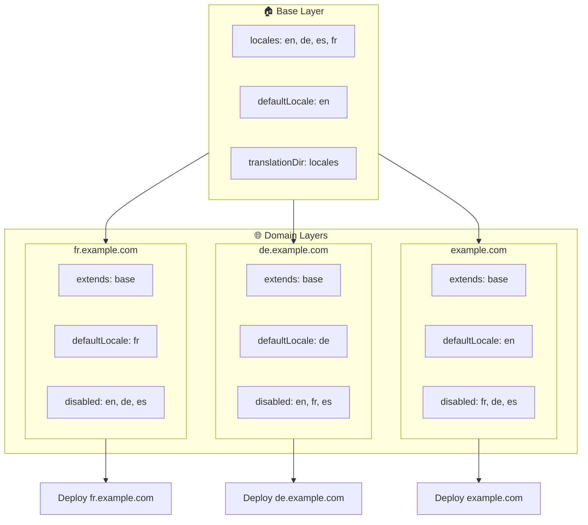

# 🌍 إعداد لغات متعدّدة النطاقات باستخدام `Nuxt I18n Micro` والطبقات

## 📝 مقدمة

من خلال الاستفادة من الطبقات (Layers) في `Nuxt I18n Micro`، يمكنك إنشاء إعداد توطين متعدّد النطاقات مرن وقابل للصيانة. لا يبسّط هذا النهج إدارة النطاقات عن طريق إلغاء الحاجة إلى وظائف معقّدة فحسب، بل يسمح أيضًا بتوزيع الحِمل بكفاءة وتقليل تعقيد المشروع. من خلال تشغيل مشاريع منفصلة للغات مختلفة، يمكن لتطبيقك أن يتوسّع بسهولة ويتكيّف مع متطلّبات اللغة المتنوّعة عبر نطاقات متعدّدة، مما يوفر حلًا قويًا وقابلًا للتوسّع للتطبيقات العالمية.

## 🎯 الهدف

إنشاء إعداد تقدّم فيه نطاقات مختلفة لغات محدّدة عبر تخصيص التهيئة في الطبقات الفرعية. تستفيد هذه الطريقة من نظام الطبقات في Nuxt، مما يسمح لك بالحفاظ على تهيئة أساسية مع توسيعها أو تعديلها لكل نطاق.

### بنية متعدّدة النطاقات



## 🛠 خطوات تنفيذ اللغات متعدّدة النطاقات

### 1. **إنشاء الطبقة الأساسية**

ابدأ بإنشاء طبقة تهيئة أساسية تتضمّن جميع إعدادات اللغة المشتركة لتطبيقك. ستكون هذه التهيئة أساسًا للتهيئات الخاصة بالنطاقات الأخرى.

#### **تهيئة الطبقة الأساسية**

أنشئ ملف التهيئة الأساسي `base/nuxt.config.ts`:

```typescript
// base/nuxt.config.ts

export default defineNuxtConfig({
  i18n: {
    locales: [
      { code: 'en', iso: 'en-US', dir: 'ltr' },
      { code: 'de', iso: 'de-DE', dir: 'ltr' },
      { code: 'es', iso: 'es-ES', dir: 'ltr' },
    ],
    defaultLocale: 'en',
    translationDir: 'locales',
    meta: true,
    autoDetectLanguage: true,
  },
})
```

### 2. **إنشاء طبقات فرعية خاصة بالنطاقات**

لكل نطاق، أنشئ طبقة فرعية تُعدّل التهيئة الأساسية لتلبية المتطلّبات الخاصة بذلك النطاق. يمكنك تعطيل اللغات غير المطلوبة لنطاق معيّن.

#### **مثال: تهيئة النطاق الفرنسي**

أنشئ تهيئة الطبقة الفرعية للنطاق الفرنسي في `fr/nuxt.config.ts`:

```typescript
// fr/nuxt.config.ts

export default defineNuxtConfig({
  extends: '../base', // Inherit from the base configuration

  i18n: {
    locales: [
      { code: 'en', iso: 'en-US', dir: 'ltr', disabled: true }, // Disable English
      { code: 'fr', iso: 'fr-FR', dir: 'ltr' }, // Add and enable the French locale
      { code: 'de', iso: 'de-DE', dir: 'ltr', disabled: true }, // Disable German
      { code: 'es', iso: 'es-ES', dir: 'ltr', disabled: true }, // Disable Spanish
    ],
    defaultLocale: 'fr', // Set French as the default locale
    autoDetectLanguage: false, // Disable automatic language detection
  },
})
```

#### **مثال: تهيئة النطاق الألماني**

بالمثل، أنشئ تهيئة الطبقة الفرعية للنطاق الألماني في `de/nuxt.config.ts`:

```typescript
// de/nuxt.config.ts

export default defineNuxtConfig({
  extends: '../base', // Inherit from the base configuration

  i18n: {
    locales: [
      { code: 'en', iso: 'en-US', dir: 'ltr', disabled: true }, // Disable English
      { code: 'fr', iso: 'fr-FR', dir: 'ltr', disabled: true }, // Disable French
      { code: 'de', iso: 'de-DE', dir: 'ltr' }, // Use the German locale
      { code: 'es', iso: 'es-ES', dir: 'ltr', disabled: true }, // Disable Spanish
    ],
    defaultLocale: 'de', // Set German as the default locale
    autoDetectLanguage: false, // Disable automatic language detection
  },
})
```

### 3. **نشر التطبيق لكل نطاق**

انشر التطبيق مع التهيئة المناسبة لكل نطاق. على سبيل المثال:

- انشر تهيئة الطبقة `fr` إلى `fr.example.com`.
- انشر تهيئة الطبقة `de` إلى `de.example.com`.

### 4. **إعداد مشاريع متعدّدة للغات مختلفة**

لكل لغة ونطاق، ستحتاج إلى تشغيل مثيل منفصل من التطبيق. يضمن هذا أن يخدم كل نطاق تهيئة اللغة الصحيحة، مما يحسّن توزيع الحِمل ويبسّط بنية المشروع. من خلال تشغيل مشاريع متعدّدة مصمّمة لكل لغة، يمكنك الحفاظ على فصل واضح بين التهيئات وتقليل تعقيد الإعداد الشامل.

### 5. **إعداد التوجيه بناءً على النطاق**

تأكد من أن التوجيه لديك مُعَدّ لتوجيه المستخدمين إلى المشروع الصحيح استنادًا إلى النطاق الذي يصلون إليه. سيضمن هذا أن يخدم كل نطاق اللغة المناسبة، مما يعزّز تجربة المستخدم ويحافظ على الاتساق عبر مناطق مختلفة.

### 6. **النشر والتحقق**

بعد تهيئة الطبقات ونشرها في نطاقاتها المعنية، تأكد من أن كل نطاق يقدّم اللغة الصحيحة. اختبر التطبيق بدقة لتأكيد تحميل اللغة الصحيحة اعتمادًا على النطاق.

## 📝 أفضل الممارسات

- **حافظ على عمومية التهيئة الأساسية**: يجب أن تغطي التهيئة الأساسية الإعدادات العامة المناسبة لجميع النطاقات.
- **اعزل المنطق الخاص بالنطاقات**: احتفظ بالتهيئات الخاصة بالنطاقات في طبقاتها المعنية للحفاظ على الوضوح وفصل الاهتمامات.

## 🎉 خاتمة

من خلال الاستفادة من الطبقات في `Nuxt I18n Micro`، يمكنك إنشاء إعداد توطين متعدّد النطاقات مرن وقابل للصيانة. لا يلغي هذا النهج الحاجة إلى وظائف إدارة نطاقات معقّدة فحسب، بل يسمح لك أيضًا بتوزيع الحِمل بكفاءة وتقليل تعقيد المشروع. يضمن تشغيل مشاريع منفصلة للغات مختلفة أن يتمكّن تطبيقك من التوسّع بسهولة والتكيّف مع متطلّبات اللغة المختلفة عبر نطاقات متنوّعة، مما يوفر حلًا قويًا وقابلًا للتوسّع للتطبيقات العالمية.
