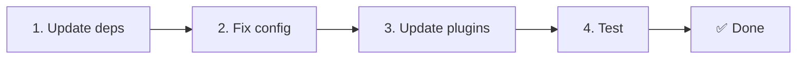

# 📦 الترقية من v2.x إلى v3.x

<Tip>
راجع [الانتقال من nuxt-i18n](/migration/from-nuxtjs-i18n) — يغطّي ذلك الدليل الانتقال من نظام vue-i18n البيئي، وليس من nuxt-i18n-micro v2.
</Tip>

يقدّم v3.0.0 تغييرات معمارية جوهرية: حزم استراتيجية، ونظام تخزين مؤقت جديد، وإدارة لغة مركزية عبر `useI18nLocale()`، وسير عمل إعادة توجيه معاد تصميمه. يغطّي هذا القسم كل التغييرات الجذرية وكيفية تحديث شيفرتك.

## خطوات الانتقال



## ملخّص التغييرات الجذرية

- **حالة اللغة** — `useState` / `useCookie` يدوياً → `useI18nLocale()` composable
- **الوصول إلى التكوين** — `useRuntimeConfig().public.i18nConfig` → `getI18nConfig()` من `#build/i18n.strategy.mjs`
- **مكوّن إعادة التوجيه** — خيار `fallbackRedirectComponentPath` → إضافة إعادة توجيه على الخادم + middleware مسار على العميل (تلقائي)
- **`includeDefaultLocaleRoute`** — مدعوم (مهجور) → أُزيل، استخدم خيار `strategy`
- **`experimental.hmr`** — تحت `experimental` → خيار على المستوى الجذري
- **`previousPageFallback`** — أُزيل كلياً (تعالجه استراتيجية الدمج التراكمي تلقائياً)
- **التخزين المؤقت** — `useStorage('cache')` → مفرد `TranslationStorage` (`Symbol.for` على `globalThis`)
- **نقل SSR** — تكوين وقت التشغيل → حمولة Nuxt (استخدم v3 سابقاً `useState`؛ الآن توجد الأجزاء في `payload.data`، راجع [الأداء](/guides/performance#server-side-payload-transfer))
- **فئات الاستراتيجية** — داخلية → حزم منفصلة (`@i18n-micro/route-strategy` و `@i18n-micro/path-strategy`)

## أُزيل: `fallbackRedirectComponentPath`

أُزيل الخيار `fallbackRedirectComponentPath` والمكوّن الاحتياطي `locale-redirect.vue`. يُعالج منطق إعادة التوجيه الآن بواسطة:

1. **Middleware الخادم** (`i18n.global.ts`) — يضبط `event.context.i18n.locale`
2. **إضافة إعادة توجيه الخادم** (`06.redirect.ts`، على الخادم فقط) — إعادة توجيه 302 قبل العرض
3. **Middleware مسار العميل** (`i18n-redirect.global.ts`) — إعادة توجيه SPA بعد الترطيب

```diff
 i18n: {
   strategy: 'prefix_except_default',
-  fallbackRedirectComponentPath: '~/components/MyRedirect.vue',
 }
```

إذا كان لديك منطق إعادة توجيه مخصص في المكوّن الاحتياطي، فنفّذه في إضافة خادم بدلاً منه:

```ts
// plugins/i18n-loader.server.ts
export default defineNuxtPlugin({
  name: 'i18n-custom-redirect',
  enforce: 'pre',
  order: -10,
  setup() {
    const { setLocale } = useI18nLocale()
    // Your custom detection logic
    setLocale(detectedLocale)
  },
})
```

## أُزيل: `includeDefaultLocaleRoute`

استخدم خيار `strategy` بدلاً منه:

- `includeDefaultLocaleRoute: true` → `strategy: 'prefix'`
- `includeDefaultLocaleRoute: false` → `strategy: 'prefix_except_default'` (الافتراضي)

```diff
 i18n: {
-  includeDefaultLocaleRoute: true,
+  strategy: 'prefix',
 }
```

## الوصول إلى التكوين: `getI18nConfig()` يستبدل `useRuntimeConfig`

```diff
- const config = useRuntimeConfig()
- const cookieName = config.public.i18nConfig?.localeCookie || 'user-locale'
+ import { getI18nConfig } from '#build/i18n.strategy.mjs'
+ const { localeCookie: configCookie } = getI18nConfig()
+ const cookieName = configCookie ?? 'user-locale'
```

## إدارة اللغة: `useI18nLocale()` يستبدل الحالة اليدوية

في v2، ربما استخدمت `useState('i18n-locale')` أو `useCookie('user-locale')` مباشرة. في v3، استخدم composable `useI18nLocale()` المركزي:

```diff
- const locale = useState('i18n-locale')
- const cookie = useCookie('user-locale')
- locale.value = 'fr'
- cookie.value = 'fr'
+ const { setLocale } = useI18nLocale()
+ setLocale('fr') // Updates both state and cookie atomically
```

راجع [الكشف المخصص عن اللغة](/guides/custom-language-detection) للحصول على أمثلة مفصّلة.

## الخيارات التجريبية نُقلت / أُزيلت

انتقلت `hmr` من `experimental` إلى المستوى الجذري. أُزيلت `previousPageFallback` كلياً — تستخدم الوحدة الآن استراتيجية دمج عميق تراكمي (عمق مستويين) تحافظ تلقائياً على الترجمات من الصفحة السابقة أثناء رسوم انتقال الصفحة، حتى عندما تشترك الصفحات في مفاتيح متداخلة متداخلة. بعد اكتمال رسوم الانتقال، يُنظّف hook `page:transition:finish` مفاتيح الصفحة القديمة من الذاكرة.

```diff
 i18n: {
-  experimental: {
-    hmr: true,
-    previousPageFallback: true
-  }
+  hmr: true,
+  // previousPageFallback removed — handled automatically
 }
```

## معمارية إعادة التوجيه (v3)

تُعالج إعادات التوجيه الآن تلقائياً بواسطة مكوّنين:

1. **من جانب الخادم** (`06.redirect.ts`، على الخادم فقط): يعمل أثناء SSR، ويُصدر إعادات توجيه 302 قبل أي عرض للصفحة — بدون "وميض خطأ"
2. **من جانب العميل** (`i18n-redirect.global.ts`): middleware مسار عام على تنقّل SPA؛ يحفظ سلسلة الاستعلام والتجزئة

أولوية اللغة لإعادات التوجيه:

1. `useState('i18n-locale')` — مضبوطة عبر `useI18nLocale().setLocale()`
2. ملف تعريف الارتباط — إذا كان `localeCookie` مضبوطاً
3. ترويسة `Accept-Language` — إذا كان `autoDetectLanguage: true`
4. `defaultLocale` — احتياطي

لا تتطلّب الإعدادات القياسية أي تغييرات في الشيفرة.

<Warning>
بالنسبة لاستراتيجيتي `prefix` و `prefix_except_default` مع `redirects: true`، اضبط `localeCookie: 'user-locale'` لتمكين استمرار اللغة عبر عمليات إعادة تحميل الصفحة. بدونها، تستخدم إعادات التوجيه `Accept-Language` أو `defaultLocale` فقط.
</Warning>

## TypeScript: أنواع الوحدة الداخلية (اختياري)

إذا واجهت أخطاء أنواع مرتبطة بالاستيرادات الداخلية مثل `#i18n-internal/plural` أو `#i18n-internal/strategy` أو `#i18n-internal/config`، أضف قسم `imports` إلى `package.json` الخاص بمشروعك:

```json
{
  "imports": {
    "#i18n-internal/plural": "nuxt-i18n-micro/internals",
    "#i18n-internal/strategy": "nuxt-i18n-micro/internals",
    "#i18n-internal/config": "nuxt-i18n-micro/internals"
  }
}
```
