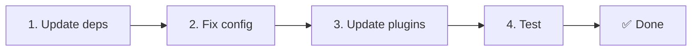

# 📦 الترقية من v2.x إلى v3.x

<Tip>
اطّلع على [الهجرة من nuxt-i18n](/migration/from-nuxtjs-i18n) — يغطّي ذلك الدليل الانتقال من منظومة vue-i18n، وليس من nuxt-i18n-micro v2.
</Tip>

يقدّم v3.0.0 تغييرات معمارية جوهرية: حزم استراتيجية، ونظام تخزين مؤقت جديد، وإدارة مركزية للغة عبر `useI18nLocale()`، ومسار إعادة توجيه مُعاد تصميمه. يغطّي هذا القسم جميع التغييرات الجذرية وكيفية تحديث الشيفرة الخاصة بك.

## خطوات الهجرة



## ملخّص التغييرات الجذرية

- **حالة اللغة** — `useState` / `useCookie` يدويًا → composable `useI18nLocale()`
- **الوصول للتهيئة** — `useRuntimeConfig().public.i18nConfig` → `getI18nConfig()` من `#build/i18n.strategy.mjs`
- **مكوّن إعادة التوجيه** — خيار `fallbackRedirectComponentPath` → إضافة إعادة توجيه على الخادم + وسيط مسار على العميل (تلقائي)
- **`includeDefaultLocaleRoute`** — مدعوم (مهجور) → أُزيل، استخدم خيار `strategy`
- **`experimental.hmr`** — ضمن `experimental` → خيار على المستوى الجذر
- **`previousPageFallback`** — أُزيل بالكامل (تعالج استراتيجية الدمج التراكمي ذلك تلقائيًا)
- **التخزين المؤقت** — `useStorage('cache')` → مفرد `TranslationStorage` (`Symbol.for` على `globalThis`)
- **نقل SSR** — التهيئة في وقت التشغيل → حمولة Nuxt (استخدم v3 `useState`؛ تعيش القطع الآن في `payload.data`، انظر [الأداء](/guides/performance#server-side-payload-transfer))
- **فئات الاستراتيجية** — داخلية → حزم منفصلة (`@i18n-micro/route-strategy` و`@i18n-micro/path-strategy`)

## أُزيل: `fallbackRedirectComponentPath`

أُزيل خيار `fallbackRedirectComponentPath` ومكوّن الاحتياطي `locale-redirect.vue`. يُعالج منطق إعادة التوجيه الآن بواسطة:

1. **وسيط الخادم** (`i18n.global.ts`) — يعيّن `event.context.i18n.locale`
2. **إضافة إعادة توجيه الخادم** (`06.redirect.ts`، الخادم فقط) — إعادات توجيه 302 قبل التقديم
3. **وسيط مسار العميل** (`i18n-redirect.global.ts`) — إعادات توجيه SPA بعد الترطيب

```diff
 i18n: {
   strategy: 'prefix_except_default',
-  fallbackRedirectComponentPath: '~/components/MyRedirect.vue',
 }
```

إذا كان لديك منطق إعادة توجيه مخصّص في مكوّن الاحتياطي، فنفّذه في إضافة خادم بدلًا من ذلك:

```ts
// plugins/i18n-loader.server.ts
export default defineNuxtPlugin({
  name: 'i18n-custom-redirect',
  enforce: 'pre',
  order: -10,
  setup() {
    const { setLocale } = useI18nLocale()
    // Your custom detection logic
    setLocale(detectedLocale)
  },
})
```

## أُزيل: `includeDefaultLocaleRoute`

استخدم خيار `strategy` بدلًا من ذلك:

- `includeDefaultLocaleRoute: true` → `strategy: 'prefix'`
- `includeDefaultLocaleRoute: false` → `strategy: 'prefix_except_default'` (الافتراضي)

```diff
 i18n: {
-  includeDefaultLocaleRoute: true,
+  strategy: 'prefix',
 }
```

## الوصول إلى التهيئة: `getI18nConfig()` يحلّ محلّ `useRuntimeConfig`

```diff
- const config = useRuntimeConfig()
- const cookieName = config.public.i18nConfig?.localeCookie || 'user-locale'
+ import { getI18nConfig } from '#build/i18n.strategy.mjs'
+ const { localeCookie: configCookie } = getI18nConfig()
+ const cookieName = configCookie ?? 'user-locale'
```

## إدارة اللغة: `useI18nLocale()` يحلّ محلّ الحالة اليدوية

في الإصدار v2، ربما كنت تستخدم `useState('i18n-locale')` أو `useCookie('user-locale')` مباشرةً. في v3، استخدم composable المركزي `useI18nLocale()`:

```diff
- const locale = useState('i18n-locale')
- const cookie = useCookie('user-locale')
- locale.value = 'fr'
- cookie.value = 'fr'
+ const { setLocale } = useI18nLocale()
+ setLocale('fr') // Updates both state and cookie atomically
```

اطّلع على [الكشف المخصّص للغة](/guides/custom-language-detection) للحصول على أمثلة مفصّلة.

## نقل/إزالة الخيارات التجريبية

انتقل `hmr` من `experimental` إلى المستوى الجذر. أُزيل `previousPageFallback` بالكامل — تستخدم الوحدة الآن استراتيجية دمج عميق تراكمي (بعمق مستويين) تحفظ تلقائيًا الترجمات من الصفحة السابقة أثناء تأثيرات الانتقال، حتى عندما تتشارك الصفحات مفاتيح متداخلة متداخلة. بعد اكتمال تأثير الانتقال، ينظّف خطاف `page:transition:finish` مفاتيح الصفحة القديمة من الذاكرة.

```diff
 i18n: {
-  experimental: {
-    hmr: true,
-    previousPageFallback: true
-  }
+  hmr: true,
+  // previousPageFallback removed — handled automatically
 }
```

## بنية إعادة التوجيه (v3)

يُعالَج إعادة التوجيه الآن تلقائيًا بواسطة مكوّنين:

1. **جانب الخادم** (`06.redirect.ts`، الخادم فقط): يعمل أثناء SSR، ويُصدر إعادات توجيه 302 قبل تقديم أي صفحة — لا يوجد "وميض خطأ"
2. **جانب العميل** (`i18n-redirect.global.ts`): وسيط مسار عام على تنقّل SPA؛ يحافظ على سلسلة الاستعلام والوسم

أولوية اللغة لإعادة التوجيه:

1. `useState('i18n-locale')` — يُعيَّن عبر `useI18nLocale().setLocale()`
2. الكوكي — إذا كان `localeCookie` مُعدًّا
3. رأس `Accept-Language` — إذا كان `autoDetectLanguage: true`
4. `defaultLocale` — الاحتياطي

لا يلزم تغيير الشيفرة للإعدادات القياسية.

<Warning>
بالنسبة إلى استراتيجيتَي `prefix` و`prefix_except_default` مع `redirects: true`، عيّن `localeCookie: 'user-locale'` لتمكين استمرارية اللغة عبر إعادة تحميل الصفحات. بدونها، تستخدم إعادات التوجيه `Accept-Language` أو `defaultLocale` فقط.
</Warning>

## TypeScript: أنواع الوحدة الداخلية (اختياري)

إذا واجهت أخطاء نوعية تتعلّق بواردات داخلية مثل `#i18n-internal/plural` أو `#i18n-internal/strategy` أو `#i18n-internal/config`، أضف قسم `imports` إلى ملف `package.json` الخاص بمشروعك:

```json
{
  "imports": {
    "#i18n-internal/plural": "nuxt-i18n-micro/internals",
    "#i18n-internal/strategy": "nuxt-i18n-micro/internals",
    "#i18n-internal/config": "nuxt-i18n-micro/internals"
  }
}
```

<Tip>

</Tip>
