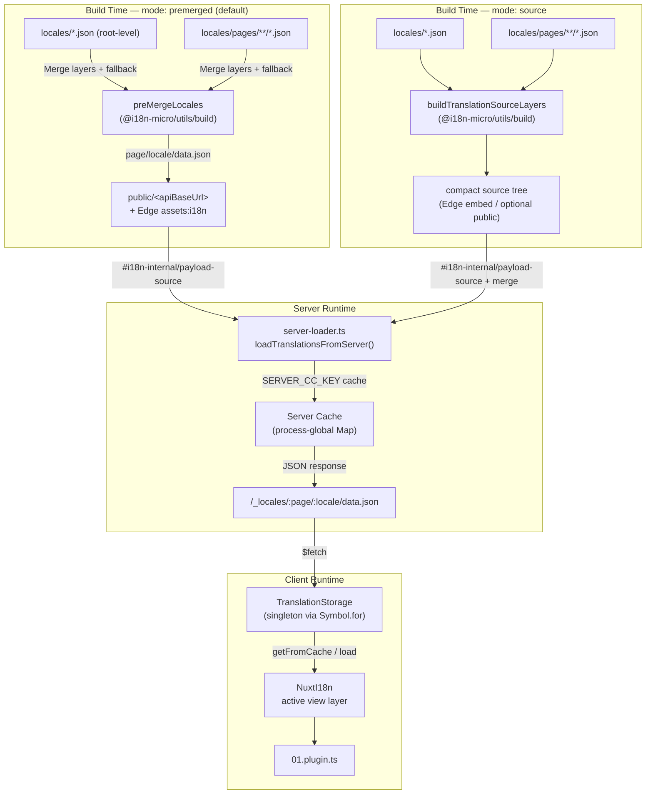

# 🗄️ Arquitectura de la memòria cau i emmagatzematge de traduccions

## 📖 Visió general

Nuxt I18n Micro v3 utilitza una arquitectura de memòria cau multicapa per a les traduccions. La càrrega de payloads depèn de `translationPayloads.mode`:

- **`premerged`** (per defecte) — els fitxers arrel, de pàgina, de fallback i de capes es fusionen en temps de compilació via `@i18n-micro/utils/build` a `\{page\}/\{locale\}/data.json`
- **`source`** — es mantenen fitxers font compactes per a la fusió en temps d'execució via `@i18n-micro/utils/source-loader` i `@i18n-micro/utils/merge-source` (Edge els incrusta a Nitro `serverAssets`; Node els llegeix des de `public/` quan es copien)

Aquesta pàgina descriu com funciona la memòria cau integrada i com ampliar-la per a casos d'ús personalitzats (eines d'administració, APIs externes, invalidació de la memòria cau).

## 📊 Visió general de l'arquitectura

### Flux de dades



## 🧱 Components principals

### 1. `TranslationStorage` (Client + Servidor)

**Fitxer**: `src/runtime/utils/storage.ts`

Una classe singleton que proporciona emmagatzematge de traduccions unificat tant per al client com per al servidor. Utilitza `Symbol.for('__NUXT_I18N_STORAGE_CACHE__')` a `globalThis` per garantir que només existeixi una instància, fins i tot quan es carreguen múltiples bundles.

**Mètodes clau:**

| Mètode                              | Descripció                                                            |
| ----------------------------------- | ---------------------------------------------------------------------- |
| `getFromCache(locale, routeName?)`  | Comprovació síncrona: retorna les dades en memòria caché, o `null`     |
| `load(locale, routeName?, options)` | Càrrega asíncrona amb memòria cau: primer comprova la caché, després fa fetch via `$fetch` |
| `clear()`                           | Neteja tota la memòria cau                                             |

**Format de la clau de la memòria cau**: `\{locale\}:\{routeName\}` (per exemple, `en:index`, `fr:about`)

```typescript
import { translationStorage } from '../utils/storage'

// Synchronous cache check
const cached = translationStorage.getFromCache('en', 'index')

// Async load (with automatic caching)
const result = await translationStorage.load('en', 'index', {
  apiBaseUrl: '_locales',
  baseURL: '/',
  dateBuild: '2024-01-01',
})
// result.data — merged translations
// result.cacheKey — cache key used
```

### ⚙️ Invalidació determinista de la memòria cau (`i18n.dateBuild`)

Per defecte, aquest mòdul genera `dateBuild` durant el temps de compilació utilitzant `Date.now()`. Després s'incrusta al `#build/i18n.strategy.mjs` generat i s'utilitza com a paràmetre de consulta (`?v=...`) per invalidar la memòria cau de fetch de traduccions després de recompilacions.

Si necessites builds reproduïbles (per exemple, per millorar les taxes d'encert de la memòria cau de chunks en desplegaments incrementals), estableix un valor estable a `nuxt.config`:

```ts
export default defineNuxtConfig({
  i18n: {
    // Any stable string/number (git SHA, CI build number, release tag, etc.)
    dateBuild: process.env.GIT_SHA ?? 'local-dev',
  },
})
```

### 2. `loadTranslationsFromServer()` (Només al servidor)

**Fitxer**: `src/runtime/server/utils/server-loader.ts`

Carrega les traduccions per a un locale/pàgina i emmagatzema el resultat fusionat en un mapa `CacheControl` global del procés, indexat per `@i18n-micro/hmr/cache-keys` (`SERVER_CC_KEY`).

Comportament: SSR carrega des de `#i18n-internal/payload-source` — **Node** `readFile` sota `public/<apiBaseUrl>` (`\{page\}/\{locale\}/data.json` en mode premerged), **Edge** `assets:i18n`. `premerged` llegeix un fitxer; `source` fusiona root/page/fallback via `@i18n-micro/utils/source-loader`.

```typescript
import { loadTranslationsFromServer } from '../server/utils/server-loader'

// Returns { data: Translations, json: string }
const { data, json } = await loadTranslationsFromServer('en', 'index')
```

### 3. Càrrega al client (sense incrustament HTML)

Els diccionaris **no** s'escriuen a `nuxtApp.payload`. El servidor els manté en memòria per al render SSR;
el plugin del client fa `await` de `switchContext`, que carrega `/\{apiBaseUrl\}/:page/:locale/data.json`
(la mateixa postura per defecte que `@nuxtjs/i18n` amb `experimental.preload: false`).

`NuxtI18n` conté el diccionari actiu de la capa de vista utilitzat per `$t()` i `$has()`. `NuxtTranslationLoader` canvia el context de locale/ruta i fusiona els chunks en aquesta capa.

### 4. Ruta API del servidor

**Ruta**: `/_locales/\{page\}/\{locale\}/data.json`

**Fitxer**: `src/runtime/server/routes/i18n.ts`

Aquesta ruta Nitro serveix traduccions fusionades per al mode de payload actiu. Crida `loadTranslationsFromServer()` i retorna el resultat com a JSON.

En producció també defineix:

```http
Cache-Control: public, max-age={httpCacheDuration}, immutable
```

El `httpCacheDuration` per defecte és `31536000` (1 any). Això és segur perquè els clients demanen payloads amb cache-busting `?v=\{dateBuild\}`. Estableix `httpCacheDuration: 0` per ometre la capçalera. La capçalera no s'aplica en desenvolupament.

## 📥 Ampliació: Càrrega personalitzada de traduccions

### Llegir des de la memòria cau (ruta del servidor)

```ts
// server/api/i18n/load-cache.[post].ts
import { defineEventHandler, readBody } from 'h3'
import { loadTranslationsFromServer } from '#imports'

export default defineEventHandler(async (event) => {
  const { page, locale } = await readBody<{ page: string; locale: string }>(event)
  const { data } = await loadTranslationsFromServer(locale, page)
  return { locale, page, data }
})
```

### Actualitzar traduccions (fitxer + invalidar la memòria cau)

```ts
// server/api/i18n/update.[post].ts
import { defineEventHandler, readBody, createError } from 'h3'
import { join } from 'node:path'
import { readFile, writeFile } from 'node:fs/promises'
import { deepMergeTranslations } from '@i18n-micro/utils/deep-merge'

export default defineEventHandler(async (event) => {
  const { path, updates } = await readBody<{ path: string; updates: Record<string, unknown> }>(event)

  if (!path || !updates) {
    throw createError({ statusCode: 400, statusMessage: 'Missing path or updates' })
  }

  const fullPath = join('locales', path)
  let existing: Record<string, unknown> = {}

  try {
    const content = await readFile(fullPath, 'utf-8')
    existing = JSON.parse(content) as Record<string, unknown>
  } catch {
    // File does not exist — create new
  }

  const merged = deepMergeTranslations(existing, updates)
  await writeFile(fullPath, JSON.stringify(merged, null, 2), 'utf-8')

  return { success: true, path, updated: merged }
})
```

<Tip>

</Tip>

## 🧹 Neteja de la memòria cau

### Neteja programàtica de la memòria cau (client)

Utilitza el mètode integrat `$clearCache`:

```vue
<script setup>
const { $clearCache } = useNuxtApp()

// Clears both TranslationStorage and plugin-level cache
$clearCache()
</script>
```

### Comportament de la memòria cau del servidor

La memòria cau del costat del servidor (`loadTranslationsFromServer`) és global al procés i persisteix fins que:

- El procés del servidor es reinicia
- Es detecta un nou desplegament (valor diferent de `dateBuild`)

Per a entorns serverless, cada arrencada en fred té una memòria cau nova.

## ⚙️ Configuració serverless

Per a entorns serverless (Cloudflare Workers, AWS Lambda), la memòria cau integrada utilitza objectes `Map` en memòria. No cal configurar cap emmagatzematge extern per a la memòria cau de traduccions en si.

Tanmateix, l'emmagatzematge Nitro per als fitxers font de traducció pot necessitar configuració:

```ts
export default defineNuxtConfig({
  nitro: {
    storage: {
      // Only needed if default file-system storage is unavailable
      'assets:server': {
        driver: 'cloudflare-kv-binding',
        binding: 'MY_KV_NAMESPACE',
      },
    },
  },
})
```

## 💡 Diferències clau respecte a v2

| Aspecte          | v2                            | v3                                                                       |
| ---------------- | ----------------------------- | ------------------------------------------------------------------------ |
| Memòria cau client | `useStorage('cache')`       | Singleton `TranslationStorage` (Symbol.for a globalThis)                 |
| Transferència SSR | Runtime config              | Chunks complets via `payload.data` (v3.0 utilitzava `useState`)          |
| Memòria cau del servidor | Emmagatzematge de la memòria cau de Nitro | `Map` global de procés via `Symbol.for`                          |
| Lògica de fusió  | Al costat del client          | En temps de compilació (`premerged`) o en runtime (`source`) via `@i18n-micro/utils/*` |
| Format de la clau de la memòria cau | `i18n:merged:\{page\}:\{locale\}` | `\{locale\}:\{routeName\}`                                       |

## 📚 Relacionat

- [Guia de rendiment](/guides/performance) — Com afecta la memòria cau al rendiment
- [Traduccions al costat del servidor](/guides/server-side-translations) — Utilitzar traduccions en rutes del servidor
- [Desplegament amb Firebase](/guides/firebase) — Consideracions de memòria cau específiques del desplegament
