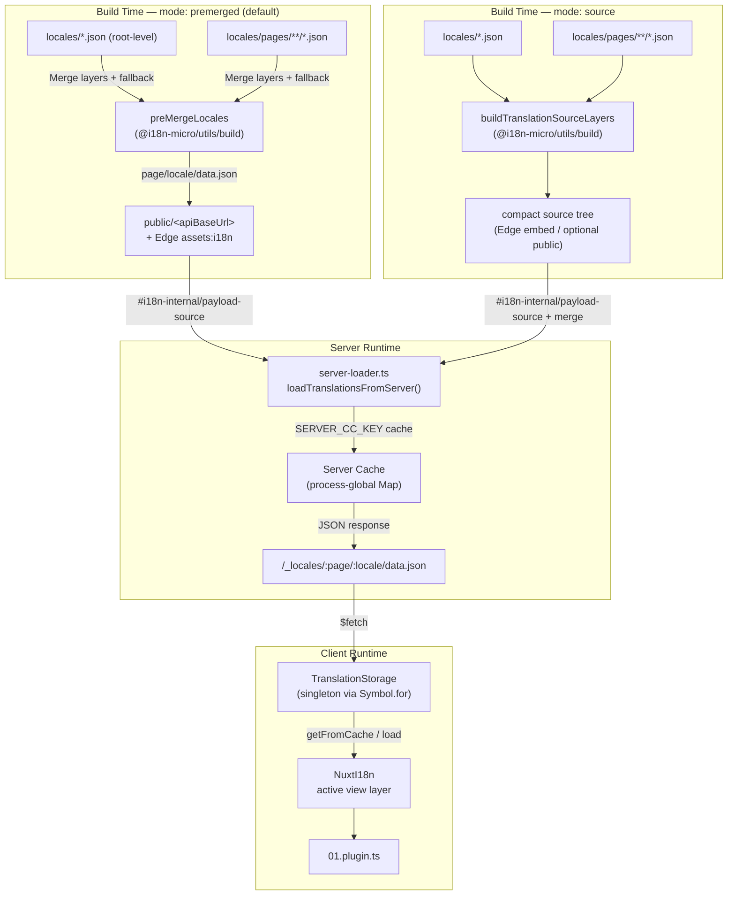

# 🗄️ Arquitectura de memòria cau i emmagatzematge de traduccions

## 📖 Visió general

Nuxt I18n Micro v3 fa servir una arquitectura de memòria cau multicapa per a les traduccions. La càrrega de payloads depèn de `translationPayloads.mode`:

- **`premerged`** (per defecte): els fitxers d'arrel, de pàgina, de fallback i de capes es fusionen en temps de compilació mitjançant `@i18n-micro/utils/build` dins `\{page\}/\{locale\}/data.json`.
- **`source`**: els fitxers font compactes es mantenen per a la fusió en temps d'execució mitjançant `@i18n-micro/utils/source-loader` i `@i18n-micro/utils/merge-source` (Edge els incrusta a `serverAssets` de Nitro; Node els llegeix des de `public/` quan s'han copiat).

Aquesta pàgina descriu com funciona la memòria cau integrada i com estendre-la per a casos d'ús personalitzats (eines d'administració, API externes, invalidació de memòria cau).

## 📊 Visió general de l'arquitectura

### Flux de dades



## 🧱 Components principals

### 1. `TranslationStorage` (client + servidor)

**Fitxer**: `src/runtime/utils/storage.ts`

Una classe singleton que proporciona emmagatzematge unificat de traduccions per a client i servidor. Fa servir `Symbol.for('__NUXT_I18N_STORAGE_CACHE__')` a `globalThis` per assegurar que només existeix una instància, encara que es carreguin múltiples paquets.

**Mètodes clau:**

| Mètode                              | Descripció                                                             |
| ----------------------------------- | ---------------------------------------------------------------------- |
| `getFromCache(locale, routeName?)`  | Comprovació síncrona: retorna les dades en memòria en cau, o `null`    |
| `load(locale, routeName?, options)` | Càrrega asíncrona amb cau: comprova la cau primer, i després obté amb `$fetch` |
| `clear()`                           | Buida tota la memòria cau                                              |

**Format de la clau de cau**: `\{locale\}:\{routeName\}` (per exemple, `en:index`, `fr:about`)

```typescript
import { translationStorage } from '../utils/storage'

// Synchronous cache check
const cached = translationStorage.getFromCache('en', 'index')

// Async load (with automatic caching)
const result = await translationStorage.load('en', 'index', {
  apiBaseUrl: '_locales',
  baseURL: '/',
  dateBuild: '2024-01-01',
})
// result.data — merged translations
// result.cacheKey — cache key used
```

### ⚙️ Invalidació determinista de memòria cau (`i18n.dateBuild`)

Per defecte, aquest mòdul genera `dateBuild` durant la compilació amb `Date.now()`. Després s'incrusta a `#build/i18n.strategy.mjs` generat i es fa servir com a paràmetre de consulta (`?v=...`) per invalidar les memòries cau de traduccions després de recompilacions.

Si necessites compilacions reproduïbles (per exemple, per millorar la taxa d'encert de la cau de fragments en desplegaments rolling), defineix un valor estable a `nuxt.config`:

```ts
export default defineNuxtConfig({
  i18n: {
    // Any stable string/number (git SHA, CI build number, release tag, etc.)
    dateBuild: process.env.GIT_SHA ?? 'local-dev',
  },
})
```

### 2. `loadTranslationsFromServer()` (només servidor)

**Fitxer**: `src/runtime/server/utils/server-loader.ts`

Carrega les traduccions d'un locale/pàgina i emmagatzema el resultat fusionat en un mapa `CacheControl` global del procés indexat per `@i18n-micro/hmr/cache-keys` (`SERVER_CC_KEY`).

Comportament: SSR carrega des de `#i18n-internal/payload-source`. **Node** fa `readFile` sota `public/<apiBaseUrl>` (`\{page\}/\{locale\}/data.json` en mode premerged), **Edge** fa `assets:i18n`. `premerged` llegeix un únic fitxer; `source` fusiona root/page/fallback mitjançant `@i18n-micro/utils/source-loader`.

```typescript
import { loadTranslationsFromServer } from '../server/utils/server-loader'

// Returns { data: Translations, json: string }
const { data, json } = await loadTranslationsFromServer('en', 'index')
```

### 3. Càrrega des del client (sense inserció a HTML)

Els diccionaris **no** s'escriuen a `nuxtApp.payload`. El servidor els conserva en memòria per a la renderització SSR. El plugin del client `await`a `switchContext`, que carrega `/\{apiBaseUrl\}/:page/:locale/data.json` (mateixa postura per defecte que `@nuxtjs/i18n` amb `experimental.preload: false`).

`NuxtI18n` conté el diccionari actiu de la capa de vista que fan servir `$t()` i `$has()`. `NuxtTranslationLoader` canvia el context de locale/ruta i fusiona els fragments dins d'aquesta capa.

### 4. Ruta d'API del servidor

**Ruta**: `/_locales/\{page\}/\{locale\}/data.json`

**Fitxer**: `src/runtime/server/routes/i18n.ts`

Aquesta ruta Nitro serveix les traduccions fusionades del mode de payload actiu. Crida `loadTranslationsFromServer()` i retorna el resultat com a JSON.

En producció també defineix:

```http
Cache-Control: public, max-age={httpCacheDuration}, immutable
```

Per defecte, `httpCacheDuration` és `31536000` (1 any). És segur perquè els clients demanen els payloads amb `?v=\{dateBuild\}` per invalidar la cau. Defineix `httpCacheDuration: 0` per ometre la capçalera. La capçalera no s'aplica en desenvolupament.

## 📥 Ampliació: càrrega personalitzada de traduccions

### Llegir de la memòria cau (ruta de servidor)

```ts
// server/api/i18n/load-cache.[post].ts
import { defineEventHandler, readBody } from 'h3'
import { loadTranslationsFromServer } from '#imports'

export default defineEventHandler(async (event) => {
  const { page, locale } = await readBody<{ page: string; locale: string }>(event)
  const { data } = await loadTranslationsFromServer(locale, page)
  return { locale, page, data }
})
```

### Actualitzar traduccions (fitxer + invalidar la memòria cau)

```ts
// server/api/i18n/update.[post].ts
import { defineEventHandler, readBody, createError } from 'h3'
import { join } from 'node:path'
import { readFile, writeFile } from 'node:fs/promises'
import { deepMergeTranslations } from '@i18n-micro/utils/deep-merge'

export default defineEventHandler(async (event) => {
  const { path, updates } = await readBody<{ path: string; updates: Record<string, unknown> }>(event)

  if (!path || !updates) {
    throw createError({ statusCode: 400, statusMessage: 'Missing path or updates' })
  }

  const fullPath = join('locales', path)
  let existing: Record<string, unknown> = {}

  try {
    const content = await readFile(fullPath, 'utf-8')
    existing = JSON.parse(content) as Record<string, unknown>
  } catch {
    // File does not exist — create new
  }

  const merged = deepMergeTranslations(existing, updates)
  await writeFile(fullPath, JSON.stringify(merged, null, 2), 'utf-8')

  return { success: true, path, updated: merged }
})
```


## 🧹 Buidatge de la memòria cau

### Buidatge programàtic de la memòria cau (client)

Fes servir el mètode integrat `$clearCache`:

```vue
<script setup>
const { $clearCache } = useNuxtApp()

// Clears both TranslationStorage and plugin-level cache
$clearCache()
</script>
```

### Comportament de la memòria cau al servidor

La memòria cau del servidor (`loadTranslationsFromServer`) és global del procés i persisteix fins que:

- El procés del servidor es reinicia.
- Es detecta un nou desplegament (valor `dateBuild` diferent).

En entorns serverless, cada inici en fred té una memòria cau nova.

## ⚙️ Configuració per a serverless

Per a entorns serverless (Cloudflare Workers, AWS Lambda), la memòria cau integrada fa servir objectes `Map` en memòria. No cal configurar cap emmagatzematge extern per a la memòria cau de traduccions.

Tot i això, l'emmagatzematge Nitro per als fitxers font de traducció pot necessitar configuració:

```ts
export default defineNuxtConfig({
  nitro: {
    storage: {
      // Only needed if default file-system storage is unavailable
      'assets:server': {
        driver: 'cloudflare-kv-binding',
        binding: 'MY_KV_NAMESPACE',
      },
    },
  },
})
```

## 💡 Diferències clau respecte a v2

| Aspecte           | v2                            | v3                                                                       |
| ----------------- | ----------------------------- | ------------------------------------------------------------------------ |
| Memòria cau client | `useStorage('cache')`        | Singleton `TranslationStorage` (Symbol.for a globalThis)                 |
| Transferència SSR | Configuració en temps d'execució | Fragments complets mitjançant `payload.data` (v3.0 feia servir `useState`) |
| Memòria cau servidor | Emmagatzematge de cau Nitro | `Map` global del procés mitjançant `Symbol.for`                          |
| Lògica de fusió   | Al client                     | En temps de compilació (`premerged`) o d'execució (`source`) mitjançant `@i18n-micro/utils/*` |
| Format de clau de cau | `i18n:merged:\{page\}:\{locale\}` | `\{locale\}:\{routeName\}`                                              |

## 📚 Relacionats

- [Guia de rendiment](/guides/performance): com afecta la memòria cau al rendiment.
- [Traduccions al servidor](/guides/server-side-translations): ús de traduccions a rutes del servidor.
- [Desplegament a Firebase](/guides/firebase): consideracions específiques de memòria cau en el desplegament.
