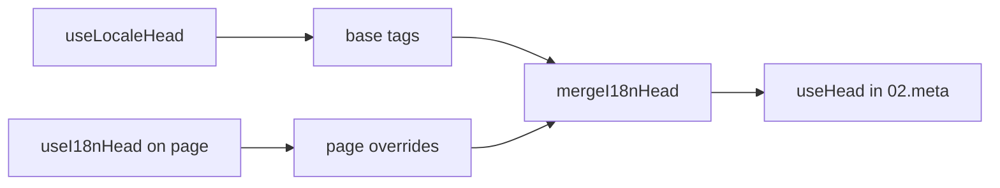

# Composable `useI18nHead`

`useI18nHead` et permet personalitzar les tags SEO d'i18n **per pàgina** sense un plugin meta personalitzat. Quan `meta: true`, el mòdul fusiona la teva entrada sobre la sortida de [`useLocaleHead`](/api/composables/use-locale-head).

Casos típics:

- **Articles de CMS / blog** — només alguns locales estan traduïts; les URLs alternatives difereixen segons l'idioma (slugs o rutes diferents).
- **Canonical dinàmica** — la URL canònica ha de coincidir amb la URL de l'article de l'API, no amb `$switchLocalePath`.
- **Open Graph extra** — `og:title`, `og:description`, `og:image` juntament amb `og:locale` / `og:url` autogenerats.
- **Control parcial** — mantenir la canonical i `og:url` generades pel mòdul, però reemplaçar només `hreflang` i `og:locale:alternate`.

---

## Signatura

{/* generated:symbol:useI18nHead — do not edit; run `pnpm run docs:generate` */}

```ts
useI18nHead(input?: MaybeRefOrGetter<I18nHeadInput | null>): { pageHead: any; resetPageHead: () => void }
```

Registra sobreescriptures a nivell de pàgina per a les head tags de SEO d'i18n.
Es fusionen sobre la sortida de `useLocaleHead` pel plugin `02.meta`.

| Paràmetre | Tipus | Descripció |
| --- | --- | --- |
| `input` *(opcional)* | `MaybeRefOrGetter<I18nHeadInput \| null>` |  |

{/* /generated:symbol:useI18nHead */}

## Com encaixa al pipeline



Crides `useI18nHead` en un component de pàgina. El plugin `02.meta` aplica les sobreescriptures després de cada `updateMeta()` (canvi de ruta, `$setI18nRouteParams`, `page:finish` al client).

---

## Exemple 1 — Article amb traduccions només en alguns locales

Un patró habitual: l'API retorna quins locales existeixen i les seves URLs absolutes o relatives.

```ts
interface Article {
  title: string
  slug: string
  /** Locale code → page URL (absolute or site-relative) */
  locales: Record<string, string>
}
```

```vue
<script setup lang="ts">
const route = useRoute()
const { data: article } = await useFetch<Article>(`/api/articles/${route.params.slug}`)

const localeCodes = computed(() => Object.keys(article.value?.locales ?? {}))

useI18nHead(() => {
  if (!article.value) return null

  return {
    meta: [
      { property: 'og:title', content: article.value.title },
      { property: 'og:type', content: 'article' },
    ],
    replace: {
      hreflang: localeCodes.value.map((locale) => ({
        rel: 'alternate',
        hreflang: locale,
        href: article.value!.locales[locale]!,
      })),
      ogAlternates: localeCodes.value,
    },
  }
})
</script>
```

`ogAlternates` pren **codis de locale** de la teva configuració `i18n.locales`. Els valors per a `og:locale:alternate` es resolen mitjançant `locale.og` o `iso` (format `en_US` d'Open Graph).

---

## Exemple 2 — Article amb slugs per locale (`$defineI18nRoute` + `$setI18nRouteParams`)

Quan les URLs es construeixen a partir de plantilles de ruta localitzades i paràmetres dinàmics:

```vue
<script setup lang="ts">
const { $defineI18nRoute, $setI18nRouteParams } = useNuxtApp()
const route = useRoute()

const { data: article } = await useFetch(`/api/articles/${route.params.slug}`)

$defineI18nRoute({
  localeRoutes: {
    en: '/blog/[slug]',
    de: '/de/blog/[slug]',
    fr: '/fr/blog/[slug]',
  },
})

if (article.value) {
  $setI18nRouteParams({
    en: { slug: article.value.slugEn },
    de: { slug: article.value.slugDe },
    fr: { slug: article.value.slugFr },
  })

  const availableLocales = article.value.availableLocales as string[]

  useI18nHead({
    meta: [{ property: 'og:title', content: article.value.title }],
    replace: {
      hreflang: availableLocales.map((locale) => ({
        rel: 'alternate',
        hreflang: locale,
        href: article.value!.urls[locale],
      })),
      ogAlternates: availableLocales,
    },
  })
}
</script>
```

Les alternatives generades pel mòdul llistarien **tots** els locales configurats. `replace.hreflang` limita les tags als locales que realment tenen una traducció.

---

## Exemple 3 — `x-default` personalitzat per a la URL de l'article del locale per defecte

Per defecte, `x-default` apunta a la URL del locale per defecte des de `$switchLocalePath`. Per als articles, apunta-ho a la URL de traducció per defecte:

```vue
<script setup lang="ts">
const { $defaultLocale } = useNuxtApp()
const article = await loadArticle()

const defaultLocale = $defaultLocale() ?? 'en'
const defaultHref = article.locales[defaultLocale]

useI18nHead({
  replace: {
    hreflang: Object.entries(article.locales).map(([locale, href]) => ({
      rel: 'alternate',
      hreflang: locale,
      href,
    })),
    xDefault: defaultHref ? { rel: 'alternate', hreflang: 'x-default', href: defaultHref } : false,
    ogAlternates: Object.keys(article.locales),
  },
})
</script>
```

---

## Exemple 4 — Reemplaçar canonical i `og:url` des de dades de l'API

Quan la canonical ha de coincidir amb una URL proporcionada pel CMS (multi-domini, ruta personalitzada o URL absoluta preconstruïda):

```vue
<script setup lang="ts">
const article = await loadArticle()
const canonical = article.canonicalUrl // e.g. https://www.example.com/en/blog/my-post

useI18nHead({
  replace: {
    canonical,
    ogUrl: canonical,
    hreflang: buildAlternateLinks(article),
    ogAlternates: Object.keys(article.locales),
  },
  meta: [
    { property: 'og:title', content: article.title },
    { name: 'description', content: article.excerpt },
  ],
})
</script>
```

---

## Exemple 5 — Mantenir la canonical / `og:url` automàtiques, reemplaçar només les alternatives

Si `$switchLocalePath` + `$setI18nRouteParams` ja produeixen una canonical i `og:url` correctes, reemplaça només les tags de descoberta:

```vue
<script setup lang="ts">
const article = await loadArticle()

useI18nHead({
  replace: {
    hreflang: buildAlternateLinks(article),
    ogAlternates: Object.keys(article.locales),
  },
})
</script>
```

---

## Exemple 6 — Head complet per a una pàgina de detall de contingut (meta + links)

Patró similar a dividir "meta de pàgina" i "enllaços alternatius" en helpers separats — combinat en una sola crida:

```vue
<script setup lang="ts">
const article = await loadArticle()
const alternates = Object.entries(article.locales).map(([locale, href]) => ({
  rel: 'alternate' as const,
  hreflang: locale,
  href: normalizeSeoUrl(href), // strip ?query and #hash if needed
}))

useI18nHead({
  meta: [
    { property: 'og:title', content: article.title },
    { property: 'og:description', content: article.description },
    { property: 'og:image', content: article.imageUrl },
    { name: 'twitter:card', content: 'summary_large_image' },
    { name: 'twitter:title', content: article.title },
  ],
  replace: {
    canonical: article.canonicalUrl,
    ogUrl: article.canonicalUrl,
    hreflang: alternates,
    ogAlternates: Object.keys(article.locales),
  },
})
</script>
```

```ts
/** Remove query and hash — useful when CMS URLs must be clean for SEO */
function normalizeSeoUrl(href: string): string {
  try {
    const url = new URL(href, 'https://placeholder.local')
    url.search = ''
    url.hash = ''
    return href.startsWith('http') ? url.href : `${url.pathname}`
  } catch {
    return href.split(/[?#]/)[0] ?? href
  }
}
```

---

## Exemple 7 — Dos tipus de contingut, mateix patró (notícies vs guies)

Mateixa forma d'API, noms de ruta diferents — reutilitza un petit helper:

```ts
// composables/useArticleHead.ts
import type { I18nHeadInput } from '@i18n-micro/types'

interface LocalizedContent {
  title: string
  locales: Record<string, string>
  canonicalUrl?: string
}

export function buildArticleHead(content: LocalizedContent): I18nHeadInput {
  const localeCodes = Object.keys(content.locales)
  const canonical = content.canonicalUrl ?? content.locales.en

  return {
    meta: [{ property: 'og:title', content: content.title }],
    replace: {
      canonical,
      ogUrl: canonical,
      hreflang: localeCodes.map((locale) => ({
        rel: 'alternate',
        hreflang: locale,
        href: content.locales[locale]!,
      })),
      ogAlternates: localeCodes,
    },
  }
}
```

```vue
<!-- pages/blog/[slug].vue -->
<script setup lang="ts">
const article = await loadArticle()
useI18nHead(buildArticleHead(article))
</script>
```

```vue
<!-- pages/guides/[slug].vue -->
<script setup lang="ts">
const guide = await loadGuide()
useI18nHead(buildArticleHead(guide))
</script>
```

---

## Exemple 8 — Desactivar les alternatives integrades, proporcionar la teva llista

Equivalent a desactivar el generador de hreflang del mòdul i passar una llista personalitzada (sense conjunts alternatius duplicats):

```vue
<script setup lang="ts">
const article = await loadArticle()

useI18nHead({
  disable: ['hreflang', 'x-default', 'og-alternates'],
  link: Object.entries(article.locales).map(([locale, href]) => ({
    rel: 'alternate',
    hreflang: locale,
    href,
  })),
  replace: {
    ogAlternates: Object.keys(article.locales),
  },
})
</script>
```

O prefereix `replace.hreflang` sense `disable` — reemplaça tots els enllaços `rel="alternate"` en un sol pas.

---

## Exemple 9 — Pàgina d'aterratge: només OG extra, mantenir totes les tags d'i18n

```vue
<script setup lang="ts">
const { t } = useI18n()

useI18nHead({
  meta: [
    { property: 'og:title', content: t('landing.ogTitle') },
    { property: 'og:description', content: t('landing.ogDescription') },
  ],
})
</script>
```

---

## Exemple 10 — Pàgina de producte: desactivar hreflang per a un experiment amb un sol locale

```vue
<script setup lang="ts">
useI18nHead({
  disable: ['hreflang', 'x-default'],
  // canonical, og:locale, og:url still generated
})
</script>
```

---

## Exemple 11 — Actualitzacions reactives després d'un fetch al client

```vue
<script setup lang="ts">
const article = ref<Article | null>(null)

onMounted(async () => {
  article.value = await $fetch('/api/articles/latest')
})

useI18nHead(() => {
  if (!article.value) return null
  return {
    meta: [{ property: 'og:title', content: article.value.title }],
    replace: {
      hreflang: Object.entries(article.value.locales).map(([locale, href]) => ({
        rel: 'alternate',
        hreflang: locale,
        href,
      })),
    },
  }
})
</script>
```

El head es refresca a `page:finish` i quan l'estat `pageHead` canvia.

---

## Exemple 12 — Origen HTTPS darrere d'un reverse proxy

Si prèviament resolies un composable de "public origin" per a URLs absolutes de canonical / alternates, utilitza la configuració del mòdul en el seu lloc:

```ts
// nuxt.config.ts
export default defineNuxtConfig({
  i18n: {
    meta: true,
    // undefined = origin from current request (multi-domain friendly)
    metaBaseUrl: undefined,
    metaTrustForwardedHost: true,
    metaTrustForwardedProto: true,
  },
})
```

Després passa **rutes o URLs completes** a `replace.hreflang` / `replace.canonical`. El mòdul utilitza `useRequestURL` amb `X-Forwarded-Host` / `X-Forwarded-Proto` en SSR.

---

## Referència de l'API

### `meta`

Tags `<meta>` addicionals. Deduplicades per `id`, `property` o `name`.

### `link`

Tags `<link>` addicionals. Deduplicades per `id` o `rel` + `hreflang`.

### `htmlAttrs`

Fusionades als atributs de `<html>` des de `useLocaleHead` (`lang`, `dir`).

### `replace`

| Clau           | Tipus                     | Efecte                                         |
| -------------- | ------------------------- | ---------------------------------------------- |
| `canonical`    | `string \| false`         | Reemplaça o elimina l'enllaç canonical         |
| `hreflang`     | `I18nHeadLink[] \| false` | Reemplaça o elimina tots els enllaços `rel="alternate"` |
| `xDefault`     | `I18nHeadLink \| false`   | Reemplaça o elimina `hreflang="x-default"`     |
| `ogLocale`     | `string \| false`         | Reemplaça o elimina `og:locale`                |
| `ogUrl`        | `string \| false`         | Reemplaça o elimina `og:url`                   |
| `ogAlternates` | `string[] \| false`       | Reconstrueix `og:locale:alternate` per als codis de locale |

### `disable`

| Valor           | Elimina                                     |
| --------------- | ------------------------------------------ |
| `hreflang`      | Enllaços alternatius de locale (no `x-default`) |
| `x-default`     | Enllaç `hreflang="x-default"`              |
| `canonical`     | Enllaç canonical                           |
| `og`            | `og:locale` i `og:url`                     |
| `og-alternates` | Tags `og:locale:alternate`                 |
| `html`          | `lang` / `dir` a `<html>`                  |

---

## `useLocaleHead` vs `useI18nHead`

| Composable      | Àmbit                | Quan utilitzar-lo                          |
| --------------- | -------------------- | ------------------------------------------ |
| `useLocaleHead` | Global / head manual | `meta: false`, configuració completa personalitzada de `useHead` |
| `useI18nHead`   | Sobreescriptures per pàgina | `meta: true`, personalitzar pàgines específiques |

Quan `meta: true`, **no** necessites `useLocaleHead` a les pàgines que només utilitzen `useI18nHead`.

---

## Migració d'un plugin d'i18n head personalitzat

Molts projectes mantenen un plugin personalitzat que:

- fusiona enllaços alternatius específics de pàgina des d'un estat compartit;
- filtra entrades regionals de `hreflang` duplicades;
- normalitza els valors d'`og:locale`;
- elimina les query strings de les URLs SEO.

Pots reemplaçar-ho amb `useI18nHead` a cada pàgina de contingut i els valors per defecte del mòdul.

| Enfocament anterior                                     | Amb `useI18nHead`                                   |
| ----------------------------------------------------- | ---------------------------------------------------- |
| Estat compartit + "quins locales existeixen per aquest article" | `replace: \{ ogAlternates: localeCodes \}`             |
| Helper separat que construeix enllaços `rel="alternate"` | `replace: \{ hreflang: links \}`                       |
| Plugin personalitzat que fusiona l'estat de la pàgina al head | Fusió integrada a `02.meta`                          |
| "public origin" personalitzat per a URLs absolutes    | `metaBaseUrl` + capçaleres forwarded (vegeu Exemple 12) |
| `og:locale` curt (`en` en lloc de `en_US`)            | Estableix `locale.og` o utilitza `iso` → `en_US` (protocol OG) |

**`hreflang` a partir d'`iso`:** cada locale emet una alternativa amb `hreflang = iso || code`. El `code` d'enrutament mai s'utilitza quan `iso` està definit (evita tags no vàlides com ara `hreflang="mx"`). Activa les alternatives amb només l'idioma (`es-ES` → també `es`) amb `hreflangBaseLanguage: true` — derivades d'`iso`, no de `code`. Per a llistes totalment personalitzades, utilitza `replace.hreflang`.

**JSON-LD:** `useI18nHead` no genera dades estructurades. Manté `useHead(\{ script: [...] \})` o un helper JSON-LD dedicat al seu costat.

---

## Vegeu també

- [Guia de SEO](/guides/seo) — generació automàtica de meta i sobreescriptures a nivell de pàgina
- [`useLocaleHead`](/api/composables/use-locale-head) — API de head de baix nivell
