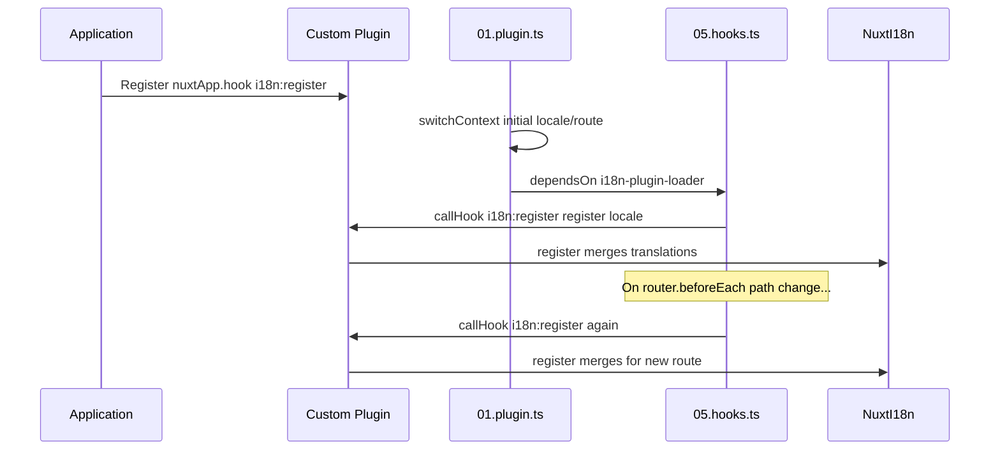

# 📢 Esdeveniments

## 🔄 `i18n:register`

L'esdeveniment `i18n:register` de `Nuxt I18n Micro` permet afegir traduccions dinàmicament al context i18n de la teva aplicació, fent el procés d'internacionalització fluid i flexible. Aquest esdeveniment et permet integrar noves traduccions quan calgui, millorant les capacitats de localització de l'aplicació.

### 📝 Detalls de l'esdeveniment

- **Finalitat**:
  - Permet incorporar dinàmicament traduccions addicionals al conjunt existent per a un locale concret.

- **Càrrega útil**:
  - **`register`**:
    - Una funció proporcionada per l'esdeveniment que rep dos arguments:
      - **`translations`** (`Translations`):
        - Un objecte amb parells clau-valor que representen traduccions, organitzats segons la interfície `Translations`.
      - **`locale`** (`string`, opcional):
        - El codi de locale (per exemple, `'en'`, `'ru'`) per al qual es registren les traduccions. Per defecte, el locale proporcionat per l'esdeveniment si no s'especifica.

- **Comportament**:
  - Quan es dispara, la funció `register` fusiona les noves traduccions al context actual per al locale especificat, actualitzant les traduccions disponibles a tota l'aplicació.

### ⏱️ Quan es dispara

El plugin de hooks del mòdul (`05.hooks.ts`, `dependsOn: ['i18n-plugin-loader']`) crida `nuxtApp.callHook('i18n:register', …)`:

1. **Una vegada a l'inici**: després que el plugin principal d'i18n (`01.plugin.ts`) hagi carregat les traduccions per a la ruta inicial.
2. **En navegar**: a `router.beforeEach` quan canvia la ruta, o a cada navegació quan `strategy: 'no_prefix'`.

Registra el teu listener en un plugin normal de Nuxt amb `nuxtApp.hook('i18n:register', …)`. El plugin de hooks s'executa després que el carregador estigui llest, així que la teva callback s'invoca quan les traduccions s'han d'ampliar.

Defineix `hooks: false` a `nuxt.config` per desactivar les crides automàtiques `i18n:register` (consulta [Configuració — `hooks`](/guides/configuration#hooks)).

### 💡 Exemple d'ús

L'exemple següent mostra com fer servir l'esdeveniment `i18n:register` per afegir traduccions dinàmicament:

```typescript
nuxt.hook('i18n:register', async (register: (translations: unknown, locale?: string) => void, locale: string) => {
  register(
    {
      greeting: 'Hello',
      farewell: 'Goodbye',
    },
    locale,
  )
})
```

### 🛠️ Explicació



- **Disparament de l'esdeveniment**:
  - El plugin de hooks (`05.hooks.ts`) dispara `i18n:register` quan el carregador principal està llest i a les navegacions rellevants.

- **Afegir traduccions**:
  - L'exemple registra traduccions en anglès per a `"greeting"` i `"farewell"`.
  - La funció `register` fusiona aquestes traduccions al conjunt existent per al locale proporcionat.

### 🔗 Beneficis principals

- **Actualitzacions dinàmiques**:
  - Actualitza o afegeix traduccions fàcilment sense haver de redesplegar tota l'aplicació.

- **Flexibilitat de localització**:
  - Admet ajustos de localització en temps real segons les necessitats de l'usuari o l'aplicació.

Fent servir l'esdeveniment `i18n:register`, pots assegurar-te que l'estratègia de localització de l'aplicació sigui flexible i adaptable, millorant l'experiència d'usuari.

---

## 🛠️ Modificació de traduccions amb plugins

Per modificar traduccions dinàmicament a la teva aplicació Nuxt, es recomana fer servir plugins. Els plugins ofereixen una manera estructurada de gestionar actualitzacions de localització, especialment quan es treballa amb mòduls o fitxers de traducció externs.

### **Registre del plugin**

Si fas servir un mòdul, registra el plugin on es produiran les modificacions de traducció afegint-lo a la configuració del mòdul:

```javascript
addPlugin({
  src: resolve('./plugins/extend_locales'),
})
```

Això registra el plugin situat a `./plugins/extend_locales`, que gestionarà la càrrega dinàmica i el registre de traduccions.

### **Implementació del plugin**

Al plugin pots gestionar les modificacions de locale. Aquest és un exemple d'implementació en un plugin de Nuxt:

```typescript
import { defineNuxtPlugin } from '#app'

export default defineNuxtPlugin(async (nuxtApp) => {
  // Function to load translations from JSON files and register them
  const loadTranslations = async (lang: string) => {
    try {
      const translations = await import(`../locales/${lang}.json`)
      return translations.default
    } catch (error) {
      console.error(`Error loading translations for language: ${lang}`, error)
      return null
    }
  }

  // Hook into the 'i18n:register' event to dynamically add translations
  // eslint-disable-next-line @typescript-eslint/ban-ts-comment
  // @ts-expect-error
  nuxtApp.hook('i18n:register', async (register: (translations: unknown, locale?: string) => void, locale: string) => {
    const translations = await loadTranslations(locale)
    if (translations) {
      register(translations, locale)
    }
  })
})
```

### 📝 Explicació detallada

1. **Càrrega de traduccions**:

- La funció `loadTranslations` importa dinàmicament els fitxers de traducció segons el locale. Els fitxers s'espera que siguin al directori `locales` i que estiguin anomenats segons els codis de locale (per exemple, `en.json`, `de.json`).
- En una càrrega correcta, es retornen les traduccions; en cas contrari, es registra un error.

2. **Registre de traduccions**:

- El plugin s'enganxa a l'esdeveniment `i18n:register` mitjançant `nuxtApp.hook`.
- Quan es dispara l'esdeveniment, es crida la funció `register` amb les traduccions carregades i el locale corresponent.
- Això fusiona les noves traduccions al context i18n per al locale especificat, actualitzant les traduccions disponibles a tota l'aplicació.

### 🔗 Beneficis d'usar plugins per a modificacions de traduccions

- **Separació de responsabilitats**:
  - Encapsula la lògica de localització separadament del codi principal de l'aplicació, facilitant-ne la gestió i el manteniment.

- **Dinàmic i escalable**:
  - En carregar i registrar traduccions dinàmicament, pots actualitzar contingut sense necessitat de redesplegar completament l'aplicació, cosa especialment útil per a aplicacions amb contingut actualitzat sovint o multilingüe.

- **Major flexibilitat de localització**:
  - Els plugins et permeten modificar o ampliar traduccions segons calgui, oferint una estratègia de localització més adaptable i receptiva a les preferències de l'usuari o els requisits del negoci.

Adoptant aquest enfocament, pots ampliar i modificar eficientment la localització de l'aplicació mitjançant un procés estructurat i mantenible amb plugins, mantenint la internacionalització adaptativa a les necessitats canviants i millorant l'experiència d'usuari.
