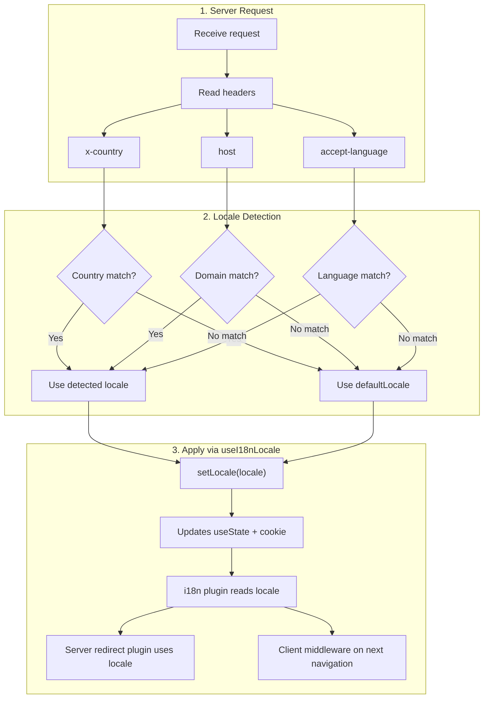

# 🔧 Detecció d'idioma personalitzada a Nuxt I18n Micro

## 📖 Visió general

Nuxt I18n Micro v3 proporciona un composable centralitzat — `useI18nLocale()` — per a tota la gestió del locale. Aquest reemplaça els patrons manuals `useState`/`useCookie` de v2. Utilitzant `useI18nLocale().setLocale()` en un plugin del servidor, pots implementar qualsevol lògica de detecció personalitzada mantenint la compatibilitat total amb els sistemes de redirecció i cookies del mòdul.

## 🏗️ Arquitectura

```mermaid
flowchart TB
    subgraph Plugins["Plugin Execution Order"]
        A["Your plugin<br/>order: -10"] -->|setLocale()| B["01.plugin.ts<br/>order: -5"]
        B --> C["06.redirect.ts server<br/>order: 10"]
    end

    subgraph Client["Client SPA Navigation"]
        D["i18n-redirect.global.ts<br/>route middleware"]
    end

    subgraph State["Locale State"]
        E["useState('i18n-locale')"]
        F["localeCookie"]
    end

    A -->|"setLocale() updates both"| E
    A -->|"setLocale() updates both"| F
    B -->|reads| E
    C -->|reads| E
    C -->|reads| F
    D -->|reads target route +| E
```

**Principi clau**: Crida `useI18nLocale().setLocale()` en un plugin del servidor amb `order: -10`. Això actualitza atòmicament tant `useState('i18n-locale')` com la cookie de locale, de manera que el plugin d'i18n (`order: -5`) i el plugin de redirecció del servidor (`order: 10`) veuen el locale correcte a la primera petició SSR. Les redireccions automàtiques al client s'executen al middleware global de ruta en navegacions posteriors.

## 🛠️ Desactivar la detecció automàtica integrada

Si vols un control total sobre la detecció de locale, desactiva el mecanisme integrat:

```ts
export default defineNuxtConfig({
  i18n: {
    autoDetectLanguage: false,
  },
})
```

## ✨ Exemple: Detecció al servidor amb `useI18nLocale`

Aquest és **l'enfocament recomanat** per a totes les estratègies.

### Pas 1: Configura `nuxt.config.ts`

```ts
export default defineNuxtConfig({
  modules: ['nuxt-i18n-micro'],
  i18n: {
    strategy: 'no_prefix', // Works with ANY strategy
    defaultLocale: 'en',
    localeCookie: 'user-locale',
    autoDetectLanguage: false,
    locales: [
      { code: 'en', iso: 'en-US' },
      { code: 'de', iso: 'de-DE' },
      { code: 'ja', iso: 'ja-JP' },
    ],
  },
})
```

### Pas 2: Crea `plugins/i18n-loader.server.ts`

```ts
import { defineNuxtPlugin, useRequestHeaders } from '#imports'

export default defineNuxtPlugin({
  name: 'i18n-custom-loader',
  enforce: 'pre',
  order: -10, // Execute BEFORE the i18n plugin (which has order -5)

  setup() {
    const { setLocale } = useI18nLocale()
    const headers = useRequestHeaders(['host', 'x-country', 'accept-language'])
    let detectedLocale = 'en'

    // --- YOUR DETECTION LOGIC ---

    // Example 1: By domain
    const host = headers['host']
    if (host?.includes('example.de')) {
      detectedLocale = 'de'
    }
    // Example 2: By custom header
    else if (headers['x-country'] === 'JP') {
      detectedLocale = 'ja'
    }
    // Example 3: By Accept-Language header
    else if (headers['accept-language']?.includes('de')) {
      detectedLocale = 'de'
    }

    // --- APPLY THE LOCALE ---
    setLocale(detectedLocale)
  },
})
```

### Com funciona



1. **El plugin s'executa primer** (`order: -10`) — detecta el locale a partir de capçaleres, domini o altres fonts
2. **`setLocale()` actualitza tots dos** `useState('i18n-locale')` i la cookie — garanteix visibilitat immediata a tots els plugins posteriors
3. **El plugin d'i18n** (`order: -5`) llegeix el locale i carrega les traduccions correctes
4. **El plugin de redirecció del servidor** (`order: 10`) utilitza el locale per a decisions de redirecció a SSR
5. **El middleware de ruta al client** (`i18n-redirect`) aplica redireccions a la navegació SPA quan el locale de l'URL no coincideix amb la preferència

## 🌐 Comportament específic d'estratègia

`useI18nLocale().setLocale()` funciona amb **totes les estratègies**. El comportament de redirecció depèn de l'estratègia:

<Tip>
| Estratègia | Efecte de `setLocale('de')` |
|----------|---------------------------|
| `no_prefix` | Renderitza en alemany, sense canvi d'URL |
| `prefix` | 302 → `/de/` (redirecció al servidor) |
| `prefix_except_default` | 302 → `/de/` si `de` ≠ per defecte; sense redirecció si `de` = per defecte |
| `prefix_and_default` | Sense redirecció (`/` i `/de/` són vàlids) |
</Tip>

**Notes importants:**

- La detecció de locale basada en cookies està desactivada per defecte (`localeCookie: null`)
- Defineix `localeCookie: 'user-locale'` per activar la persistència de cookies
- Si el valor de cookie/estat no és a la llista `locales`, recorre a `defaultLocale`

## 🏢 Avançat: Detecció basada en domini

Per a configuracions multidomini on cada domini serveix un locale diferent:

```ts
import { defineNuxtPlugin, useRequestHeaders } from '#imports'

export default defineNuxtPlugin({
  name: 'i18n-domain-loader',
  enforce: 'pre',
  order: -10,

  setup() {
    const { setLocale } = useI18nLocale()
    const headers = useRequestHeaders(['host'])
    const host = headers['host'] || ''

    let detectedLocale = 'en'

    if (host.endsWith('.de') || host.includes('german.')) {
      detectedLocale = 'de'
    } else if (host.endsWith('.fr') || host.includes('french.')) {
      detectedLocale = 'fr'
    } else if (host.endsWith('.jp') || host.includes('japanese.')) {
      detectedLocale = 'ja'
    }

    setLocale(detectedLocale)
  },
})
```

## 🔄 Avançat: Respectar la preferència de l'usuari

Si els usuaris poden canviar manualment d'idioma, respecta la seva elecció sobre la detecció automàtica:

```ts
import { defineNuxtPlugin, useRequestHeaders } from '#imports'

export default defineNuxtPlugin({
  name: 'i18n-smart-loader',
  enforce: 'pre',
  order: -10,

  setup() {
    const { getLocale, setLocale } = useI18nLocale()

    // If user already has a preference (from cookie), respect it
    if (getLocale()) {
      return
    }

    // Otherwise, detect locale from headers
    const headers = useRequestHeaders(['accept-language'])
    let detectedLocale = 'en'

    const acceptLanguage = headers['accept-language'] || ''
    if (acceptLanguage.includes('de')) {
      detectedLocale = 'de'
    } else if (acceptLanguage.includes('ja')) {
      detectedLocale = 'ja'
    }

    setLocale(detectedLocale)
  },
})
```

## ⚙️ Plugins només al servidor o només al client

Utilitza les [convencions de noms de fitxer de Nuxt](https://nuxt.com/docs/getting-started/directory-structure#plugins) per controlar on s'executa el teu plugin:

- **Només al servidor**: `i18n-loader.server.ts` — s'executa només durant SSR (recomanat per a detecció basada en capçaleres)
- **Només al client**: `i18n-loader.client.ts` — s'executa només al navegador (per a detecció basada en `localStorage` o DOM)

<Tip>

</Tip>

## ✅ Resum

| Funcionalitat                          | Descripció                                                        |
| -------------------------------------- | ----------------------------------------------------------------- |
| `useI18nLocale().setLocale()`          | Actualitza `useState` + cookie atòmicament; funciona amb totes les estratègies |
| `useI18nLocale().getLocale()`          | Retorna el locale actual des de l'estat o la cookie               |
| `useI18nLocale().getPreferredLocale()` | Retorna el locale preferit (validat contra la llista `locales`)   |
| Plugin `order: -10`                    | Assegura que el teu plugin s'executi abans de la inicialització d'i18n |
| `enforce: 'pre'`                       | S'executa al grup de plugins "pre"                                |

**NO facis:**

- Utilitzar `useCookie('user-locale')` directament — `useI18nLocale()` gestiona les cookies internament
- Utilitzar `useState('i18n-locale')` directament — utilitza `useI18nLocale().setLocale()` en el seu lloc
- Establir `order` >= -5 — el teu plugin ha d'executar-se abans del plugin d'i18n
