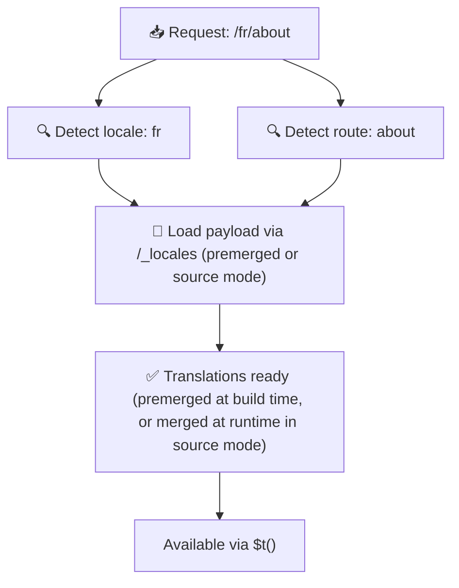

# 📂 Guia d'estructura de carpetes

## 📖 Introducció

Organitzar els teus fitxers de traducció de manera efectiva és essencial per mantenir un sistema d'internacionalització (i18n) escalable i eficient. `Nuxt I18n Micro` simplifica aquest procés oferint un enfocament clar per gestionar les traduccions d'arrel i específiques de pàgina. Aquesta guia et guiarà per l'estructura de carpetes recomanada i explicarà com `Nuxt I18n Micro` gestiona aquestes traduccions.

## 🗂️ Estructura de carpetes recomanada

`Nuxt I18n Micro` organitza les traduccions en fitxers d'arrel i fitxers específics de pàgina dins del directori `pages`. Amb `translationPayloads.mode: 'premerged'` (per defecte), les traduccions d'arrel es fusionen automàticament a cada fitxer de pàgina en temps de compilació, de manera que cada pàgina té un conjunt complet de traduccions sense sobrecàrrega de fusió en temps d'execució.

Amb `mode: 'source'`, els fitxers font es mantenen separats als assets de Nitro i es fusionen en temps d'execució via la ruta `/_locales`. Vegeu [Sortida de payload serverless](/guides/performance#serverless-payload-output).

### 🔧 Estructura bàsica

Aquí tens un exemple bàsic de l'estructura de carpetes que hauries de seguir:

```text
locales/
├── pages/
│   ├── index/
│   │   ├── en.json
│   │   ├── fr.json
│   │   └── ar.json
│   ├── about/
│   │   ├── en.json
│   │   ├── fr.json
│   │   └── ar.json
├── en.json
├── fr.json
└── ar.json

```

### 📄 Explicació de l'estructura

#### 1. 🌍 Fitxers de traducció d'arrel

- **Ruta:** `/locales/\{locale\}.json` (per exemple, `/locales/en.json`)
- **Propòsit:** Aquests fitxers contenen traduccions compartides a tota l'aplicació (menús de navegació, capçaleres, peus de pàgina, etc.). Amb `mode: 'premerged'` (per defecte), es fusionen automàticament a cada fitxer específic de pàgina en temps de compilació, de manera que el servidor retorna un únic fitxer preconstruït per pàgina.

  **Contingut d'exemple (`/locales/en.json`):**

  ```json
  {
    "menu": {
      "home": "Home",
      "about": "About Us",
      "contact": "Contact"
    },
    "footer": {
      "copyright": "© 2024 Your Company"
    }
  }
  ```

#### 2. 📄 Fitxers de traducció específics de pàgina

- **Ruta:** `/locales/pages/\{routeName\}/\{locale\}.json` (per exemple, `/locales/pages/index/en.json`)
- **Propòsit:** Aquests fitxers contenen traduccions específiques de pàgines individuals. Amb `mode: 'premerged'` (per defecte), les traduccions d'arrel es fusionen com a base en temps de compilació, de manera que cada fitxer de pàgina esdevé autocontingut.

  **Contingut d'exemple (`/locales/pages/index/en.json`):**

  ```json
  {
    "title": "Welcome to Our Website",
    "description": "We offer a wide range of products and services to meet your needs."
  }
  ```

  **Contingut d'exemple (`/locales/pages/about/en.json`):**

  ```json
  {
    "title": "About Us",
    "description": "Learn more about our mission, vision, and values."
  }
  ```

### 📂 Gestió de rutes dinàmiques i camins imbricats

`Nuxt I18n Micro` transforma automàticament els segments dinàmics i els camins imbricats de les rutes en una estructura de carpetes plana utilitzant una convenció de renomenat específica. Això garanteix que totes les traduccions s'emmagatzemin de manera consistent i fàcilment accessible.

#### Estructura de carpetes de traducció de rutes dinàmiques

Quan es tracten rutes dinàmiques, com ara `/products/[id]`, el mòdul converteix el segment dinàmic `[id]` en un format estàtic dins de l'estructura de fitxers.

**Exemple d'estructura de carpetes per a rutes dinàmiques:**

Per a una ruta com `/products/[id]`, els fitxers de traducció s'emmagatzemarien en una carpeta anomenada `products-id`:

```text
locales/pages/
├── products-id/
│   ├── en.json
│   ├── fr.json
│   └── ar.json

```

**Exemple d'estructura de carpetes per a rutes dinàmiques imbricades:**

Per a una ruta imbricada com `/products/key/[id]`, els fitxers de traducció s'emmagatzemarien en una carpeta anomenada `products-key-id`:

```text
locales/pages/
├── products-key-id/
│   ├── en.json
│   ├── fr.json
│   └── ar.json

```

**Exemple d'estructura de carpetes per a rutes imbricades multinivell:**

Per a una ruta imbricada més complexa com `/products/category/[id]/details`, els fitxers de traducció s'emmagatzemarien en una carpeta anomenada `products-category-id-details`:

```text
locales/pages/
├── products-category-id-details/
│   ├── en.json
│   ├── fr.json
│   └── ar.json

```

### 🛠 Personalitzar l'estructura del directori

Si prefereixes emmagatzemar traduccions en un directori diferent, `Nuxt I18n Micro` et permet personalitzar el directori on s'emmagatzemen els fitxers de traducció. Pots configurar-ho al teu fitxer `nuxt.config.ts`.

**Exemple: Personalitzar el directori de traduccions**

```typescript
export default defineNuxtConfig({
  i18n: {
    translationDir: 'i18n', // Custom directory path
  },
})
```

Això indicarà a `Nuxt I18n Micro` que busqui fitxers de traducció al directori `/i18n` en lloc del directori `/locales` per defecte.

## ⚙️ Com es carreguen les traduccions

### 🌍 Rutes dinàmiques de locale

`Nuxt I18n Micro` utilitza rutes dinàmiques de locale per carregar traduccions de manera eficient. Quan un usuari visita una pàgina, el mòdul determina el locale adequat i carrega els fitxers de traducció corresponents en funció de la ruta i el locale actuals.



Per exemple:

- Visitar `/en/index` carregarà les traduccions de `/locales/pages/index/en.json`.
- Visitar `/fr/about` carregarà les traduccions de `/locales/pages/about/fr.json`.

Aquest mètode garanteix que només es carreguin les traduccions necessàries, optimitzant tant la càrrega del servidor com el rendiment del client.

### 💾 Memòria cau i pre-render

Per millorar encara més el rendiment, `Nuxt I18n Micro` admet memòria cau i pre-render dels fitxers de traducció:

- **Memòria cau**: Un cop carregat un fitxer de traducció, es guarda a la memòria cau per a sol·licituds posteriors, reduint la necessitat de tornar-lo a obtenir repetidament.
- **Pre-render**: Durant el procés de compilació, pots pre-renderitzar fitxers de traducció per a tots els locales i rutes configurats, permetent que es serveixin directament des del servidor sense demores en temps d'execució.

## 📝 Bones pràctiques

### 📂 Utilitza fitxers específics de pàgina amb saviesa

Aprofita els fitxers específics de pàgina per mantenir les traduccions organitzades. Això manté les traduccions de cada pàgina lleugeres i ràpides de carregar, cosa que és especialment important per a pàgines amb contingut complex o gran.

### 🔑 Mantén les claus de traducció consistents

Utilitza convencions de nomenclatura consistents per a les teves claus de traducció a tots els fitxers. Això ajuda a mantenir la claredat i evita problemes en gestionar traduccions, especialment a mesura que la teva aplicació creix.

### 🗂️ Organitza les traduccions per context

Agrupa les traduccions relacionades dins dels teus fitxers. Per exemple, agrupa totes les etiquetes de botons sota una clau `buttons` i tots els textos relacionats amb formularis sota una clau `forms`. Això no només millora la llegibilitat, sinó que també facilita la gestió de traduccions entre diferents locales.

### ⚠️ Límit de profunditat d'imbricació (2 nivells recomanats)

Durant la navegació al client, `Nuxt I18n Micro` utilitza una fusió profunda optimitzada de 2 nivells per combinar les traduccions de les pàgines de sortida i d'entrada. Això garanteix que les claus imbricades superposades (per exemple, ambdues pàgines tenen claus sota `common.*`) es preservin durant les animacions de transició.

**Això funciona correctament per a l'estructura estàndard `Secció → Clau → Valor` (2 nivells):**

```json
// Page A translations
{ "common": { "fromA": "Text A" } }

// Page B translations
{ "common": { "fromB": "Text B" } }

// During transition, both are available:
// { "common": { "fromA": "Text A", "fromB": "Text B" } }
```

**Tanmateix, si utilitzes més de 3 nivells d'imbricació, les claus més profundes es poden sobreescriure durant les transicions:**

```json
// Page A translations
{ "auth": { "form": { "login": "Login" } } }

// Page B translations
{ "auth": { "form": { "register": "Register" } } }

// During transition: "login" key is lost
// { "auth": { "form": { "register": "Register" } } }
```

<Tip>

</Tip>

### 🧹 Neteja regularment les traduccions no utilitzades

Amb el temps, la teva aplicació pot acumular claus de traducció no utilitzades, especialment si es treuen o es reestructuren funcionalitats. Revisa i neteja periòdicament els teus fitxers de traducció per mantenir-los lleugers i mantenibles.
