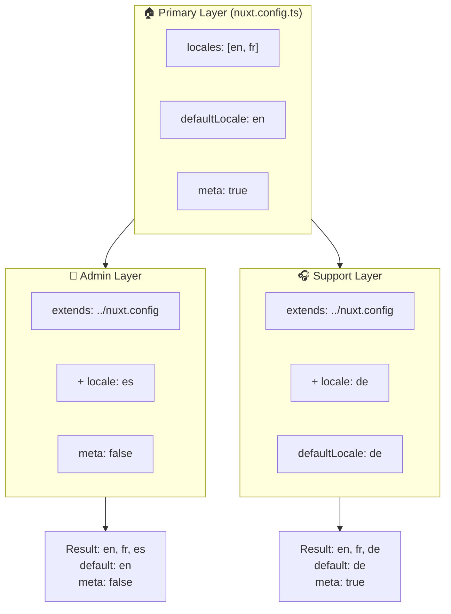

# 🗂️ Capes a `Nuxt I18n Micro`

## 📖 Introducció a les capes

Les capes a `Nuxt I18n Micro` et permeten gestionar i personalitzar la configuració de localització de manera flexible a diferents parts de la teva aplicació. Definint diferents capes, pots ajustar la configuració per a diversos contextos, com ara sobreescriure configuracions per a seccions específiques del teu lloc o crear configuracions base reutilitzables que altres parts de la teva aplicació poden ampliar.

### Flux d'herència de capes



## 🛠️ Capa de configuració primària

La **capa de configuració primària** és on estableixes la configuració de localització per defecte per a tota la teva aplicació. Aquesta capa és essencial ja que defineix la configuració global, incloent els locales admesos, l'idioma per defecte i altres configuracions crítiques d'i18n.

### 📄 Exemple: Definir la capa de configuració primària

Aquí tens un exemple de com podries definir la capa de configuració primària al teu fitxer `nuxt.config.ts`:

```typescript
export default defineNuxtConfig({
  i18n: {
    locales: [
      { code: 'en', iso: 'en-EN', dir: 'ltr' },
      { code: 'fr', iso: 'fr-FR', dir: 'ltr' },
      { code: 'ar', iso: 'ar-SA', dir: 'rtl' },
    ],
    defaultLocale: 'en', // The default locale for the entire app
    translationDir: 'locales', // Directory where translations are stored
    meta: true, // Automatically generate SEO-related meta tags like `alternate`
    autoDetectLanguage: true, // Automatically detect and use the user's preferred language
  },
})
```

## 🌱 Capes filles

Les capes filles s'utilitzen per ampliar o sobreescriure la configuració primària per a parts específiques de la teva aplicació. Per exemple, podries voler afegir locales addicionals o modificar el locale per defecte per a una secció particular del teu lloc. Les capes filles són especialment útils en aplicacions modulars on diferents parts de l'aplicació poden tenir requisits de localització diferents.

### 📄 Exemple: Ampliar la capa primària en una capa filla

Suposem que tens una secció del teu lloc que ha d'admetre locales addicionals, o vols desactivar un locale particular en un cert context. Aquí tens com pots aconseguir-ho ampliant la capa de configuració primària:

```typescript
// basic/nuxt.config.ts (Primary Layer)
export default defineNuxtConfig({
  i18n: {
    locales: [
      { code: 'en', iso: 'en-EN', dir: 'ltr' },
      { code: 'fr', iso: 'fr-FR', dir: 'ltr' },
    ],
    defaultLocale: 'en',
    meta: true,
    translationDir: 'locales',
  },
})
```

```typescript
// extended/nuxt.config.ts (Child Layer)
export default defineNuxtConfig({
  extends: '../basic', // Inherit the base configuration from the 'basic' layer
  i18n: {
    locales: [
      { code: 'en', iso: 'en-EN', dir: 'ltr' }, // Inherited from the base layer
      { code: 'fr', iso: 'fr-FR', dir: 'ltr' }, // Inherited from the base layer
      { code: 'de', iso: 'de-DE', dir: 'ltr' }, // Added in the child layer
    ],
    defaultLocale: 'fr', // Override the default locale to French for this section
    autoDetectLanguage: false, // Disable automatic language detection in this section
  },
})
```

### 🌐 Utilitzar capes en una aplicació modular

En una aplicació Nuxt modular més gran, podries tenir múltiples seccions, cadascuna requerint la seva pròpia configuració d'i18n. Aprofitant les capes, pots mantenir una estructura de configuració neta i escalable.

### 📄 Exemple: Configuració per capes en una aplicació modular

Imagina que tens un lloc de comerç electrònic amb seccions diferents com el lloc web principal, el panell d'administració i el portal d'atenció al client. Cada secció podria necessitar un conjunt diferent de locales o altres configuracions d'i18n.

#### **Capa primària (configuració global):**

```typescript
// nuxt.config.ts
export default defineNuxtConfig({
  i18n: {
    locales: [
      { code: 'en', iso: 'en-EN', dir: 'ltr' },
      { code: 'fr', iso: 'fr-FR', dir: 'ltr' },
    ],
    defaultLocale: 'en',
    meta: true,
    translationDir: 'locales',
    autoDetectLanguage: true,
  },
})
```

#### **Capa filla per al panell d'administració:**

```typescript
// admin/nuxt.config.ts
export default defineNuxtConfig({
  extends: '../nuxt.config', // Inherit the global settings
  i18n: {
    locales: [
      { code: 'en', iso: 'en-EN', dir: 'ltr' }, // Inherited
      { code: 'fr', iso: 'fr-FR', dir: 'ltr' }, // Inherited
      { code: 'es', iso: 'es-ES', dir: 'ltr' }, // Specific to the admin panel
    ],
    defaultLocale: 'en',
    meta: false, // Disable automatic meta generation in the admin panel
  },
})
```

#### **Capa filla per al portal d'atenció al client:**

```typescript
// support/nuxt.config.ts
export default defineNuxtConfig({
  extends: '../nuxt.config', // Inherit the global settings
  i18n: {
    locales: [
      { code: 'en', iso: 'en-EN', dir: 'ltr' }, // Inherited
      { code: 'fr', iso: 'fr-FR', dir: 'ltr' }, // Inherited
      { code: 'de', iso: 'de-DE', dir: 'ltr' }, // Specific to the support portal
    ],
    defaultLocale: 'de', // Default to German in the support portal
    autoDetectLanguage: false, // Disable automatic language detection
  },
})
```

En aquest exemple modular:

- Cada secció (admin, support) té la seva pròpia configuració d'i18n, però totes hereten la configuració base.
- El panell d'administració afegeix el castellà (`es`) com a locale i desactiva la generació de meta tags.
- El portal d'atenció al client afegeix l'alemany (`de`) com a locale i té l'alemany per defecte per a la interfície d'usuari.

## 📝 Bones pràctiques per utilitzar capes

- **🔧 Mantén la capa primària senzilla:** La capa primària ha de contenir les configuracions més utilitzades que s'apliquen globalment a tota la teva aplicació. Mantén-la senzilla per garantir la consistència.
- **⚙️ Utilitza capes filles per a personalitzacions específiques:** Només sobreescriu o amplia configuracions en capes filles quan sigui necessari. Aquest enfocament evita una complexitat innecessària a la teva configuració.
- **📚 Documenta les teves capes:** Documenta clarament el propòsit i els detalls de cada capa al teu projecte. Això ajudarà a mantenir la claredat i facilitarà que altres (o tu mateix en el futur) entengueu la configuració.
