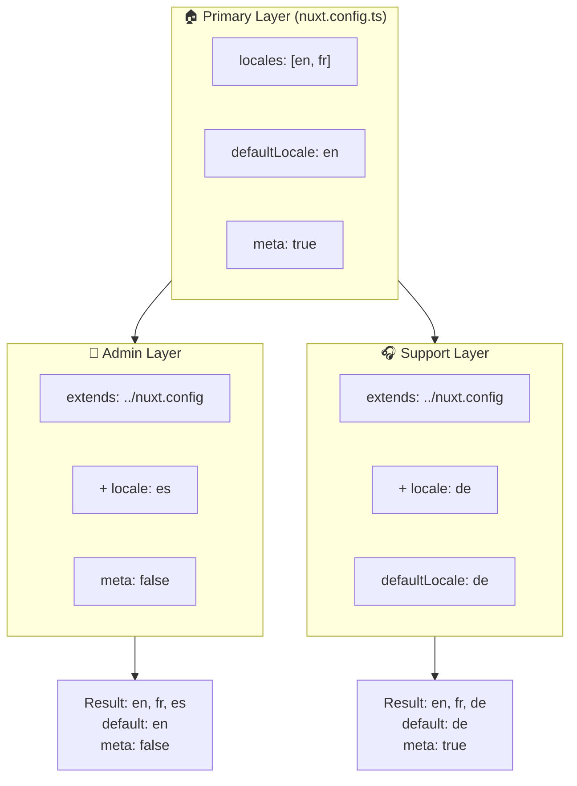

# 🗂️ Capes a `Nuxt I18n Micro`

## 📖 Introducció a les capes

Les capes a `Nuxt I18n Micro` et permeten gestionar i personalitzar la configuració de localització de manera flexible per les diferents parts de la teva aplicació. Definint diferents capes, pots ajustar la configuració per a diversos contextos, com ara sobreescriure la configuració per a seccions concretes del teu lloc o crear configuracions base reutilitzables que altres parts de l'aplicació poden estendre.

### Flux d'herència de capes



## 🛠️ Capa de configuració primària

La **capa de configuració primària** és on defineixes la configuració de localització per defecte per a tota l'aplicació. Aquesta capa és essencial perquè defineix la configuració global, incloent-hi els locales admesos, l'idioma per defecte i altres configuracions crítiques d'i18n.

### 📄 Exemple: definició de la capa de configuració primària

Aquest és un exemple de com podries definir la capa de configuració primària al teu fitxer `nuxt.config.ts`:

```typescript
export default defineNuxtConfig({
  i18n: {
    locales: [
      { code: 'en', iso: 'en-EN', dir: 'ltr' },
      { code: 'fr', iso: 'fr-FR', dir: 'ltr' },
      { code: 'ar', iso: 'ar-SA', dir: 'rtl' },
    ],
    defaultLocale: 'en', // The default locale for the entire app
    translationDir: 'locales', // Directory where translations are stored
    meta: true, // Automatically generate SEO-related meta tags like `alternate`
    autoDetectLanguage: true, // Automatically detect and use the user's preferred language
  },
})
```

## 🌱 Capes filles

Les capes filles s'utilitzen per estendre o sobreescriure la configuració primària per a parts concretes de la teva aplicació. Per exemple, pots voler afegir locales addicionals o modificar el locale per defecte per a una secció concreta del teu lloc. Les capes filles són especialment útils en aplicacions modulars on diferents parts poden tenir requisits de localització diferents.

### 📄 Exemple: extensió de la capa primària en una capa filla

Suposa que tens una secció del teu lloc que necessita admetre locales addicionals, o vols desactivar un locale particular en un context concret. Així ho pots aconseguir estenent la capa de configuració primària:

```typescript
// basic/nuxt.config.ts (Primary Layer)
export default defineNuxtConfig({
  i18n: {
    locales: [
      { code: 'en', iso: 'en-EN', dir: 'ltr' },
      { code: 'fr', iso: 'fr-FR', dir: 'ltr' },
    ],
    defaultLocale: 'en',
    meta: true,
    translationDir: 'locales',
  },
})
```

```typescript
// extended/nuxt.config.ts (Child Layer)
export default defineNuxtConfig({
  extends: '../basic', // Inherit the base configuration from the 'basic' layer
  i18n: {
    locales: [
      { code: 'en', iso: 'en-EN', dir: 'ltr' }, // Inherited from the base layer
      { code: 'fr', iso: 'fr-FR', dir: 'ltr' }, // Inherited from the base layer
      { code: 'de', iso: 'de-DE', dir: 'ltr' }, // Added in the child layer
    ],
    defaultLocale: 'fr', // Override the default locale to French for this section
    autoDetectLanguage: false, // Disable automatic language detection in this section
  },
})
```

### 🌐 Ús de capes en una aplicació modular

En una aplicació Nuxt més gran i modular, podries tenir múltiples seccions, cadascuna amb la seva pròpia configuració d'i18n. Aprofitant les capes, pots mantenir una estructura de configuració neta i escalable.

### 📄 Exemple: configuració amb capes en una aplicació modular

Imagina que tens un lloc d'e-commerce amb seccions diferenciades com el lloc principal, el panell d'administració i el portal de suport al client. Cada secció pot necessitar un conjunt diferent de locales o altres configuracions d'i18n.

#### **Capa primària (configuració global):**

```typescript
// nuxt.config.ts
export default defineNuxtConfig({
  i18n: {
    locales: [
      { code: 'en', iso: 'en-EN', dir: 'ltr' },
      { code: 'fr', iso: 'fr-FR', dir: 'ltr' },
    ],
    defaultLocale: 'en',
    meta: true,
    translationDir: 'locales',
    autoDetectLanguage: true,
  },
})
```

#### **Capa filla per al panell d'administració:**

```typescript
// admin/nuxt.config.ts
export default defineNuxtConfig({
  extends: '../nuxt.config', // Inherit the global settings
  i18n: {
    locales: [
      { code: 'en', iso: 'en-EN', dir: 'ltr' }, // Inherited
      { code: 'fr', iso: 'fr-FR', dir: 'ltr' }, // Inherited
      { code: 'es', iso: 'es-ES', dir: 'ltr' }, // Specific to the admin panel
    ],
    defaultLocale: 'en',
    meta: false, // Disable automatic meta generation in the admin panel
  },
})
```

#### **Capa filla per al portal de suport al client:**

```typescript
// support/nuxt.config.ts
export default defineNuxtConfig({
  extends: '../nuxt.config', // Inherit the global settings
  i18n: {
    locales: [
      { code: 'en', iso: 'en-EN', dir: 'ltr' }, // Inherited
      { code: 'fr', iso: 'fr-FR', dir: 'ltr' }, // Inherited
      { code: 'de', iso: 'de-DE', dir: 'ltr' }, // Specific to the support portal
    ],
    defaultLocale: 'de', // Default to German in the support portal
    autoDetectLanguage: false, // Disable automatic language detection
  },
})
```

En aquest exemple modular:

- Cada secció (admin, support) té la seva pròpia configuració d'i18n, però totes hereten la configuració base.
- El panell d'administració afegeix castellà (`es`) com a locale i desactiva la generació de meta tags.
- El portal de suport afegeix alemany (`de`) com a locale i posa alemany per defecte a la interfície d'usuari.

## 📝 Bones pràctiques per fer servir capes

- **🔧 Mantén la capa primària simple:** la capa primària ha de contenir la configuració més comuna aplicada globalment a l'aplicació. Mantén-la senzilla per garantir consistència.
- **⚙️ Fes servir capes filles per a personalitzacions específiques:** només sobreescriu o esten configuracions en capes filles quan calgui. Aquest enfocament evita complexitat innecessària a la configuració.
- **📚 Documenta les teves capes:** documenta clarament la finalitat i les especificitats de cada capa del teu projecte. Això ajudarà a mantenir la claredat i farà més fàcil que altres (o tu mateix en el futur) entenguin la configuració.
