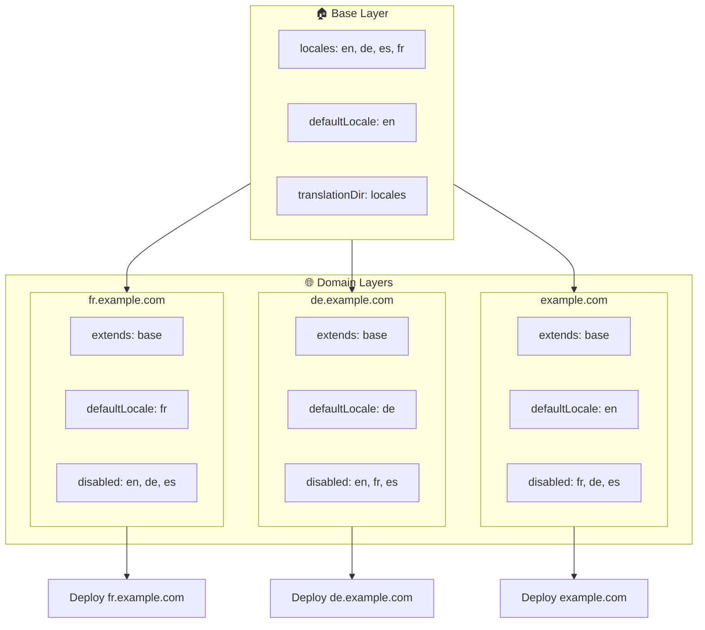

# 🌍 Configurar locales multidomini amb `Nuxt I18n Micro` utilitzant capes

## 📝 Introducció

Aprofitant les capes a `Nuxt I18n Micro`, pots crear una configuració de localització multidomini flexible i mantenible. Aquest enfocament no només simplifica la gestió de dominis eliminant la necessitat de funcionalitats complexes, sinó que també permet una distribució de càrrega eficient i redueix la complexitat del projecte. En executar projectes separats per a diferents locales, la teva aplicació pot escalar fàcilment i adaptar-se a requisits de locale variables a través de múltiples dominis, oferint una solució robusta i escalable per a aplicacions globals.

## 🎯 Objectiu

Crear una configuració on diferents dominis serveixen locales específics personalitzant les configuracions a capes filles. Aquest mètode aprofita el sistema de capes de Nuxt, permetent-te mantenir una configuració base mentre l'amplies o modifiques per a cada domini.

### Arquitectura multidomini



## 🛠 Passos per implementar locales multidomini

### 1. **Crea la capa base**

Comença creant una capa de configuració base que inclogui totes les configuracions comunes de locale per a la teva aplicació. Aquesta configuració servirà com a fonament per a altres configuracions específiques de domini.

#### **Configuració de la capa base**

Crea el fitxer de configuració base `base/nuxt.config.ts`:

```typescript
// base/nuxt.config.ts

export default defineNuxtConfig({
  i18n: {
    locales: [
      { code: 'en', iso: 'en-US', dir: 'ltr' },
      { code: 'de', iso: 'de-DE', dir: 'ltr' },
      { code: 'es', iso: 'es-ES', dir: 'ltr' },
    ],
    defaultLocale: 'en',
    translationDir: 'locales',
    meta: true,
    autoDetectLanguage: true,
  },
})
```

### 2. **Crea capes filles específiques de domini**

Per a cada domini, crea una capa filla que modifiqui la configuració base per satisfer els requisits específics d'aquest domini. Pots desactivar els locales que no calen per a un domini específic.

#### **Exemple: Configuració per al domini francès**

Crea una configuració de capa filla per al domini francès a `fr/nuxt.config.ts`:

```typescript
// fr/nuxt.config.ts

export default defineNuxtConfig({
  extends: '../base', // Inherit from the base configuration

  i18n: {
    locales: [
      { code: 'en', iso: 'en-US', dir: 'ltr', disabled: true }, // Disable English
      { code: 'fr', iso: 'fr-FR', dir: 'ltr' }, // Add and enable the French locale
      { code: 'de', iso: 'de-DE', dir: 'ltr', disabled: true }, // Disable German
      { code: 'es', iso: 'es-ES', dir: 'ltr', disabled: true }, // Disable Spanish
    ],
    defaultLocale: 'fr', // Set French as the default locale
    autoDetectLanguage: false, // Disable automatic language detection
  },
})
```

#### **Exemple: Configuració per al domini alemany**

De manera similar, crea una configuració de capa filla per al domini alemany a `de/nuxt.config.ts`:

```typescript
// de/nuxt.config.ts

export default defineNuxtConfig({
  extends: '../base', // Inherit from the base configuration

  i18n: {
    locales: [
      { code: 'en', iso: 'en-US', dir: 'ltr', disabled: true }, // Disable English
      { code: 'fr', iso: 'fr-FR', dir: 'ltr', disabled: true }, // Disable French
      { code: 'de', iso: 'de-DE', dir: 'ltr' }, // Use the German locale
      { code: 'es', iso: 'es-ES', dir: 'ltr', disabled: true }, // Disable Spanish
    ],
    defaultLocale: 'de', // Set German as the default locale
    autoDetectLanguage: false, // Disable automatic language detection
  },
})
```

### 3. **Desplega l'aplicació per a cada domini**

Desplega l'aplicació amb la configuració adequada per a cada domini. Per exemple:

- Desplega la configuració de la capa `fr` a `fr.example.com`.
- Desplega la configuració de la capa `de` a `de.example.com`.

### 4. **Configura múltiples projectes per a diferents locales**

Per a cada locale i domini, hauràs d'executar una instància separada de l'aplicació. Això garanteix que cada domini serveixi la configuració de locale correcta, optimitzant la distribució de càrrega i simplificant l'estructura del projecte. En executar múltiples projectes adaptats a cada locale, pots mantenir una separació neta entre configuracions i reduir la complexitat de la configuració global.

### 5. **Configura l'enrutament basat en el domini**

Assegura't que el teu enrutament estigui configurat per dirigir els usuaris al projecte correcte segons el domini al qual accedeixen. Això garantirà que cada domini serveixi el locale adequat, millorant l'experiència d'usuari i mantenint la consistència en diferents regions.

### 6. **Desplega i verifica**

Després de configurar les capes i desplegar-les als seus respectius dominis, assegura't que cada domini estigui servint el locale correcte. Prova a fons l'aplicació per confirmar que es carregui el locale correcte segons el domini.

## 📝 Bones pràctiques

- **Mantén la configuració base genèrica**: La configuració base ha de cobrir configuracions generals aplicables a tots els dominis.
- **Aïlla la lògica específica de domini**: Mantén les configuracions específiques de domini a les seves respectives capes per mantenir la claredat i la separació de responsabilitats.

## 🎉 Conclusió

Aprofitant les capes a `Nuxt I18n Micro`, pots crear una configuració de localització multidomini flexible i mantenible. Aquest enfocament no només elimina la necessitat de funcionalitats complexes de gestió de dominis, sinó que també et permet distribuir la càrrega de manera eficient i reduir la complexitat del projecte. Executar projectes separats per a diferents locales assegura que la teva aplicació pugui escalar fàcilment i adaptar-se a diferents requisits de locale a través de diversos dominis, proporcionant una solució robusta i escalable per a aplicacions globals.
