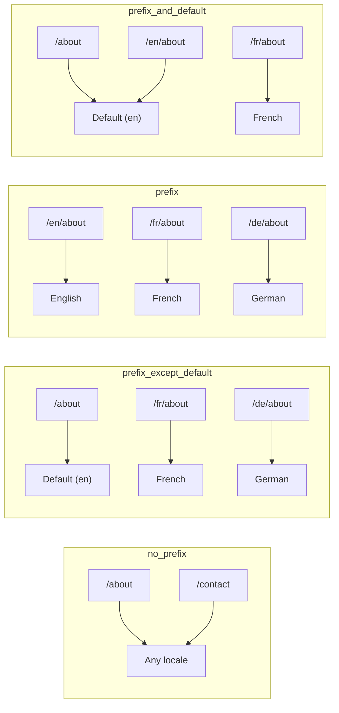
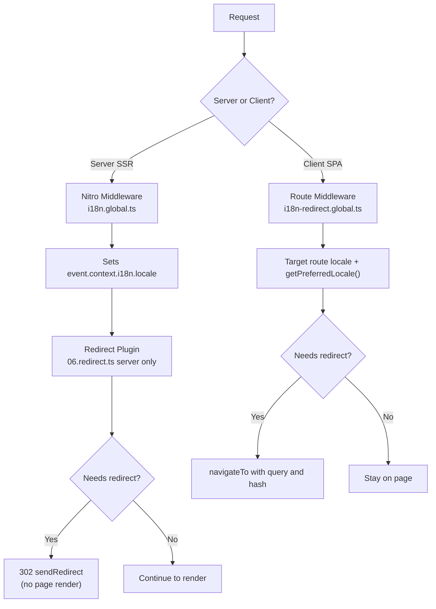

# 🗂️ Estratègies d'enrutament a Nuxt I18n Micro

## 📖 Visió general

Nuxt I18n Micro controla com apareixen els prefixos de locale a les URLs mitjançant l'opció `strategy`. Sota les cobertes, dos paquets implementen això:

- **`@i18n-micro/route-strategy`** — generació de rutes en temps de compilació (estén les pàgines de Nuxt amb rutes localitzades)
- **`@i18n-micro/path-strategy`** — resolució de ruta en temps d'execució, redireccions, atributs SEO i generació d'enllaços

El mòdul Nuxt selecciona la classe d'estratègia correcta en temps de compilació i li assigna un àlies via `#i18n-strategy`, de manera que només s'inclou al bundle la implementació escollida.

## 🚦 Estratègies disponibles

{/* generated:option:strategy — do not edit; run `pnpm run docs:generate` */}

**Tipus** `Strategies` · **Per defecte** `'prefix_except_default'`

Estratègia d'enrutament d'URL per als prefixos de locale.

- `'no_prefix'` — sense locale a l'URL; locale emmagatzemat a la cookie.
- `'prefix_except_default'` — prefix a tots els locales excepte al per defecte.
- `'prefix'` — sempre amb prefix, inclòs el locale per defecte.
- `'prefix_and_default'` — com `prefix`, però el locale per defecte també és accessible sense prefix.

{/* /generated:option:strategy */}

### Comparació d'estratègies



### 🛑 `no_prefix`

Les URLs no tenen segment de locale. El locale es determina per cookies, l'estat de `useI18nLocale()` o la detecció del navegador.

- **Rutes**: `/about`, `/contact` — mateix patró d'URL per a tots els locales (sense prefix `/en/`, `/fr/`)
- **Persistència del locale**: Via `localeCookie` (definit automàticament a `'user-locale'` si no s'especifica)
- **Rutes personalitzades**: Admeses via [`globalLocaleRoutes`](/guides/configuration#globallocaleroutes) i [`defineI18nRoute`](/guides/custom-locale-routes) — els slugs localitzats es generen sense afegir un prefix de locale a les URLs (per exemple, `/about` vs `/ueber-uns`). Les rutes imbricades, els àlies i les restriccions per locale són més senzilles que a `prefix_except_default`.

<Tip>
En utilitzar `no_prefix`, `localeCookie` es defineix automàticament a `'user-locale'` si no s'especifica. Això és necessari perquè l'URL no conté informació de locale.
</Tip>

```typescript
i18n: {
  strategy: 'no_prefix'
  // localeCookie is automatically set to 'user-locale'
}
```

### 🚧 `prefix_except_default`

Totes les rutes tenen un prefix de locale **excepte** el locale per defecte.

- **Locale per defecte**: `/about`, `/contact`
- **Altres locales**: `/fr/about`, `/de/contact`
- **El locale per defecte amb prefix retorna 404**: `/en/about` → 404 (quan `en` és el per defecte)

```typescript
i18n: {
  strategy: 'prefix_except_default' // This is the default
}
```

### 🌍 `prefix`

Totes les rutes tenen un prefix de locale, incloent el locale per defecte.

- **Tots els locales**: `/en/about`, `/fr/about`, `/de/about`
- **`/` arrel**: Redirigeix a `/\{locale\}/` segons la preferència de l'usuari

```typescript
i18n: {
  strategy: 'prefix'
}
```

### 🔄 `prefix_and_default`

El locale per defecte està disponible tant amb prefix com sense. Els locales no per defecte sempre tenen un prefix.

- **Locale per defecte**: `/about` i `/en/about` són vàlids
- **Altres locales**: `/fr/about`, `/de/about`
- **Sense redirecció de `/`**: Tant `/` com `/en/` serveixen el locale per defecte

```typescript
i18n: {
  strategy: 'prefix_and_default'
}
```

## 🔀 Arquitectura de redireccions (v3)

A la v3, la lògica de redirecció es divideix en dues capes per a un rendiment òptim:

### Com funciona



### Al servidor (sense flash)

1. **El middleware de Nitro** (`i18n.global.ts`) s'executa primer — detecta el locale de l'URL, la cookie o la capçalera `Accept-Language` i estableix `event.context.i18n.locale`
2. **El plugin de redirecció** (`06.redirect.ts`, només al servidor) comprova si la ruta actual necessita una redirecció utilitzant `i18nStrategy.getClientRedirect()` i emet una 302 **abans** de qualsevol render de pàgina
3. Això evita el "flash d'error" on els usuaris veuen breument una pàgina incorrecta abans de la redirecció

### Al client (navegació SPA)

1. El middleware global de ruta (`i18n-redirect.global.ts`) s'executa a cada navegació del client quan `redirects` està activat
2. Deriva el locale preferit primer de la **ruta de destinació**, després recorre a `useI18nLocale().getPreferredLocale()`
3. Utilitza `i18nStrategy.getClientRedirect()` per decidir si cal una redirecció
4. Preserva `query` i `hash` en redirigir

### Ordre de prioritat de locale

Al servidor, el plugin de redirecció determina el locale preferit en aquest ordre:

1. **`useState('i18n-locale')`** — prioritat més alta (definit programàticament via `useI18nLocale().setLocale()`)
2. **Cookie** — si `localeCookie` està configurada
3. **Capçalera `Accept-Language`** — si `autoDetectLanguage: true`
4. **`defaultLocale`** — fallback final

Al client, el middleware de ruta prefereix el locale de la ruta de destinació, i després utilitza la mateixa cadena de fallback estat/cookie.

### Comportament de redirecció per estratègia

| Estratègia              | Comportament de `GET /`                       | Cookie necessària? |
| ----------------------- | --------------------------------------------- | ------------------ |
| `no_prefix`             | Sense redirecció (locale des de cookie/estat) | Auto-establerta    |
| `prefix`                | 302 → `/\{locale\}/`                          | Recomanada         |
| `prefix_except_default` | 302 → `/\{locale\}/` si locale ≠ per defecte  | Recomanada         |
| `prefix_and_default`    | Sense redirecció (`/` i `/\{locale\}/` vàlids)| Opciónal           |

### Desactivar redireccions

```typescript
i18n: {
  redirects: false // Disables automatic locale redirects
}
```

Quan `redirects: false`, les redireccions automàtiques de locale es desactiven:

- **Servidor**: el plugin de redirecció (`06.redirect.ts`, només al servidor) roman registrat però omet la lògica de redirecció. Encara realitza **comprovacions 404** per a prefixos de locale no vàlids (per exemple, `/xx/about` on `xx` no és un locale vàlid) i **sincronització de cookies** a partir del prefix de l'URL (per exemple, visitar `/fr/about` sincronitza la cookie a `fr`)
- **Client**: el middleware global de ruta `i18n-redirect` **no es registra** — sense redireccions automàtiques SPA

## 🍪 Persistència de locale basada en cookies

<Warning>
En utilitzar `prefix` o `prefix_except_default` amb `redirects: true` (el valor per defecte), **has de** definir `localeCookie` perquè les redireccions funcionin correctament. Sense una cookie, el plugin de redirecció no pot recordar la preferència de locale de l'usuari a través de les recàrregues de pàgina.

```typescript
i18n: {
  strategy: 'prefix_except_default',
  localeCookie: 'user-locale' // Required for redirects to work properly
}
```
</Warning>

**Com funciona `localeCookie` a v3:**

- Gestionada internament per `useI18nLocale()` — **no la defineixis manualment** via `useCookie()`
- Quan un usuari visita una URL amb prefix (per exemple, `/fr/about`), la cookie es sincronitza automàticament a `fr`
- A la següent visita a `/`, s'utilitza el valor de la cookie per redirigir a `/\{locale\}/`
- Si la cookie conté un locale no vàlid (no a la llista `locales`), recorre a `defaultLocale`

| Estratègia              | `localeCookie` per defecte | Notes                                |
| ----------------------- | -------------------------- | ------------------------------------ |
| `no_prefix`             | Auto: `'user-locale'`      | Necessària; definida automàticament  |
| `prefix`                | `null` (desactivada)       | Defineix a `'user-locale'` per a redireccions |
| `prefix_except_default` | `null` (desactivada)       | Defineix a `'user-locale'` per a redireccions |
| `prefix_and_default`    | `null` (desactivada)       | Opciónal                             |

## 🔍 `autoDetectLanguage` i `autoDetectPath`

### `autoDetectLanguage`

{/* generated:option:autoDetectLanguage — do not edit; run `pnpm run docs:generate` */}

**Tipus** `boolean` · **Per defecte** `true`

Detecta automàticament l'idioma preferit de l'usuari des de la capçalera HTTP `Accept-Language`.
S'utilitza en combinació amb `autoDetectPath` per decidir quan es produeix la detecció.

{/* /generated:option:autoDetectLanguage */}

La comprovació s'executa al middleware del servidor i és un fallback: una cookie o un estat existent guanya.

```typescript
i18n: {
  autoDetectLanguage: true
}
```

### `autoDetectPath`

{/* generated:option:autoDetectPath — do not edit; run `pnpm run docs:generate` */}

**Tipus** `string` · **Per defecte** `'/'`

On es poden executar les redireccions de preferència de cookie / Accept-Language (quan `redirects` està activat).

- `'/'` — només `/` (els deep links en el locale per defecte segueixen sent accessibles; per defecte)
- `'no_prefix'` — només rutes sense prefix de locale
- `'*'` — totes les rutes, inclosa la reescriptura d'un prefix de locale explícit
  (per exemple, `/fr/about` → `/de/about` quan la cookie prefereix `de`)

- qualsevol altra cadena — coincidència exacta de ruta (per exemple, `'/welcome'`)

La neteja d'estratègia amb prefix (per exemple, `/en` → `/` sota `prefix_except_default`) no està bloquejada.

{/* /generated:option:autoDetectPath */}

```typescript
i18n: {
  autoDetectPath: '/' // Default: only root
  // autoDetectPath: '*' // All paths — redirects even /fr/about to /de/about
}
```

<Warning>
Amb `autoDetectPath: '*'`, fins i tot les URLs amb un prefix de locale explícit (per exemple, `/fr/about`) es redirigiran si el locale preferit de l'usuari difereix. Això pot ser útil per a configuracions basades en domini, però pot confondre els usuaris que comparteixen URLs.
</Warning>

Amb el valor per defecte `autoDetectPath: '/'` i una cookie de locale:

| sol·licitud | cookie | resultat |
| --- | --- | --- |
| `/` | `de` | 302 → `/de` |
| `/about` | `de` | 200, locale per defecte (sense reescriptura) |

```typescript
i18n: {
  localeCookie: 'user-locale',
  strategy: 'prefix_except_default',
  // Default — remember language on entry, keep deep links stable
  autoDetectPath: '/',
  // Or redirect on every unprefixed path (but not /de/… → /fr/…):
  // autoDetectPath: 'no_prefix',
}
```

## ⚠️ Problemes coneguts i bones pràctiques

### 1. Desajust d'hidratació a l'estratègia `no_prefix`

En utilitzar `no_prefix`, el locale es determina dinàmicament. Si el servidor i el client discrepen sobre el locale, veuràs un desajust d'hidratació.

**Solució**: Utilitza `useI18nLocale().setLocale()` en un plugin del servidor (amb `order: -10`) per establir el locale abans de la inicialització d'i18n:

```ts
// plugins/i18n-loader.server.ts
export default defineNuxtPlugin({
  name: 'i18n-custom-loader',
  enforce: 'pre',
  order: -10,
  setup() {
    const { setLocale } = useI18nLocale()
    setLocale('ja') // Your detection logic here
  },
})
```

Consulta [Detecció d'idioma personalitzada](/guides/custom-language-detection) per veure exemples detallats.

### 2. Utilitza rutes amb nom amb `localeRoute`

L'enrutament basat en rutes pot causar problemes amb la resolució de rutes:

```typescript
// May cause issues
$localeRoute('/page')

// Preferred approach
$localeRoute({ name: 'page' })
```

### 3. Utilitzar `pages: false` amb i18n

En utilitzar Nuxt amb `pages: false`:

```typescript
export default defineNuxtConfig({
  pages: false,
  i18n: {
    strategy: 'no_prefix', // Recommended
    disablePageLocales: true, // Required
    localeCookie: 'user-locale', // Required for persistence
  },
})
```

**Limitacions amb `pages: false`:**

- Sense redireccions automàtiques
- Sense detecció de locale basada en URL
- El canvi de locale al client requereix una recàrrega de pàgina o una càrrega manual de traduccions

### 4. Gestió de cookies no vàlides

Si una cookie conté un locale no vàlid (no a la llista `locales`), el mòdul recorre amb elegància a `defaultLocale`. No es llancen errors.

## 📝 Resum de bones pràctiques

| Recomanació               | Detalls                                                                             |
| ------------------------- | ----------------------------------------------------------------------------------- |
| **Defineix `localeCookie`** | Sempre defineix per a estratègies amb prefix amb `redirects: true`                |
| **Utilitza `useI18nLocale()`** | La manera centralitzada de gestionar l'estat de locale (substitueix `useState`/`useCookie` manuals) |
| **Utilitza rutes amb nom** | `$localeRoute(\{ name: 'page' \})` millor que `$localeRoute('/page')`               |
| **Locale programàtic**    | Utilitza `useI18nLocale().setLocale()` en un plugin del servidor amb `order: -10`   |
| **Evita cookies manuals** | No utilitzis `useCookie('user-locale')` directament — `useI18nLocale()` ho gestiona |
