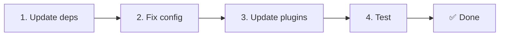

# 📦 Actualització de v2.x a v3.x

<Tip>
Consulta [Migració des de nuxt-i18n](/migration/from-nuxtjs-i18n) — aquesta guia cobreix la migració des de l'ecosistema vue-i18n, no des de nuxt-i18n-micro v2.
</Tip>

La v3.0.0 introdueix canvis arquitectònics fonamentals: paquets d'estratègia, un nou sistema de memòria cau, gestió centralitzada del locale via `useI18nLocale()` i un pipeline de redirecció redissenyat. Aquesta secció cobreix tots els canvis incompatibles i com actualitzar el teu codi.

## Passos de migració



## Resum dels canvis incompatibles

- **Estat del locale** — `useState` / `useCookie` manualment → composable `useI18nLocale()`
- **Accés a la configuració** — `useRuntimeConfig().public.i18nConfig` → `getI18nConfig()` des de `#build/i18n.strategy.mjs`
- **Component de redirecció** — opció `fallbackRedirectComponentPath` → plugin de redirecció del servidor + middleware de ruta del client (automàtic)
- **`includeDefaultLocaleRoute`** — Admès (obsolet) → Eliminat, utilitza l'opció `strategy`
- **`experimental.hmr`** — Sota `experimental` → Opció a nivell d'arrel
- **`previousPageFallback`** — Eliminat completament (l'estratègia de fusió acumulativa ho gestiona automàticament)
- **Memòria cau** — `useStorage('cache')` → Singleton `TranslationStorage` (`Symbol.for` a `globalThis`)
- **Transferència SSR** — Configuració en temps d'execució → Payload de Nuxt (v3 utilitzava `useState`; els chunks ara viuen a `payload.data`, vegeu [Rendiment](/guides/performance#server-side-payload-transfer))
- **Classes d'estratègia** — Internes → Paquets separats (`@i18n-micro/route-strategy`, `@i18n-micro/path-strategy`)

## Eliminat: `fallbackRedirectComponentPath`

L'opció `fallbackRedirectComponentPath` i el component de reserva `locale-redirect.vue` s'han eliminat. La lògica de redirecció ara la gestionen:

1. **Middleware del servidor** (`i18n.global.ts`) — estableix `event.context.i18n.locale`
2. **Plugin de redirecció del servidor** (`06.redirect.ts`, només al servidor) — redireccions 302 abans del render
3. **Middleware de ruta del client** (`i18n-redirect.global.ts`) — redireccions SPA després de la hidratació

```diff
 i18n: {
   strategy: 'prefix_except_default',
-  fallbackRedirectComponentPath: '~/components/MyRedirect.vue',
 }
```

Si tenies lògica de redirecció personalitzada al component de reserva, implementa-la en un plugin del servidor en lloc d'això:

```ts
// plugins/i18n-loader.server.ts
export default defineNuxtPlugin({
  name: 'i18n-custom-redirect',
  enforce: 'pre',
  order: -10,
  setup() {
    const { setLocale } = useI18nLocale()
    // Your custom detection logic
    setLocale(detectedLocale)
  },
})
```

## Eliminat: `includeDefaultLocaleRoute`

Utilitza l'opció `strategy` en lloc d'això:

- `includeDefaultLocaleRoute: true` → `strategy: 'prefix'`
- `includeDefaultLocaleRoute: false` → `strategy: 'prefix_except_default'` (el valor per defecte)

```diff
 i18n: {
-  includeDefaultLocaleRoute: true,
+  strategy: 'prefix',
 }
```

## Accés a la configuració: `getI18nConfig()` substitueix `useRuntimeConfig`

```diff
- const config = useRuntimeConfig()
- const cookieName = config.public.i18nConfig?.localeCookie || 'user-locale'
+ import { getI18nConfig } from '#build/i18n.strategy.mjs'
+ const { localeCookie: configCookie } = getI18nConfig()
+ const cookieName = configCookie ?? 'user-locale'
```

## Gestió del locale: `useI18nLocale()` substitueix la gestió manual d'estat

A la v2, potser vas utilitzar `useState('i18n-locale')` o `useCookie('user-locale')` directament. A la v3, utilitza el composable centralitzat `useI18nLocale()`:

```diff
- const locale = useState('i18n-locale')
- const cookie = useCookie('user-locale')
- locale.value = 'fr'
- cookie.value = 'fr'
+ const { setLocale } = useI18nLocale()
+ setLocale('fr') // Updates both state and cookie atomically
```

Consulta [Detecció d'idioma personalitzada](/guides/custom-language-detection) per veure exemples detallats.

## Opcións experimentals mogudes / eliminades

`hmr` s'ha mogut de `experimental` al nivell d'arrel. `previousPageFallback` s'ha eliminat completament — el mòdul ara utilitza una estratègia de fusió profunda acumulativa (profunditat de 2 nivells) que preserva automàticament les traduccions de la pàgina anterior durant les animacions de transició, fins i tot quan les pàgines comparteixen claus imbricades superposades. Un cop completada l'animació de transició, el hook `page:transition:finish` neteja les claus de la pàgina antiga de la memòria.

```diff
 i18n: {
-  experimental: {
-    hmr: true,
-    previousPageFallback: true
-  }
+  hmr: true,
+  // previousPageFallback removed — handled automatically
 }
```

## Arquitectura de redireccions (v3)

Les redireccions ara les gestionen automàticament dos components:

1. **Al servidor** (`06.redirect.ts`, només al servidor): S'executa durant SSR, emet redireccions 302 abans del render de la pàgina — sense "error flash"
2. **Al client** (`i18n-redirect.global.ts`): Middleware global de ruta en navegació SPA; preserva la query string i el hash

Prioritat del locale per a les redireccions:

1. `useState('i18n-locale')` — establert via `useI18nLocale().setLocale()`
2. Cookie — si `localeCookie` està configurada
3. Capçalera `Accept-Language` — si `autoDetectLanguage: true`
4. `defaultLocale` — fallback

No cal cap canvi de codi per a configuracions estàndard.

<Warning>
Per a les estratègies `prefix` i `prefix_except_default` amb `redirects: true`, defineix `localeCookie: 'user-locale'` per habilitar la persistència del locale a través de les recàrregues de pàgina. Sense això, les redireccions només utilitzen `Accept-Language` o `defaultLocale`.
</Warning>

## TypeScript: Tipus interns del mòdul (opcional)

Si trobes errors de tipus relacionats amb importacions internes com `#i18n-internal/plural`, `#i18n-internal/strategy` o `#i18n-internal/config`, afegeix la secció `imports` al `package.json` del teu projecte:

```json
{
  "imports": {
    "#i18n-internal/plural": "nuxt-i18n-micro/internals",
    "#i18n-internal/strategy": "nuxt-i18n-micro/internals",
    "#i18n-internal/config": "nuxt-i18n-micro/internals"
  }
}
```

<Tip>

</Tip>
