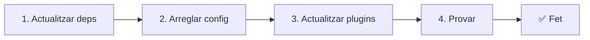

# 📦 Actualització de v2.x a v3.x

<Tip>
Consulta [Migració des de nuxt-i18n](/migration/from-nuxtjs-i18n): aquesta guia cobreix la migració des de l'ecosistema vue-i18n, no des de nuxt-i18n-micro v2.
</Tip>

v3.0.0 introdueix canvis arquitectònics fonamentals: paquets d'estratègia, un nou sistema de memòria cau, gestió centralitzada de locale via `useI18nLocale()` i una canonada de redireccions redissenyada. Aquesta secció cobreix tots els canvis incompatibles i com actualitzar el teu codi.

## Passos de migració



## Resum de canvis incompatibles

- **Estat del locale**: `useState` / `useCookie` manualment → composable `useI18nLocale()`.
- **Accés a la config**: `useRuntimeConfig().public.i18nConfig` → `getI18nConfig()` de `#build/i18n.strategy.mjs`.
- **Component de redirecció**: opció `fallbackRedirectComponentPath` → plugin del servidor de redirecció + middleware de ruta del client (automàtic).
- **`includeDefaultLocaleRoute`**: admès (obsolet) → eliminat, fes servir l'opció `strategy`.
- **`experimental.hmr`**: sota `experimental` → opció a nivell d'arrel.
- **`previousPageFallback`**: eliminat completament (l'estratègia de fusió acumulativa ho gestiona automàticament).
- **Memòria cau**: `useStorage('cache')` → singleton `TranslationStorage` (`Symbol.for` a `globalThis`).
- **Transferència SSR**: configuració de temps d'execució → payload de Nuxt (v3 feia servir `useState`; els fragments ara viuen a `payload.data`, consulta [Rendiment](/guides/performance#server-side-payload-transfer)).
- **Classes d'estratègia**: internes → paquets separats (`@i18n-micro/route-strategy`, `@i18n-micro/path-strategy`).

## Eliminat: `fallbackRedirectComponentPath`

L'opció `fallbackRedirectComponentPath` i el component de reserva `locale-redirect.vue` s'han eliminat. La lògica de redirecció ara la gestionen:

1. **Middleware del servidor** (`i18n.global.ts`): defineix `event.context.i18n.locale`.
2. **Plugin de redirecció del servidor** (`06.redirect.ts`, només servidor): redireccions 302 abans de renderitzar.
3. **Middleware de ruta del client** (`i18n-redirect.global.ts`): redireccions SPA després de la hidratació.

```diff
 i18n: {
   strategy: 'prefix_except_default',
-  fallbackRedirectComponentPath: '~/components/MyRedirect.vue',
 }
```

Si tenies lògica de redirecció personalitzada al component de reserva, implementa-la en un plugin del servidor:

```ts
// plugins/i18n-loader.server.ts
export default defineNuxtPlugin({
  name: 'i18n-custom-redirect',
  enforce: 'pre',
  order: -10,
  setup() {
    const { setLocale } = useI18nLocale()
    // Your custom detection logic
    setLocale(detectedLocale)
  },
})
```

## Eliminat: `includeDefaultLocaleRoute`

Fes servir l'opció `strategy`:

- `includeDefaultLocaleRoute: true` → `strategy: 'prefix'`
- `includeDefaultLocaleRoute: false` → `strategy: 'prefix_except_default'` (per defecte)

```diff
 i18n: {
-  includeDefaultLocaleRoute: true,
+  strategy: 'prefix',
 }
```

## Accés a la config: `getI18nConfig()` reemplaça `useRuntimeConfig`

```diff
- const config = useRuntimeConfig()
- const cookieName = config.public.i18nConfig?.localeCookie || 'user-locale'
+ import { getI18nConfig } from '#build/i18n.strategy.mjs'
+ const { localeCookie: configCookie } = getI18nConfig()
+ const cookieName = configCookie ?? 'user-locale'
```

## Gestió del locale: `useI18nLocale()` reemplaça l'estat manual

A v2, potser feies servir `useState('i18n-locale')` o `useCookie('user-locale')` directament. A v3, fes servir el composable centralitzat `useI18nLocale()`:

```diff
- const locale = useState('i18n-locale')
- const cookie = useCookie('user-locale')
- locale.value = 'fr'
- cookie.value = 'fr'
+ const { setLocale } = useI18nLocale()
+ setLocale('fr') // Updates both state and cookie atomically
```

Consulta [Detecció d'idioma personalitzada](/guides/custom-language-detection) per a exemples detallats.

## Opcions experimentals mogudes / eliminades

`hmr` s'ha mogut d'`experimental` al nivell d'arrel. `previousPageFallback` s'ha eliminat completament: el mòdul ara fa servir una estratègia de fusió profunda acumulativa (profunditat de 2 nivells) que preserva automàticament les traduccions de la pàgina anterior durant les animacions de transició, fins i tot quan les pàgines comparteixen claus imbricades superposades. Un cop l'animació de transició acaba, el hook `page:transition:finish` neteja les claus de la pàgina anterior de la memòria.

```diff
 i18n: {
-  experimental: {
-    hmr: true,
-    previousPageFallback: true
-  }
+  hmr: true,
+  // previousPageFallback removed — handled automatically
 }
```

## Arquitectura de redireccions (v3)

Les redireccions ara les gestionen dos components automàticament:

1. **Costat del servidor** (`06.redirect.ts`, només servidor): s'executa durant SSR, emet redireccions 302 abans de renderitzar cap pàgina. Sense "flash d'error".
2. **Costat del client** (`i18n-redirect.global.ts`): middleware de ruta global en navegació SPA; preserva la cadena de consulta i el hash.

Prioritat del locale per a redireccions:

1. `useState('i18n-locale')`: definit via `useI18nLocale().setLocale()`.
2. Cookie: si `localeCookie` està configurat.
3. Capçalera `Accept-Language`: si `autoDetectLanguage: true`.
4. `defaultLocale`: reserva.

No cal cap canvi de codi per a configuracions estàndard.

<Warning>
Per a estratègies `prefix` i `prefix_except_default` amb `redirects: true`, defineix `localeCookie: 'user-locale'` per habilitar la persistència del locale entre recàrregues de pàgina. Sense això, les redireccions només fan servir `Accept-Language` o `defaultLocale`.
</Warning>

## TypeScript: tipus interns del mòdul (opcional)

Si trobes errors de tipus relacionats amb imports interns com `#i18n-internal/plural`, `#i18n-internal/strategy` o `#i18n-internal/config`, afegeix la secció `imports` al `package.json` del teu projecte:

```json
{
  "imports": {
    "#i18n-internal/plural": "nuxt-i18n-micro/internals",
    "#i18n-internal/strategy": "nuxt-i18n-micro/internals",
    "#i18n-internal/config": "nuxt-i18n-micro/internals"
  }
}
```
