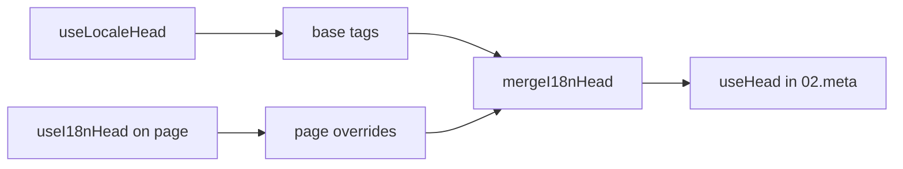

# `useI18nHead` 组合式函数

`useI18nHead` 允许你在**按页面**级别定制 i18n SEO 标签，而无需自定义 meta 插件。当 `meta: true` 时，模块会把你的输入合并到 [`useLocaleHead`](/api/composables/use-locale-head) 输出之上。

典型场景：

- **CMS / 博客文章** —— 只有部分语言完成了翻译；alternate URL 在各语言下不同（不同的 slug 或路径）。
- **动态 canonical** —— canonical URL 必须来自 API 返回的文章 URL，而不是 `$switchLocalePath`。
- **额外的 Open Graph** —— 在自动生成的 `og:locale` / `og:url` 之外再加 `og:title`、`og:description`、`og:image`。
- **部分控制** —— 保留模块生成的 canonical 与 `og:url`，只替换 `hreflang` 与 `og:locale:alternate`。

---

## 签名

{/* generated:symbol:useI18nHead — do not edit; run `pnpm run docs:generate` */}

```ts
useI18nHead(input?: MaybeRefOrGetter<I18nHeadInput | null>): { pageHead: any; resetPageHead: () => void }
```

为 i18n SEO head 标签注册页面级覆盖。
由 `02.meta` 插件合并到 `useLocaleHead` 输出之上。

| 参数 | 类型 | 描述 |
| --- | --- | --- |
| `input` *(可选)* | `MaybeRefOrGetter<I18nHeadInput \| null>` |  |

{/* /generated:symbol:useI18nHead */}

## 它在流水线中的位置



你在页面组件中调用 `useI18nHead`。`02.meta` 插件会在每次 `updateMeta()` 后应用覆盖（路由变更、`$setI18nRouteParams`、客户端的 `page:finish`）。

---

## 示例 1 —— 仅在部分语言中有翻译的文章

一种常见模式：API 返回该文章存在哪些语言以及各自的绝对或相对 URL。

```ts
interface Article {
  title: string
  slug: string
  /** Locale code → page URL (absolute or site-relative) */
  locales: Record<string, string>
}
```

```vue
<script setup lang="ts">
const route = useRoute()
const { data: article } = await useFetch<Article>(`/api/articles/${route.params.slug}`)

const localeCodes = computed(() => Object.keys(article.value?.locales ?? {}))

useI18nHead(() => {
  if (!article.value) return null

  return {
    meta: [
      { property: 'og:title', content: article.value.title },
      { property: 'og:type', content: 'article' },
    ],
    replace: {
      hreflang: localeCodes.value.map((locale) => ({
        rel: 'alternate',
        hreflang: locale,
        href: article.value!.locales[locale]!,
      })),
      ogAlternates: localeCodes.value,
    },
  }
})
</script>
```

`ogAlternates` 接受来自 `i18n.locales` 配置的**语言代码**。`og:locale:alternate` 的值会通过 `locale.og` 或 `iso` 解析（Open Graph 的 `en_US` 格式）。

---

## 示例 2 —— 按语言使用不同 slug 的文章（`$defineI18nRoute` + `$setI18nRouteParams`）

当 URL 由本地化路由模板和动态参数拼装时：

```vue
<script setup lang="ts">
const { $defineI18nRoute, $setI18nRouteParams } = useNuxtApp()
const route = useRoute()

const { data: article } = await useFetch(`/api/articles/${route.params.slug}`)

$defineI18nRoute({
  localeRoutes: {
    en: '/blog/[slug]',
    de: '/de/blog/[slug]',
    fr: '/fr/blog/[slug]',
  },
})

if (article.value) {
  $setI18nRouteParams({
    en: { slug: article.value.slugEn },
    de: { slug: article.value.slugDe },
    fr: { slug: article.value.slugFr },
  })

  const availableLocales = article.value.availableLocales as string[]

  useI18nHead({
    meta: [{ property: 'og:title', content: article.value.title }],
    replace: {
      hreflang: availableLocales.map((locale) => ({
        rel: 'alternate',
        hreflang: locale,
        href: article.value!.urls[locale],
      })),
      ogAlternates: availableLocales,
    },
  })
}
</script>
```

模块生成的 alternate 会列出**所有**已配置的语言。`replace.hreflang` 可将其限制在实际存在翻译的语言。

---

## 示例 3 —— 为默认语言的文章 URL 自定义 `x-default`

默认情况下，`x-default` 指向 `$switchLocalePath` 得到的默认语言 URL。对于文章而言，可以把它指向该文章的默认语言翻译 URL：

```vue
<script setup lang="ts">
const { $defaultLocale } = useNuxtApp()
const article = await loadArticle()

const defaultLocale = $defaultLocale() ?? 'en'
const defaultHref = article.locales[defaultLocale]

useI18nHead({
  replace: {
    hreflang: Object.entries(article.locales).map(([locale, href]) => ({
      rel: 'alternate',
      hreflang: locale,
      href,
    })),
    xDefault: defaultHref ? { rel: 'alternate', hreflang: 'x-default', href: defaultHref } : false,
    ogAlternates: Object.keys(article.locales),
  },
})
</script>
```

---

## 示例 4 —— 从 API 数据替换 canonical 与 `og:url`

当 canonical 必须与 CMS 提供的 URL 一致时（多域名、自定义路径或预先构建的绝对 URL）：

```vue
<script setup lang="ts">
const article = await loadArticle()
const canonical = article.canonicalUrl // e.g. https://www.example.com/en/blog/my-post

useI18nHead({
  replace: {
    canonical,
    ogUrl: canonical,
    hreflang: buildAlternateLinks(article),
    ogAlternates: Object.keys(article.locales),
  },
  meta: [
    { property: 'og:title', content: article.title },
    { name: 'description', content: article.excerpt },
  ],
})
</script>
```

---

## 示例 5 —— 保留自动生成的 canonical / `og:url`，只替换 alternate

如果 `$switchLocalePath` + `$setI18nRouteParams` 已经能生成正确的 canonical 与 `og:url`，那就只替换发现标签：

```vue
<script setup lang="ts">
const article = await loadArticle()

useI18nHead({
  replace: {
    hreflang: buildAlternateLinks(article),
    ogAlternates: Object.keys(article.locales),
  },
})
</script>
```

---

## 示例 6 —— 内容详情页的完整 head（meta + 链接）

一种把“页面 meta”和“alternate 链接”拆成不同 helper 的模式，也可以合并到一个调用中：

```vue
<script setup lang="ts">
const article = await loadArticle()
const alternates = Object.entries(article.locales).map(([locale, href]) => ({
  rel: 'alternate' as const,
  hreflang: locale,
  href: normalizeSeoUrl(href), // strip ?query and #hash if needed
}))

useI18nHead({
  meta: [
    { property: 'og:title', content: article.title },
    { property: 'og:description', content: article.description },
    { property: 'og:image', content: article.imageUrl },
    { name: 'twitter:card', content: 'summary_large_image' },
    { name: 'twitter:title', content: article.title },
  ],
  replace: {
    canonical: article.canonicalUrl,
    ogUrl: article.canonicalUrl,
    hreflang: alternates,
    ogAlternates: Object.keys(article.locales),
  },
})
</script>
```

```ts
/** Remove query and hash — useful when CMS URLs must be clean for SEO */
function normalizeSeoUrl(href: string): string {
  try {
    const url = new URL(href, 'https://placeholder.local')
    url.search = ''
    url.hash = ''
    return href.startsWith('http') ? url.href : `${url.pathname}`
  } catch {
    return href.split(/[?#]/)[0] ?? href
  }
}
```

---

## 示例 7 —— 两类内容，同一模式（news 与 guides）

相同的 API 结构、不同的路由名称，可以复用一个小 helper：

```ts
// composables/useArticleHead.ts
import type { I18nHeadInput } from '@i18n-micro/types'

interface LocalizedContent {
  title: string
  locales: Record<string, string>
  canonicalUrl?: string
}

export function buildArticleHead(content: LocalizedContent): I18nHeadInput {
  const localeCodes = Object.keys(content.locales)
  const canonical = content.canonicalUrl ?? content.locales.en

  return {
    meta: [{ property: 'og:title', content: content.title }],
    replace: {
      canonical,
      ogUrl: canonical,
      hreflang: localeCodes.map((locale) => ({
        rel: 'alternate',
        hreflang: locale,
        href: content.locales[locale]!,
      })),
      ogAlternates: localeCodes,
    },
  }
}
```

```vue
<!-- pages/blog/[slug].vue -->
<script setup lang="ts">
const article = await loadArticle()
useI18nHead(buildArticleHead(article))
</script>
```

```vue
<!-- pages/guides/[slug].vue -->
<script setup lang="ts">
const guide = await loadGuide()
useI18nHead(buildArticleHead(guide))
</script>
```

---

## 示例 8 —— 禁用内置 alternate，改用自定义列表

相当于禁用模块自带的 hreflang 生成器并传入自定义列表（避免重复的 alternate 集合）：

```vue
<script setup lang="ts">
const article = await loadArticle()

useI18nHead({
  disable: ['hreflang', 'x-default', 'og-alternates'],
  link: Object.entries(article.locales).map(([locale, href]) => ({
    rel: 'alternate',
    hreflang: locale,
    href,
  })),
  replace: {
    ogAlternates: Object.keys(article.locales),
  },
})
</script>
```

或者不使用 `disable`，直接用 `replace.hreflang`——它会一步替换所有 `rel="alternate"` 链接。

---

## 示例 9 —— 落地页：仅添加额外 OG，保留所有 i18n 标签

```vue
<script setup lang="ts">
const { t } = useI18n()

useI18nHead({
  meta: [
    { property: 'og:title', content: t('landing.ogTitle') },
    { property: 'og:description', content: t('landing.ogDescription') },
  ],
})
</script>
```

---

## 示例 10 —— 产品页：为单一语言实验禁用 hreflang

```vue
<script setup lang="ts">
useI18nHead({
  disable: ['hreflang', 'x-default'],
  // canonical, og:locale, og:url still generated
})
</script>
```

---

## 示例 11 —— 客户端拉取数据后响应式更新

```vue
<script setup lang="ts">
const article = ref<Article | null>(null)

onMounted(async () => {
  article.value = await $fetch('/api/articles/latest')
})

useI18nHead(() => {
  if (!article.value) return null
  return {
    meta: [{ property: 'og:title', content: article.value.title }],
    replace: {
      hreflang: Object.entries(article.value.locales).map(([locale, href]) => ({
        rel: 'alternate',
        hreflang: locale,
        href,
      })),
    },
  }
})
</script>
```

head 会在 `page:finish` 时和 `pageHead` 状态变化时刷新。

---

## 示例 12 —— 反向代理后的 HTTPS 来源

如果之前你通过某个 composable 解析出用于 canonical / alternate 绝对 URL 的"公共来源"，请改用模块配置：

```ts
// nuxt.config.ts
export default defineNuxtConfig({
  i18n: {
    meta: true,
    // undefined = origin from current request (multi-domain friendly)
    metaBaseUrl: undefined,
    metaTrustForwardedHost: true,
    metaTrustForwardedProto: true,
  },
})
```

然后在 `replace.hreflang` / `replace.canonical` 中传入**路径或完整 URL**。模块在 SSR 时会使用 `useRequestURL` 并结合 `X-Forwarded-Host` / `X-Forwarded-Proto`。

---

## API 参考

### `meta`

额外的 `<meta>` 标签。按 `id`、`property` 或 `name` 去重。

### `link`

额外的 `<link>` 标签。按 `id` 或 `rel` + `hreflang` 去重。

### `htmlAttrs`

合并进由 `useLocaleHead` 提供的 `<html>` 属性（`lang`、`dir`）。

### `replace`

| 键            | 类型                      | 效果                                         |
| -------------- | ------------------------- | ---------------------------------------------- |
| `canonical`    | `string \| false`         | 替换或移除 canonical 链接               |
| `hreflang`     | `I18nHeadLink[] \| false` | 替换或移除所有 `rel="alternate"` 链接  |
| `xDefault`     | `I18nHeadLink \| false`   | 替换或移除 `hreflang="x-default"`       |
| `ogLocale`     | `string \| false`         | 替换或移除 `og:locale`                  |
| `ogUrl`        | `string \| false`         | 替换或移除 `og:url`                     |
| `ogAlternates` | `string[] \| false`       | 基于语言代码重建 `og:locale:alternate` |

### `disable`

| 值           | 移除                                  |
| --------------- | ---------------------------------------- |
| `hreflang`      | 语言 alternate 链接（不含 `x-default`） |
| `x-default`     | `hreflang="x-default"` 链接              |
| `canonical`     | canonical 链接                           |
| `og`            | `og:locale` 与 `og:url`                 |
| `og-alternates` | `og:locale:alternate` 标签               |
| `html`          | `<html>` 上的 `lang` / `dir`               |

---

## `useLocaleHead` 与 `useI18nHead` 对比

| 组合式函数      | 作用范围                | 何时使用                                |
| --------------- | -------------------- | ------------------------------------------ |
| `useLocaleHead` | 全局 / 手动 head | `meta: false`，完全自定义 `useHead` |
| `useI18nHead`   | 按页面覆盖   | `meta: true`，只需定制个别页面     |

当 `meta: true` 时，只使用 `useI18nHead` 的页面**不需要**再调用 `useLocaleHead`。

---

## 从自定义 i18n head 插件迁移

许多项目维护着一个自定义插件，它可能会：

- 从共享状态合并页面级 alternate 链接；
- 过滤重复的地区 `hreflang`；
- 规范化 `og:locale` 值；
- 从 SEO URL 中剥离查询串。

你可以在每个内容页使用 `useI18nHead` 并结合模块的默认行为替代它。

| 以前的做法                                     | 使用 `useI18nHead` 后                                   |
| ----------------------------------------------------- | ---------------------------------------------------- |
| 共享状态 + “该文章有哪些语言”                        | `replace: \{ ogAlternates: localeCodes \}`             |
| 单独的 helper 构建 `rel="alternate"` 链接      | `replace: \{ hreflang: links \}`                       |
| 自定义插件把页面状态合入 head            | `02.meta` 内置合并                          |
| 为绝对 URL 使用自定义"公共来源"               | `metaBaseUrl` + 转发头（见示例 12）   |
| 短格式 `og:locale`（例如 `en` 而非 `en_US`）           | 设置 `locale.og` 或使用 `iso` → `en_US`（OG 协议） |

**`hreflang` 来自 `iso`：** 每个语言会产出一个 `hreflang = iso || code` 的 alternate。设置了 `iso` 时永远不会使用路由 `code`（避免出现 `hreflang="mx"` 之类的非法标签）。若要开启裸语言回退（`es-ES` → 同时输出 `es`），设置 `hreflangBaseLanguage: true`——从 `iso` 而不是 `code` 推导。若需要完全自定义的列表，请使用 `replace.hreflang`。

**JSON-LD：** `useI18nHead` 不生成结构化数据。请继续使用 `useHead(\{ script: [...] \})` 或专用的 JSON-LD helper。

---

## 另请参见

- [SEO 指南](/guides/seo) —— 自动 meta 生成与页面级覆盖
- [`useLocaleHead`](/api/composables/use-locale-head) —— 底层 head API
