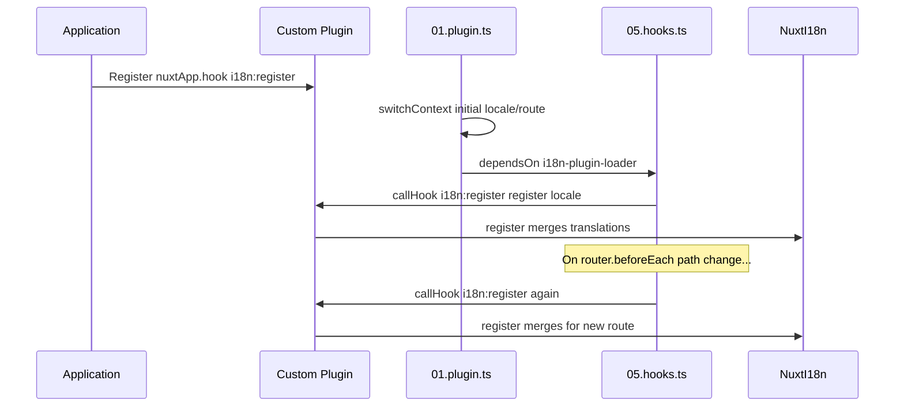

# 📢 事件

## 🔄 `i18n:register`

`Nuxt I18n Micro` 中的 `i18n:register` 事件可将翻译动态添加到应用的 i18n 上下文中,使国际化流程既顺畅又灵活。你可以在需要时集成新翻译,增强应用的本地化能力。

### 📝 事件详情

- **用途**:
  - 允许将额外的翻译动态并入某种语言现有的翻译集中。

- **载荷**:
  - **`register`**:
    - 事件提供的函数,接受两个参数:
      - **`translations`**(`Translations`):
        - 一个包含键值对的对象,按 `Translations` 接口组织的翻译。
      - **`locale`**(`string`,可选):
        - 该翻译所对应的语言 code(例如 `'en'`、`'ru'`)。若未指定,则使用事件提供的语言。

- **行为**:
  - 触发时,`register` 函数会将新翻译合并到指定语言的当前上下文中,更新整个应用可用的翻译。

### ⏱️ 触发时机

模块的 hooks 插件(`05.hooks.ts`,`dependsOn: ['i18n-plugin-loader']`)会调用 `nuxtApp.callHook('i18n:register', …)`:

1. **启动时一次** —— 在主 i18n 插件(`01.plugin.ts`)为初始路由加载完翻译之后
2. **导航时** —— 路径变化时在 `router.beforeEach` 中触发;在 `strategy: 'no_prefix'` 时,每次导航都会触发

在普通的 Nuxt 插件中通过 `nuxtApp.hook('i18n:register', …)` 注册监听器。hooks 插件会在加载器就绪之后运行,因此在需要扩展翻译时会调用你的回调。

在 `nuxt.config` 中设置 `hooks: false` 可禁用自动的 `i18n:register` 调用(参见 [配置 —— `hooks`](/guides/configuration#hooks))。

### 💡 示例用法

下面的示例展示了如何使用 `i18n:register` 事件动态添加翻译:

```typescript
nuxt.hook('i18n:register', async (register: (translations: unknown, locale?: string) => void, locale: string) => {
  register(
    {
      greeting: 'Hello',
      farewell: 'Goodbye',
    },
    locale,
  )
})
```

### 🛠️ 说明



- **事件触发**:
  - hooks 插件(`05.hooks.ts`)会在主加载器就绪之后以及相关导航时触发 `i18n:register`。

- **添加翻译**:
  - 示例注册了 `"greeting"` 和 `"farewell"` 的英文翻译。
  - `register` 函数会将这些翻译合并到指定语言的现有翻译集中。

### 🔗 主要优势

- **动态更新**:
  - 无需重新部署整个应用即可轻松更新或增加翻译。

- **本地化灵活性**:
  - 支持根据用户或应用需求进行实时的本地化调整。

借助 `i18n:register` 事件,你可以确保应用的本地化策略保持灵活可扩展,从而提升整体的用户体验。

---

## 🛠️ 使用插件修改翻译

若想在 Nuxt 应用中动态修改翻译,推荐使用插件。插件为处理本地化更新提供了结构化的方式,尤其适用于配合模块或外部翻译文件的场景。

### **注册插件**

若你正在开发模块,可在需要修改翻译的位置将插件加入到模块的配置中:

```javascript
addPlugin({
  src: resolve('./plugins/extend_locales'),
})
```

这会注册位于 `./plugins/extend_locales` 的插件,由其处理翻译的动态加载与注册。

### **实现插件**

在插件中,你可以管理语言相关的修改。以下是一个 Nuxt 插件的示例实现:

```typescript
import { defineNuxtPlugin } from '#app'

export default defineNuxtPlugin(async (nuxtApp) => {
  // Function to load translations from JSON files and register them
  const loadTranslations = async (lang: string) => {
    try {
      const translations = await import(`../locales/${lang}.json`)
      return translations.default
    } catch (error) {
      console.error(`Error loading translations for language: ${lang}`, error)
      return null
    }
  }

  // Hook into the 'i18n:register' event to dynamically add translations
  // eslint-disable-next-line @typescript-eslint/ban-ts-comment
  // @ts-expect-error
  nuxtApp.hook('i18n:register', async (register: (translations: unknown, locale?: string) => void, locale: string) => {
    const translations = await loadTranslations(locale)
    if (translations) {
      register(translations, locale)
    }
  })
})
```

### 📝 详细说明

1. **加载翻译**:

- `loadTranslations` 函数根据语言动态导入翻译文件。这些文件应位于 `locales` 目录,并按语言 code 命名(例如 `en.json`、`de.json`)。
- 加载成功后返回翻译;失败则记录错误。

2. **注册翻译**:

- 插件通过 `nuxtApp.hook` 挂载到 `i18n:register` 事件。
- 事件触发时,会以加载好的翻译和对应语言调用 `register` 函数。
- 这会将新翻译合并到指定语言的 i18n 上下文中,更新整个应用可用的翻译。

### 🔗 使用插件修改翻译的好处

- **关注点分离**:
  - 将本地化逻辑与应用主代码分离,便于管理与维护。

- **动态且可扩展**:
  - 通过动态加载和注册翻译,无需完整重新部署应用即可更新内容;这对于内容频繁更新或多语言的应用尤为有用。

- **本地化灵活性更强**:
  - 插件允许你按需修改或扩展翻译,提供更具适应性、更能响应用户偏好或业务需求的本地化策略。

采用这种方式,你可以通过一个结构化、可维护的插件流程高效扩展与修改应用的本地化,让国际化能够灵活应对变化,不断改善用户体验。
