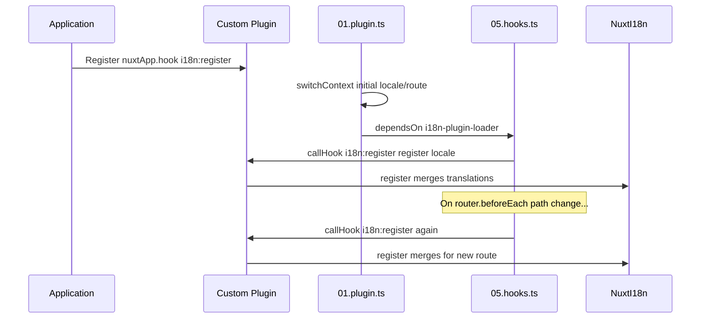

# 📢 事件

## 🔄 `i18n:register`

`Nuxt I18n Micro` 中的 `i18n:register` 事件允许你向应用的 i18n 上下文动态添加翻译，使国际化流程更为顺畅、灵活。通过该事件，你可以按需集成新的翻译，从而增强应用的本地化能力。

### 📝 事件详情

- **用途**：
  - 允许向特定语言已有的翻译集中动态并入更多翻译。

- **载荷**：
  - **`register`**：
    - 事件提供的一个函数，接收两个参数：
      - **`translations`**（`Translations`）：
        - 包含翻译键值对的对象，按 `Translations` 接口结构组织。
      - **`locale`**（`string`，可选）：
        - 注册这些翻译时对应的语言代码（例如 `'en'`、`'ru'`）。若未指定，则使用事件提供的默认语言。

- **行为**：
  - 触发时，`register` 函数会把新翻译合并进指定语言当前的上下文，从而更新应用中可用的翻译。

### ⏱️ 触发时机

模块的 hooks 插件（`05.hooks.ts`，`dependsOn: ['i18n-plugin-loader']`）会调用 `nuxtApp.callHook('i18n:register', …)`：

1. **启动时触发一次** —— 在主 i18n 插件（`01.plugin.ts`）为初始路由加载完翻译之后
2. **每次导航时** —— 在 `router.beforeEach` 中路径发生变化时；当 `strategy: 'no_prefix'` 时则在每次导航都会触发

在普通的 Nuxt 插件中通过 `nuxtApp.hook('i18n:register', …)` 注册监听器。由于 hooks 插件会在 loader 准备好后再运行，你的回调只会在需要扩展翻译时被调用。

在 `nuxt.config` 中设置 `hooks: false` 可以禁用自动的 `i18n:register` 调用（参见[配置 —— `hooks`](/guides/configuration#hooks)）。

### 💡 使用示例

以下示例演示如何使用 `i18n:register` 事件动态添加翻译：

```typescript
nuxt.hook('i18n:register', async (register: (translations: unknown, locale?: string) => void, locale: string) => {
  register(
    {
      greeting: 'Hello',
      farewell: 'Goodbye',
    },
    locale,
  )
})
```

### 🛠️ 说明



- **触发事件**：
  - hooks 插件（`05.hooks.ts`）会在主 loader 就绪后以及相关导航时触发 `i18n:register`。

- **添加翻译**：
  - 该示例为 `"greeting"` 和 `"farewell"` 注册了英文翻译。
  - `register` 函数会把这些翻译合并进指定语言已有的翻译集。

### 🔗 主要优势

- **动态更新**：
  - 无需重新部署整个应用即可轻松更新或添加翻译。

- **本地化灵活性**：
  - 支持根据用户或应用需求进行实时的本地化调整。

借助 `i18n:register` 事件，你可以确保应用的本地化策略保持灵活、可适应，从而提升整体用户体验。

---

## 🛠️ 通过插件修改翻译

若要在 Nuxt 应用中动态修改翻译，推荐使用插件。插件为处理本地化更新提供了结构化的方式，尤其适合与模块或外部翻译文件一起使用。

### **注册插件**

如果你在编写模块，则可以在模块配置中注册用于翻译修改的插件：

```javascript
addPlugin({
  src: resolve('./plugins/extend_locales'),
})
```

这会注册位于 `./plugins/extend_locales` 的插件，用于动态加载并注册翻译。

### **实现插件**

在插件中你可以管理各种语言的修改。以下是一个 Nuxt 插件的示例实现：

```typescript
import { defineNuxtPlugin } from '#app'

export default defineNuxtPlugin(async (nuxtApp) => {
  // Function to load translations from JSON files and register them
  const loadTranslations = async (lang: string) => {
    try {
      const translations = await import(`../locales/${lang}.json`)
      return translations.default
    } catch (error) {
      console.error(`Error loading translations for language: ${lang}`, error)
      return null
    }
  }

  // Hook into the 'i18n:register' event to dynamically add translations
  // eslint-disable-next-line @typescript-eslint/ban-ts-comment
  // @ts-expect-error
  nuxtApp.hook('i18n:register', async (register: (translations: unknown, locale?: string) => void, locale: string) => {
    const translations = await loadTranslations(locale)
    if (translations) {
      register(translations, locale)
    }
  })
})
```

### 📝 详细说明

1. **加载翻译**：

- `loadTranslations` 函数会根据语言动态导入翻译文件。文件应放在 `locales` 目录下，并以语言代码命名（例如 `en.json`、`de.json`）。
- 加载成功时返回翻译；否则会输出错误。

2. **注册翻译**：

- 插件通过 `nuxtApp.hook` 挂钩到 `i18n:register` 事件。
- 事件触发时，会用加载到的翻译和对应语言调用 `register` 函数。
- 这会将新翻译合并进指定语言的 i18n 上下文，从而更新整个应用中可用的翻译。

### 🔗 使用插件管理翻译的收益

- **关注点分离**：
  - 把本地化逻辑从主应用代码中分离出来，便于管理和维护。

- **动态且可扩展**：
  - 通过动态加载并注册翻译，你无需完全重新部署即可更新内容，这对内容更新频繁或多语言的应用尤为有用。

- **增强的本地化灵活性**：
  - 插件允许你按需修改或扩展翻译，让本地化策略更灵活、更能响应用户偏好或业务需求。

采用这种方式，你可以借助插件以结构化、可维护的方式高效扩展和修改应用中的本地化，让国际化能够随需求变化持续适应，并提升整体用户体验。
