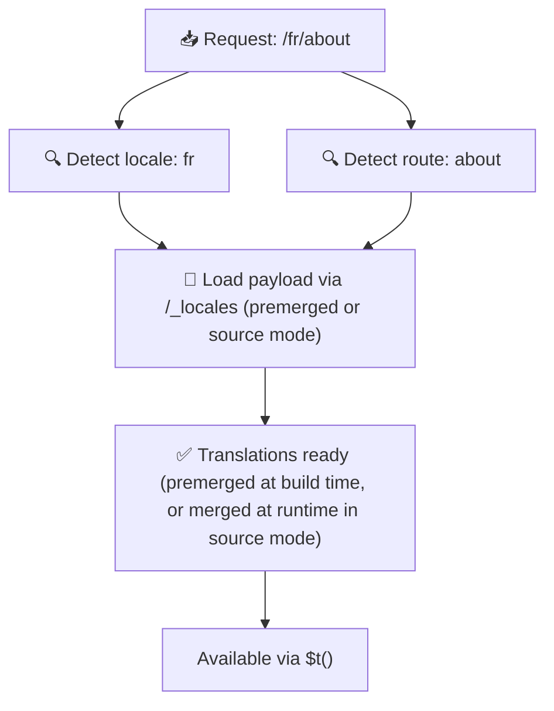

# 📂 目录结构指南

## 📖 简介

有条理地组织翻译文件对于维护一个可扩展、高效的国际化(i18n)体系至关重要。`Nuxt I18n Micro` 通过清晰的方式管理根级与页面级翻译,让这个过程更简单。本指南将介绍推荐的目录结构,并解释 `Nuxt I18n Micro` 如何处理这些翻译。

## 🗂️ 推荐目录结构

`Nuxt I18n Micro` 将翻译组织为根级文件与 `pages` 目录下的页面级文件。当 `translationPayloads.mode: 'premerged'`(默认)时,根级翻译会在构建期自动合并到每个页面文件中,因此每个页面都拥有完整的翻译集合,而无需在运行时进行合并。

在 `mode: 'source'` 下,源文件会分别保留在 Nitro 资源中,并通过 `/_locales` 路由在运行时合并。参见 [Serverless Payload 输出](/guides/performance#serverless-payload-output)。

### 🔧 基本结构

以下是应遵循的基本目录结构示例:

```text
locales/
├── pages/
│   ├── index/
│   │   ├── en.json
│   │   ├── fr.json
│   │   └── ar.json
│   ├── about/
│   │   ├── en.json
│   │   ├── fr.json
│   │   └── ar.json
├── en.json
├── fr.json
└── ar.json

```

### 📄 结构说明

#### 1. 🌍 根级翻译文件

- **路径:** `/locales/\{locale\}.json`(例如 `/locales/en.json`)
- **用途:** 这些文件包含在整个应用中共享的翻译(导航菜单、页眉、页脚等)。当 `mode: 'premerged'`(默认)时,它们会在构建期自动合并到每个页面级文件中,因此服务端可以为每个页面返回一份预构建好的文件。

  **示例内容(`/locales/en.json`):**

  ```json
  {
    "menu": {
      "home": "Home",
      "about": "About Us",
      "contact": "Contact"
    },
    "footer": {
      "copyright": "© 2024 Your Company"
    }
  }
  ```

#### 2. 📄 页面级翻译文件

- **路径:** `/locales/pages/\{routeName\}/\{locale\}.json`(例如 `/locales/pages/index/en.json`)
- **用途:** 这些文件包含各个页面独有的翻译。当 `mode: 'premerged'`(默认)时,根级翻译会作为基础在构建期被合并进来,因此每个页面文件都是自包含的。

  **示例内容(`/locales/pages/index/en.json`):**

  ```json
  {
    "title": "Welcome to Our Website",
    "description": "We offer a wide range of products and services to meet your needs."
  }
  ```

  **示例内容(`/locales/pages/about/en.json`):**

  ```json
  {
    "title": "About Us",
    "description": "Learn more about our mission, vision, and values."
  }
  ```

### 📂 处理动态路由与嵌套路径

`Nuxt I18n Micro` 会按特定命名规则,将路由中的动态段与嵌套路径自动转换为扁平化的目录结构,以便所有翻译都以一致、易访问的方式存放。

#### 动态路由的翻译目录结构

面对动态路由(如 `/products/[id]`),模块会将动态段 `[id]` 转换为文件结构中的静态形式。

**动态路由的目录结构示例:**

对于形如 `/products/[id]` 的路由,翻译文件将存放在名为 `products-id` 的目录中:

```text
locales/pages/
├── products-id/
│   ├── en.json
│   ├── fr.json
│   └── ar.json

```

**嵌套动态路由的目录结构示例:**

对于形如 `/products/key/[id]` 的嵌套路由,翻译文件将存放在名为 `products-key-id` 的目录中:

```text
locales/pages/
├── products-key-id/
│   ├── en.json
│   ├── fr.json
│   └── ar.json

```

**多级嵌套路由的目录结构示例:**

对于更复杂的嵌套路由(如 `/products/category/[id]/details`),翻译文件将存放在名为 `products-category-id-details` 的目录中:

```text
locales/pages/
├── products-category-id-details/
│   ├── en.json
│   ├── fr.json
│   └── ar.json

```

### 🛠 自定义目录结构

若你偏好将翻译存放在其他目录,`Nuxt I18n Micro` 允许自定义翻译文件目录。可在 `nuxt.config.ts` 中进行配置。

**示例:自定义翻译目录**

```typescript
export default defineNuxtConfig({
  i18n: {
    translationDir: 'i18n', // Custom directory path
  },
})
```

这会让 `Nuxt I18n Micro` 从 `/i18n` 目录读取翻译文件,而不是默认的 `/locales` 目录。

## ⚙️ 翻译的加载方式

### 🌍 动态语言路由

`Nuxt I18n Micro` 通过动态语言路由高效地加载翻译。用户访问页面时,模块会根据当前路由和语言,加载对应的翻译文件。



例如:

- 访问 `/en/index` 会加载 `/locales/pages/index/en.json`。
- 访问 `/fr/about` 会加载 `/locales/pages/about/fr.json`。

这种方式只加载必要的翻译,同时优化服务端负载和客户端性能。

### 💾 缓存与预渲染

为进一步提升性能,`Nuxt I18n Micro` 支持翻译文件的缓存与预渲染:

- **缓存**:翻译文件加载后会被缓存,后续请求可直接使用,避免重复获取相同数据。
- **预渲染**:在构建过程中,你可以为所有已配置的语言和路由预渲染翻译文件,让它们无需运行时延迟即可从服务端直接提供。

## 📝 最佳实践

### 📂 合理使用页面级文件

利用页面级文件保持翻译的组织性。这样每个页面的翻译体积较小、加载更快——尤其是对内容复杂或体量较大的页面而言。

### 🔑 保持翻译键的一致性

在各个文件之间使用一致的键命名规范,有助于保持清晰度,避免在应用规模变大时管理翻译时出现问题。

### 🗂️ 按上下文组织翻译

在文件中将相关翻译分组。例如,将所有按钮文案放在 `buttons` 下,将所有表单相关文本放在 `forms` 下。这不仅便于阅读,还能让跨语言管理翻译更轻松。

### ⚠️ 嵌套深度限制(建议 2 层)

在客户端导航过程中,`Nuxt I18n Micro` 会使用经过优化的 2 层深度合并来组合离开页与进入页的翻译。这样,即使两个页面都在 `common.*` 下有重叠嵌套键,也能在过渡动画期间保留。

**对于标准的 `Section → Key → Value`(2 层)结构,这能正常工作:**

```json
// Page A translations
{ "common": { "fromA": "Text A" } }

// Page B translations
{ "common": { "fromB": "Text B" } }

// During transition, both are available:
// { "common": { "fromA": "Text A", "fromB": "Text B" } }
```

**但若嵌套 3 层及以上,较深层次的键在过渡期间可能被覆盖:**

```json
// Page A translations
{ "auth": { "form": { "login": "Login" } } }

// Page B translations
{ "auth": { "form": { "register": "Register" } } }

// During transition: "login" key is lost
// { "auth": { "form": { "register": "Register" } } }
```

<Tip>

</Tip>

### 🧹 定期清理未使用的翻译

随着时间推移,应用中可能会积累未使用的翻译键(例如功能被移除或重构)。请定期审查并清理翻译文件,让它们保持精简、易维护。
