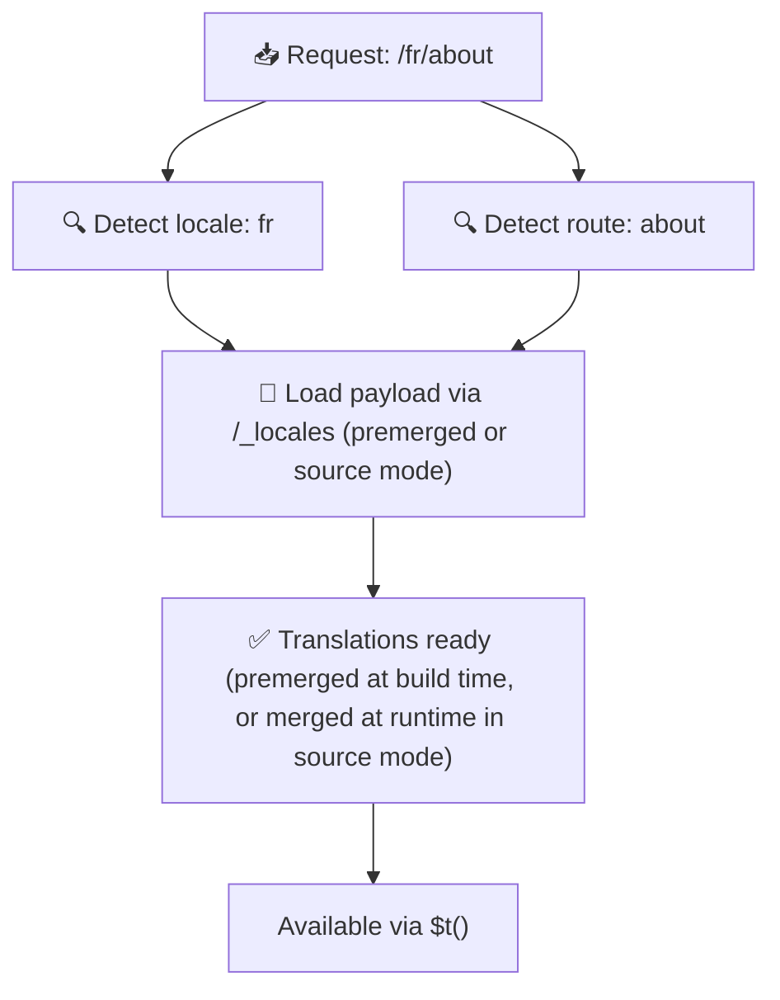

# 📂 目录结构指南

## 📖 简介

有效组织翻译文件对于维护可扩展且高效的国际化（i18n）体系至关重要。`Nuxt I18n Micro` 通过清晰的方式来管理根级与页面级翻译，简化了这一过程。本指南将介绍推荐的目录结构以及 `Nuxt I18n Micro` 是如何处理这些翻译的。

## 🗂️ 推荐的目录结构

`Nuxt I18n Micro` 会把翻译分为根级文件与位于 `pages` 目录下的页面级文件。当 `translationPayloads.mode: 'premerged'`（默认）时，根级翻译会在构建期自动合并进每个页面文件，因此每个页面都拥有完整的翻译集，无需运行时合并开销。

在 `mode: 'source'` 下，源文件在 Nitro 资源中保持独立，通过 `/_locales` 路由在运行时合并。参见[serverless payload 输出](/guides/performance#serverless-payload-output)。

### 🔧 基本结构

以下是一个应遵循的基本目录示例：

```text
locales/
├── pages/
│   ├── index/
│   │   ├── en.json
│   │   ├── fr.json
│   │   └── ar.json
│   ├── about/
│   │   ├── en.json
│   │   ├── fr.json
│   │   └── ar.json
├── en.json
├── fr.json
└── ar.json

```

### 📄 结构说明

#### 1. 🌍 根级翻译文件

- **路径：** `/locales/\{locale\}.json`（例如 `/locales/en.json`）
- **用途：** 这些文件包含在整个应用共享的翻译（导航菜单、页眉、页脚等）。当 `mode: 'premerged'`（默认）时，它们会在构建期自动合并进每个页面级文件，服务器只需为每个页面返回一个预先构建好的文件。

  **示例内容（`/locales/en.json`）：**

  ```json
  {
    "menu": {
      "home": "Home",
      "about": "About Us",
      "contact": "Contact"
    },
    "footer": {
      "copyright": "© 2024 Your Company"
    }
  }
  ```

#### 2. 📄 页面级翻译文件

- **路径：** `/locales/pages/\{routeName\}/\{locale\}.json`（例如 `/locales/pages/index/en.json`）
- **用途：** 这些文件包含单个页面独有的翻译。当 `mode: 'premerged'`（默认）时，根级翻译会作为基础在构建期合并进来，因此每个页面文件都是自包含的。

  **示例内容（`/locales/pages/index/en.json`）：**

  ```json
  {
    "title": "Welcome to Our Website",
    "description": "We offer a wide range of products and services to meet your needs."
  }
  ```

  **示例内容（`/locales/pages/about/en.json`）：**

  ```json
  {
    "title": "About Us",
    "description": "Learn more about our mission, vision, and values."
  }
  ```

### 📂 处理动态路由与嵌套路径

`Nuxt I18n Micro` 会通过一个特定的重命名约定，把路由中的动态段和嵌套路径自动转换为扁平的目录结构。这样能保证所有翻译以一致、易访问的方式存储。

#### 动态路由的翻译目录

处理 `/products/[id]` 这类动态路由时，模块会把动态段 `[id]` 转换成文件系统中的静态形式。

**动态路由目录示例：**

对于 `/products/[id]` 这样的路由，翻译文件会保存在名为 `products-id` 的目录里：

```text
locales/pages/
├── products-id/
│   ├── en.json
│   ├── fr.json
│   └── ar.json

```

**嵌套动态路由目录示例：**

对于 `/products/key/[id]` 这样的嵌套路由，翻译文件会保存在名为 `products-key-id` 的目录里：

```text
locales/pages/
├── products-key-id/
│   ├── en.json
│   ├── fr.json
│   └── ar.json

```

**多层嵌套路由目录示例：**

对于 `/products/category/[id]/details` 这样更复杂的嵌套路由，翻译文件会保存在名为 `products-category-id-details` 的目录里：

```text
locales/pages/
├── products-category-id-details/
│   ├── en.json
│   ├── fr.json
│   └── ar.json

```

### 🛠 自定义目录结构

如果你希望把翻译放在别的目录，`Nuxt I18n Micro` 支持在 `nuxt.config.ts` 中自定义翻译文件所在的目录。

**示例：自定义翻译目录**

```typescript
export default defineNuxtConfig({
  i18n: {
    translationDir: 'i18n', // Custom directory path
  },
})
```

这样 `Nuxt I18n Micro` 就会在 `/i18n` 目录中查找翻译文件，而不是默认的 `/locales` 目录。

## ⚙️ 翻译的加载方式

### 🌍 动态语言路由

`Nuxt I18n Micro` 通过动态语言路由高效加载翻译。当用户访问一个页面时，模块会确定合适的语言，并基于当前路由和语言加载相应的翻译文件。



例如：

- 访问 `/en/index` 会加载 `/locales/pages/index/en.json` 中的翻译。
- 访问 `/fr/about` 会加载 `/locales/pages/about/fr.json` 中的翻译。

这种方式确保只加载必要的翻译，同时优化了服务器负载与客户端性能。

### 💾 缓存与预渲染

为了进一步提升性能，`Nuxt I18n Micro` 支持翻译文件的缓存与预渲染：

- **缓存**：一旦某个翻译文件被加载，就会被缓存，供后续请求复用，避免反复拉取相同的数据。
- **预渲染**：在构建过程中，你可以为所有已配置的语言和路由预渲染翻译文件，从而在无运行时延迟的情况下直接由服务器提供。

## 📝 最佳实践

### 📂 合理使用页面级文件

利用页面级文件来保持翻译的组织性。这样每个页面的翻译都可以保持精简、加载迅速，尤其适合内容复杂或体量较大的页面。

### 🔑 保持翻译键的一致性

在不同文件中使用一致的翻译键命名约定。这有助于保持清晰，并在应用不断扩张时避免管理上的问题。

### 🗂️ 按上下文组织翻译

在同一文件内把相关的翻译分组。例如把所有按钮文案放在 `buttons` 下、把表单文案放在 `forms` 下。这样不仅可读性更好，也让跨语言管理更容易。

### ⚠️ 建议的嵌套深度限制（2 层）

在客户端导航期间，`Nuxt I18n Micro` 会对离开与进入页面的翻译执行经过优化的 2 层深合并。这样能在过渡动画期间保留重叠的嵌套键（例如两个页面都有 `common.*` 下的键）。

**这对标准的 `Section → Key → Value` 结构（2 层）能正确工作：**

```json
// Page A translations
{ "common": { "fromA": "Text A" } }

// Page B translations
{ "common": { "fromB": "Text B" } }

// During transition, both are available:
// { "common": { "fromA": "Text A", "fromB": "Text B" } }
```

**但如果使用 3 层及以上的嵌套，过渡期间更深层的键可能被覆盖：**

```json
// Page A translations
{ "auth": { "form": { "login": "Login" } } }

// Page B translations
{ "auth": { "form": { "register": "Register" } } }

// During transition: "login" key is lost
// { "auth": { "form": { "register": "Register" } } }
```


### 🧹 定期清理未使用的翻译

随着时间推移，如果功能被移除或结构调整，应用中可能积累一些不再使用的翻译键。定期审阅并清理翻译文件，让它们保持精简、易维护。
