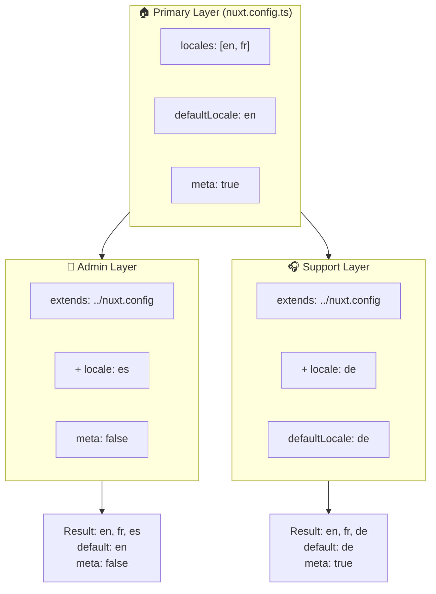

# 🗂️ `Nuxt I18n Micro` 中的 Layer

## 📖 Layer 简介

`Nuxt I18n Micro` 中的 layer 让你能够跨应用不同部分灵活管理和定制本地化设置。通过定义不同的 layer，你可以为不同上下文调整配置——例如为站点某个模块覆盖设置，或创建可被其他部分继承扩展的可复用基础配置。

### Layer 继承流程



## 🛠️ 主配置 Layer

**主配置 Layer** 是你为整个应用配置默认本地化设置的地方。它定义了全局配置（支持的语言、默认语言以及其他关键的 i18n 设置），非常重要。

### 📄 示例：定义主配置 Layer

以下是一个在 `nuxt.config.ts` 中定义主配置 layer 的示例：

```typescript
export default defineNuxtConfig({
  i18n: {
    locales: [
      { code: 'en', iso: 'en-EN', dir: 'ltr' },
      { code: 'fr', iso: 'fr-FR', dir: 'ltr' },
      { code: 'ar', iso: 'ar-SA', dir: 'rtl' },
    ],
    defaultLocale: 'en', // The default locale for the entire app
    translationDir: 'locales', // Directory where translations are stored
    meta: true, // Automatically generate SEO-related meta tags like `alternate`
    autoDetectLanguage: true, // Automatically detect and use the user's preferred language
  },
})
```

## 🌱 子 Layer

子 layer 用于扩展或覆盖主配置以适配应用的某些部分。例如，你可能需要为某个模块添加额外的语言或修改默认语言。在模块化应用中，不同部分的本地化要求可能不同，这时子 layer 尤为有用。

### 📄 示例：在子 layer 中扩展主 Layer

假设站点某个模块需要支持额外的语言，或需要在某个上下文中禁用某个语言。可以通过扩展主 layer 来实现：

```typescript
// basic/nuxt.config.ts (Primary Layer)
export default defineNuxtConfig({
  i18n: {
    locales: [
      { code: 'en', iso: 'en-EN', dir: 'ltr' },
      { code: 'fr', iso: 'fr-FR', dir: 'ltr' },
    ],
    defaultLocale: 'en',
    meta: true,
    translationDir: 'locales',
  },
})
```

```typescript
// extended/nuxt.config.ts (Child Layer)
export default defineNuxtConfig({
  extends: '../basic', // Inherit the base configuration from the 'basic' layer
  i18n: {
    locales: [
      { code: 'en', iso: 'en-EN', dir: 'ltr' }, // Inherited from the base layer
      { code: 'fr', iso: 'fr-FR', dir: 'ltr' }, // Inherited from the base layer
      { code: 'de', iso: 'de-DE', dir: 'ltr' }, // Added in the child layer
    ],
    defaultLocale: 'fr', // Override the default locale to French for this section
    autoDetectLanguage: false, // Disable automatic language detection in this section
  },
})
```

### 🌐 在模块化应用中使用 Layer

在较大型的模块化 Nuxt 应用中，你可能有多个模块，各自需要不同的 i18n 设置。借助 layer，你可以维持清晰、可扩展的配置结构。

### 📄 示例：模块化应用中的分层配置

设想你有一个电商站点，包含主站、管理面板和客服门户等不同模块。每个模块可能需要不同的语言集或其他 i18n 设置。

#### **主 Layer（全局配置）：**

```typescript
// nuxt.config.ts
export default defineNuxtConfig({
  i18n: {
    locales: [
      { code: 'en', iso: 'en-EN', dir: 'ltr' },
      { code: 'fr', iso: 'fr-FR', dir: 'ltr' },
    ],
    defaultLocale: 'en',
    meta: true,
    translationDir: 'locales',
    autoDetectLanguage: true,
  },
})
```

#### **管理面板子 Layer：**

```typescript
// admin/nuxt.config.ts
export default defineNuxtConfig({
  extends: '../nuxt.config', // Inherit the global settings
  i18n: {
    locales: [
      { code: 'en', iso: 'en-EN', dir: 'ltr' }, // Inherited
      { code: 'fr', iso: 'fr-FR', dir: 'ltr' }, // Inherited
      { code: 'es', iso: 'es-ES', dir: 'ltr' }, // Specific to the admin panel
    ],
    defaultLocale: 'en',
    meta: false, // Disable automatic meta generation in the admin panel
  },
})
```

#### **客服门户子 Layer：**

```typescript
// support/nuxt.config.ts
export default defineNuxtConfig({
  extends: '../nuxt.config', // Inherit the global settings
  i18n: {
    locales: [
      { code: 'en', iso: 'en-EN', dir: 'ltr' }, // Inherited
      { code: 'fr', iso: 'fr-FR', dir: 'ltr' }, // Inherited
      { code: 'de', iso: 'de-DE', dir: 'ltr' }, // Specific to the support portal
    ],
    defaultLocale: 'de', // Default to German in the support portal
    autoDetectLanguage: false, // Disable automatic language detection
  },
})
```

在这个模块化示例中：

- 每个模块（admin、support）都有自己的 i18n 设置，但都继承了基础配置。
- 管理面板新增了西语（`es`）并禁用了 meta 标签生成。
- 客服门户新增了德语（`de`）并将用户界面默认设为德语。

## 📝 使用 Layer 的最佳实践

- **🔧 主 Layer 保持简单：** 主 layer 应包含最常用、适用于全局的设置，保持简单以确保一致性。
- **⚙️ 在子 Layer 中做具体定制：** 只在必要时才在子 layer 中覆盖或扩展设置，避免不必要的复杂度。
- **📚 为你的 Layer 编写文档：** 清楚记录每个 layer 的用途与差异。这有助于让他人（或未来的你）更容易理解配置。
