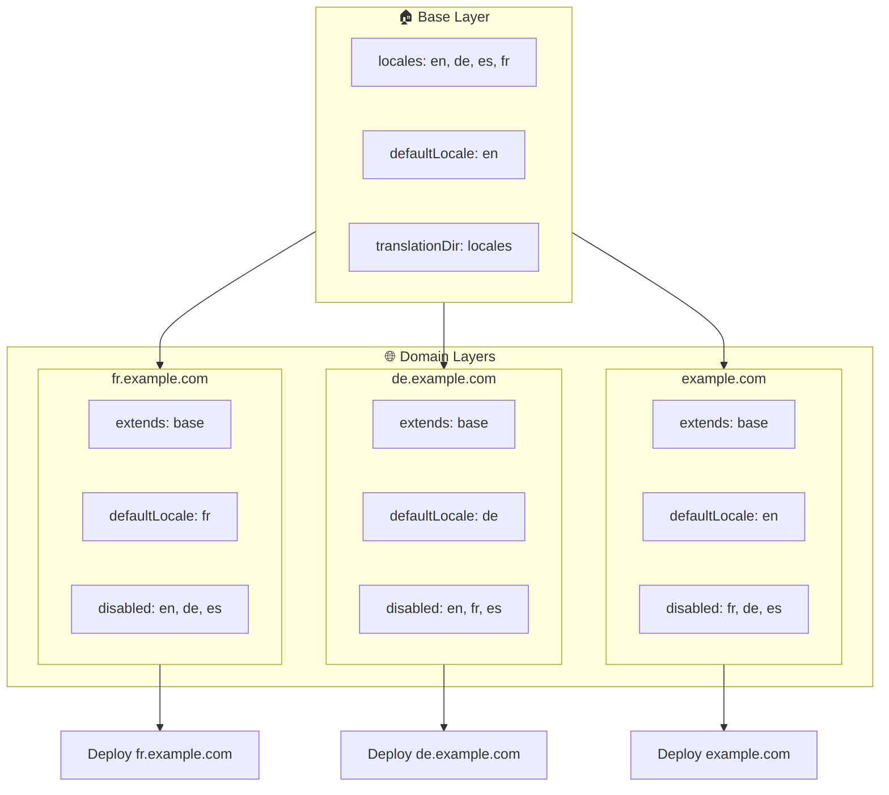

# 🌍 使用 Layer 在 `Nuxt I18n Micro` 中配置多域名语言

## 📝 简介

通过在 `Nuxt I18n Micro` 中使用 layer,你可以构建一个灵活、可维护的多域名本地化方案。该方式不仅可以省去复杂的域名管理逻辑,简化项目,还能实现负载分布并降低项目复杂度。通过为不同语言运行相互独立的项目,应用可以轻松扩展,并适配多域名下的各种语言需求,是面向全球化应用的稳健、可扩展方案。

## 🎯 目标

为不同域名分别提供各自的语言支持——通过在子 layer 中定制配置来实现。此方法利用了 Nuxt 的 layer 系统,让你可以维护一份基础配置,并针对每个域名进行扩展或修改。

### 多域名架构



## 🛠 实施多域名语言的步骤

### 1. **创建基础 Layer**

先创建一个包含应用所有通用语言设置的基础配置 layer。它将作为其他各域名特定配置的基础。

#### **基础 Layer 配置**

创建基础配置文件 `base/nuxt.config.ts`:

```typescript
// base/nuxt.config.ts

export default defineNuxtConfig({
  i18n: {
    locales: [
      { code: 'en', iso: 'en-US', dir: 'ltr' },
      { code: 'de', iso: 'de-DE', dir: 'ltr' },
      { code: 'es', iso: 'es-ES', dir: 'ltr' },
    ],
    defaultLocale: 'en',
    translationDir: 'locales',
    meta: true,
    autoDetectLanguage: true,
  },
})
```

### 2. **创建针对具体域名的子 Layer**

为每个域名创建一个子 layer,在其中修改基础配置以满足该域名的特定需求。可以禁用该域名不需要的语言。

#### **示例:法语域名的配置**

在 `fr/nuxt.config.ts` 中为法语域名创建子 layer 配置:

```typescript
// fr/nuxt.config.ts

export default defineNuxtConfig({
  extends: '../base', // Inherit from the base configuration

  i18n: {
    locales: [
      { code: 'en', iso: 'en-US', dir: 'ltr', disabled: true }, // Disable English
      { code: 'fr', iso: 'fr-FR', dir: 'ltr' }, // Add and enable the French locale
      { code: 'de', iso: 'de-DE', dir: 'ltr', disabled: true }, // Disable German
      { code: 'es', iso: 'es-ES', dir: 'ltr', disabled: true }, // Disable Spanish
    ],
    defaultLocale: 'fr', // Set French as the default locale
    autoDetectLanguage: false, // Disable automatic language detection
  },
})
```

#### **示例:德语域名的配置**

同理,在 `de/nuxt.config.ts` 中为德语域名创建子 layer 配置:

```typescript
// de/nuxt.config.ts

export default defineNuxtConfig({
  extends: '../base', // Inherit from the base configuration

  i18n: {
    locales: [
      { code: 'en', iso: 'en-US', dir: 'ltr', disabled: true }, // Disable English
      { code: 'fr', iso: 'fr-FR', dir: 'ltr', disabled: true }, // Disable French
      { code: 'de', iso: 'de-DE', dir: 'ltr' }, // Use the German locale
      { code: 'es', iso: 'es-ES', dir: 'ltr', disabled: true }, // Disable Spanish
    ],
    defaultLocale: 'de', // Set German as the default locale
    autoDetectLanguage: false, // Disable automatic language detection
  },
})
```

### 3. **为每个域名部署应用**

按各自的配置为每个域名部署应用。例如:

- 将 `fr` layer 配置部署到 `fr.example.com`。
- 将 `de` layer 配置部署到 `de.example.com`。

### 4. **为不同语言运行多个独立项目**

为每种语言和每个域名分别运行独立的应用实例。这样可以保证每个域名都使用正确的语言配置,优化负载分布,并简化项目结构。通过运行针对每种语言的独立项目,可以在配置之间保持清晰的隔离,减少整体的复杂度。

### 5. **根据域名配置路由**

请确保你的路由能够根据用户访问的域名将其引导到对应的项目实例。这样才能保证每个域名都提供正确的语言,提升用户体验并保持跨区域的一致性。

### 6. **部署并验证**

在配置好各 layer 并将它们部署到相应域名后,请确认每个域名都提供了正确的语言。对应用进行充分测试,以验证不同域名下加载的语言是否正确。

## 📝 最佳实践

- **保持基础配置通用**:基础配置应覆盖所有域名通用的设置。
- **隔离域名相关逻辑**:将域名相关的配置放在各自的 layer 中,以保持清晰与关注点分离。

## 🎉 结论

通过在 `Nuxt I18n Micro` 中利用 layer,你可以构建一个灵活且可维护的多域名本地化方案。这种方式不仅省去了复杂的域名管理逻辑,还能高效分布负载,降低项目复杂度。为不同语言运行独立项目可确保应用轻松扩展,并适配跨域名的各种语言需求,是面向全球化应用的稳健、可扩展方案。
