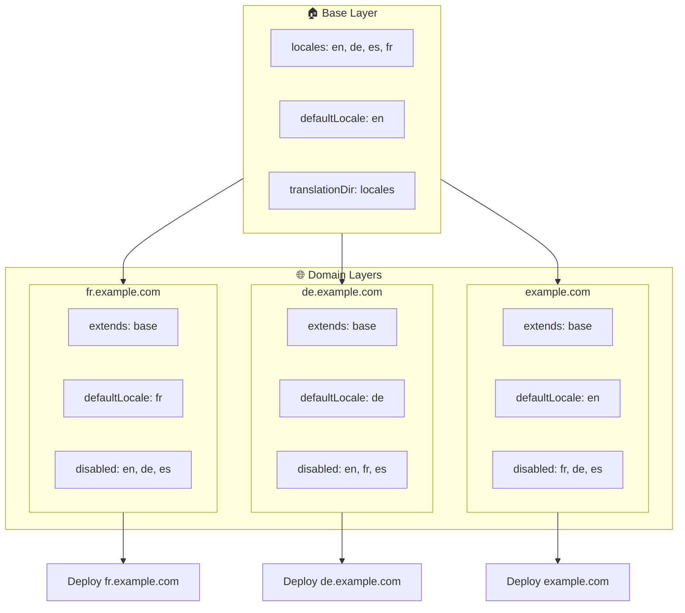

# 🌍 通过 Layer 用 `Nuxt I18n Micro` 搭建多域名多语言

## 📝 简介

借助 `Nuxt I18n Micro` 的 layer，你可以构建灵活且易维护的多域名本地化方案。这种做法既能省去复杂的多域名逻辑，又能高效分担负载、降低项目复杂度。为不同语言运行独立项目，能让应用轻松扩展、适配跨多个域名的语言差异，是面向全球应用的稳健、可扩展方案。

## 🎯 目标

打造一种：通过在子 layer 中定制配置，让不同域名分别服务特定语言的部署方式。该方法充分利用 Nuxt 的 layer 体系，你可以在保持基础配置的同时，为每个域名进行扩展或修改。

### 多域名架构



## 🛠 实施多域名多语言的步骤

### 1. **创建基础 Layer**

首先创建一个基础配置 layer，包含所有域名共用的通用语言设置。它将作为其他域名特定配置的基础。

#### **基础 Layer 配置**

创建基础配置文件 `base/nuxt.config.ts`：

```typescript
// base/nuxt.config.ts

export default defineNuxtConfig({
  i18n: {
    locales: [
      { code: 'en', iso: 'en-US', dir: 'ltr' },
      { code: 'de', iso: 'de-DE', dir: 'ltr' },
      { code: 'es', iso: 'es-ES', dir: 'ltr' },
    ],
    defaultLocale: 'en',
    translationDir: 'locales',
    meta: true,
    autoDetectLanguage: true,
  },
})
```

### 2. **为各个域名创建子 Layer**

为每个域名创建一个子 layer，用于修改基础配置以满足该域名的具体需求。你可以禁用该域名不需要的语言。

#### **示例：法语域名配置**

在 `fr/nuxt.config.ts` 中为法语域名创建一个子 layer：

```typescript
// fr/nuxt.config.ts

export default defineNuxtConfig({
  extends: '../base', // Inherit from the base configuration

  i18n: {
    locales: [
      { code: 'en', iso: 'en-US', dir: 'ltr', disabled: true }, // Disable English
      { code: 'fr', iso: 'fr-FR', dir: 'ltr' }, // Add and enable the French locale
      { code: 'de', iso: 'de-DE', dir: 'ltr', disabled: true }, // Disable German
      { code: 'es', iso: 'es-ES', dir: 'ltr', disabled: true }, // Disable Spanish
    ],
    defaultLocale: 'fr', // Set French as the default locale
    autoDetectLanguage: false, // Disable automatic language detection
  },
})
```

#### **示例：德语域名配置**

同样地，在 `de/nuxt.config.ts` 中为德语域名创建子 layer：

```typescript
// de/nuxt.config.ts

export default defineNuxtConfig({
  extends: '../base', // Inherit from the base configuration

  i18n: {
    locales: [
      { code: 'en', iso: 'en-US', dir: 'ltr', disabled: true }, // Disable English
      { code: 'fr', iso: 'fr-FR', dir: 'ltr', disabled: true }, // Disable French
      { code: 'de', iso: 'de-DE', dir: 'ltr' }, // Use the German locale
      { code: 'es', iso: 'es-ES', dir: 'ltr', disabled: true }, // Disable Spanish
    ],
    defaultLocale: 'de', // Set German as the default locale
    autoDetectLanguage: false, // Disable automatic language detection
  },
})
```

### 3. **将应用按域名分别部署**

为每个域名部署使用相应配置的应用。例如：

- 把 `fr` layer 配置部署到 `fr.example.com`。
- 把 `de` layer 配置部署到 `de.example.com`。

### 4. **为不同语言启动多个项目**

对每种语言和域名而言，都需要单独运行一份应用实例。这样能确保每个域名提供正确的语言配置，优化负载分配并简化项目结构。为每种语言运行独立项目能保持配置之间的清晰分离，降低整体复杂度。

### 5. **基于域名配置路由**

请确保路由能够根据用户访问的域名把请求引导到正确的项目。这样每个域名都能提供对应的语言，从而提升用户体验并保持不同地区的一致性。

### 6. **部署与验证**

配置好各 layer 并部署到相应域名后，请确保每个域名都在提供正确的语言。彻底测试应用，确认按域名切换的语言符合预期。

## 📝 最佳实践

- **保持基础配置通用**：基础配置应涵盖适用于所有域名的通用设置。
- **隔离域名特定逻辑**：把域名特定的配置放在各自的 layer 中，以保持清晰的关注点分离。

## 🎉 结语

借助 `Nuxt I18n Micro` 的 layer，你可以搭建灵活且易维护的多域名本地化方案。这种做法不仅省去了复杂的域名管理逻辑，还能高效分担负载、降低项目复杂度。为不同语言运行独立项目让应用能轻松扩展、适应不同域名的语言需求，是面向全球应用的稳健、可扩展方案。
