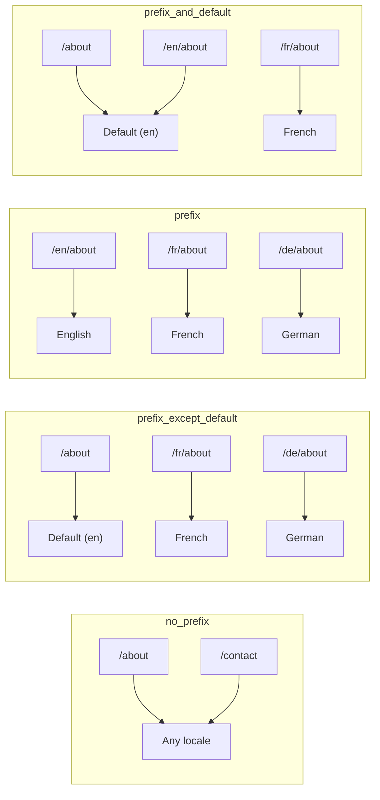
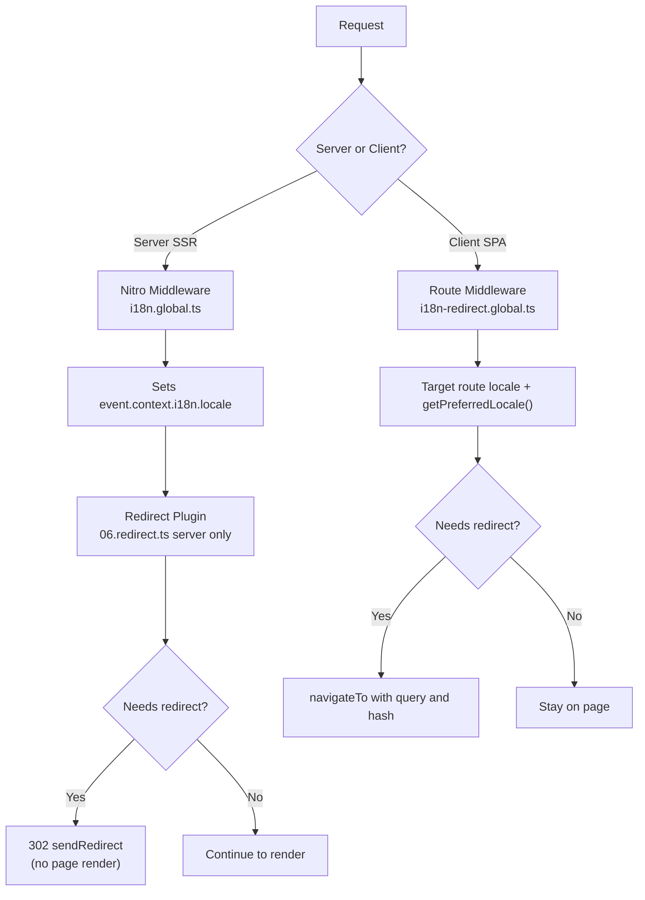

# 🗂️ Nuxt I18n Micro 中的路由策略

## 📖 概述

Nuxt I18n Micro 通过 `strategy` 选项控制语言前缀在 URL 中的呈现方式。其底层由两个包实现:

- **`@i18n-micro/route-strategy`** —— 构建期路由生成(为 Nuxt 页面扩展本地化路由)
- **`@i18n-micro/path-strategy`** —— 运行时路径解析、重定向、SEO 属性以及链接生成

Nuxt 模块会在构建期选择合适的策略类,并通过 `#i18n-strategy` 别名引入,因此只会打包被选中的实现。

## 🚦 可用策略

{/* generated:option:strategy — do not edit; run `pnpm run docs:generate` */}

**类型** `Strategies` · **默认** `'prefix_except_default'`

面向语言前缀的 URL 路由策略。

- `'no_prefix'` —— URL 中不含语言;语言存于 Cookie。
- `'prefix_except_default'` —— 除默认语言外,其他语言均加前缀。
- `'prefix'` —— 始终加前缀,包括默认语言。
- `'prefix_and_default'` —— 与 `prefix` 相同,但默认语言也可通过不带前缀的路径访问。

{/* /generated:option:strategy */}

### 策略对比



### 🛑 `no_prefix`

URL 中不含语言段。语言由 Cookie、`useI18nLocale()` 状态或浏览器检测确定。

- **路由**:`/about`、`/contact` —— 所有语言使用相同的 URL 模式(不加 `/en/`、`/fr/` 等前缀)
- **语言持久化**:通过 `localeCookie`(若未指定,会自动设为 `'user-locale'`)
- **自定义路径**:可通过 [`globalLocaleRoutes`](/guides/configuration#globallocaleroutes) 与 [`defineI18nRoute`](/guides/custom-locale-routes) 实现——生成本地化的 slug,而不在 URL 中添加语言前缀(如 `/about` 对应 `/ueber-uns`)。嵌套路由、别名以及按语言限制,均比 `prefix_except_default` 简单。

<Tip>
使用 `no_prefix` 时,若未指定 `localeCookie`,会自动设为 `'user-locale'`。因为 URL 中不包含语言信息,这一点是必需的。
</Tip>

```typescript
i18n: {
  strategy: 'no_prefix'
  // localeCookie is automatically set to 'user-locale'
}
```

### 🚧 `prefix_except_default`

除默认语言外,所有路由都带有语言前缀。

- **默认语言**:`/about`、`/contact`
- **其他语言**:`/fr/about`、`/de/contact`
- **默认语言带前缀会返回 404**:`/en/about` → 404(当 `en` 为默认时)

```typescript
i18n: {
  strategy: 'prefix_except_default' // This is the default
}
```

### 🌍 `prefix`

每条路由都带有语言前缀,包括默认语言。

- **所有语言**:`/en/about`、`/fr/about`、`/de/about`
- **根路径 `/`**:根据用户偏好重定向到 `/\{locale\}/`

```typescript
i18n: {
  strategy: 'prefix'
}
```

### 🔄 `prefix_and_default`

默认语言可通过带前缀和不带前缀的路径访问。其他语言始终带前缀。

- **默认语言**:`/about` 与 `/en/about` 均有效
- **其他语言**:`/fr/about`、`/de/about`
- **`/` 不会重定向**:`/` 与 `/en/` 均提供默认语言

```typescript
i18n: {
  strategy: 'prefix_and_default'
}
```

## 🔀 重定向架构(v3)

在 v3 中,重定向逻辑被分为两层以获得最佳性能:

### 工作原理



### 服务端(无闪烁)

1. **Nitro 中间件**(`i18n.global.ts`)最先运行——从 URL、Cookie 或 `Accept-Language` header 检测语言,并设置 `event.context.i18n.locale`
2. **重定向插件**(`06.redirect.ts`,仅服务端)通过 `i18nStrategy.getClientRedirect()` 判断当前路径是否需要重定向,并在页面渲染**之前**发出 302
3. 这样可以避免"错误闪烁"——用户在重定向前短暂看到错误页面的情况

### 客户端(SPA 导航)

1. 当启用 `redirects` 时,全局路由中间件(`i18n-redirect.global.ts`)在每次客户端导航时运行
2. 首先从**目标路由**推导偏好语言,再回退到 `useI18nLocale().getPreferredLocale()`
3. 使用 `i18nStrategy.getClientRedirect()` 判断是否需要重定向
4. 重定向时保留 `query` 和 `hash`

### 语言优先级顺序

在服务端,重定向插件按以下顺序确定偏好语言:

1. **`useState('i18n-locale')`** —— 最高优先级(通过 `useI18nLocale().setLocale()` 设置)
2. **Cookie** —— 若已配置 `localeCookie`
3. **`Accept-Language` 请求头** —— 若 `autoDetectLanguage: true`
4. **`defaultLocale`** —— 最终兜底

在客户端,路由中间件优先使用目标路由的语言,然后使用相同的状态/Cookie 回退链。

### 各策略下的重定向行为

| 策略                | `GET /` 行为                              | 是否需要 Cookie? |
| ----------------------- | --------------------------------------------- | ---------------- |
| `no_prefix`             | 无重定向(语言来自 Cookie/状态)        | 自动设置         |
| `prefix`                | 302 → `/\{locale\}/`                            | 建议设置      |
| `prefix_except_default` | 若语言 ≠ 默认,则 302 → `/\{locale\}/`        | 建议设置      |
| `prefix_and_default`    | 无重定向(`/` 与 `/\{locale\}/` 均有效) | 可选         |

### 禁用重定向

```typescript
i18n: {
  redirects: false // Disables automatic locale redirects
}
```

当 `redirects: false` 时,自动的语言重定向会被禁用:

- **服务端**:重定向插件(`06.redirect.ts`,仅服务端)仍会注册但跳过重定向逻辑。它仍会对无效的语言前缀执行 **404 检查**(例如 `xx` 不是有效语言时的 `/xx/about`),并根据 URL 前缀**同步 Cookie**(例如访问 `/fr/about` 会将 Cookie 同步为 `fr`)
- **客户端**:`i18n-redirect` 全局路由中间件**不会注册** —— 不会进行 SPA 自动重定向

## 🍪 基于 Cookie 的语言持久化

<Warning>
当使用 `prefix` 或 `prefix_except_default` 且 `redirects: true`(默认)时,**必须**设置 `localeCookie` 才能让重定向正常工作。没有 Cookie,重定向插件就无法在页面刷新之间记住用户的语言偏好。

```typescript
i18n: {
  strategy: 'prefix_except_default',
  localeCookie: 'user-locale' // Required for redirects to work properly
}
```
</Warning>

**v3 中 `localeCookie` 的工作方式:**

- 由 `useI18nLocale()` 在内部管理 —— **不要**通过 `useCookie()` 手动设置
- 当用户访问带前缀的 URL(如 `/fr/about`)时,Cookie 会自动同步为 `fr`
- 下次访问 `/` 时,会使用 Cookie 值将其重定向到 `/\{locale\}/`
- 若 Cookie 中的语言无效(不在 `locales` 列表中),则回退到 `defaultLocale`

| 策略                | `localeCookie` 默认值 | 备注                                |
| ----------------------- | ---------------------- | ------------------------------------ |
| `no_prefix`             | 自动:`'user-locale'`  | 必需;自动设置          |
| `prefix`                | `null`(禁用)      | 若需重定向,设为 `'user-locale'` |
| `prefix_except_default` | `null`(禁用)      | 若需重定向,设为 `'user-locale'` |
| `prefix_and_default`    | `null`(禁用)      | 可选                             |

## 🔍 `autoDetectLanguage` 与 `autoDetectPath`

### `autoDetectLanguage`

{/* generated:option:autoDetectLanguage — do not edit; run `pnpm run docs:generate` */}

**类型** `boolean` · **默认** `true`

自动从 `Accept-Language` HTTP 请求头检测用户的偏好语言。
与 `autoDetectPath` 结合使用以决定何时进行检测。

{/* /generated:option:autoDetectLanguage */}

该检查在服务端中间件中运行,作为兜底逻辑:Cookie 或已有状态优先。

```typescript
i18n: {
  autoDetectLanguage: true
}
```

### `autoDetectPath`

{/* generated:option:autoDetectPath — do not edit; run `pnpm run docs:generate` */}

**类型** `string` · **默认** `'/'`

决定何时基于 Cookie/Accept-Language 偏好触发重定向(需 `redirects` 启用)。

- `'/'` —— 仅 `/`(默认;深链接仍可用于默认语言)
- `'no_prefix'` —— 仅不带语言前缀的路径
- `'*'` —— 每个路径,包括改写显式语言前缀
  (例如 Cookie 偏好 `de` 时,`/fr/about` → `/de/about`)

- 任意其他字符串 —— 精确路径匹配(例如 `'/welcome'`)

带前缀策略的清理(例如 `prefix_except_default` 下 `/en` → `/`)不受此选项限制。

{/* /generated:option:autoDetectPath */}

```typescript
i18n: {
  autoDetectPath: '/' // Default: only root
  // autoDetectPath: '*' // All paths — redirects even /fr/about to /de/about
}
```

<Warning>
使用 `autoDetectPath: '*'` 时,即使 URL 中含显式语言前缀(如 `/fr/about`),只要用户偏好不同也会被重定向。这在基于域名的方案中可能有用,但可能会让分享 URL 的用户感到困惑。
</Warning>

当使用默认的 `autoDetectPath: '/'` 且带有语言 Cookie 时:

| 请求 | Cookie | 结果 |
| --- | --- | --- |
| `/` | `de` | 302 → `/de` |
| `/about` | `de` | 200,默认语言(不重写) |

```typescript
i18n: {
  localeCookie: 'user-locale',
  strategy: 'prefix_except_default',
  // Default — remember language on entry, keep deep links stable
  autoDetectPath: '/',
  // Or redirect on every unprefixed path (but not /de/… → /fr/…):
  // autoDetectPath: 'no_prefix',
}
```

## ⚠️ 已知问题与最佳实践

### 1. `no_prefix` 策略下的 Hydration 不一致

使用 `no_prefix` 时,语言是动态确定的。若服务端与客户端使用了不同语言,就会出现 hydration 不一致。

**解决方案**:在 `order: -10` 的服务端插件中通过 `useI18nLocale().setLocale()` 在 i18n 初始化之前设置语言:

```ts
// plugins/i18n-loader.server.ts
export default defineNuxtPlugin({
  name: 'i18n-custom-loader',
  enforce: 'pre',
  order: -10,
  setup() {
    const { setLocale } = useI18nLocale()
    setLocale('ja') // Your detection logic here
  },
})
```

详细示例请参见 [自定义语言检测](/guides/custom-language-detection)。

### 2. 与 `localeRoute` 一起使用具名路由

基于路径的路由可能在解析时出现问题:

```typescript
// May cause issues
$localeRoute('/page')

// Preferred approach
$localeRoute({ name: 'page' })
```

### 3. 在 i18n 中使用 `pages: false`

当使用 Nuxt 且 `pages: false` 时:

```typescript
export default defineNuxtConfig({
  pages: false,
  i18n: {
    strategy: 'no_prefix', // Recommended
    disablePageLocales: true, // Required
    localeCookie: 'user-locale', // Required for persistence
  },
})
```

**`pages: false` 的限制:**

- 无自动重定向
- 无基于 URL 的语言检测
- 客户端语言切换需要页面刷新或手动加载翻译

### 4. 无效 Cookie 的处理

若 Cookie 中的语言无效(不在 `locales` 列表中),模块会优雅地回退到 `defaultLocale`,不会抛出错误。

## 📝 最佳实践总结

| 建议            | 细节                                                                             |
| ------------------------- | ----------------------------------------------------------------------------------- |
| **设置 `localeCookie`**    | 使用带前缀且 `redirects: true` 的策略时,请始终设置                             |
| **使用 `useI18nLocale()`** | 集中管理语言状态的方式(替代手动 `useState`/`useCookie`) |
| **使用具名路由**      | 优先 `$localeRoute(\{ name: 'page' \})`,而非 `$localeRoute('/page')`                       |
| **以编程方式设置语言**   | 在 `order: -10` 的服务端插件中使用 `useI18nLocale().setLocale()`              |
| **避免手动操作 Cookie**  | 不要直接使用 `useCookie('user-locale')` —— `useI18nLocale()` 会为你管理      |
