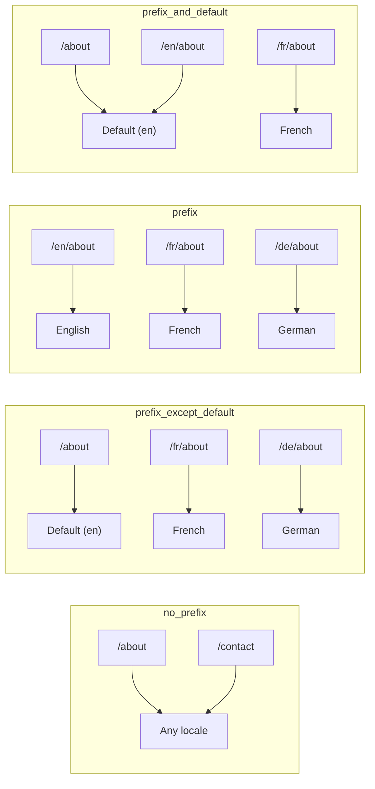
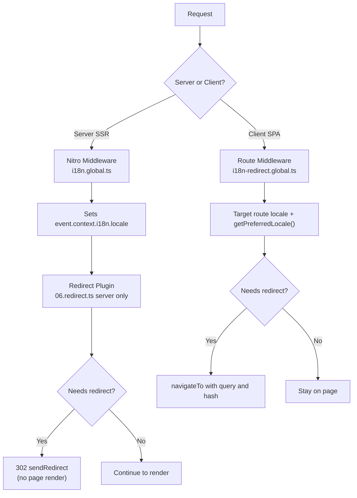

# 🗂️ Nuxt I18n Micro 中的路由策略

## 📖 概述

Nuxt I18n Micro 通过 `strategy` 选项控制 URL 中语言前缀的呈现方式。其底层由两个包实现：

- **`@i18n-micro/route-strategy`** —— 构建期路由生成（扩展 Nuxt 页面为本地化路由）
- **`@i18n-micro/path-strategy`** —— 运行时路径解析、重定向、SEO 属性与链接生成

Nuxt 模块会在构建期选择合适的策略类，并通过 `#i18n-strategy` 建立别名，因此只有被选中的实现会被打包。

## 🚦 可用策略

{/* generated:option:strategy — do not edit; run `pnpm run docs:generate` */}

**类型** `Strategies` · **默认值** `'prefix_except_default'`

语言前缀的 URL 路由策略。

- `'no_prefix'` —— URL 中无语言前缀；语言存储在 cookie 中。
- `'prefix_except_default'` —— 除默认语言外，全部加前缀。
- `'prefix'` —— 始终加前缀，包括默认语言。
- `'prefix_and_default'` —— 与 `prefix` 类似，但默认语言也可以在无前缀的情况下访问。

{/* /generated:option:strategy */}

### 策略对比



### 🛑 `no_prefix`

URL 中没有语言段。语言由 cookie、`useI18nLocale()` 状态或浏览器检测决定。

- **路由**：`/about`、`/contact` —— 所有语言使用相同的 URL 模式（不带 `/en/`、`/fr/` 前缀）
- **语言持久化**：通过 `localeCookie`（若未指定会自动设为 `'user-locale'`）
- **自定义路径**：可通过 [`globalLocaleRoutes`](/guides/configuration#globallocaleroutes) 与 [`defineI18nRoute`](/guides/custom-locale-routes) 支持——生成本地化 slug 但不在 URL 中加语言前缀（例如 `/about` 对应 `/ueber-uns`）。相比 `prefix_except_default`，嵌套路由、别名和按语言的限制都更简单。

<Tip>
在使用 `no_prefix` 时，如果未指定 `localeCookie`，模块会自动将其设为 `'user-locale'`。因为 URL 不包含语言信息，这一 cookie 是必需的。
</Tip>

```typescript
i18n: {
  strategy: 'no_prefix'
  // localeCookie is automatically set to 'user-locale'
}
```

### 🚧 `prefix_except_default`

除默认语言外，所有路由都带语言前缀。

- **默认语言**：`/about`、`/contact`
- **其他语言**：`/fr/about`、`/de/contact`
- **默认语言带前缀返回 404**：`/en/about` → 404（当 `en` 是默认语言时）

```typescript
i18n: {
  strategy: 'prefix_except_default' // This is the default
}
```

### 🌍 `prefix`

所有路由都带语言前缀，包括默认语言。

- **所有语言**：`/en/about`、`/fr/about`、`/de/about`
- **根路径 `/`**：根据用户偏好重定向到 `/\{locale\}/`

```typescript
i18n: {
  strategy: 'prefix'
}
```

### 🔄 `prefix_and_default`

默认语言同时以带前缀和不带前缀的形式可用。非默认语言始终带前缀。

- **默认语言**：`/about` 和 `/en/about` 都合法
- **其他语言**：`/fr/about`、`/de/about`
- **`/` 不重定向**：`/` 与 `/en/` 都服务于默认语言

```typescript
i18n: {
  strategy: 'prefix_and_default'
}
```

## 🔀 重定向架构（v3）

在 v3 中，重定向逻辑被分为两层以获得最佳性能：

### 工作方式



### 服务端（无闪烁）

1. **Nitro 中间件**（`i18n.global.ts`）最先运行——从 URL、cookie 或 `Accept-Language` 请求头检测语言，并设置 `event.context.i18n.locale`
2. **重定向插件**（`06.redirect.ts`，仅服务器）使用 `i18nStrategy.getClientRedirect()` 判断当前路径是否需要重定向，并在**任何页面渲染之前**发出 302
3. 这样可以避免用户在重定向前短暂看到错误页面的"错误闪烁"

### 客户端（SPA 导航）

1. 启用 `redirects` 时，全局路由中间件（`i18n-redirect.global.ts`）会在每次客户端导航时运行
2. 首先根据**目标路由**推导出偏好语言，然后回退到 `useI18nLocale().getPreferredLocale()`
3. 使用 `i18nStrategy.getClientRedirect()` 决定是否需要重定向
4. 重定向时保留 `query` 与 `hash`

### 语言优先级顺序

服务器端，重定向插件按以下顺序确定偏好语言：

1. **`useState('i18n-locale')`** —— 最高优先级（通过 `useI18nLocale().setLocale()` 编程设置）
2. **Cookie** —— 若已配置 `localeCookie`
3. **`Accept-Language` 请求头** —— 若 `autoDetectLanguage: true`
4. **`defaultLocale`** —— 最终回退

客户端路由中间件优先使用目标路由的语言，然后使用相同的 state/cookie 回退链。

### 各策略下的重定向行为

| 策略                | `GET /` 行为                              | 是否需要 cookie？ |
| ----------------------- | --------------------------------------------- | ---------------- |
| `no_prefix`             | 不重定向（语言来自 cookie/state）        | 自动设置         |
| `prefix`                | 302 → `/\{locale\}/`                            | 推荐      |
| `prefix_except_default` | 若语言 ≠ 默认，则 302 → `/\{locale\}/`        | 推荐      |
| `prefix_and_default`    | 不重定向（`/` 与 `/\{locale\}/` 都合法） | 可选         |

### 关闭重定向

```typescript
i18n: {
  redirects: false // Disables automatic locale redirects
}
```

设置 `redirects: false` 时会关闭自动语言重定向：

- **服务器**：重定向插件（`06.redirect.ts`，仅服务器）仍会被注册，但跳过重定向逻辑。它仍会执行**无效语言前缀（例如 `/xx/about`，其中 `xx` 不是有效语言）的 404 检查**以及**从 URL 前缀同步 cookie**（例如访问 `/fr/about` 会把 cookie 同步为 `fr`）
- **客户端**：`i18n-redirect` 全局路由中间件**不会注册**——不再进行 SPA 自动重定向

## 🍪 基于 Cookie 的语言持久化

<Warning>
当使用 `prefix` 或 `prefix_except_default` 且 `redirects: true`（默认）时，你**必须**设置 `localeCookie`，重定向才能正确工作。没有 cookie 时，重定向插件无法在页面刷新之间记住用户的语言偏好。

```typescript
i18n: {
  strategy: 'prefix_except_default',
  localeCookie: 'user-locale' // Required for redirects to work properly
}
```
</Warning>

**v3 中 `localeCookie` 的工作方式：**

- 由 `useI18nLocale()` 内部管理——**不要**通过 `useCookie()` 手动设置
- 当用户访问带前缀的 URL（例如 `/fr/about`）时，cookie 会被自动同步为 `fr`
- 下次访问 `/` 时会使用 cookie 值重定向到 `/\{locale\}/`
- 如果 cookie 包含无效语言（不在 `locales` 列表中），会回退到 `defaultLocale`

| 策略                | `localeCookie` 默认值 | 备注                                |
| ----------------------- | ---------------------- | ------------------------------------ |
| `no_prefix`             | 自动：`'user-locale'`  | 必需；自动设置          |
| `prefix`                | `null`（关闭）      | 若需重定向请设为 `'user-locale'` |
| `prefix_except_default` | `null`（关闭）      | 若需重定向请设为 `'user-locale'` |
| `prefix_and_default`    | `null`（关闭）      | 可选                             |

## 🔍 `autoDetectLanguage` 与 `autoDetectPath`

### `autoDetectLanguage`

{/* generated:option:autoDetectLanguage — do not edit; run `pnpm run docs:generate` */}

**类型** `boolean` · **默认值** `true`

从 HTTP 请求头 `Accept-Language` 自动检测用户偏好语言。
与 `autoDetectPath` 配合使用以决定何时进行检测。

{/* /generated:option:autoDetectLanguage */}

该检查在服务器中间件中运行，作为回退：cookie 或已有 state 优先。

```typescript
i18n: {
  autoDetectLanguage: true
}
```

### `autoDetectPath`

{/* generated:option:autoDetectPath — do not edit; run `pnpm run docs:generate` */}

**类型** `string` · **默认值** `'/'`

（启用 `redirects` 时）cookie / Accept-Language 偏好重定向可以运行的路径。

- `'/'` —— 只针对 `/`（默认语言下的深链接仍可访问；默认）
- `'no_prefix'` —— 只针对不带语言前缀的路径
- `'*'` —— 所有路径，包括改写已有的语言前缀
  （例如 cookie 偏好 `de` 时，`/fr/about` → `/de/about`）

- 任何其他字符串 —— 精确路径匹配（例如 `'/welcome'`）

前缀策略下的清理（例如 `prefix_except_default` 下 `/en` → `/`）不受该选项限制。

{/* /generated:option:autoDetectPath */}

```typescript
i18n: {
  autoDetectPath: '/' // Default: only root
  // autoDetectPath: '*' // All paths — redirects even /fr/about to /de/about
}
```

<Warning>
使用 `autoDetectPath: '*'` 时，即使 URL 已包含明确的语言前缀（例如 `/fr/about`），只要用户偏好语言不同也会被重定向。这在基于域名的部署里可能有用，但可能让分享 URL 的用户困惑。
</Warning>

在默认的 `autoDetectPath: '/'` 加语言 cookie 下：

| 请求 | cookie | 结果 |
| --- | --- | --- |
| `/` | `de` | 302 → `/de` |
| `/about` | `de` | 200，默认语言（不改写） |

```typescript
i18n: {
  localeCookie: 'user-locale',
  strategy: 'prefix_except_default',
  // Default — remember language on entry, keep deep links stable
  autoDetectPath: '/',
  // Or redirect on every unprefixed path (but not /de/… → /fr/…):
  // autoDetectPath: 'no_prefix',
}
```

## ⚠️ 已知问题与最佳实践

### 1. `no_prefix` 策略下的 Hydration 不匹配

使用 `no_prefix` 时语言是动态确定的。如果服务器与客户端的语言不一致，会出现 hydration 不匹配。

**解决方案**：在服务器插件中（使用 `order: -10`）通过 `useI18nLocale().setLocale()` 在 i18n 初始化之前设置语言：

```ts
// plugins/i18n-loader.server.ts
export default defineNuxtPlugin({
  name: 'i18n-custom-loader',
  enforce: 'pre',
  order: -10,
  setup() {
    const { setLocale } = useI18nLocale()
    setLocale('ja') // Your detection logic here
  },
})
```

详细示例参见[自定义语言检测](/guides/custom-language-detection)。

### 2. 在 `localeRoute` 中使用命名路由

基于路径的路由可能在路由解析上出问题：

```typescript
// May cause issues
$localeRoute('/page')

// Preferred approach
$localeRoute({ name: 'page' })
```

### 3. 结合 `pages: false` 使用 i18n

在 Nuxt 中使用 `pages: false` 时：

```typescript
export default defineNuxtConfig({
  pages: false,
  i18n: {
    strategy: 'no_prefix', // Recommended
    disablePageLocales: true, // Required
    localeCookie: 'user-locale', // Required for persistence
  },
})
```

**`pages: false` 的限制：**

- 无自动重定向
- 无基于 URL 的语言检测
- 客户端语言切换需要页面刷新或手动加载翻译

### 4. 无效 cookie 处理

如果 cookie 包含无效语言（不在 `locales` 列表中），模块会安全地回退到 `defaultLocale`，不会抛出错误。

## 📝 最佳实践总结

| 建议            | 详情                                                                             |
| ------------------------- | ----------------------------------------------------------------------------------- |
| **设置 `localeCookie`**    | 前缀策略且 `redirects: true` 时始终设置                             |
| **使用 `useI18nLocale()`** | 集中管理语言状态的推荐方式（替代手动的 `useState`/`useCookie`） |
| **使用命名路由**      | 优先 `$localeRoute(\{ name: 'page' \})`，而非 `$localeRoute('/page')`                       |
| **以编程方式设置语言**   | 在服务器插件中以 `order: -10` 调用 `useI18nLocale().setLocale()`              |
| **不要手动操作 cookie**  | 不要直接使用 `useCookie('user-locale')`—— `useI18nLocale()` 会管理它      |
