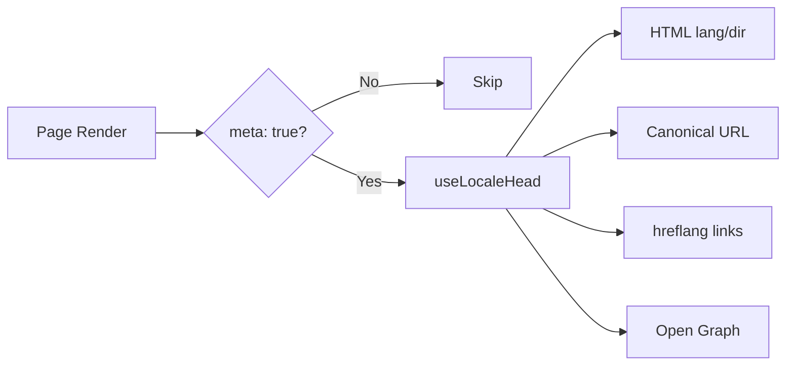

# 🌐 Nuxt I18n Micro SEO 指南

## 📖 简介

有效的 SEO（搜索引擎优化）对于确保你的多语言站点在全球范围内被搜索引擎发现和访问至关重要。`Nuxt I18n Micro` 会自动生成必要的 meta 标签与属性，帮助搜索引擎理解站点结构与内容，从而简化多语言站点的 SEO 管理。

本指南说明 `Nuxt I18n Micro` 是如何在无需额外配置的情况下改善站点可见性和用户体验的。

## ⚙️ 自动 SEO 处理

### SEO Meta 生成流程



**生成的标签：**

| 标签             | 示例                                                  |
| --------------- | -------------------------------------------------------- |
| HTML 属性 | `<html lang="en" dir="ltr">`                             |
| Canonical       | `<link rel="canonical" href="...">`                      |
| hreflang        | `<link rel="alternate" hreflang="en" href="...">`        |
| x-default       | `<link rel="alternate" hreflang="x-default" href="...">` |
| Open Graph      | `<meta property="og:locale" content="en_US">`            |

#### 按语言的 `og`（`og:locale` 与 BCP 47）

`<html lang>` 与 `hreflang` 使用 **BCP 47** —— 来自 `locale.iso`（例如 `ar-AE`）。  
Open Graph 要求 **`language_TERRITORY`** 且使用**下划线**（`ar_AE`），依据 [OG 协议](https://ogp.me/)。

默认情况下，当映射明确时，`og:locale` 会由 `iso` 派生（例如 `en-US` → `en_US`）。  
需要自定义时，可显式设置 **`og`** 字符串（例如 `zh-Hans` → `zh_CN`）。  
如果既没有 `og` 也没有可转换的 `iso`，则不会生成 `og:locale` 标签——在开发模式下会看到控制台警告（尊重 `missingWarn`）。

```typescript
i18n: {
  meta: true,
  locales: [
    { code: 'ar', iso: 'ar-AE', og: 'ar_AE', dir: 'rtl' },
    { code: 'en', iso: 'en-US' }, // og:locale → en_US
    { code: 'zh', iso: 'zh-Hans', og: 'zh_CN' }, // script tags need explicit og
  ],
}
```

### 🔑 关键 SEO 特性

启用 `meta` 选项后，`Nuxt I18n Micro` 会自动管理以下 SEO 相关内容：

1. **🌍 语言与文字方向属性**：
   - 根据当前语言与文字方向（例如英文的 `ltr` 或阿拉伯语的 `rtl`），在 `<html>` 上设置 `lang` 与 `dir`。

2. **🔗 Canonical URL**：
   - 为每个页面生成 canonical 链接（`<link rel="canonical">`），让搜索引擎识别内容的主版本。

3. **🌐 备选语言链接（`hreflang`）**：
   - 自动为所有可用语言生成 `<link rel="alternate" hreflang="">` 标签。这有助于搜索引擎理解内容有哪些语言版本，提升全球用户体验。
   - 每个语言输出**一个**标签：`hreflang = iso || code`。设置了 `iso` 时永远不会将路由 `code` 用作 `hreflang`（因此像 `mx` 这类市场标识不会成为非法语言标签）。
   - 可选设置 `hreflangBaseLanguage: true`，会再输出一个从 `iso` 派生的裸语言标签（例如 `es-ES` → `es`），由 `locales` 中该语言下第一个地区语言占用。

4. **🌏 `x-default` Hreflang**：
   - 自动生成 `<link rel="alternate" hreflang="x-default">`，指向默认语言的 URL。它告诉搜索引擎：语言不匹配任何已定义语言的用户应看到哪个 URL。当 `meta: true` 时自动生效，无需额外配置。

5. **🔖 Open Graph 元数据**：
   - 为每个语言生成 Open Graph meta 标签（`og:locale`、`og:url` 等），有助于社媒分享和搜索引擎索引。

### 🛠️ 配置

要启用这些 SEO 特性，请确保 `nuxt.config.ts` 中 `meta` 选项设为 `true`：

```typescript
export default defineNuxtConfig({
  modules: ['nuxt-i18n-micro'],
  i18n: {
    locales: [
      { code: 'en', iso: 'en-US', dir: 'ltr' },
      { code: 'fr', iso: 'fr-FR', dir: 'ltr' },
      { code: 'ar', iso: 'ar-SA', dir: 'rtl' },
    ],
    defaultLocale: 'en',
    translationDir: 'locales',
    meta: true, // Enables automatic SEO management
  },
})
```

### 🌍 多域名部署中的动态 `metaBaseUrl`

未设置 `metaBaseUrl` 时，绝对 SEO URL 按以下顺序解析（#240）：

1. 来自 [`nuxt-site-config`](https://nuxtseo.com/docs/site-config) 的 `site.url`（如果该模块存在，例如通过 `@nuxtjs/seo` 引入）
2. 否则使用当前请求的主机名（`useRequestURL()` / `window.location.origin`）

请求来源的回退方案会尊重反向代理头（`X-Forwarded-Host`、`X-Forwarded-Proto`），因此在 nginx、Cloudflare、AWS ALB 等代理之后同样有效。

这意味着已经为 sitemap / robots / schema.org 设置了 `site.url` 的应用**无需**再单独声明 `metaBaseUrl`：

```typescript
export default defineNuxtConfig({
  site: {
    url: process.env.NUXT_SITE_URL, // also used by micro for canonical / og:url / hreflang
  },
  i18n: {
    meta: true,
    // metaBaseUrl omitted — picks up site.url, then request origin
  },
})
```

没有 `site.url` 时，一份应用实例仍可通过请求来源为**多个域名**生成正确的 SEO 标签：

```typescript
export default defineNuxtConfig({
  i18n: {
    meta: true,
    // metaBaseUrl is undefined by default — resolved dynamically from the request
  },
})
```

例如，请求 `https://site-a.com/en/about` 会生成：

```html
<link rel="canonical" href="https://site-a.com/en/about" /> <meta property="og:url" content="https://site-a.com/en/about" />
```

而同一份应用服务 `https://site-b.com/en/about` 时会生成：

```html
<link rel="canonical" href="https://site-b.com/en/about" /> <meta property="og:url" content="https://site-b.com/en/about" />
```

如果你需要一个永远优先于 `site.url` 的固定基础 URL，请传入静态字符串：

```typescript
metaBaseUrl: 'https://example.com'
```

### 🔍 Canonical 查询白名单

默认情况下，查询参数会从 canonical 和 `og:url` 中被剥离，以避免重复内容。你可以把需要保留的特定查询参数加入白名单：

```typescript
i18n: {
  canonicalQueryWhitelist: ['page', 'sort', 'filter', 'search', 'q', 'query', 'tag']
}
```

只有出现在 `canonicalQueryWhitelist` 中的参数才会保留在 canonical URL 中。其他参数（例如追踪、会话 ID）都会被移除。

### 🚫 按页面禁用 meta 标签

你可以通过 `defineI18nRoute()` 为特定页面禁用 SEO meta 标签的生成：

```vue
<script setup>
// Disable all SEO meta tags for this page
defineI18nRoute({
  disableMeta: true,
})
</script>
```

也可以仅为特定语言禁用 meta：

```vue
<script setup>
// Disable meta tags only for English locale on this page
defineI18nRoute({
  disableMeta: ['en'],
})
</script>
```

`disableMeta` 生效时，受影响的页面/语言不会生成任何 `hreflang`、`canonical`、`og:locale`、`og:url` 或 `x-default` 标签。

### 🔇 已禁用的语言

`disabled: true` 的语言会自动从所有 SEO 标签中排除——不会为它们生成 `hreflang`、`og:locale:alternate` 或备选链接：

```typescript
i18n: {
  locales: [
    { code: 'en', iso: 'en-US' },
    { code: 'fr', iso: 'fr-FR', disabled: true }, // excluded from SEO tags
  ]
}
```

### 🙈 选择性退出（`seo: false`）

对于仍可路由和翻译但不希望出现在跨语言发现标签中的语言，请设置 `seo: false`。这些语言会从 `hreflang` alternate 与 `og:locale:alternate` 中省略。如果你配置的**默认**语言设为 `seo: false`，则也不会输出 `x-default` 链接。

```typescript
i18n: {
  locales: [
    { code: 'en', iso: 'en-US' },
    { code: 'ru', iso: 'ru-RU', seo: false }, // internal / non-indexed locale
  ]
}
```

### 📌 各策略下的行为

| 策略                | hreflang 链接   | x-default             | canonical      | og:url |
| ----------------------- | ---------------- | --------------------- | -------------- | ------ |
| `prefix`                | ✅ 所有语言   | ✅ 默认语言 URL | ✅ 当前 URL | ✅     |
| `prefix_except_default` | ✅ 所有语言   | ✅ 无前缀 URL     | ✅ 当前 URL | ✅     |
| `prefix_and_default`    | ✅ 所有语言   | ✅ 默认语言 URL | ✅ 当前 URL | ✅     |
| `no_prefix`             | ❌ 不生成 | ❌ 不生成      | ✅ 当前 URL | ✅     |

对于 `no_prefix` 策略，只生成 `canonical`、`og:url`、`og:locale` 和 `<html>` 属性（`lang`、`dir`）。备选语言链接（`hreflang`）与 `x-default` 不会生成，因为不存在按语言区分的 URL。

## 页面级覆盖（`useI18nHead`）

对于**文章、指南或任何 CMS 内容**——并非每种语言都存在翻译、URL 来自 API 的情况——请在页面中使用 [`useI18nHead`](/api/composables/use-i18n-head)，而不是自定义的 i18n head 插件。

### 只有部分语言翻译的文章

```vue
<script setup lang="ts">
const article = await loadArticle()
// article.locales = { en: '...', de: '...' } — only translated locales

useI18nHead({
  meta: [{ property: 'og:title', content: article.title }],
  replace: {
    hreflang: Object.entries(article.locales).map(([locale, href]) => ({
      rel: 'alternate',
      hreflang: locale,
      href,
    })),
    ogAlternates: Object.keys(article.locales),
  },
})
</script>
```

### 结合 `$setI18nRouteParams` 处理按语言的 slug

当 slug 因语言而异时，先设置路由参数，再用真实 URL 覆盖 alternate：

```vue
<script setup lang="ts">
const { $defineI18nRoute, $setI18nRouteParams } = useNuxtApp()
const { data: article } = await useFetch(`/api/articles/${slug}`)

$defineI18nRoute({
  localeRoutes: { en: '/blog/[slug]', de: '/de/blog/[slug]' },
})

$setI18nRouteParams({
  en: { slug: article.value.slugEn },
  de: { slug: article.value.slugDe },
})

useI18nHead({
  replace: {
    hreflang: ['en', 'de'].map((locale) => ({
      rel: 'alternate',
      hreflang: locale,
      href: article.value.urls[locale],
    })),
    ogAlternates: ['en', 'de'],
  },
})
</script>
```

### 代理后的 HTTPS 来源

不使用自定义 origin composable 也能保证 SSR 得到正确的绝对 URL：

```ts
i18n: {
  meta: true,
  metaBaseUrl: undefined,
  metaTrustForwardedHost: true,
  metaTrustForwardedProto: true,
}
```

更多示例（canonical 覆盖、`x-default`、响应式 fetch、共享 helper）见 [useI18nHead 组合式函数](/api/composables/use-i18n-head)。

### ⚠️ 尾部斜杠

模块会基于 `useRoute().fullPath` 的实际路径生成 canonical 与 `hreflang` URL。如果你的应用使用尾部斜杠（例如通过 Nuxt 的 `router.options` 配置），生成的 URL 会反映这一点。不过 `$switchLocalePath` 可能会对路径进行规范化并移除尾部斜杠。如果尾部斜杠的一致性对 SEO 至关重要，请核对生成的 URL 与应用 URL 结构是否一致。

### 🎯 收益

启用 `meta` 选项，你可以获得：

- **📈 更高的搜索排名**：搜索引擎能更好地索引你的站点，理解不同语言版本之间的关系。
- **👥 更佳的用户体验**：根据用户偏好提供相应语言版本，带来更个性化的体验。
- **🔧 更少的手动配置**：模块自动处理 SEO 任务，让你无需手动添加 SEO 相关的 meta 标签与属性。

## 🔗 Nuxt SEO（`@nuxtjs/seo`）

[`@nuxtjs/seo`](https://nuxtseo.com/) 集成了 sitemap、robots、schema.org、OG 图像等相关模块。它通过 [`nuxt-site-config`](https://nuxtseo.com/docs/site-config/guides/i18n)（v4+）与 **nuxt-i18n-micro** 集成。

### 前置要求

- **`@nuxtjs/seo` 3+**（当前版本使用 `nuxt-site-config` 4+，会为 micro 注册 `nuxt-site-config:i18n` 插件）
- **`i18n.meta: true`**（推荐——micro 负责语言相关的 head 标签；Nuxt SEO 负责 sitemap、schema.org 等）

### 模块顺序

请把 **nuxt-i18n-micro 放在 `@nuxtjs/seo` 之前**，这样 site config 才能读取到你的语言设置：

```typescript
export default defineNuxtConfig({
  modules: ['nuxt-i18n-micro', '@nuxtjs/seo'],
  site: {
    url: 'https://example.com',
    name: 'My Site',
  },
  i18n: {
    meta: true,
    defaultLocale: 'en',
    locales: [
      { code: 'en', iso: 'en-US' },
      { code: 'de', iso: 'de-DE' },
    ],
  },
})
```

### 翻译过的站点名称与描述

Nuxt Site Config 会从你的语言文件中读取可选的翻译键：

```json
{
  "nuxtSiteConfig": {
    "name": "My Site",
    "description": "My site description"
  }
}
```

`locales/en.json`、`locales/de.json` 等文件里按语言配置的值会被自动读取。

### 疑难解答

如果看到 `Plugin nuxt-seo:defaults depends on nuxt-site-config:i18n but they are not registered`，请升级 **`@nuxtjs/seo` 到 3+**（参见 [issue #133](https://github.com/s00d/nuxt-i18n-micro/issues/133)）。旧版 `nuxt-site-config` 3.x 只为 `@nuxtjs/i18n` 接入 i18n，而不适配 micro。

更多资料：[Sitemap i18n 指南](https://nuxtseo.com/docs/sitemap/guides/i18n)、[Site Config i18n 指南](https://nuxtseo.com/docs/site-config/guides/i18n)。
