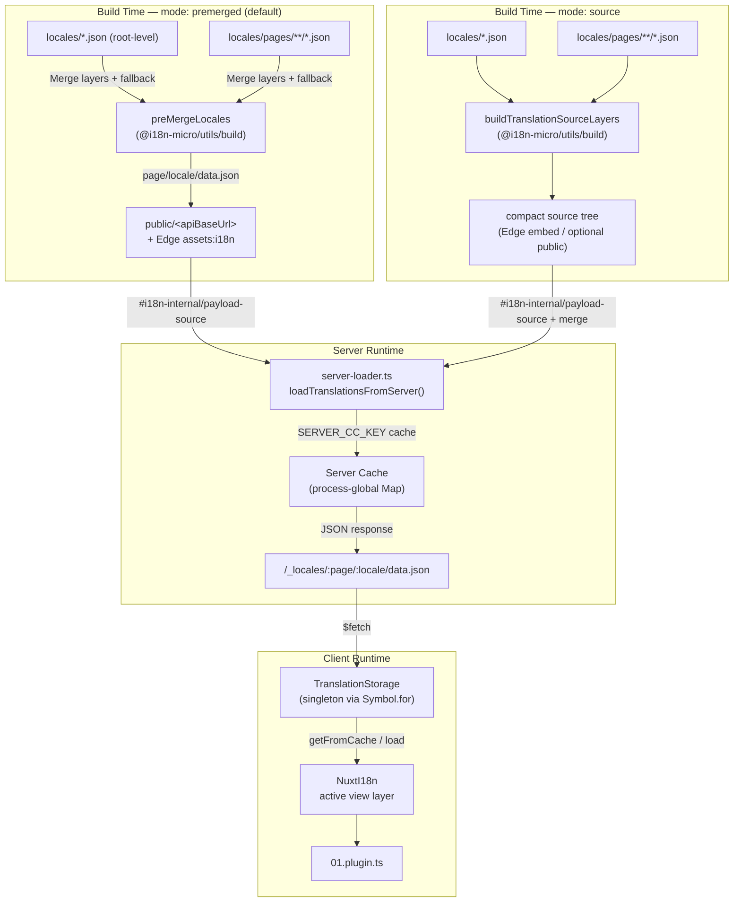

# 🗄️ Architektura cache a úložiště pro překlady

## 📖 Přehled

Nuxt I18n Micro v3 používá pro překlady vícevrstvou architekturu cache. Načítání payloadu závisí na `translationPayloads.mode`:

- **`premerged`** (výchozí): kořenové, stránkové, fallback a layer soubory jsou sloučeny v době buildu pomocí `@i18n-micro/utils/build` do `\{page\}/\{locale\}/data.json`
- **`source`**: kompaktní zdrojové soubory jsou uchovávány pro runtime merge přes `@i18n-micro/utils/source-loader` a `@i18n-micro/utils/merge-source` (Edge je vkládá do Nitro `serverAssets`; Node je při zkopírování čte z `public/`)

Tato stránka popisuje, jak funguje vestavěná cache a jak ji rozšířit pro vlastní scénáře (administrátorské nástroje, externí API, invalidace cache).

## 📊 Přehled architektury

### Tok dat



## 🧱 Základní komponenty

### 1. `TranslationStorage` (klient + server)

**Soubor**: `src/runtime/utils/storage.ts`

Singleton třída, která poskytuje jednotné úložiště překladů pro klient i server. Používá `Symbol.for('__NUXT_I18N_STORAGE_CACHE__')` na `globalThis`, aby existovala jen jedna instance, i když se načte více bundlů.

**Klíčové metody:**

| Metoda                              | Popis                                                            |
| ----------------------------------- | ---------------------------------------------------------------- |
| `getFromCache(locale, routeName?)`  | Synchronní kontrola: vrátí cachovaná data v paměti, nebo `null`  |
| `load(locale, routeName?, options)` | Async načtení s cachováním: nejdřív kontrola cache, pak `$fetch` |
| `clear()`                           | Vymaže celou cache                                               |

**Formát klíče cache**: `\{locale\}:\{routeName\}` (například `en:index`, `fr:about`)

```typescript
import { translationStorage } from '../utils/storage'

// Synchronous cache check
const cached = translationStorage.getFromCache('en', 'index')

// Async load (with automatic caching)
const result = await translationStorage.load('en', 'index', {
  apiBaseUrl: '_locales',
  baseURL: '/',
  dateBuild: '2024-01-01',
})
// result.data — merged translations
// result.cacheKey — cache key used
```

### ⚙️ Deterministické busting cache (`i18n.dateBuild`)

Ve výchozím stavu tento modul generuje `dateBuild` v době buildu pomocí `Date.now()`. Ta se pak vkládá do generovaného `#build/i18n.strategy.mjs` a používá jako query parametr (`?v=...`) pro invalidaci cache při načítání překladů po rebuildu.

Pokud potřebujete reprodukovatelné buildy (například pro zvýšení míry zásahů v cache chunků při rolling deploymentu), nastavte v `nuxt.config` stabilní hodnotu:

```ts
export default defineNuxtConfig({
  i18n: {
    // Any stable string/number (git SHA, CI build number, release tag, etc.)
    dateBuild: process.env.GIT_SHA ?? 'local-dev',
  },
})
```

### 2. `loadTranslationsFromServer()` (pouze server)

**Soubor**: `src/runtime/server/utils/server-loader.ts`

Načítá překlady pro locale/stránku a cachuje sloučený výsledek v procesně-globální mapě `CacheControl` klíčované pomocí `@i18n-micro/hmr/cache-keys` (`SERVER_CC_KEY`).

Chování: SSR načítá z `#i18n-internal/payload-source`. **Node** volá `readFile` pod `public/<apiBaseUrl>` (`\{page\}/\{locale\}/data.json` v režimu premerged), **Edge** používá `assets:i18n`. `premerged` čte jeden soubor; `source` slučuje root/page/fallback pomocí `@i18n-micro/utils/source-loader`.

```typescript
import { loadTranslationsFromServer } from '../server/utils/server-loader'

// Returns { data: Translations, json: string }
const { data, json } = await loadTranslationsFromServer('en', 'index')
```

### 3. Načítání na klientu (bez vkládání do HTML)

Slovníky se **nezapisují** do `nuxtApp.payload`. Server je drží v paměti pro SSR render; klientský plugin `await`uje na `switchContext`, který načte `/\{apiBaseUrl\}/:page/:locale/data.json` (stejné výchozí chování jako `@nuxtjs/i18n` s `experimental.preload: false`).

`NuxtI18n` drží aktivní slovník view-layer používaný funkcemi `$t()` a `$has()`. `NuxtTranslationLoader` přepíná kontext locale/route a slučuje chunky do této vrstvy.

### 4. Serverová API route

**Route**: `/_locales/\{page\}/\{locale\}/data.json`

**Soubor**: `src/runtime/server/routes/i18n.ts`

Tato Nitro route slouží sloučené překlady pro aktivní payload režim. Volá `loadTranslationsFromServer()` a vrací výsledek jako JSON.

V produkci navíc nastavuje:

```http
Cache-Control: public, max-age={httpCacheDuration}, immutable
```

Výchozí `httpCacheDuration` je `31536000` (1 rok). To je bezpečné, protože klienti požadují payloady s busting cache `?v=\{dateBuild\}`. Nastavením `httpCacheDuration: 0` hlavičku vynecháte. Ve vývoji se hlavička neaplikuje.

## 📥 Rozšíření: vlastní načítání překladů

### Čtení z cache (serverová route)

```ts
// server/api/i18n/load-cache.[post].ts
import { defineEventHandler, readBody } from 'h3'
import { loadTranslationsFromServer } from '#imports'

export default defineEventHandler(async (event) => {
  const { page, locale } = await readBody<{ page: string; locale: string }>(event)
  const { data } = await loadTranslationsFromServer(locale, page)
  return { locale, page, data }
})
```

### Aktualizace překladů (soubor + invalidace cache)

```ts
// server/api/i18n/update.[post].ts
import { defineEventHandler, readBody, createError } from 'h3'
import { join } from 'node:path'
import { readFile, writeFile } from 'node:fs/promises'
import { deepMergeTranslations } from '@i18n-micro/utils/deep-merge'

export default defineEventHandler(async (event) => {
  const { path, updates } = await readBody<{ path: string; updates: Record<string, unknown> }>(event)

  if (!path || !updates) {
    throw createError({ statusCode: 400, statusMessage: 'Missing path or updates' })
  }

  const fullPath = join('locales', path)
  let existing: Record<string, unknown> = {}

  try {
    const content = await readFile(fullPath, 'utf-8')
    existing = JSON.parse(content) as Record<string, unknown>
  } catch {
    // File does not exist — create new
  }

  const merged = deepMergeTranslations(existing, updates)
  await writeFile(fullPath, JSON.stringify(merged, null, 2), 'utf-8')

  return { success: true, path, updated: merged }
})
```


## 🧹 Vymazání cache

### Programové vymazání cache (klient)

Použijte vestavěnou metodu `$clearCache`:

```vue
<script setup>
const { $clearCache } = useNuxtApp()

// Clears both TranslationStorage and plugin-level cache
$clearCache()
</script>
```

### Chování cache na serveru

Cache na straně serveru (`loadTranslationsFromServer`) je procesně-globální a přetrvává, dokud:

- se serverový proces nerestartuje
- není detekováno nové nasazení (jiná hodnota `dateBuild`)

V bezserverových prostředích má každý studený start čerstvou cache.

## ⚙️ Konfigurace pro serverless

V bezserverových prostředích (Cloudflare Workers, AWS Lambda) používá vestavěná cache in-memory objekty `Map`. Pro samotnou cache překladů není nutná žádná konfigurace externího úložiště.

Konfigurace však může být potřeba pro Nitro storage se zdrojovými soubory překladů:

```ts
export default defineNuxtConfig({
  nitro: {
    storage: {
      // Only needed if default file-system storage is unavailable
      'assets:server': {
        driver: 'cloudflare-kv-binding',
        binding: 'MY_KV_NAMESPACE',
      },
    },
  },
})
```

## 💡 Klíčové rozdíly oproti v2

| Aspekt           | v2                            | v3                                                                       |
| ---------------- | ----------------------------- | ------------------------------------------------------------------------ |
| Klientská cache  | `useStorage('cache')`         | Singleton `TranslationStorage` (Symbol.for na globalThis)                |
| SSR přenos       | Runtime config                | Plné chunky přes `payload.data` (v3.0 používala `useState`)              |
| Serverová cache  | Nitro cache storage           | Procesně-globální `Map` přes `Symbol.for`                                |
| Merge logika     | Na klientu                    | V době buildu (`premerged`) nebo za běhu (`source`) přes `@i18n-micro/utils/*` |
| Formát klíče cache | `i18n:merged:\{page\}:\{locale\}` | `\{locale\}:\{routeName\}`                                                   |

## 📚 Související

- [Průvodce výkonem](/guides/performance): Jak cache ovlivňuje výkon
- [Překlady na straně serveru](/guides/server-side-translations): Použití překladů v serverových routách
- [Nasazení na Firebase](/guides/firebase): Aspekty cache specifické pro nasazení
