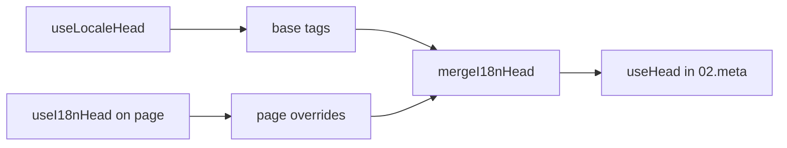

# Composable `useI18nHead`

`useI18nHead` vám umožňuje přizpůsobit i18n SEO tagy **pro každou stránku** bez vlastního meta pluginu. Když je `meta: true`, modul sloučí váš vstup nad výstup [`useLocaleHead`](/api/composables/use-locale-head).

Typické případy:

- **CMS / blog články**: přeložené jsou jen některé locale; alternativní URL se pro každý jazyk liší (jiné slugy nebo cesty).
- **Dynamický canonical**: canonical URL musí odpovídat URL článku z API, nikoli `$switchLocalePath`.
- **Další Open Graph tagy**: `og:title`, `og:description`, `og:image` vedle automaticky generovaných `og:locale` / `og:url`.
- **Částečné řízení**: ponechte modulem generované canonical a `og:url`, ale nahraďte pouze `hreflang` a `og:locale:alternate`.

---

## Signatura

{/* generated:symbol:useI18nHead — do not edit; run `pnpm run docs:generate` */}

```ts
useI18nHead(input?: MaybeRefOrGetter<I18nHeadInput | null>): { pageHead: any; resetPageHead: () => void }
```

Registruje přepisy i18n SEO head tagů na úrovni stránky. Slučuje se nad výstup `useLocaleHead` pluginem `02.meta`.

| Parametr | Typ | Popis |
| --- | --- | --- |
| `input` *(volitelný)* | `MaybeRefOrGetter<I18nHeadInput \| null>` |  |

{/* /generated:symbol:useI18nHead */}

## Jak zapadá do pipeline



Volání `useI18nHead` provádíte v komponentě stránky. Plugin `02.meta` aplikuje přepisy po každém `updateMeta()` (změna routy, `$setI18nRouteParams`, `page:finish` na klientu).

---

## Příklad 1: článek s překlady jen v některých locale

Běžný vzor: API vrací, které locale existují, a jejich absolutní nebo relativní URL.

```ts
interface Article {
  title: string
  slug: string
  /** Locale code → page URL (absolute or site-relative) */
  locales: Record<string, string>
}
```

```vue
<script setup lang="ts">
const route = useRoute()
const { data: article } = await useFetch<Article>(`/api/articles/${route.params.slug}`)

const localeCodes = computed(() => Object.keys(article.value?.locales ?? {}))

useI18nHead(() => {
  if (!article.value) return null

  return {
    meta: [
      { property: 'og:title', content: article.value.title },
      { property: 'og:type', content: 'article' },
    ],
    replace: {
      hreflang: localeCodes.value.map((locale) => ({
        rel: 'alternate',
        hreflang: locale,
        href: article.value!.locales[locale]!,
      })),
      ogAlternates: localeCodes.value,
    },
  }
})
</script>
```

`ogAlternates` bere **kódy locale** z vaší konfigurace `i18n.locales`. Hodnoty pro `og:locale:alternate` se rozhodují přes `locale.og` nebo `iso` (Open Graph formát `en_US`).

---

## Příklad 2: článek s per-locale slugy (`$defineI18nRoute` + `$setI18nRouteParams`)

Když se URL sestavují z lokalizovaných šablon rout a dynamických parametrů:

```vue
<script setup lang="ts">
const { $defineI18nRoute, $setI18nRouteParams } = useNuxtApp()
const route = useRoute()

const { data: article } = await useFetch(`/api/articles/${route.params.slug}`)

$defineI18nRoute({
  localeRoutes: {
    en: '/blog/[slug]',
    de: '/de/blog/[slug]',
    fr: '/fr/blog/[slug]',
  },
})

if (article.value) {
  $setI18nRouteParams({
    en: { slug: article.value.slugEn },
    de: { slug: article.value.slugDe },
    fr: { slug: article.value.slugFr },
  })

  const availableLocales = article.value.availableLocales as string[]

  useI18nHead({
    meta: [{ property: 'og:title', content: article.value.title }],
    replace: {
      hreflang: availableLocales.map((locale) => ({
        rel: 'alternate',
        hreflang: locale,
        href: article.value!.urls[locale],
      })),
      ogAlternates: availableLocales,
    },
  })
}
</script>
```

Alternativy generované modulem by uváděly **všechny** nakonfigurované locale. `replace.hreflang` omezuje tagy jen na locale, které skutečně mají překlad.

---

## Příklad 3: vlastní `x-default` pro URL článku ve výchozím locale

Ve výchozím stavu `x-default` směřuje na URL výchozího locale z `$switchLocalePath`. U článků nechte směřovat na URL výchozího překladu:

```vue
<script setup lang="ts">
const { $defaultLocale } = useNuxtApp()
const article = await loadArticle()

const defaultLocale = $defaultLocale() ?? 'en'
const defaultHref = article.locales[defaultLocale]

useI18nHead({
  replace: {
    hreflang: Object.entries(article.locales).map(([locale, href]) => ({
      rel: 'alternate',
      hreflang: locale,
      href,
    })),
    xDefault: defaultHref ? { rel: 'alternate', hreflang: 'x-default', href: defaultHref } : false,
    ogAlternates: Object.keys(article.locales),
  },
})
</script>
```

---

## Příklad 4: nahrazení canonical a `og:url` z API dat

Když musí canonical odpovídat URL poskytnuté CMS (multi-doména, vlastní cesta nebo předem sestavená absolutní URL):

```vue
<script setup lang="ts">
const article = await loadArticle()
const canonical = article.canonicalUrl // e.g. https://www.example.com/en/blog/my-post

useI18nHead({
  replace: {
    canonical,
    ogUrl: canonical,
    hreflang: buildAlternateLinks(article),
    ogAlternates: Object.keys(article.locales),
  },
  meta: [
    { property: 'og:title', content: article.title },
    { name: 'description', content: article.excerpt },
  ],
})
</script>
```

---

## Příklad 5: ponechání automatického canonical / `og:url`, nahrazení pouze alternativ

Pokud `$switchLocalePath` + `$setI18nRouteParams` již generují správný canonical a `og:url`, nahraďte pouze discovery tagy:

```vue
<script setup lang="ts">
const article = await loadArticle()

useI18nHead({
  replace: {
    hreflang: buildAlternateLinks(article),
    ogAlternates: Object.keys(article.locales),
  },
})
</script>
```

---

## Příklad 6: kompletní head pro detailní stránku obsahu (meta + odkazy)

Vzor podobný rozdělení „meta stránky“ a „alternativních odkazů“ do samostatných pomocníků, ale sloučený do jednoho volání:

```vue
<script setup lang="ts">
const article = await loadArticle()
const alternates = Object.entries(article.locales).map(([locale, href]) => ({
  rel: 'alternate' as const,
  hreflang: locale,
  href: normalizeSeoUrl(href), // strip ?query and #hash if needed
}))

useI18nHead({
  meta: [
    { property: 'og:title', content: article.title },
    { property: 'og:description', content: article.description },
    { property: 'og:image', content: article.imageUrl },
    { name: 'twitter:card', content: 'summary_large_image' },
    { name: 'twitter:title', content: article.title },
  ],
  replace: {
    canonical: article.canonicalUrl,
    ogUrl: article.canonicalUrl,
    hreflang: alternates,
    ogAlternates: Object.keys(article.locales),
  },
})
</script>
```

```ts
/** Remove query and hash — useful when CMS URLs must be clean for SEO */
function normalizeSeoUrl(href: string): string {
  try {
    const url = new URL(href, 'https://placeholder.local')
    url.search = ''
    url.hash = ''
    return href.startsWith('http') ? url.href : `${url.pathname}`
  } catch {
    return href.split(/[?#]/)[0] ?? href
  }
}
```

---

## Příklad 7: dva typy obsahu, stejný vzor (news vs. guides)

Stejný tvar API, jiné názvy rout. Znovupoužijte malý pomocník:

```ts
// composables/useArticleHead.ts
import type { I18nHeadInput } from '@i18n-micro/types'

interface LocalizedContent {
  title: string
  locales: Record<string, string>
  canonicalUrl?: string
}

export function buildArticleHead(content: LocalizedContent): I18nHeadInput {
  const localeCodes = Object.keys(content.locales)
  const canonical = content.canonicalUrl ?? content.locales.en

  return {
    meta: [{ property: 'og:title', content: content.title }],
    replace: {
      canonical,
      ogUrl: canonical,
      hreflang: localeCodes.map((locale) => ({
        rel: 'alternate',
        hreflang: locale,
        href: content.locales[locale]!,
      })),
      ogAlternates: localeCodes,
    },
  }
}
```

```vue
<!-- pages/blog/[slug].vue -->
<script setup lang="ts">
const article = await loadArticle()
useI18nHead(buildArticleHead(article))
</script>
```

```vue
<!-- pages/guides/[slug].vue -->
<script setup lang="ts">
const guide = await loadGuide()
useI18nHead(buildArticleHead(guide))
</script>
```

---

## Příklad 8: vypnutí vestavěných alternativ a vlastní seznam

Ekvivalent vypnutí generátoru hreflang v modulu a předání vlastního seznamu (žádné duplicitní sady alternativ):

```vue
<script setup lang="ts">
const article = await loadArticle()

useI18nHead({
  disable: ['hreflang', 'x-default', 'og-alternates'],
  link: Object.entries(article.locales).map(([locale, href]) => ({
    rel: 'alternate',
    hreflang: locale,
    href,
  })),
  replace: {
    ogAlternates: Object.keys(article.locales),
  },
})
</script>
```

Nebo raději použijte `replace.hreflang` bez `disable`. Ten nahradí všechny odkazy `rel="alternate"` v jednom kroku.

---

## Příklad 9: landing page, jen extra OG, zachovat všechny i18n tagy

```vue
<script setup lang="ts">
const { t } = useI18n()

useI18nHead({
  meta: [
    { property: 'og:title', content: t('landing.ogTitle') },
    { property: 'og:description', content: t('landing.ogDescription') },
  ],
})
</script>
```

---

## Příklad 10: produktová stránka, vypnutí hreflang pro experiment s jedním locale

```vue
<script setup lang="ts">
useI18nHead({
  disable: ['hreflang', 'x-default'],
  // canonical, og:locale, og:url still generated
})
</script>
```

---

## Příklad 11: reaktivní aktualizace po klientském fetch

```vue
<script setup lang="ts">
const article = ref<Article | null>(null)

onMounted(async () => {
  article.value = await $fetch('/api/articles/latest')
})

useI18nHead(() => {
  if (!article.value) return null
  return {
    meta: [{ property: 'og:title', content: article.value.title }],
    replace: {
      hreflang: Object.entries(article.value.locales).map(([locale, href]) => ({
        rel: 'alternate',
        hreflang: locale,
        href,
      })),
    },
  }
})
</script>
```

Head se obnovuje při `page:finish` a když se změní stav `pageHead`.

---

## Příklad 12: HTTPS origin za reverzní proxy

Pokud jste dříve pro canonical / alternate absolutní URL řešili composable pro „veřejný origin“, použijte místo něj konfiguraci modulu:

```ts
// nuxt.config.ts
export default defineNuxtConfig({
  i18n: {
    meta: true,
    // undefined = origin from current request (multi-domain friendly)
    metaBaseUrl: undefined,
    metaTrustForwardedHost: true,
    metaTrustForwardedProto: true,
  },
})
```

Pak předávejte v `replace.hreflang` / `replace.canonical` **cesty nebo plné URL**. Modul na SSR používá `useRequestURL` s `X-Forwarded-Host` / `X-Forwarded-Proto`.

---

## Reference API

### `meta`

Extra tagy `<meta>`. Deduplikované podle `id`, `property` nebo `name`.

### `link`

Extra tagy `<link>`. Deduplikované podle `id` nebo `rel` + `hreflang`.

### `htmlAttrs`

Slučuje se do atributů `<html>` z `useLocaleHead` (`lang`, `dir`).

### `replace`

| Klíč           | Typ                       | Efekt                                          |
| -------------- | ------------------------- | ---------------------------------------------- |
| `canonical`    | `string \| false`         | Nahradí nebo odstraní canonical odkaz          |
| `hreflang`     | `I18nHeadLink[] \| false` | Nahradí nebo odstraní všechny `rel="alternate"` odkazy |
| `xDefault`     | `I18nHeadLink \| false`   | Nahradí nebo odstraní `hreflang="x-default"`   |
| `ogLocale`     | `string \| false`         | Nahradí nebo odstraní `og:locale`              |
| `ogUrl`        | `string \| false`         | Nahradí nebo odstraní `og:url`                 |
| `ogAlternates` | `string[] \| false`       | Přestaví `og:locale:alternate` pro kódy locale |

### `disable`

| Hodnota         | Odstraní                                 |
| --------------- | ---------------------------------------- |
| `hreflang`      | Alternativní odkazy locale (ne `x-default`) |
| `x-default`     | Odkaz `hreflang="x-default"`             |
| `canonical`     | Canonical odkaz                          |
| `og`            | `og:locale` a `og:url`                   |
| `og-alternates` | Tagy `og:locale:alternate`               |
| `html`          | `lang` / `dir` na `<html>`               |

---

## `useLocaleHead` vs `useI18nHead`

| Composable      | Rozsah               | Kdy použít                                 |
| --------------- | -------------------- | ------------------------------------------ |
| `useLocaleHead` | Globální / ruční head | `meta: false`, plně vlastní nastavení `useHead` |
| `useI18nHead`   | Přepisy per stránka  | `meta: true`, přizpůsobení konkrétních stránek |

Když je `meta: true`, na stránkách, které používají jen `useI18nHead`, **není** potřeba `useLocaleHead`.

---

## Migrace z vlastního i18n head pluginu

Mnoho projektů udržuje vlastní plugin, který:

- slučuje alternativní odkazy specifické pro stránku ze sdíleného state;
- filtruje duplicitní regionální `hreflang` položky;
- normalizuje hodnoty `og:locale`;
- odstraňuje query řetězce z SEO URL.

To můžete nahradit voláním `useI18nHead` na každé obsahové stránce a výchozími hodnotami modulu.

| Předchozí přístup                                     | S `useI18nHead`                                      |
| ----------------------------------------------------- | ---------------------------------------------------- |
| Sdílený state + „které locale existují pro tento článek“ | `replace: \{ ogAlternates: localeCodes \}`             |
| Samostatný pomocník pro sestavení `rel="alternate"` odkazů | `replace: \{ hreflang: links \}`                       |
| Vlastní plugin slučující stav stránky do head         | Vestavěné slučování v `02.meta`                      |
| Vlastní „veřejný origin“ pro absolutní URL            | `metaBaseUrl` + forwarded hlavičky (viz Příklad 12)  |
| Krátký `og:locale` (`en` místo `en_US`)               | Nastavte `locale.og` nebo použijte `iso` → `en_US` (OG protokol) |

**`hreflang` z `iso`:** každý locale emituje jednu alternativu s `hreflang = iso || code`. Routovací `code` se nikdy nepoužívá, pokud je nastaveno `iso` (vyhýbá se nevalidním tagům jako `hreflang="mx"`). Zapněte fallback holého jazyka (`es-ES` → také `es`) přes `hreflangBaseLanguage: true`. Odvozeno z `iso`, nikoli z `code`. Pro plně vlastní seznamy použijte `replace.hreflang`.

**JSON-LD:** `useI18nHead` negeneruje strukturovaná data. Zachovejte `useHead(\{ script: [...] \})` nebo vyhrazený JSON-LD pomocník vedle něj.

---

## Viz také

- [Průvodce SEO](/guides/seo): automatické generování meta tagů a přepisy na úrovni stránky
- [`useLocaleHead`](/api/composables/use-locale-head): nízkoúrovňové head API
