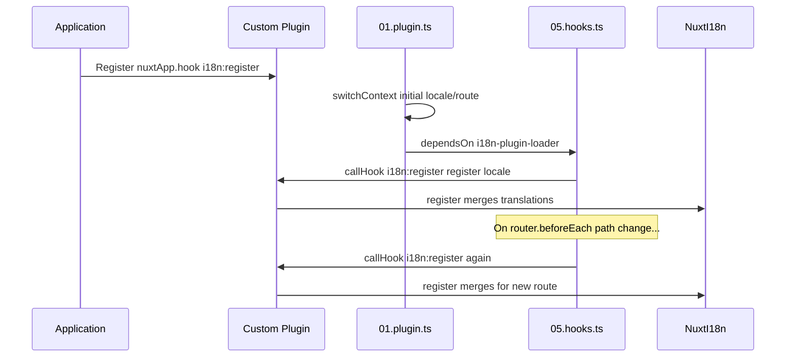

# 📢 Události

## 🔄 `i18n:register`

Událost `i18n:register` v `Nuxt I18n Micro` umožňuje dynamické přidávání překladů do i18n kontextu vaší aplikace. Díky ní zůstává proces internacionalizace bezproblémový a flexibilní. Tato událost vám umožňuje integrovat nové překlady podle potřeby a rozšiřovat lokalizační možnosti vaší aplikace.

### 📝 Detaily události

- **Účel**:
  - Umožňuje dynamické začlenění dalších překladů do existující sady pro konkrétní locale.

- **Payload**:
  - **`register`**:
    - Funkce poskytnutá událostí, která přijímá dva argumenty:
      - **`translations`** (`Translations`):
        - Objekt obsahující páry klíč-hodnota reprezentující překlady, uspořádaný podle rozhraní `Translations`.
      - **`locale`** (`string`, volitelný):
        - Kód locale (např. `'en'`, `'ru'`), pro který se překlady registrují. Pokud není zadán, použije se locale poskytnutý událostí.

- **Chování**:
  - Při spuštění funkce `register` sloučí nové překlady do aktuálního kontextu pro zadaný locale a aktualizuje dostupné překlady napříč aplikací.

### ⏱️ Kdy se spouští

Hooks plugin modulu (`05.hooks.ts`, `dependsOn: ['i18n-plugin-loader']`) volá `nuxtApp.callHook('i18n:register', …)`:

1. **Jednou při startu**: po tom, co hlavní i18n plugin (`01.plugin.ts`) načetl překlady pro počáteční routu
2. **Při navigaci**: v `router.beforeEach` při změně cesty, případně při každé navigaci, pokud je `strategy: 'no_prefix'`

Svůj posluchač zaregistrujte v běžném Nuxt pluginu pomocí `nuxtApp.hook('i18n:register', …)`. Hooks plugin běží až po připravení loaderu, takže se vaše callback funkce vyvolá, když je potřeba překlady rozšířit.

Nastavením `hooks: false` v `nuxt.config` vypnete automatická volání `i18n:register` (viz [Konfigurace: `hooks`](/guides/configuration#hooks)).

### 💡 Příklad použití

Následující příklad ukazuje, jak pomocí události `i18n:register` dynamicky přidávat překlady:

```typescript
nuxt.hook('i18n:register', async (register: (translations: unknown, locale?: string) => void, locale: string) => {
  register(
    {
      greeting: 'Hello',
      farewell: 'Goodbye',
    },
    locale,
  )
})
```

### 🛠️ Vysvětlení



- **Spuštění události**:
  - Hooks plugin (`05.hooks.ts`) spustí `i18n:register` po tom, co je hlavní loader připravený, a při relevantních navigacích.

- **Přidání překladů**:
  - Příklad registruje anglické překlady pro `"greeting"` a `"farewell"`.
  - Funkce `register` sloučí tyto překlady do existující sady pro zadaný locale.

### 🔗 Klíčové výhody

- **Dynamické aktualizace**:
  - Snadno aktualizujte nebo přidávejte překlady bez nutnosti nasazovat celou aplikaci znovu.

- **Flexibilita lokalizace**:
  - Podporuje úpravy lokalizace v reálném čase podle potřeb uživatele nebo aplikace.

Použitím události `i18n:register` zajistíte, že lokalizační strategie vaší aplikace zůstane flexibilní a přizpůsobitelná, což zlepší celkovou uživatelskou zkušenost.

---

## 🛠️ Úprava překladů pomocí pluginů

Pro dynamickou úpravu překladů v Nuxt aplikaci se doporučují pluginy. Pluginy nabízejí strukturovaný způsob, jak zpracovávat aktualizace lokalizace, zejména při práci s moduly nebo externími soubory překladů.

### **Registrace pluginu**

Pokud používáte modul, zaregistrujte plugin, ve kterém dochází k úpravám překladů, přidáním do konfigurace modulu:

```javascript
addPlugin({
  src: resolve('./plugins/extend_locales'),
})
```

Tím se zaregistruje plugin umístěný v `./plugins/extend_locales`, který bude zajišťovat dynamické načítání a registraci překladů.

### **Implementace pluginu**

V pluginu můžete spravovat úpravy locale. Zde je ukázka implementace v Nuxt pluginu:

```typescript
import { defineNuxtPlugin } from '#app'

export default defineNuxtPlugin(async (nuxtApp) => {
  // Function to load translations from JSON files and register them
  const loadTranslations = async (lang: string) => {
    try {
      const translations = await import(`../locales/${lang}.json`)
      return translations.default
    } catch (error) {
      console.error(`Error loading translations for language: ${lang}`, error)
      return null
    }
  }

  // Hook into the 'i18n:register' event to dynamically add translations
  // eslint-disable-next-line @typescript-eslint/ban-ts-comment
  // @ts-expect-error
  nuxtApp.hook('i18n:register', async (register: (translations: unknown, locale?: string) => void, locale: string) => {
    const translations = await loadTranslations(locale)
    if (translations) {
      register(translations, locale)
    }
  })
})
```

### 📝 Podrobné vysvětlení

1. **Načítání překladů**:

- Funkce `loadTranslations` dynamicky importuje soubory překladů podle locale. Očekává se, že soubory jsou v adresáři `locales` a pojmenované podle kódů locale (např. `en.json`, `de.json`).
- Při úspěšném načtení se překlady vrátí; v opačném případě se zaloguje chyba.

2. **Registrace překladů**:

- Plugin se pomocí `nuxtApp.hook` napojí na událost `i18n:register`.
- Při spuštění události se funkce `register` zavolá s načtenými překlady a odpovídajícím locale.
- Tím se nové překlady sloučí do i18n kontextu pro zadaný locale a aktualizují se dostupné překlady v celé aplikaci.

### 🔗 Výhody použití pluginů pro úpravu překladů

- **Oddělení odpovědností**:
  - Zapouzdřete lokalizační logiku odděleně od hlavního kódu aplikace, což usnadňuje správu i údržbu.

- **Dynamické a škálovatelné řešení**:
  - Dynamickým načítáním a registrací překladů můžete aktualizovat obsah bez nutnosti kompletního nasazení aplikace, což je užitečné zejména pro aplikace s často aktualizovaným nebo vícejazyčným obsahem.

- **Rozšířená flexibilita lokalizace**:
  - Pluginy vám umožňují upravovat nebo rozšiřovat překlady podle potřeby a poskytují tak adaptabilnější a citlivější lokalizační strategii, která splňuje preference uživatelů nebo obchodní požadavky.

Přijetím tohoto přístupu můžete efektivně rozšiřovat a upravovat lokalizaci vaší aplikace strukturovaným a udržovatelným způsobem s využitím pluginů. Internacionalizace tak zůstává adaptivní vůči měnícím se potřebám a zlepšuje celkovou uživatelskou zkušenost.
