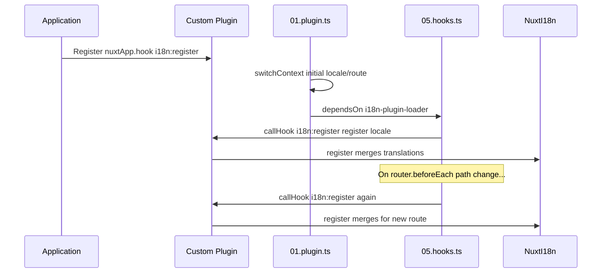

# 📢 Události

## 🔄 `i18n:register`

Událost `i18n:register` v `Nuxt I18n Micro` umožňuje dynamické přidávání překladů do i18n kontextu aplikace, díky čemuž je proces internacionalizace bezproblémový a flexibilní. Tato událost umožňuje integrovat nové překlady podle potřeby a rozšiřovat lokalizační schopnosti vaší aplikace.

### 📝 Detaily události

- **Účel**:
  - Umožňuje dynamické začlenění dalších překladů do existující sady pro konkrétní locale.

- **Payload**:
  - **`register`**:
    - Funkce poskytovaná událostí, která přijímá dva argumenty:
      - **`translations`** (`Translations`):
        - Objekt obsahující dvojice klíč–hodnota reprezentující překlady, organizovaný podle rozhraní `Translations`.
      - **`locale`** (`string`, volitelné):
        - Kód locale (např. `'en'`, `'ru'`), pro který jsou překlady registrovány. Pokud není specifikován, výchozí je locale poskytnutý událostí.

- **Chování**:
  - Při spuštění funkce `register` sloučí nové překlady do aktuálního kontextu pro daný locale a aktualizuje dostupné překlady v celé aplikaci.

### ⏱️ Kdy se spouští

Hooks plugin modulu (`05.hooks.ts`, `dependsOn: ['i18n-plugin-loader']`) volá `nuxtApp.callHook('i18n:register', …)`:

1. **Jednou při startu** — poté, co hlavní i18n plugin (`01.plugin.ts`) načte překlady pro počáteční routu
2. **Při navigaci** — v `router.beforeEach` když se změní cesta, nebo při každé navigaci pokud `strategy: 'no_prefix'`

Zaregistrujte svůj posluchač v běžném Nuxt pluginu pomocí `nuxtApp.hook('i18n:register', …)`. Hooks plugin se spouští poté, co je loader připraven, takže se váš callback vyvolá, když je potřeba překlady rozšířit.

Nastavením `hooks: false` v `nuxt.config` zakážete automatická volání `i18n:register` (viz [Konfigurace — `hooks`](/guides/configuration#hooks)).

### 💡 Příklad použití

Následující příklad ukazuje, jak použít událost `i18n:register` pro dynamické přidání překladů:

```typescript
nuxt.hook('i18n:register', async (register: (translations: unknown, locale?: string) => void, locale: string) => {
  register(
    {
      greeting: 'Hello',
      farewell: 'Goodbye',
    },
    locale,
  )
})
```

### 🛠️ Vysvětlení



- **Spuštění události**:
  - Hooks plugin (`05.hooks.ts`) spouští `i18n:register` poté, co je hlavní loader připraven, a při relevantních navigacích.

- **Přidání překladů**:
  - Příklad registruje anglické překlady pro `"greeting"` a `"farewell"`.
  - Funkce `register` sloučí tyto překlady do existující sady pro daný locale.

### 🔗 Klíčové výhody

- **Dynamické aktualizace**:
  - Snadno aktualizujte nebo přidávejte překlady, aniž byste museli znovu nasazovat celou aplikaci.

- **Flexibilita lokalizace**:
  - Podporuje úpravy lokalizace v reálném čase na základě uživatelských nebo aplikačních potřeb.

Pomocí události `i18n:register` můžete zajistit, aby lokalizační strategie vaší aplikace zůstala flexibilní a adaptivní, což zlepšuje celkový uživatelský komfort.

---

## 🛠️ Úprava překladů pomocí pluginů

Pro dynamickou úpravu překladů ve vaší Nuxt aplikaci se doporučuje používat pluginy. Pluginy poskytují strukturovaný způsob, jak zpracovávat aktualizace lokalizace, zejména při práci s moduly nebo externími překladovými soubory.

### **Registrace pluginu**

Pokud používáte modul, zaregistrujte plugin, kde budou probíhat úpravy překladů, přidáním do konfigurace modulu:

```javascript
addPlugin({
  src: resolve('./plugins/extend_locales'),
})
```

Toto zaregistruje plugin nacházející se v `./plugins/extend_locales`, který bude zajišťovat dynamické načítání a registraci překladů.

### **Implementace pluginu**

V pluginu můžete spravovat úpravy locale. Zde je příklad implementace v Nuxt pluginu:

```typescript
import { defineNuxtPlugin } from '#app'

export default defineNuxtPlugin(async (nuxtApp) => {
  // Function to load translations from JSON files and register them
  const loadTranslations = async (lang: string) => {
    try {
      const translations = await import(`../locales/${lang}.json`)
      return translations.default
    } catch (error) {
      console.error(`Error loading translations for language: ${lang}`, error)
      return null
    }
  }

  // Hook into the 'i18n:register' event to dynamically add translations
  // eslint-disable-next-line @typescript-eslint/ban-ts-comment
  // @ts-expect-error
  nuxtApp.hook('i18n:register', async (register: (translations: unknown, locale?: string) => void, locale: string) => {
    const translations = await loadTranslations(locale)
    if (translations) {
      register(translations, locale)
    }
  })
})
```

### 📝 Podrobné vysvětlení

1. **Načítání překladů**:

- Funkce `loadTranslations` dynamicky importuje překladové soubory na základě locale. Očekává se, že soubory jsou v adresáři `locales` a pojmenovány podle kódů locale (např. `en.json`, `de.json`).
- Při úspěšném načtení jsou překlady vráceny; jinak je zalogována chyba.

2. **Registrace překladů**:

- Plugin se zavěsí na událost `i18n:register` pomocí `nuxtApp.hook`.
- Při spuštění události je zavolána funkce `register` s načtenými překlady a odpovídajícím locale.
- Toto sloučí nové překlady do i18n kontextu pro daný locale a aktualizuje dostupné překlady v celé aplikaci.

### 🔗 Výhody použití pluginů pro úpravy překladů

- **Oddělení odpovědností**:
  - Zapouzdřete lokalizační logiku odděleně od hlavního kódu aplikace, což usnadňuje správu a údržbu.

- **Dynamické a škálovatelné**:
  - Dynamickým načítáním a registrací překladů můžete aktualizovat obsah, aniž by bylo nutné znovu nasazovat celou aplikaci, což je obzvláště užitečné pro aplikace s často aktualizovaným nebo vícejazyčným obsahem.

- **Vylepšená flexibilita lokalizace**:
  - Pluginy vám umožňují upravovat nebo rozšiřovat překlady podle potřeby a poskytují adaptabilnější a citlivější lokalizační strategii, která splňuje uživatelské preference nebo obchodní požadavky.

Přijetím tohoto přístupu můžete efektivně rozšiřovat a upravovat lokalizaci vaší aplikace prostřednictvím strukturovaného a udržovatelného procesu pomocí pluginů, čímž zajistíte, že internacionalizace zůstane adaptivní na měnící se potřeby a zlepší celkový uživatelský komfort.
