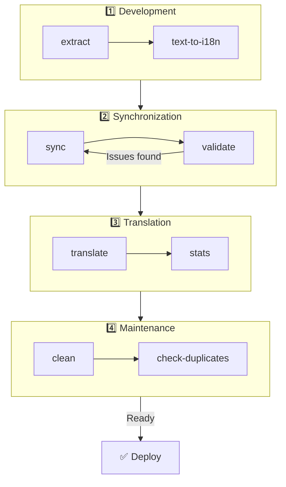

# 🌐 Průvodce nuxt-i18n-micro-cli

## 📖 Úvod

`nuxt-i18n-micro-cli` je nástroj příkazové řádky navržený pro zjednodušení procesu lokalizace a internacionalizace v Nuxt.js projektech používajících modul `nuxt-i18n-micro` (Nuxt I18n Micro). Poskytuje nástroje pro extrakci klíčů překladů z vaší codebase, správu souborů překladů, synchronizaci překladů napříč locale a automatizaci procesu překladu pomocí externích překladových služeb.

Tento průvodce vás provede instalací, konfigurací a použitím `nuxt-i18n-micro-cli` pro efektivní správu překladů v projektu. Balíček na [npmjs.com](https://www.npmjs.com/package/nuxt-i18n-micro-cli).

## 🔧 Instalace a nastavení

### 📦 Instalace nuxt-i18n-micro-cli

Nainstalujte globálně nebo jako dev závislost do Nuxt projektu (doporučeno pro CI):

```bash
# global
npm install -g nuxt-i18n-micro-cli

# or per project
pnpm add -D nuxt-i18n-micro-cli
pnpm exec i18n-micro text-to-i18n --dryRun
```

Použijte **`nuxt-i18n-micro-cli` ≥ 2.1.1**, pokud váš projekt používá adresář `app/` z Nuxt 4 (`app/pages`, `app/components`, …). Starší verze CLI skenovaly pouze `pages/` v kořeni projektu.

### 🛠 Inicializace v projektu

Po instalaci můžete spouštět příkazy `i18n-micro` v adresáři svého Nuxt.js projektu.

Ujistěte se, že váš projekt používá `nuxt-i18n-micro` a má potřebnou konfiguraci v `nuxt.config.ts` (nebo `nuxt.config.js`).

### 📄 Běžné argumenty

- `--cwd`: Zadejte aktuální pracovní adresář (výchozí `.`).
- `--logLevel`: Nastavte úroveň logu (`silent`, `info`, `verbose`).
- `--translationDir`: Adresář obsahující JSON soubory překladů (výchozí: `locales`).

## 📊 Přehled workflow CLI



### Kroky workflow

| Fáze            | Příkazy                     | Účel                              |
| --------------- | --------------------------- | --------------------------------- |
| **Vývoj**       | `extract`, `text-to-i18n`   | Najít a extrahovat klíče překladů |
| **Sync**        | `sync`, `validate`          | Zajistit, aby všechna locale měla stejné klíče |
| **Překlad**     | `translate`, `stats`        | Automaticky přeložit chybějící klíče |
| **Údržba**      | `clean`, `check-duplicates` | Udržet překlady uklizené         |

## 📋 Příkazy

### 🔄 Příkaz `text-to-i18n`

CLI balíček: [`nuxt-i18n-micro-cli`](https://www.npmjs.com/package/nuxt-i18n-micro-cli)

**Popis**: Skenuje soubory Vue/TS/JS pro hardcoded uživatelsky viditelné řetězce, nahradí je `$t('...')` a sloučí nové klíče do JSON souboru překladů. Spouštějte z **kořene Nuxt projektu** (kde je `nuxt.config`).

**Použití**:

```bash
i18n-micro text-to-i18n [options]
```

**Volby**:

| Volba                   | Výchozí           | Popis                                                                 |
| ----------------------- | ----------------- | --------------------------------------------------------------------- |
| `--translationFile`     | `locales/en.json` | JSON soubor pro nové klíče (relativně ke kořeni projektu).            |
| `--path`                | —                 | Zpracovat jen jeden soubor nebo adresář (např. `app/pages/about.vue`). |
| `--context`             | —                 | Prefix klíče (např. `auth` → `auth.*`).                              |
| `--dryRun`              | `false`           | Náhled bez zapisování souborů.                                        |
| `--verbose`             | `false`           | Rozšířené logování.                                                   |
| `--interactive`         | `false`           | Potvrdit nebo upravit každý klíč před aplikací.                       |
| `--extractOnlyDirs`     | `plugins`         | Adresáře, kde se klíče extrahují, ale zdrojové soubory se **nepřepisují**. |
| `--extractOnlyPatterns` | —                 | Glob-like extract-only vzory (např. `**/*.plugin.ts`).                |

**Příklad**:

```bash
i18n-micro text-to-i18n --translationFile locales/en.json --context auth --dryRun
```

#### Které složky se skenují?

<Info>
Od CLI **v2.1.1** skenuje `text-to-i18n` klasické kořenové složky i ekvivalenty `app/*`. Příkaz spouštějte z **kořene projektu**, nedělejte `cd app`.
</Info>

Sbírá `*.vue`, `*.js` a `*.ts` pod:

| Nuxt 3 (kořen projektu) | Nuxt 4 (adresář `app/`) |
| ----------------------- | ----------------------- |
| `pages/`                | `app/pages/`            |
| `components/`           | `app/components/`       |
| `plugins/`              | `app/plugins/`          |
| `layouts/`              | `app/layouts/`          |

Ostatní složky (`server/`, `composables/`, `middleware/` a další) se přeskakují, pokud nepoužijete `--path`. Pro Nuxt 4 spouštějte z kořene projektu (bez potřeby `cd app`). Pokud není `i18n.translationDir` `locales/`, srovnejte ho v `--translationFile`.

```bash
i18n-micro text-to-i18n --path app/pages
```

#### Jak to funguje

1. Sbírá soubory z výše uvedených adresářů (nebo z `--path`).
2. Nahrazuje literály / template text pomocí `$t('generated.key')` (`plugins/` je ve výchozím stavu extract-only).
3. Slučuje nové klíče do `--translationFile` bez odstraňování existujících položek.

**Ukázka transformací**:

Před:

```vue
<template>
  <div>
    <h1>Welcome to our site</h1>
    <p>Please sign in to continue</p>
  </div>
</template>
```

Po:

```vue
<template>
  <div>
    <h1>{{ $t('pages.home.welcome_to_our_site') }}</h1>
    <p>{{ $t('pages.home.please_sign_in') }}</p>
  </div>
</template>
```

**Osvědčené postupy**: nejprve dry run; před plným během udělejte commit; srovnejte `--translationFile` s `i18n.translationDir` v `nuxt.config`; ponechte `--extractOnlyDirs plugins` pro bootstrap kód.

**Omezení**: samostatný npm balíček (není součástí modulu); nečte `nuxt.config` automaticky; vydává `$t(...)`; složité dynamické řetězce mohou místo toho potřebovat `extract` / `search`.

### 📊 Příkaz `stats`

**Popis**: Příkaz `stats` slouží k zobrazení statistik překladů pro každý locale ve vašem Nuxt.js projektu. Pomáhá pochopit pokrok vašich překladů zobrazením, kolik klíčů je přeloženo v porovnání s celkovým počtem dostupných klíčů.

**Použití**:

```bash
i18n-micro stats [options]
```

**Volby**:

- `--full`: Zobrazí pouze kombinované statistiky překladů (výchozí: `false`).

**Příklad**:

```bash
i18n-micro stats --full
```

### 🌍 Příkaz `translate`

**Popis**: Příkaz `translate` automaticky překládá chybějící klíče pomocí externích překladových služeb. Tento příkaz zjednodušuje proces překladu využitím API služeb jako Google Translate, DeepL a dalších pro doplnění chybějících překladů.

**Použití**:

```bash
i18n-micro translate [options]
```

**Volby**:

- `--service`: Překladová služba k použití (například `google`, `deepl`, `yandex`). Pokud není zadáno, příkaz vás vyzve k výběru.
- `--token`: API klíč odpovídající zvolené překladové službě. Pokud není poskytnut, budete vyzváni k zadání.
- `--options`: Další volby pro překladovou službu jako páry key:value oddělené čárkami (například `model:gpt-3.5-turbo,max_tokens:1000`).
- `--replace`: Přeložit všechny klíče a nahradit existující překlady (výchozí: `false`).

**Příklad**:

```bash
i18n-micro translate --service deepl --token YOUR_DEEPL_API_KEY
```

#### 🌐 Podporované překladové služby

Příkaz `translate` podporuje více překladových služeb. Některé z podporovaných služeb:

- **Google Translate** (`google`)
- **DeepL** (`deepl`)
- **Yandex Translate** (`yandex`)
- **OpenAI** (`openai`)
- **Azure Translator** (`azure`)
- **IBM Watson** (`ibm`)
- **Baidu Translate** (`baidu`)
- **LibreTranslate** (`libretranslate`)
- **MyMemory** (`mymemory`)
- **Lingva Translate** (`lingvatranslate`)
- **Papago** (`papago`)
- **Tencent Translate** (`tencent`)
- **Systran Translate** (`systran`)
- **Yandex Cloud Translate** (`yandexcloud`)
- **ModernMT** (`modernmt`)
- **Lilt** (`lilt`)
- **Unbabel** (`unbabel`)
- **Reverso Translate** (`reverso`)

#### ⚙️ Konfigurace služby

Některé služby vyžadují specifické konfigurace nebo API klíče. Při použití příkazu `translate` můžete zadat službu a poskytnout vyžadovaný `--token` (API klíč) a další `--options`, pokud jsou potřeba.

Například:

```bash
i18n-micro translate --service openai --token YOUR_OPENAI_API_KEY --options openaiModel:gpt-3.5-turbo,max_tokens:1000
```

### 🛠️ Příkaz `extract`

**Popis**: Extrahuje klíče překladů z codebase a organizuje je podle scope.

**Použití**:

```bash
i18n-micro extract [options]
```

**Volby**:

- `--prod, -p`: Spustit v produkčním režimu.

**Příklad**:

```bash
i18n-micro extract
```

### 🔄 Příkaz `sync`

**Popis**: Synchronizuje soubory překladů napříč locale a zajišťuje, aby všechna locale měla stejné klíče.

**Použití**:

```bash
i18n-micro sync [options]
```

**Příklad**:

```bash
i18n-micro sync
```

### ✅ Příkaz `validate`

**Popis**: Validuje soubory překladů pro chybějící nebo přebývající klíče v porovnání s referenčním locale.

**Použití**:

```bash
i18n-micro validate [options]
```

**Příklad**:

```bash
i18n-micro validate
```

### 🧹 Příkaz `clean`

**Popis**: Odstraňuje nepoužívané klíče překladů ze souborů překladů.

**Použití**:

```bash
i18n-micro clean [options]
```

**Příklad**:

```bash
i18n-micro clean
```

### 📤 Příkaz `import`

**Popis**: Převádí PO soubory zpět do JSON formátu a ukládá je do adresáře překladů.

**Použití**:

```bash
i18n-micro import [options]
```

**Volby**:

- `--potsDir`: Adresář obsahující PO soubory (výchozí: `pots`).

**Příklad**:

```bash
i18n-micro import --potsDir pots
```

### 📥 Příkaz `export`

**Popis**: Exportuje překlady do PO souborů pro externí správu překladů.

**Použití**:

```bash
i18n-micro export [options]
```

**Volby**:

- `--potsDir`: Adresář pro uložení PO souborů (výchozí: `pots`).

**Příklad**:

```bash
i18n-micro export --potsDir pots
```

### 🗂️ Příkaz `export-csv`

**Popis**: Příkaz `export-csv` exportuje klíče a hodnoty překladů z JSON souborů včetně jejich cest souborů do CSV formátu. Tento příkaz je užitečný pro týmy, které raději pracují s daty překladů v tabulkovém softwaru.

**Použití**:

```bash
i18n-micro export-csv [options]
```

**Volby**:

- `--csvDir`: Adresář, kam se uloží exportované CSV soubory.
- `--delimiter`: Zadejte oddělovač pro CSV soubor (výchozí: `,`).

**Příklad**:

```bash
i18n-micro export-csv --csvDir csv_files
```

### 📑 Příkaz `import-csv`

**Popis**: Příkaz `import-csv` importuje data překladů z CSV souborů a aktualizuje odpovídající JSON soubory. Hodí se pro aplikaci hromadných aktualizací překladů z tabulek.

**Použití**:

```bash
i18n-micro import-csv [options]
```

**Volby**:

- `--csvDir`: Adresář obsahující CSV soubory k importu.
- `--delimiter`: Zadejte oddělovač použitý v CSV souboru (výchozí: `,`).

**Příklad**:

```bash
i18n-micro import-csv --csvDir csv_files
```

### 🧾 Příkaz `diff`

**Popis**: Porovnává soubory překladů mezi výchozím locale a ostatními locale ve stejném adresáři (včetně podadresářů). Příkaz identifikuje chybějící klíče a jejich hodnoty ve výchozím locale v porovnání s ostatními locale a usnadňuje sledování pokroku překladů nebo nesrovnalostí.

**Použití**:

```bash
i18n-micro diff [options]
```

**Příklad**:

```bash
i18n-micro diff
```

### 🔍 Příkaz `check-duplicates`

**Popis**: Příkaz `check-duplicates` kontroluje duplicitní hodnoty překladů uvnitř každého locale napříč všemi soubory překladů, včetně kořenových i stránkově specifických. Zajišťuje, aby různé klíče v rámci stejného jazyka nesdílely identické hodnoty překladů, a pomáhá udržet přehlednost a konzistenci vašich překladů.

**Použití**:

```bash
i18n-micro check-duplicates [options]
```

**Příklad**:

```bash
i18n-micro check-duplicates
```

**Jak to funguje**:

- Příkaz kontroluje kořenové i stránkově specifické soubory překladů pro každý locale.
- Pokud se hodnota překladu objeví na více místech (buď v kořenových překladech, nebo napříč různými stránkami), nahlásí duplicitní hodnoty spolu se souborem a klíčem, kde jsou nalezeny.
- Pokud nejsou nalezeny žádné duplikáty, příkaz potvrdí, že je locale bez duplicitních hodnot překladů.

Tento příkaz pomáhá zajistit, aby klíče překladů udržovaly unikátní hodnoty a předcházely náhodnému opakování v rámci stejného locale.

### 🔄 Příkaz `replace-values`

**Popis**: Příkaz `replace-values` umožňuje hromadné nahrazování hodnot překladů napříč všemi locale. Podporuje jak jednoduché textové nahrazení, tak pokročilá nahrazení pomocí regulárních výrazů (regex). Můžete také použít capturing groups v regex vzorech a odkazovat je v náhradním řetězci, což je ideální pro složitější scénáře nahrazení.

**Použití**:

```bash
i18n-micro replace-values [options]
```

**Volby**:

- `--search`: Text nebo regex vzor, který se má v překladech hledat. Povinná volba.
- `--replace`: Náhradní text, který se použije pro nalezené překlady. Povinná volba.
- `--useRegex`: Zapnout vyhledávání pomocí regulárního výrazu (výchozí: `false`).

**Příklad 1**: Jednoduché nahrazení

Nahradit řetězec „Hello“ za „Hi“ napříč všemi locale:

```bash
i18n-micro replace-values --search "Hello" --replace "Hi"
```

**Příklad 2**: Regex nahrazení

Zapnout regex vyhledávání a nahradit jakýkoli řetězec začínající „Hello“ následovaný čísly (například „Hello123“) za „Hi“ napříč všemi locale:

```bash
i18n-micro replace-values --search "Hello\\d+" --replace "Hi" --useRegex
```

**Příklad 3**: Použití regex capturing groups

Použijte capturing groups pro dynamické vložení části matchnutého řetězce do náhrady. Například nahraďte „Hello [name]“ za „Hi [name]“ při zachování jména:

```bash
i18n-micro replace-values --search "Hello (\\w+)" --replace "Hi $1" --useRegex
```

V tomto případě `$1` odkazuje na první capturing group, která matchuje část `[name]` po „Hello“. Náhrada zachová jméno z původního řetězce.

**Jak to funguje**:

- Příkaz skenuje všechny soubory překladů (globální i stránkově specifické).
- Když je nalezena shoda na základě search řetězce nebo regex vzoru, nahradí matchnutý text poskytnutou náhradou.
- Při použití regexu lze v náhradním řetězci použít capturing groups odkazem přes `$1`, `$2` a další.
- Všechny změny se logují, ukazují cestu souboru, klíč překladu a stav before/after hodnoty překladu.

**Logování**:
Pro každé nahrazení příkaz loguje detaily včetně:

- Locale a cesty souboru
- Klíče překladu, který se upravuje
- Staré hodnoty a nové hodnoty po nahrazení
- Pokud používáte regex s capturing groups, logy ukážou shody skupin a jak byly nahrazeny

To vám umožňuje přesně sledovat, kde a co bylo během operace nahrazení změněno, a poskytuje jasnou historii úprav napříč vašimi soubory překladů.

## 🛠 Příklady

- **Extrahování překladů**:

  ```bash
  i18n-micro extract
  ```

- **Překlad chybějících klíčů pomocí Google Translate**:

  ```bash
  i18n-micro translate --service google --token YOUR_GOOGLE_API_KEY
  ```

- **Překlad všech klíčů s nahrazením existujících**:

  ```bash
  i18n-micro translate --service deepl --token YOUR_DEEPL_API_KEY --replace
  ```

- **Validace souborů překladů**:

  ```bash
  i18n-micro validate
  ```

- **Vyčištění nepoužívaných klíčů překladů**:

  ```bash
  i18n-micro clean
  ```

- **Synchronizace souborů překladů**:

  ```bash
  i18n-micro sync
  ```

## ⚙️ Průvodce konfigurací

`nuxt-i18n-micro-cli` se spoléhá na vaši i18n konfiguraci v `nuxt.config.ts` (nebo `nuxt.config.js`). Ujistěte se, že máte modul `nuxt-i18n-micro` nainstalovaný a nakonfigurovaný.

### 🔑 Ukázka nuxt.config.js

```ts
export default defineNuxtConfig({
  modules: ['nuxt-i18n-micro'],
  i18n: {
    locales: [
      { code: 'en', iso: 'en-US' },
      { code: 'fr', iso: 'fr-FR' },
    ],
    defaultLocale: 'en',
    fallbackLocale: 'en',
    translationDir: 'locales', // or 'app/locales' for Nuxt 4 colocation
  },
})
```

Ujistěte se, že `translationDir` odpovídá adresáři použitému `nuxt-i18n-micro-cli` (výchozí je `locales`).

## 📝 Osvědčené postupy

### 🔑 Konzistentní pojmenování klíčů

Zajistěte, aby klíče překladů byly konzistentní a popisné, aby se předešlo zmatku a duplikaci.

### 🧹 Pravidelná údržba

Pravidelně používejte příkaz `clean` k odstranění nepoužívaných klíčů překladů a k udržování čistoty souborů překladů.

### 🛠 Automatizace překladového workflow

Integrujte příkazy `nuxt-i18n-micro-cli` do svého vývojového workflow nebo CI/CD pipeline pro automatizaci extrakce, překladu, validace a synchronizace souborů překladů.

### 🛡️ Bezpečné API klíče

Při použití překladových služeb vyžadujících API klíče zajistěte, aby vaše klíče zůstaly bezpečné a nebyly commitovány do verzovacích systémů. Zvažte použití proměnných prostředí nebo bezpečných řešení pro správu klíčů.

## 📞 Podpora a přispění

Pokud narazíte na problémy nebo máte návrhy na zlepšení, neváhejte přispět k projektu nebo otevřít issue v jeho repozitáři.

---

Postupem podle tohoto průvodce budete schopni efektivně spravovat překlady ve vašem Nuxt.js projektu pomocí `nuxt-i18n-micro-cli`, zefektivnit internacionalizační úsilí a zajistit hladký zážitek pro uživatele v různých locale.
