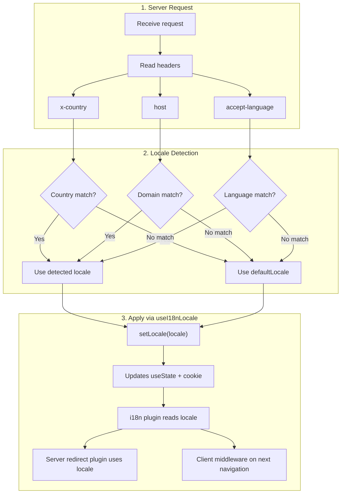

# 🔧 Vlastní detekce jazyka v Nuxt I18n Micro

## 📖 Přehled

Nuxt I18n Micro v3 poskytuje centralizovaný composable, `useI18nLocale()`, pro veškerou správu locale. Ten nahrazuje manuální vzory `useState`/`useCookie` z v2. Použitím `useI18nLocale().setLocale()` v serverovém pluginu můžete implementovat libovolnou vlastní detekční logiku a zachovat plnou kompatibilitu s přesměrovacím a cookie systémem modulu.

## 🏗️ Architektura

```mermaid
flowchart TB
    subgraph Plugins["Plugin Execution Order"]
        A["Your plugin<br/>order: -10"] -->|setLocale()| B["01.plugin.ts<br/>order: -5"]
        B --> C["06.redirect.ts server<br/>order: 10"]
    end

    subgraph Client["Client SPA Navigation"]
        D["i18n-redirect.global.ts<br/>route middleware"]
    end

    subgraph State["Locale State"]
        E["useState('i18n-locale')"]
        F["localeCookie"]
    end

    A -->|"setLocale() updates both"| E
    A -->|"setLocale() updates both"| F
    B -->|reads| E
    C -->|reads| E
    C -->|reads| F
    D -->|reads target route +| E
```

**Klíčový princip**: Volejte `useI18nLocale().setLocale()` v serverovém pluginu s `order: -10`. Ten aktualizuje současně `useState('i18n-locale')` a locale cookie, takže i18n plugin (`order: -5`) a serverový redirect plugin (`order: 10`) vidí správný locale při prvním SSR requestu. Klientská auto-přesměrování běží v globálním route middleware při následujících navigacích.

## 🛠️ Vypnutí vestavěné auto-detekce

Pokud chcete plnou kontrolu nad detekcí locale, vypněte vestavěný mechanismus:

```ts
export default defineNuxtConfig({
  i18n: {
    autoDetectLanguage: false,
  },
})
```

## ✨ Příklad: Serverová detekce s `useI18nLocale`

Toto je **doporučený přístup** pro všechny strategie.

### Krok 1: Nakonfigurujte `nuxt.config.ts`

```ts
export default defineNuxtConfig({
  modules: ['nuxt-i18n-micro'],
  i18n: {
    strategy: 'no_prefix', // Works with ANY strategy
    defaultLocale: 'en',
    localeCookie: 'user-locale',
    autoDetectLanguage: false,
    locales: [
      { code: 'en', iso: 'en-US' },
      { code: 'de', iso: 'de-DE' },
      { code: 'ja', iso: 'ja-JP' },
    ],
  },
})
```

### Krok 2: Vytvořte `plugins/i18n-loader.server.ts`

```ts
import { defineNuxtPlugin, useRequestHeaders } from '#imports'

export default defineNuxtPlugin({
  name: 'i18n-custom-loader',
  enforce: 'pre',
  order: -10, // Execute BEFORE the i18n plugin (which has order -5)

  setup() {
    const { setLocale } = useI18nLocale()
    const headers = useRequestHeaders(['host', 'x-country', 'accept-language'])
    let detectedLocale = 'en'

    // --- YOUR DETECTION LOGIC ---

    // Example 1: By domain
    const host = headers['host']
    if (host?.includes('example.de')) {
      detectedLocale = 'de'
    }
    // Example 2: By custom header
    else if (headers['x-country'] === 'JP') {
      detectedLocale = 'ja'
    }
    // Example 3: By Accept-Language header
    else if (headers['accept-language']?.includes('de')) {
      detectedLocale = 'de'
    }

    // --- APPLY THE LOCALE ---
    setLocale(detectedLocale)
  },
})
```

### Jak to funguje



1. **Plugin běží první** (`order: -10`): detekuje locale z hlaviček, domény nebo jiných zdrojů
2. **`setLocale()` aktualizuje současně** `useState('i18n-locale')` a cookie. Tím zajišťuje okamžitou viditelnost pro všechny následující pluginy
3. **i18n plugin** (`order: -5`) čte locale a načte správné překlady
4. **Serverový redirect plugin** (`order: 10`) používá locale pro rozhodnutí o přesměrování na SSR
5. **Klientský route middleware** (`i18n-redirect`) aplikuje přesměrování při SPA navigaci, když locale v URL neodpovídá preferenci

## 🌐 Chování podle strategie

`useI18nLocale().setLocale()` funguje se **všemi strategiemi**. Chování přesměrování závisí na strategii:

<Tip>
| Strategie | Efekt `setLocale('de')` |
|----------|---------------------------|
| `no_prefix` | Vykreslí v němčině, žádná změna URL |
| `prefix` | 302 → `/de/` (serverové přesměrování) |
| `prefix_except_default` | 302 → `/de/` pokud `de` ≠ výchozí; bez přesměrování pokud `de` = výchozí |
| `prefix_and_default` | Bez přesměrování (obě `/` i `/de/` jsou platné) |
</Tip>

**Důležité poznámky:**

- Detekce locale založená na cookie je ve výchozím stavu vypnutá (`localeCookie: null`)
- Nastavte `localeCookie: 'user-locale'` pro zapnutí perzistence přes cookie
- Pokud hodnota cookie/state není v seznamu `locales`, použije se fallback na `defaultLocale`

## 🏢 Pokročilé: Detekce založená na doméně

Pro multi-doménová nastavení, kde každá doména servíruje jiný locale:

```ts
import { defineNuxtPlugin, useRequestHeaders } from '#imports'

export default defineNuxtPlugin({
  name: 'i18n-domain-loader',
  enforce: 'pre',
  order: -10,

  setup() {
    const { setLocale } = useI18nLocale()
    const headers = useRequestHeaders(['host'])
    const host = headers['host'] || ''

    let detectedLocale = 'en'

    if (host.endsWith('.de') || host.includes('german.')) {
      detectedLocale = 'de'
    } else if (host.endsWith('.fr') || host.includes('french.')) {
      detectedLocale = 'fr'
    } else if (host.endsWith('.jp') || host.includes('japanese.')) {
      detectedLocale = 'ja'
    }

    setLocale(detectedLocale)
  },
})
```

## 🔄 Pokročilé: Respektování preference uživatele

Pokud mohou uživatelé manuálně přepínat jazyk, respektujte jejich volbu před auto-detekcí:

```ts
import { defineNuxtPlugin, useRequestHeaders } from '#imports'

export default defineNuxtPlugin({
  name: 'i18n-smart-loader',
  enforce: 'pre',
  order: -10,

  setup() {
    const { getLocale, setLocale } = useI18nLocale()

    // If user already has a preference (from cookie), respect it
    if (getLocale()) {
      return
    }

    // Otherwise, detect locale from headers
    const headers = useRequestHeaders(['accept-language'])
    let detectedLocale = 'en'

    const acceptLanguage = headers['accept-language'] || ''
    if (acceptLanguage.includes('de')) {
      detectedLocale = 'de'
    } else if (acceptLanguage.includes('ja')) {
      detectedLocale = 'ja'
    }

    setLocale(detectedLocale)
  },
})
```

## ⚙️ Server-only nebo client-only pluginy

Použijte [Nuxt konvence názvů souborů](https://nuxt.com/docs/getting-started/directory-structure#plugins) k řízení, kde váš plugin běží:

- **Pouze na serveru**: `i18n-loader.server.ts`: běží jen během SSR (doporučeno pro detekci založenou na hlavičkách)
- **Pouze na klientu**: `i18n-loader.client.ts`: běží jen v prohlížeči (pro `localStorage` nebo detekci založenou na DOM)


## ✅ Shrnutí

| Funkce                                 | Popis                                                             |
| -------------------------------------- | ----------------------------------------------------------------- |
| `useI18nLocale().setLocale()`          | Aktualizuje `useState` + cookie současně; funguje se všemi strategiemi |
| `useI18nLocale().getLocale()`          | Vrátí aktuální locale ze state nebo cookie                        |
| `useI18nLocale().getPreferredLocale()` | Vrátí preferovaný locale (ověřený proti seznamu `locales`)        |
| Plugin `order: -10`                    | Zajišťuje, že váš plugin běží před inicializací i18n              |
| `enforce: 'pre'`                       | Běží ve skupině pluginů „pre“                                     |

**NEDĚLEJTE:**

- Nepoužívejte `useCookie('user-locale')` přímo. `useI18nLocale()` spravuje cookies interně.
- Nepoužívejte `useState('i18n-locale')` přímo. Použijte místo toho `useI18nLocale().setLocale()`.
- Nenastavujte `order` >= -5. Váš plugin musí běžet před i18n pluginem.
