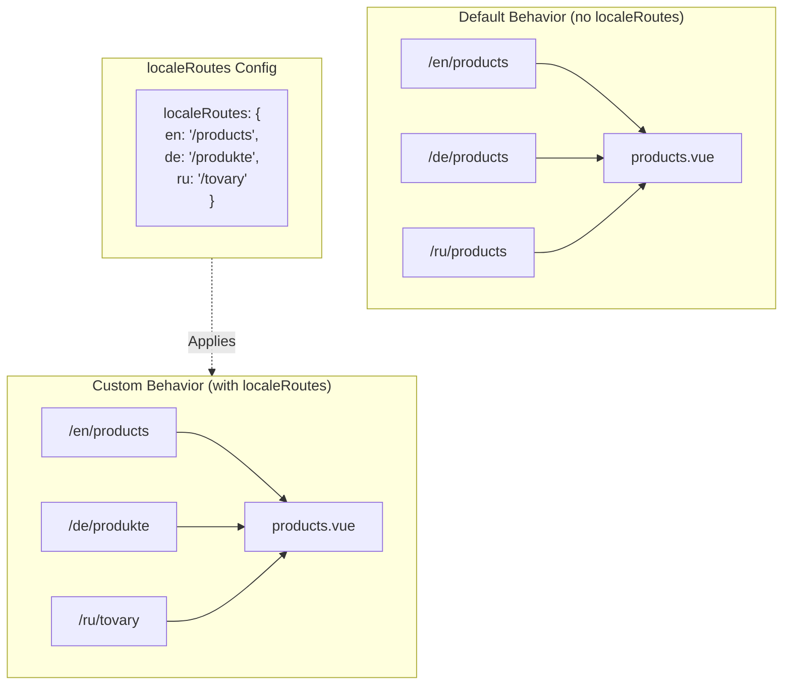

# 🔗 Vlastní lokalizované routy s `localeRoutes` v `Nuxt I18n Micro`

## 📖 Úvod do `localeRoutes`

Funkce `localeRoutes` v `Nuxt I18n Micro` vám umožňuje definovat vlastní routy pro konkrétní locale a nabízí flexibilitu a kontrolu nad routovací strukturou aplikace. Tato funkce je zvláště užitečná, když konkrétní locale vyžadují odlišné URL struktury, přizpůsobené cesty nebo musí následovat specifické regionální nebo jazykové konvence.

## 🚀 Primární případ použití `localeRoutes`

Primárním případem použití `localeRoutes` je poskytnout odlišné routy pro různá locale a zlepšit tak uživatelskou zkušenost tím, že URL jsou intuitivní a relevantní pro cílové publikum. Například můžete mít různé cesty pro anglickou a ruskou verzi stránky, kde ruský locale používá lokalizovaný URL formát.

### 📄 Příklad: Definice `localeRoutes` v `$defineI18nRoute`

Zde je příklad, jak byste mohli definovat vlastní routy pro konkrétní locale pomocí `localeRoutes` ve funkci `$defineI18nRoute`:

```typescript
import { useNuxtApp } from '#imports'

const { $defineI18nRoute } = useNuxtApp()

$defineI18nRoute({
  localeRoutes: {
    ru: '/localesubpage', // Custom route path for the Russian locale
    de: '/lokaleseite', // Custom route path for the German locale
  },
})
```

> [!IMPORTANT]
> `$defineI18nRoute` není globální funkce. V `script setup` ji nejprve získejte z `useNuxtApp()` a pak zavolejte.

### 🔄 Jak `localeRoutes` fungují



- **Výchozí chování**: Bez `localeRoutes` používají všechna locale běžnou routovací strukturu definovanou primární cestou.
- **Vlastní chování**: S `localeRoutes` mohou mít konkrétní locale vlastní routy, čímž přepisují výchozí cestu locale-specifickými routami definovanými v konfiguraci.

## 🌱 Případy použití `localeRoutes`

### 📄 Příklad: Použití `localeRoutes` ve stránce

Zde je jednoduchá Vue komponenta ukazující použití `$defineI18nRoute` s `localeRoutes`:

```vue
<template>
  <div>
    <!-- Display greeting message based on the current locale -->
    <p>{{ $t('greeting') }}</p>

    <!-- Navigation links -->
    <div>
      <NuxtLink :to="$localeRoute({ name: 'index' })"> Go to Index </NuxtLink>
      |
      <NuxtLink :to="$localeRoute({ name: 'about' })"> Go to About Page </NuxtLink>
    </div>
  </div>
</template>

<script setup>
import { useNuxtApp } from '#imports'

const { $getLocale, $switchLocale, $getLocales, $localeRoute, $t, $defineI18nRoute } = useNuxtApp()

// Define translations and custom routes for specific locales
$defineI18nRoute({
  localeRoutes: {
    ru: '/localesubpage', // Custom route path for Russian locale
  },
})
</script>
```

### 🛠️ Použití `localeRoutes` v různých kontextech

- **Landing stránky**: Používejte vlastní routy k lokalizaci URL pro landing stránky, aby odpovídaly marketingovým kampaním.
- **Dokumentační weby**: Poskytněte odlišné routy pro každý locale, aby lépe odpovídaly lokalizované struktuře obsahu.
- **E-commerce weby**: Přizpůsobte URL produktů nebo kategorií pro každý locale pro lepší SEO a uživatelskou zkušenost.

## Použití navigace s `localeRoutes`

Protože lokalizované routy neodpovídají přímo názvům souborů v adresáři pages, musíte na navigaci odkazovat spíše objektem než jménem.

```vue
<template>
  /**
   * Exemple page: /pages/about-us.vue
   * EN /about-us
   * ES /sobre-nosotros
   * FR /a-propos
   */

  // Using NuxtLink
  <NuxtLink :to="$localeRoute({ name: 'about-us' })">
    Go to About Page
  </NuxtLink>

  // Using I18nLink
  <I18nLink :to="{ name: 'about-us' }">
    Go to About Page
  </NuxtLink>

  // The string literal navigation wouldn't work for any locale but english
  <I18nLink to="/about-us">
    Go to About Page
  </NuxtLink>
</template>
```

### Pojmenování vnořených stránek

Ve výchozím stavu jsou vaše stránky pojmenované podle jména souboru a cesty. Znamená to:

- `/pages/about-us.vue` je dostupné přes `$localeRoute(\{ name: 'about-us' \})`
- `/pages/about-us/physical-stores.vue` je dostupné přes `$localeRoute(\{ name: 'about-us-physical-stores' \})`

Toto chování přepíšete explicitním pojmenováním stránky přes `definePageMeta`.

```vue
// /pages/about-us/physical-stores.vue
<script setup>
definePageMeta({
  name: 'our-stores'
})
```

Tato stránka nyní může být referencována přes `$localeRoute` nebo `I18nLink` podle svého jména `:to='\{ name: "our-stores" \}'`.

## 🎯 Dynamické routy se slugy a `$setI18nRouteParams`

Při práci s dynamickými routami obsahujícími slugy nebo parametry můžete použít `localeRoutes` s dynamickými segmenty a `$setI18nRouteParams` pro poskytnutí locale-specifických slugů pro každý locale.

### Parametry dynamické routy v `localeRoutes`

Dynamické routy můžete definovat pomocí syntaxe parametrů Nuxtu (`[...slug]` pro catch-all routy, `[param]` pro jednotlivé parametry nebo `:param()` pro pojmenované parametry):

```vue
<script setup lang="ts">
import { useNuxtApp, useRoute, useFetch, createError } from '#imports'

const { $defineI18nRoute, $setI18nRouteParams } = useNuxtApp()

// Define custom routes with dynamic segments
$defineI18nRoute({
  localeRoutes: {
    en: '/our-products/[...slug]',
    es: '/nuestros-productos/[...slug]',
  },
})
</script>
```

### Nastavení locale-specifických parametrů routy

Funkce `$setI18nRouteParams` vám umožňuje nastavit různé hodnoty parametrů (jako slugy) pro každý locale. To je zvláště užitečné, když má váš obsah locale-specifické URL.

**Důležité**: `$setI18nRouteParams` by se mělo volat po fetchování dat, která obsahují locale-specifické slugy, typicky uvnitř `useFetch` nebo `useAsyncData`.

```vue
<script setup lang="ts">
import { useNuxtApp, useRoute, useFetch, createError } from '#imports'

interface Product {
  title: string
  price: string
  urlEn: string // English slug
  urlEs: string // Spanish slug
}

const { $defineI18nRoute, $setI18nRouteParams } = useNuxtApp()

const route = useRoute()
const slug = Array.isArray(route.params.slug) ? route.params.slug[0] : route.params.slug

// Fetch product data that includes locale-specific slugs
const { data: product, error } = await useFetch<Product>(`/api/product/${slug}`)
if (error.value)
  throw createError({
    statusCode: error.value?.statusCode,
    statusMessage: error.value?.statusMessage,
    fatal: true,
  })

// Define custom routes with dynamic segments
$defineI18nRoute({
  localeRoutes: {
    en: '/our-products/[...slug]',
    es: '/nuestros-productos/[...slug]',
  },
})

// Set different slugs for different locales
if (product.value) {
  $setI18nRouteParams({
    en: { slug: product.value.urlEn },
    es: { slug: product.value.urlEs },
  })
}
</script>
```

### Kompletní příklad: Produktové stránky s locale-specifickými slugy

Zde je kompletní příklad ukazující použití `localeRoutes` a `$setI18nRouteParams` dohromady pro detailní stránku produktu:

```vue
<template>
  <div v-if="product">
    <h1>{{ product.title }}</h1>
    <p>{{ $t('price') }}: {{ product.price }}</p>
    <div class="locale-switcher">
      <a :href="$switchLocalePath('en')">English</a>
      <a :href="$switchLocalePath('es')">Español</a>
    </div>
  </div>
</template>

<script setup lang="ts">
import { useNuxtApp, useRoute, useFetch, createError } from '#imports'

interface Product {
  title: string
  price: string
  urlEn: string
  urlEs: string
}

const { $t, $defineI18nRoute, $setI18nRouteParams, $switchLocalePath } = useNuxtApp()

// Set page name for easier navigation
definePageMeta({ name: 'product-slug' })

const route = useRoute()
const slug = Array.isArray(route.params.slug) ? route.params.slug[0] : route.params.slug

// Fetch product data
const { data: product, error } = await useFetch<Product>(`/api/product/${slug}`)
if (error.value)
  throw createError({
    statusCode: error.value?.statusCode,
    statusMessage: error.value?.statusMessage,
    fatal: true,
  })

// Define locale-specific routes with dynamic segments
$defineI18nRoute({
  localeRoutes: {
    en: '/our-products/[...slug]',
    es: '/nuestros-productos/[...slug]',
  },
})

// Set locale-specific slugs so $switchLocalePath works correctly
if (product.value) {
  $setI18nRouteParams({
    en: { slug: product.value.urlEn },
    es: { slug: product.value.urlEs },
  })
}
</script>
```

### Příklad: Stránka se seznamem produktů

Při odkazování na dynamické routy ze stránky se seznamem použijte název route s parametry:

```vue
<template>
  <div>
    <h1>{{ $t('title') }}</h1>
    <ul>
      <li v-for="product in products?.[$getLocale()] || []" :key="product.id">
        <I18nLink :to="{ name: 'product-slug', params: { slug: product.url } }"> {{ product.title }} – {{ product.price }} </I18nLink>
      </li>
    </ul>
  </div>
</template>

<script setup lang="ts">
import { useNuxtApp, useFetch, createError } from '#imports'

interface Product {
  id: string
  title: string
  price: string
  url: string
}

type ProductsByLocale = Record<string, Product[]>

const { $t, $defineI18nRoute, $getLocale } = useNuxtApp()

const { data: products, error } = await useFetch<ProductsByLocale>('/api/product')
if (error.value)
  throw createError({
    statusCode: error.value?.statusCode,
    statusMessage: error.value?.statusMessage,
    fatal: true,
  })

$defineI18nRoute({
  locales: {
    en: {
      title: 'Our Product Range',
      description: 'Discover our collection of high-quality products.',
    },
    es: {
      title: 'Nuestra Gama de Productos',
      description: 'Descubra nuestra colección de productos de alta calidad.',
    },
  },
  localeRoutes: {
    en: '/our-products',
    es: '/nuestros-productos',
  },
})
</script>
```

### Jak to funguje

1. **Definice routy**: `localeRoutes` definuje strukturu základní cesty pro každý locale, včetně dynamických segmentů jako `[...slug]` nebo `[id]`.

2. **Nastavení parametrů**: `$setI18nRouteParams` nastavuje skutečné hodnoty parametrů pro každý locale. Když uživatel přepne locale pomocí `$switchLocalePath`, modul tyto parametry použije k sestavení správné URL.

3. **Formát parametrů**: Objekt parametrů by měl odpovídat struktuře:

   ```typescript
   {
     [localeCode]: {
       [paramName]: paramValue
     }
   }
   ```

4. **Navigace**: Použijte `I18nLink` nebo `$localeRoute` s názvem route a parametry pro navigaci mezi lokalizovanými verzemi dynamických rout.

### Důležité poznámky

- **Načasování**: `$setI18nRouteParams` by se mělo volat po fetchování dat obsahujících locale-specifické slugy, typicky uvnitř `useFetch` nebo `useAsyncData`.

- **Názvy parametrů**: Názvy parametrů v `$setI18nRouteParams` musí odpovídat názvům parametrů route (například `slug` pro `[...slug]` nebo `id` pro `[id]`).

- **Názvy rout**: Při použití `definePageMeta(\{ name: 'route-name' \})` použijte tento název při odkazování na routu přes `I18nLink` nebo `$localeRoute`.

- **Catch-all routy**: Pro catch-all routy (`[...slug]`) by měl být parametr slug pole nebo řetězec, který se převede na pole.

## 🧩 Programové routy (`pages:extend`) — #244

Routy vytvořené v `pages:extend` nemají místo pro `defineI18nRoute()` a několik rout často sdílí jeden wrapper SFC. File-keyed skenování je pak sloučí do jedné položky.

Nedávejte lokalizované cesty do `route.meta` (byly by dodány do klientské tabulky rout). Udržujte jeden registr a promítněte ho dvakrát:

1. do `pages:extend` (vytváří Nuxt routy)
2. do `i18n.globalLocaleRoutes` klíčováno podle **jména** route (nikoli cesty souboru)

Použijte `splitLocaleRoutes` z `@i18n-micro/utils/split-locale-routes`:

```typescript
import { splitLocaleRoutes } from '@i18n-micro/utils/split-locale-routes'

const dynamic = splitLocaleRoutes([
  {
    name: 'products_tag',
    path: '/products/:tag',
    file: '~/pages/_dynamic.vue',
    paths: { fr: '/produits/:tag', de: '/produkte/:tag' },
  },
  {
    name: 'products_category',
    path: '/products/category/:category',
    file: '~/pages/_dynamic.vue',
    paths: { fr: '/produits/categorie/:category' },
  },
  // Disable localization for a programmatic route:
  // { name: 'internal', path: '/internal', file: '~/pages/_dynamic.vue', paths: false },
])

export default defineNuxtConfig({
  hooks: {
    'pages:extend'(pages) {
      pages.push(...dynamic.pages)
    },
  },
  i18n: {
    globalLocaleRoutes: dynamic.globalLocaleRoutes,
  },
})
```

Obě poloviny zůstávají synchronizované; sdílené wrappery se navzájem nepřepisují. Samotné `globalLocaleRoutes` nestačí. Přizpůsobuje jen cesty pro routy, které už v tabulce Nuxt stránek existují.

## 📝 Osvědčené postupy pro použití `localeRoutes`

- **🚀 Používejte pro relevantní locale**: `localeRoutes` aplikujte především tam, kde URL struktura významně ovlivňuje uživatelskou zkušenost nebo SEO. Vyhněte se nadměrnému použití pro drobné rozdíly.
- **🔧 Udržujte konzistenci**: Udržujte konzistentní routovací vzor napříč locale, pokud pro odchylku neexistuje silný důvod. Tento přístup pomáhá udržet přehlednost a snižuje složitost.
- **📚 Dokumentujte vlastní routy**: Jasně dokumentujte jakékoli vlastní routy definované přes `localeRoutes`, obzvláště v modulárních aplikacích, aby členové týmu rozuměli routovací logice.
