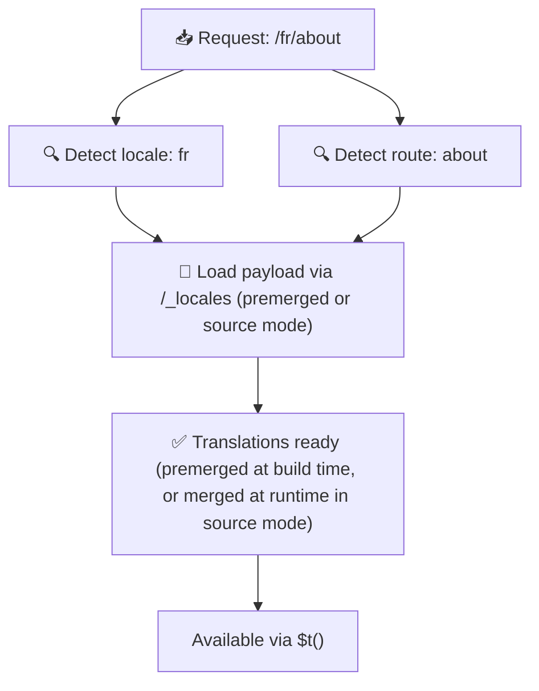

# 📂 Průvodce strukturou složek

## 📖 Úvod

Efektivní organizace souborů s překlady je zásadní pro udržení škálovatelného a výkonného systému internacionalizace (i18n). `Nuxt I18n Micro` tento proces zjednodušuje nabídkou jasného přístupu ke správě kořenových a stránkově specifických překladů. Tento průvodce vás provede doporučenou strukturou složek a vysvětlí, jak `Nuxt I18n Micro` tyto překlady zpracovává.

## 🗂️ Doporučená struktura složek

`Nuxt I18n Micro` organizuje překlady do kořenových souborů a stránkově specifických souborů v adresáři `pages`. S `translationPayloads.mode: 'premerged'` (výchozí) se kořenové překlady v době buildu automaticky slučují do každého souboru stránky, takže každá stránka má kompletní sadu překladů bez runtime režie slučování.

S `mode: 'source'` zůstávají zdrojové soubory v Nitro assets oddělené a slučují se za běhu přes routu `/_locales`. Viz [Serverless payload output](/guides/performance#serverless-payload-output).

### 🔧 Základní struktura

Zde je základní příklad struktury složek, kterou byste měli dodržovat:

```text
locales/
├── pages/
│   ├── index/
│   │   ├── en.json
│   │   ├── fr.json
│   │   └── ar.json
│   ├── about/
│   │   ├── en.json
│   │   ├── fr.json
│   │   └── ar.json
├── en.json
├── fr.json
└── ar.json

```

### 📄 Vysvětlení struktury

#### 1. 🌍 Kořenové soubory překladů

- **Cesta:** `/locales/\{locale\}.json` (například `/locales/en.json`)
- **Účel:** Tyto soubory obsahují překlady sdílené napříč celou aplikací (navigační menu, hlavičky, patičky atd.). S `mode: 'premerged'` (výchozí) se automaticky slučují do každého stránkově specifického souboru v době buildu, takže server vrací jeden předem sestavený soubor na stránku.

  **Ukázkový obsah (`/locales/en.json`):**

  ```json
  {
    "menu": {
      "home": "Home",
      "about": "About Us",
      "contact": "Contact"
    },
    "footer": {
      "copyright": "© 2024 Your Company"
    }
  }
  ```

#### 2. 📄 Stránkově specifické soubory překladů

- **Cesta:** `/locales/pages/\{routeName\}/\{locale\}.json` (například `/locales/pages/index/en.json`)
- **Účel:** Tyto soubory obsahují překlady specifické pro jednotlivé stránky. S `mode: 'premerged'` (výchozí) se kořenové překlady slučují jako základ v době buildu, takže každý soubor stránky je soběstačný.

  **Ukázkový obsah (`/locales/pages/index/en.json`):**

  ```json
  {
    "title": "Welcome to Our Website",
    "description": "We offer a wide range of products and services to meet your needs."
  }
  ```

  **Ukázkový obsah (`/locales/pages/about/en.json`):**

  ```json
  {
    "title": "About Us",
    "description": "Learn more about our mission, vision, and values."
  }
  ```

### 📂 Zpracování dynamických rout a vnořených cest

`Nuxt I18n Micro` automaticky transformuje dynamické segmenty a vnořené cesty v routách do ploché struktury složek pomocí specifické konvence přejmenování. Tím zajišťuje, že se všechny překlady ukládají konzistentně a jsou snadno dostupné.

#### Struktura složek pro dynamické routy

Při práci s dynamickými routami, například `/products/[id]`, modul převádí dynamický segment `[id]` do statického formátu ve struktuře souborů.

**Ukázková struktura složek pro dynamické routy:**

Pro routu jako `/products/[id]` by soubory s překlady byly uloženy ve složce pojmenované `products-id`:

```text
locales/pages/
├── products-id/
│   ├── en.json
│   ├── fr.json
│   └── ar.json

```

**Ukázková struktura složek pro vnořené dynamické routy:**

Pro vnořenou routu jako `/products/key/[id]` by soubory s překlady byly uloženy ve složce pojmenované `products-key-id`:

```text
locales/pages/
├── products-key-id/
│   ├── en.json
│   ├── fr.json
│   └── ar.json

```

**Ukázková struktura složek pro víceúrovňové vnořené routy:**

Pro složitější vnořenou routu jako `/products/category/[id]/details` by soubory s překlady byly uloženy ve složce pojmenované `products-category-id-details`:

```text
locales/pages/
├── products-category-id-details/
│   ├── en.json
│   ├── fr.json
│   └── ar.json

```

### 🛠 Přizpůsobení struktury adresářů

Pokud raději uchováváte překlady v jiném adresáři, `Nuxt I18n Micro` vám umožňuje přizpůsobit adresář, kde jsou soubory překladů uloženy. Můžete to nakonfigurovat v souboru `nuxt.config.ts`.

**Příklad: Přizpůsobení adresáře překladů**

```typescript
export default defineNuxtConfig({
  i18n: {
    translationDir: 'i18n', // Custom directory path
  },
})
```

To řekne `Nuxt I18n Micro`, aby hledal soubory s překlady v adresáři `/i18n` místo výchozího `/locales`.

## ⚙️ Jak se překlady načítají

### 🌍 Dynamické locale routy

`Nuxt I18n Micro` používá dynamické locale routy pro efektivní načítání překladů. Když uživatel navštíví stránku, modul určí odpovídající locale a načte příslušné soubory překladů podle aktuální routy a locale.



Například:

- Návštěva `/en/index` načte překlady z `/locales/pages/index/en.json`.
- Návštěva `/fr/about` načte překlady z `/locales/pages/about/fr.json`.

Tato metoda zajišťuje, že se načítají jen potřebné překlady, čímž optimalizuje jak zátěž serveru, tak výkon na klientu.

### 💾 Cachování a předrenderování

Pro další zvýšení výkonu podporuje `Nuxt I18n Micro` cachování a předrenderování souborů překladů:

- **Cachování**: Jakmile je soubor překladu načten, cachuje se pro následující požadavky a snižuje se potřeba opakovaně načítat stejná data.
- **Předrenderování**: Během procesu buildu můžete předrenderovat soubory překladů pro všechny nakonfigurované locale a routy, aby je bylo možné servírovat přímo ze serveru bez zpoždění za běhu.

## 📝 Osvědčené postupy

### 📂 Používejte stránkově specifické soubory rozumně

Využívejte stránkově specifické soubory pro udržení organizace překladů. Překlady každé stránky zůstávají štíhlé a rychle se načítají, což je zvláště důležité pro stránky se složitým nebo rozsáhlým obsahem.

### 🔑 Udržujte klíče překladů konzistentní

Používejte konzistentní pojmenovací konvence pro klíče překladů napříč soubory. Pomáhá to udržet přehlednost a předchází problémům při správě překladů, obzvláště jak aplikace roste.

### 🗂️ Organizujte překlady podle kontextu

Seskupujte související překlady dohromady uvnitř souborů. Například seskupte všechny popisky tlačítek pod klíč `buttons` a všechny texty související s formuláři pod klíč `forms`. To nejen zlepšuje čitelnost, ale také usnadňuje správu překladů napříč různými locale.

### ⚠️ Limit hloubky vnoření (doporučeny 2 úrovně)

Během klientské navigace používá `Nuxt I18n Micro` optimalizovaný 2-úrovňový hluboký merge pro kombinaci překladů z odcházející a přicházející stránky. Tím zajistí, že překrývající se vnořené klíče (například když obě stránky mají klíče pod `common.*`) přežijí přechodové animace.

**Toto funguje správně pro standardní strukturu `Section → Key → Value` (2 úrovně):**

```json
// Page A translations
{ "common": { "fromA": "Text A" } }

// Page B translations
{ "common": { "fromB": "Text B" } }

// During transition, both are available:
// { "common": { "fromA": "Text A", "fromB": "Text B" } }
```

**Pokud však použijete 3+ úrovně vnoření, hlubší klíče se mohou během přechodů přepsat:**

```json
// Page A translations
{ "auth": { "form": { "login": "Login" } } }

// Page B translations
{ "auth": { "form": { "register": "Register" } } }

// During transition: "login" key is lost
// { "auth": { "form": { "register": "Register" } } }
```


### 🧹 Pravidelně čistěte nepoužívané překlady

Časem se vaše aplikace může naplnit nepoužívanými klíči překladů, zvláště pokud jsou funkce odstraněny nebo přestavěny. Pravidelně kontrolujte a čistěte soubory překladů, aby zůstaly štíhlé a udržovatelné.
