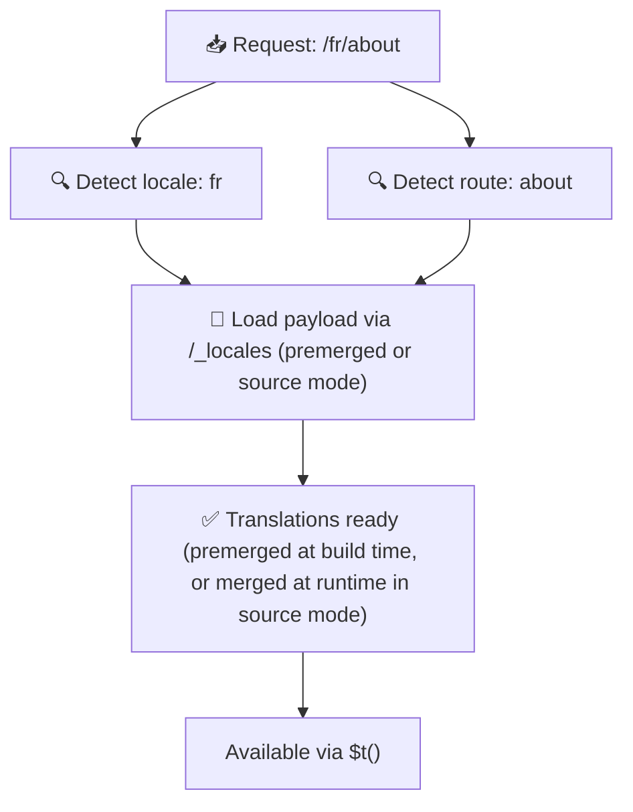

# 📂 Průvodce strukturou složek

## 📖 Úvod

Efektivní organizace překladových souborů je zásadní pro udržování škálovatelného a efektivního systému internacionalizace (i18n). `Nuxt I18n Micro` tento proces zjednodušuje nabídkou přehledného přístupu ke správě překladů na kořenové úrovni a překladů specifických pro stránky. Tento průvodce vás provede doporučenou strukturou složek a vysvětlí, jak `Nuxt I18n Micro` s těmito překlady pracuje.

## 🗂️ Doporučená struktura složek

`Nuxt I18n Micro` organizuje překlady do souborů na kořenové úrovni a souborů specifických pro stránky uvnitř adresáře `pages`. S `translationPayloads.mode: 'premerged'` (výchozí) jsou překlady na kořenové úrovni při buildu automaticky sloučeny do každého souboru pro stránku, takže každá stránka má kompletní sadu překladů bez runtime režie slučování.

S `mode: 'source'` zůstávají zdrojové soubory oddělené v Nitro assetech a slučují se za běhu přes routu `/_locales`. Viz [Výstup payloadu pro serverless](/guides/performance#serverless-payload-output).

### 🔧 Základní struktura

Zde je základní příklad struktury složek, kterou byste měli dodržovat:

```text
locales/
├── pages/
│   ├── index/
│   │   ├── en.json
│   │   ├── fr.json
│   │   └── ar.json
│   ├── about/
│   │   ├── en.json
│   │   ├── fr.json
│   │   └── ar.json
├── en.json
├── fr.json
└── ar.json

```

### 📄 Vysvětlení struktury

#### 1. 🌍 Překladové soubory na kořenové úrovni

- **Cesta:** `/locales/\{locale\}.json` (např. `/locales/en.json`)
- **Účel:** Tyto soubory obsahují překlady sdílené napříč celou aplikací (navigační menu, hlavičky, patičky atd.). S `mode: 'premerged'` (výchozí) jsou automaticky sloučeny do každého souboru specifického pro stránku při buildu, takže server vrací jediný předem sestavený soubor na stránku.

  **Ukázkový obsah (`/locales/en.json`):**

  ```json
  {
    "menu": {
      "home": "Home",
      "about": "About Us",
      "contact": "Contact"
    },
    "footer": {
      "copyright": "© 2024 Your Company"
    }
  }
  ```

#### 2. 📄 Překladové soubory specifické pro stránky

- **Cesta:** `/locales/pages/\{routeName\}/\{locale\}.json` (např. `/locales/pages/index/en.json`)
- **Účel:** Tyto soubory obsahují překlady specifické pro jednotlivé stránky. S `mode: 'premerged'` (výchozí) jsou překlady na kořenové úrovni sloučeny jako základ při buildu, takže každý soubor pro stránku se stává samostatným.

  **Ukázkový obsah (`/locales/pages/index/en.json`):**

  ```json
  {
    "title": "Welcome to Our Website",
    "description": "We offer a wide range of products and services to meet your needs."
  }
  ```

  **Ukázkový obsah (`/locales/pages/about/en.json`):**

  ```json
  {
    "title": "About Us",
    "description": "Learn more about our mission, vision, and values."
  }
  ```

### 📂 Zpracování dynamických rout a vnořených cest

`Nuxt I18n Micro` automaticky transformuje dynamické segmenty a vnořené cesty v routách do ploché struktury složek pomocí specifické konvence přejmenování. To zajišťuje, že všechny překlady jsou uloženy konzistentně a jsou snadno dostupné.

#### Struktura složek pro překlady dynamických rout

Při práci s dynamickými routami jako `/products/[id]` modul převede dynamický segment `[id]` do statického formátu ve struktuře souborů.

**Příklad struktury složek pro dynamické routy:**

Pro routu jako `/products/[id]` budou překladové soubory uloženy ve složce s názvem `products-id`:

```text
locales/pages/
├── products-id/
│   ├── en.json
│   ├── fr.json
│   └── ar.json

```

**Příklad struktury složek pro vnořené dynamické routy:**

Pro vnořenou routu jako `/products/key/[id]` budou překladové soubory uloženy ve složce s názvem `products-key-id`:

```text
locales/pages/
├── products-key-id/
│   ├── en.json
│   ├── fr.json
│   └── ar.json

```

**Příklad struktury složek pro vícestupňově vnořené routy:**

Pro složitější vnořenou routu jako `/products/category/[id]/details` budou překladové soubory uloženy ve složce s názvem `products-category-id-details`:

```text
locales/pages/
├── products-category-id-details/
│   ├── en.json
│   ├── fr.json
│   └── ar.json

```

### 🛠 Přizpůsobení struktury adresářů

Pokud dáváte přednost ukládání překladů do jiného adresáře, `Nuxt I18n Micro` vám umožňuje přizpůsobit adresář, kde jsou překladové soubory uloženy. To můžete nakonfigurovat ve svém souboru `nuxt.config.ts`.

**Příklad: Přizpůsobení adresáře překladů**

```typescript
export default defineNuxtConfig({
  i18n: {
    translationDir: 'i18n', // Custom directory path
  },
})
```

Toto pokyne `Nuxt I18n Micro`, aby hledal překladové soubory v adresáři `/i18n` místo výchozího adresáře `/locales`.

## ⚙️ Jak se překlady načítají

### 🌍 Dynamické locale routy

`Nuxt I18n Micro` používá dynamické locale routy k efektivnímu načítání překladů. Když uživatel navštíví stránku, modul určí odpovídající locale a načte odpovídající překladové soubory na základě aktuální routy a locale.



Například:

- Návštěva `/en/index` načte překlady z `/locales/pages/index/en.json`.
- Návštěva `/fr/about` načte překlady z `/locales/pages/about/fr.json`.

Tato metoda zajišťuje, že se načítají pouze potřebné překlady, což optimalizuje zátěž serveru i výkon na straně klienta.

### 💾 Cachování a pre-renderování

Pro další zvýšení výkonu `Nuxt I18n Micro` podporuje cachování a pre-renderování překladových souborů:

- **Cachování**: Jakmile je překladový soubor jednou načten, je cachován pro následné požadavky, což snižuje potřebu opakovaně načítat stejná data.
- **Pre-renderování**: Během procesu buildu můžete pre-renderovat překladové soubory pro všechna nakonfigurovaná locale a routy, což jim umožňuje být obsluhovány přímo ze serveru bez runtime prodlev.

## 📝 Osvědčené postupy

### 📂 Rozumně používejte soubory specifické pro stránky

Využívejte soubory specifické pro stránky, abyste udrželi překlady organizované. Díky tomu jsou překlady každé stránky štíhlé a rychlé na načítání, což je zvláště důležité pro stránky se složitým nebo rozsáhlým obsahem.

### 🔑 Udržujte překladové klíče konzistentní

Používejte konzistentní pojmenovávací konvence pro překladové klíče napříč soubory. To pomáhá udržet přehlednost a předchází problémům při správě překladů, zejména jak vaše aplikace roste.

### 🗂️ Organizujte překlady podle kontextu

Seskupujte související překlady dohromady ve svých souborech. Například seskupte všechny popisky tlačítek pod klíčem `buttons` a všechny texty související s formuláři pod klíčem `forms`. To nejen zlepšuje čitelnost, ale také usnadňuje správu překladů napříč různými locale.

### ⚠️ Limit hloubky vnoření (doporučeny 2 úrovně)

Během navigace na straně klienta `Nuxt I18n Micro` používá optimalizované 2-úrovňové hluboké slučování pro kombinaci překladů z opouštěné a vstupní stránky. To zajišťuje, že překrývající se vnořené klíče (např. obě stránky mají klíče pod `common.*`) jsou během přechodových animací zachovány.

**Toto funguje správně pro standardní strukturu `Sekce → Klíč → Hodnota` (2 úrovně):**

```json
// Page A translations
{ "common": { "fromA": "Text A" } }

// Page B translations
{ "common": { "fromB": "Text B" } }

// During transition, both are available:
// { "common": { "fromA": "Text A", "fromB": "Text B" } }
```

**Pokud však použijete 3+ úrovní vnoření, hlubší klíče mohou být během přechodů přepsány:**

```json
// Page A translations
{ "auth": { "form": { "login": "Login" } } }

// Page B translations
{ "auth": { "form": { "register": "Register" } } }

// During transition: "login" key is lost
// { "auth": { "form": { "register": "Register" } } }
```

<Tip>

</Tip>

### 🧹 Pravidelně vyčišťujte nepoužívané překlady

Postupem času může vaše aplikace nashromáždit nepoužívané překladové klíče, zejména pokud jsou funkce odstraněny nebo restrukturalizovány. Pravidelně kontrolujte a vyčišťujte své překladové soubory, abyste je udrželi štíhlé a udržovatelné.
