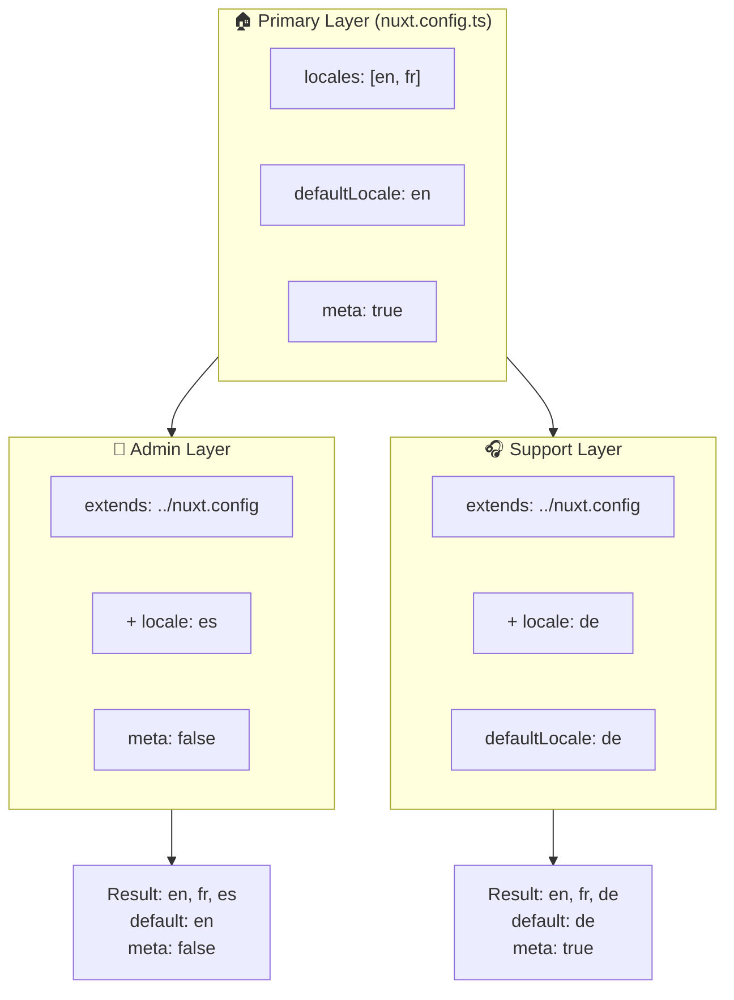

# 🗂️ Vrstvy v `Nuxt I18n Micro`

## 📖 Úvod do vrstev

Vrstvy v `Nuxt I18n Micro` vám umožňují flexibilně spravovat a přizpůsobovat nastavení lokalizace napříč různými částmi vaší aplikace. Definováním různých vrstev můžete upravit konfiguraci pro různé kontexty, například přepsat nastavení pro konkrétní sekce vašeho webu nebo vytvořit znovupoužitelné základní konfigurace, které mohou být rozšířeny jinými částmi vaší aplikace.

### Tok dědičnosti vrstev



## 🛠️ Primární konfigurační vrstva

**Primární konfigurační vrstva** je místo, kde nastavujete výchozí lokalizační nastavení pro celou vaši aplikaci. Tato vrstva je zásadní, protože definuje globální konfiguraci, včetně podporovaných locale, výchozího jazyka a dalších kritických i18n nastavení.

### 📄 Příklad: Definování primární konfigurační vrstvy

Zde je příklad, jak byste mohli definovat primární konfigurační vrstvu ve svém souboru `nuxt.config.ts`:

```typescript
export default defineNuxtConfig({
  i18n: {
    locales: [
      { code: 'en', iso: 'en-EN', dir: 'ltr' },
      { code: 'fr', iso: 'fr-FR', dir: 'ltr' },
      { code: 'ar', iso: 'ar-SA', dir: 'rtl' },
    ],
    defaultLocale: 'en', // The default locale for the entire app
    translationDir: 'locales', // Directory where translations are stored
    meta: true, // Automatically generate SEO-related meta tags like `alternate`
    autoDetectLanguage: true, // Automatically detect and use the user's preferred language
  },
})
```

## 🌱 Dceřiné vrstvy

Dceřiné vrstvy se používají k rozšíření nebo přepsání primární konfigurace pro konkrétní části vaší aplikace. Například můžete chtít přidat další locale nebo upravit výchozí locale pro konkrétní sekci vašeho webu. Dceřiné vrstvy jsou obzvláště užitečné v modulárních aplikacích, kde různé části aplikace mohou mít různé lokalizační požadavky.

### 📄 Příklad: Rozšíření primární vrstvy v dceřiné vrstvě

Předpokládejme, že máte sekci vašeho webu, která potřebuje podporovat další locale, nebo chcete v určitém kontextu zakázat konkrétní locale. Zde je způsob, jak toho dosáhnout rozšířením primární konfigurační vrstvy:

```typescript
// basic/nuxt.config.ts (Primary Layer)
export default defineNuxtConfig({
  i18n: {
    locales: [
      { code: 'en', iso: 'en-EN', dir: 'ltr' },
      { code: 'fr', iso: 'fr-FR', dir: 'ltr' },
    ],
    defaultLocale: 'en',
    meta: true,
    translationDir: 'locales',
  },
})
```

```typescript
// extended/nuxt.config.ts (Child Layer)
export default defineNuxtConfig({
  extends: '../basic', // Inherit the base configuration from the 'basic' layer
  i18n: {
    locales: [
      { code: 'en', iso: 'en-EN', dir: 'ltr' }, // Inherited from the base layer
      { code: 'fr', iso: 'fr-FR', dir: 'ltr' }, // Inherited from the base layer
      { code: 'de', iso: 'de-DE', dir: 'ltr' }, // Added in the child layer
    ],
    defaultLocale: 'fr', // Override the default locale to French for this section
    autoDetectLanguage: false, // Disable automatic language detection in this section
  },
})
```

### 🌐 Použití vrstev v modulární aplikaci

Ve větší modulární Nuxt aplikaci můžete mít více sekcí, každou vyžadující vlastní i18n nastavení. Využitím vrstev můžete udržovat čistou a škálovatelnou konfigurační strukturu.

### 📄 Příklad: Vrstvená konfigurace v modulární aplikaci

Představte si, že máte e-commerce web s odlišnými sekcemi, jako je hlavní web, administrátorský panel a zákaznický support portál. Každá sekce může potřebovat jinou sadu locale nebo jiná i18n nastavení.

#### **Primární vrstva (globální konfigurace):**

```typescript
// nuxt.config.ts
export default defineNuxtConfig({
  i18n: {
    locales: [
      { code: 'en', iso: 'en-EN', dir: 'ltr' },
      { code: 'fr', iso: 'fr-FR', dir: 'ltr' },
    ],
    defaultLocale: 'en',
    meta: true,
    translationDir: 'locales',
    autoDetectLanguage: true,
  },
})
```

#### **Dceřiná vrstva pro administrátorský panel:**

```typescript
// admin/nuxt.config.ts
export default defineNuxtConfig({
  extends: '../nuxt.config', // Inherit the global settings
  i18n: {
    locales: [
      { code: 'en', iso: 'en-EN', dir: 'ltr' }, // Inherited
      { code: 'fr', iso: 'fr-FR', dir: 'ltr' }, // Inherited
      { code: 'es', iso: 'es-ES', dir: 'ltr' }, // Specific to the admin panel
    ],
    defaultLocale: 'en',
    meta: false, // Disable automatic meta generation in the admin panel
  },
})
```

#### **Dceřiná vrstva pro zákaznický support portál:**

```typescript
// support/nuxt.config.ts
export default defineNuxtConfig({
  extends: '../nuxt.config', // Inherit the global settings
  i18n: {
    locales: [
      { code: 'en', iso: 'en-EN', dir: 'ltr' }, // Inherited
      { code: 'fr', iso: 'fr-FR', dir: 'ltr' }, // Inherited
      { code: 'de', iso: 'de-DE', dir: 'ltr' }, // Specific to the support portal
    ],
    defaultLocale: 'de', // Default to German in the support portal
    autoDetectLanguage: false, // Disable automatic language detection
  },
})
```

V tomto modulárním příkladu:

- Každá sekce (admin, support) má vlastní i18n nastavení, ale všechny dědí základní konfiguraci.
- Administrátorský panel přidává španělštinu (`es`) jako locale a zakazuje generování meta tagů.
- Support portál přidává němčinu (`de`) jako locale a defaultně používá němčinu pro uživatelské rozhraní.

## 📝 Osvědčené postupy pro používání vrstev

- **🔧 Udržujte primární vrstvu jednoduchou:** Primární vrstva by měla obsahovat nejběžněji používaná nastavení, která platí globálně napříč vaší aplikací. Držte ji přímočarou, abyste zajistili konzistenci.
- **⚙️ Používejte dceřiné vrstvy pro specifické úpravy:** Přepisujte nebo rozšiřujte nastavení v dceřiných vrstvách pouze v případě potřeby. Tento přístup zabraňuje zbytečné složitosti ve vaší konfiguraci.
- **📚 Dokumentujte své vrstvy:** Ve svém projektu jasně dokumentujte účel a specifika každé vrstvy. To pomůže udržet přehlednost a usnadní ostatním (nebo budoucímu vám) pochopení konfigurace.
