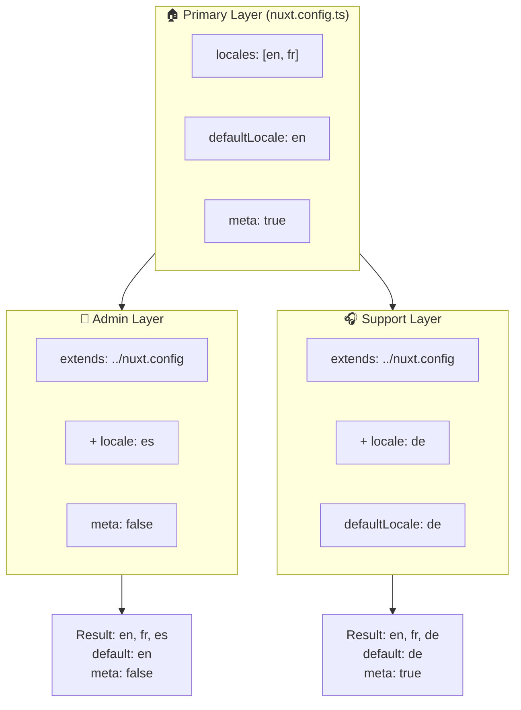

# 🗂️ Vrstvy v `Nuxt I18n Micro`

## 📖 Úvod do vrstev

Vrstvy v `Nuxt I18n Micro` umožňují flexibilně spravovat a přizpůsobovat nastavení lokalizace napříč různými částmi aplikace. Definicí různých vrstev můžete upravit konfiguraci pro různé kontexty, například přepsat nastavení pro konkrétní sekce webu nebo vytvořit znovupoužitelné základní konfigurace, které lze rozšiřovat v jiných částech aplikace.

### Tok dědění vrstev



## 🛠️ Primární konfigurační vrstva

**Primární konfigurační vrstva** je místem, kde nastavujete výchozí lokalizační nastavení pro celou aplikaci. Tato vrstva je zásadní, protože definuje globální konfiguraci včetně podporovaných locale, výchozího jazyka a dalších důležitých i18n nastavení.

### 📄 Příklad: Definice primární konfigurační vrstvy

Zde je příklad, jak byste mohli primární konfigurační vrstvu definovat v souboru `nuxt.config.ts`:

```typescript
export default defineNuxtConfig({
  i18n: {
    locales: [
      { code: 'en', iso: 'en-EN', dir: 'ltr' },
      { code: 'fr', iso: 'fr-FR', dir: 'ltr' },
      { code: 'ar', iso: 'ar-SA', dir: 'rtl' },
    ],
    defaultLocale: 'en', // The default locale for the entire app
    translationDir: 'locales', // Directory where translations are stored
    meta: true, // Automatically generate SEO-related meta tags like `alternate`
    autoDetectLanguage: true, // Automatically detect and use the user's preferred language
  },
})
```

## 🌱 Dětské vrstvy

Dětské vrstvy slouží k rozšíření nebo přepsání primární konfigurace pro konkrétní části aplikace. Můžete například přidat další locale nebo upravit výchozí locale pro konkrétní sekci webu. Dětské vrstvy jsou zvláště užitečné v modulárních aplikacích, kde různé části mohou mít různé požadavky na lokalizaci.

### 📄 Příklad: Rozšíření primární vrstvy v dětské vrstvě

Předpokládejme, že máte sekci webu, která potřebuje podporovat další locale, nebo chcete v určitém kontextu konkrétní locale vypnout. Zde je, jak toho můžete dosáhnout rozšířením primární konfigurační vrstvy:

```typescript
// basic/nuxt.config.ts (Primary Layer)
export default defineNuxtConfig({
  i18n: {
    locales: [
      { code: 'en', iso: 'en-EN', dir: 'ltr' },
      { code: 'fr', iso: 'fr-FR', dir: 'ltr' },
    ],
    defaultLocale: 'en',
    meta: true,
    translationDir: 'locales',
  },
})
```

```typescript
// extended/nuxt.config.ts (Child Layer)
export default defineNuxtConfig({
  extends: '../basic', // Inherit the base configuration from the 'basic' layer
  i18n: {
    locales: [
      { code: 'en', iso: 'en-EN', dir: 'ltr' }, // Inherited from the base layer
      { code: 'fr', iso: 'fr-FR', dir: 'ltr' }, // Inherited from the base layer
      { code: 'de', iso: 'de-DE', dir: 'ltr' }, // Added in the child layer
    ],
    defaultLocale: 'fr', // Override the default locale to French for this section
    autoDetectLanguage: false, // Disable automatic language detection in this section
  },
})
```

### 🌐 Použití vrstev v modulární aplikaci

Ve větší modulární Nuxt aplikaci můžete mít více sekcí, z nichž každá vyžaduje vlastní i18n nastavení. Využitím vrstev můžete udržet čistou a škálovatelnou strukturu konfigurace.

### 📄 Příklad: Vrstevnatá konfigurace v modulární aplikaci

Představte si, že máte e-commerce web s odlišnými sekcemi jako hlavní web, admin panel a portál zákaznické podpory. Každá sekce může potřebovat jinou sadu locale nebo dalších i18n nastavení.

#### **Primární vrstva (globální konfigurace):**

```typescript
// nuxt.config.ts
export default defineNuxtConfig({
  i18n: {
    locales: [
      { code: 'en', iso: 'en-EN', dir: 'ltr' },
      { code: 'fr', iso: 'fr-FR', dir: 'ltr' },
    ],
    defaultLocale: 'en',
    meta: true,
    translationDir: 'locales',
    autoDetectLanguage: true,
  },
})
```

#### **Dětská vrstva pro admin panel:**

```typescript
// admin/nuxt.config.ts
export default defineNuxtConfig({
  extends: '../nuxt.config', // Inherit the global settings
  i18n: {
    locales: [
      { code: 'en', iso: 'en-EN', dir: 'ltr' }, // Inherited
      { code: 'fr', iso: 'fr-FR', dir: 'ltr' }, // Inherited
      { code: 'es', iso: 'es-ES', dir: 'ltr' }, // Specific to the admin panel
    ],
    defaultLocale: 'en',
    meta: false, // Disable automatic meta generation in the admin panel
  },
})
```

#### **Dětská vrstva pro portál zákaznické podpory:**

```typescript
// support/nuxt.config.ts
export default defineNuxtConfig({
  extends: '../nuxt.config', // Inherit the global settings
  i18n: {
    locales: [
      { code: 'en', iso: 'en-EN', dir: 'ltr' }, // Inherited
      { code: 'fr', iso: 'fr-FR', dir: 'ltr' }, // Inherited
      { code: 'de', iso: 'de-DE', dir: 'ltr' }, // Specific to the support portal
    ],
    defaultLocale: 'de', // Default to German in the support portal
    autoDetectLanguage: false, // Disable automatic language detection
  },
})
```

V tomto modulárním příkladu:

- Každá sekce (admin, support) má vlastní i18n nastavení, ale všechny dědí základní konfiguraci.
- Admin panel přidává španělštinu (`es`) jako locale a vypíná generování meta tagů.
- Portál podpory přidává němčinu (`de`) jako locale a jako výchozí uživatelské rozhraní používá němčinu.

## 📝 Osvědčené postupy pro použití vrstev

- **🔧 Udržujte primární vrstvu jednoduchou:** Primární vrstva by měla obsahovat nejčastěji používaná nastavení, která platí globálně napříč aplikací. Držte ji přímočarou pro zajištění konzistence.
- **⚙️ Používejte dětské vrstvy pro konkrétní přizpůsobení:** Přepisujte nebo rozšiřujte nastavení v dětských vrstvách jen v případě potřeby. Tento přístup se vyhýbá zbytečné složitosti v konfiguraci.
- **📚 Dokumentujte své vrstvy:** Jasně dokumentujte účel a specifika každé vrstvy v projektu. To pomáhá udržet přehlednost a usnadňuje pochopení konfigurace ostatním (nebo vám v budoucnosti).
