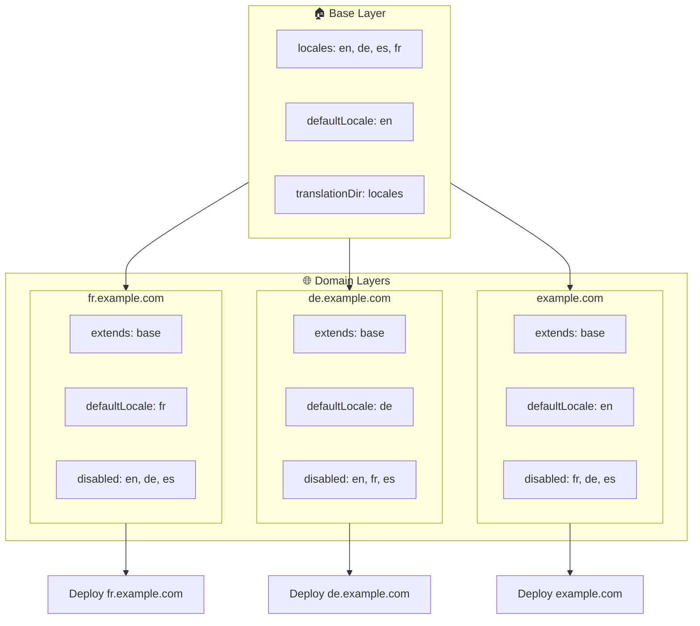

# 🌍 Nastavení multi-doménových locale s `Nuxt I18n Micro` pomocí vrstev

## 📝 Úvod

Využitím vrstev v `Nuxt I18n Micro` můžete vytvořit flexibilní a udržovatelné multi-doménové nastavení lokalizace. Tento přístup nejenže zjednodušuje správu domén tím, že odpadá potřeba komplexních funkcí, ale také umožňuje efektivní distribuci zátěže a snižuje složitost projektu. Spuštěním samostatných projektů pro různé locale se vaše aplikace může snadno škálovat a přizpůsobovat různým požadavkům locale napříč více doménami a nabízí robustní a škálovatelné řešení pro globální aplikace.

## 🎯 Cíl

Vytvořit nastavení, ve kterém různé domény servírují konkrétní locale přizpůsobením konfigurací v dětských vrstvách. Tato metoda využívá systém vrstev Nuxtu a umožňuje udržovat základní konfiguraci a zároveň ji pro každou doménu rozšiřovat nebo upravovat.

### Multi-doménová architektura



## 🛠 Kroky implementace multi-doménových locale

### 1. **Vytvoření základní vrstvy**

Začněte vytvořením základní konfigurační vrstvy, která obsahuje všechna společná nastavení locale pro vaši aplikaci. Tato konfigurace bude sloužit jako základ pro další doménově specifické konfigurace.

#### **Konfigurace základní vrstvy**

Vytvořte základní konfigurační soubor `base/nuxt.config.ts`:

```typescript
// base/nuxt.config.ts

export default defineNuxtConfig({
  i18n: {
    locales: [
      { code: 'en', iso: 'en-US', dir: 'ltr' },
      { code: 'de', iso: 'de-DE', dir: 'ltr' },
      { code: 'es', iso: 'es-ES', dir: 'ltr' },
    ],
    defaultLocale: 'en',
    translationDir: 'locales',
    meta: true,
    autoDetectLanguage: true,
  },
})
```

### 2. **Vytvoření doménově specifických dětských vrstev**

Pro každou doménu vytvořte dětskou vrstvu, která upraví základní konfiguraci tak, aby splňovala konkrétní požadavky dané domény. Můžete vypnout locale, které pro konkrétní doménu nejsou potřeba.

#### **Příklad: Konfigurace pro francouzskou doménu**

Vytvořte konfiguraci dětské vrstvy pro francouzskou doménu v `fr/nuxt.config.ts`:

```typescript
// fr/nuxt.config.ts

export default defineNuxtConfig({
  extends: '../base', // Inherit from the base configuration

  i18n: {
    locales: [
      { code: 'en', iso: 'en-US', dir: 'ltr', disabled: true }, // Disable English
      { code: 'fr', iso: 'fr-FR', dir: 'ltr' }, // Add and enable the French locale
      { code: 'de', iso: 'de-DE', dir: 'ltr', disabled: true }, // Disable German
      { code: 'es', iso: 'es-ES', dir: 'ltr', disabled: true }, // Disable Spanish
    ],
    defaultLocale: 'fr', // Set French as the default locale
    autoDetectLanguage: false, // Disable automatic language detection
  },
})
```

#### **Příklad: Konfigurace pro německou doménu**

Podobně vytvořte konfiguraci dětské vrstvy pro německou doménu v `de/nuxt.config.ts`:

```typescript
// de/nuxt.config.ts

export default defineNuxtConfig({
  extends: '../base', // Inherit from the base configuration

  i18n: {
    locales: [
      { code: 'en', iso: 'en-US', dir: 'ltr', disabled: true }, // Disable English
      { code: 'fr', iso: 'fr-FR', dir: 'ltr', disabled: true }, // Disable French
      { code: 'de', iso: 'de-DE', dir: 'ltr' }, // Use the German locale
      { code: 'es', iso: 'es-ES', dir: 'ltr', disabled: true }, // Disable Spanish
    ],
    defaultLocale: 'de', // Set German as the default locale
    autoDetectLanguage: false, // Disable automatic language detection
  },
})
```

### 3. **Nasazení aplikace pro každou doménu**

Nasaďte aplikaci s odpovídající konfigurací pro každou doménu. Například:

- Nasaďte konfiguraci vrstvy `fr` na `fr.example.com`.
- Nasaďte konfiguraci vrstvy `de` na `de.example.com`.

### 4. **Nastavení více projektů pro různé locale**

Pro každý locale a doménu budete potřebovat spustit samostatnou instanci aplikace. Tím zajistíte, že každá doména servíruje správnou konfiguraci locale, optimalizuje distribuci zátěže a zjednodušuje strukturu projektu. Spuštěním více projektů přizpůsobených každému locale můžete udržet čisté oddělení konfigurací a snížit složitost celkového nastavení.

### 5. **Konfigurace routování na základě domény**

Ujistěte se, že je vaše routování nakonfigurováno tak, aby uživatele směrovalo do správného projektu podle domény, na kterou přistupují. Tím zajistíte, že každá doména servíruje odpovídající locale a zlepší uživatelskou zkušenost i konzistenci napříč různými regiony.

### 6. **Nasazení a ověření**

Po nakonfigurování vrstev a jejich nasazení na příslušné domény zajistěte, aby každá doména servírovala správný locale. Aplikaci důkladně otestujte a potvrďte, že se v závislosti na doméně načítá správný locale.

## 📝 Osvědčené postupy

- **Udržujte základní konfiguraci obecnou**: Základní konfigurace by měla pokrývat obecná nastavení použitelná pro všechny domény.
- **Izolujte doménově specifickou logiku**: Doménově specifické konfigurace udržujte v příslušných vrstvách pro zachování přehlednosti a oddělení odpovědností.

## 🎉 Závěr

Využitím vrstev v `Nuxt I18n Micro` můžete vytvořit flexibilní a udržovatelné multi-doménové nastavení lokalizace. Tento přístup nejenže odstraňuje potřebu komplexních funkcí pro správu domén, ale také umožňuje efektivně distribuovat zátěž a snížit složitost projektu. Spuštění samostatných projektů pro různé locale zajišťuje, že vaše aplikace se může snadno škálovat a přizpůsobovat různým požadavkům locale napříč různými doménami, a poskytuje robustní a škálovatelné řešení pro globální aplikace.
