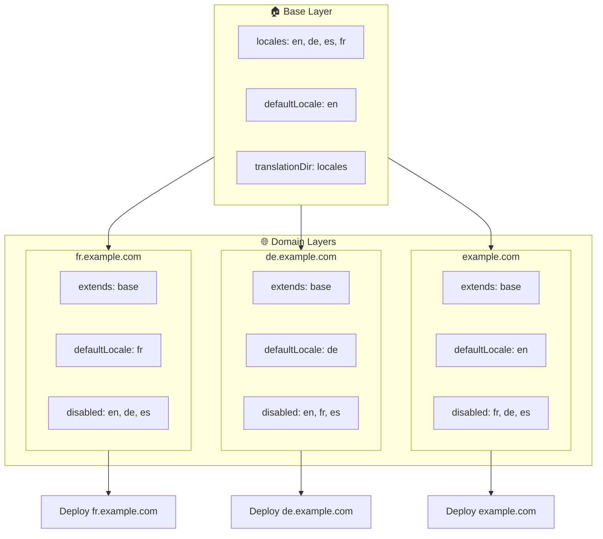

# 🌍 Nastavení multi-doménových locale s `Nuxt I18n Micro` pomocí vrstev

## 📝 Úvod

Využitím vrstev v `Nuxt I18n Micro` můžete vytvořit flexibilní a udržovatelné nastavení multi-doménové lokalizace. Tento přístup nejen zjednodušuje správu domén tím, že eliminuje potřebu složitých funkcí, ale také umožňuje efektivní distribuci zátěže a snížení složitosti projektu. Spuštěním samostatných projektů pro různé locale se vaše aplikace může snadno škálovat a přizpůsobit se různým požadavkům na locale napříč více doménami, což nabízí robustní a škálovatelné řešení pro globální aplikace.

## 🎯 Cíl

Vytvořit nastavení, kde různé domény obsluhují specifické locale přizpůsobením konfigurací v dceřiných vrstvách. Tato metoda využívá vrstvový systém Nuxt, který vám umožňuje udržovat základní konfiguraci a přitom ji rozšiřovat nebo upravovat pro každou doménu.

### Multi-doménová architektura



## 🛠 Kroky pro implementaci multi-doménových locale

### 1. **Vytvoření základní vrstvy**

Začněte vytvořením základní konfigurační vrstvy, která obsahuje všechna společná nastavení locale pro vaši aplikaci. Tato konfigurace bude sloužit jako základ pro další doménově specifické konfigurace.

#### **Konfigurace základní vrstvy**

Vytvořte základní konfigurační soubor `base/nuxt.config.ts`:

```typescript
// base/nuxt.config.ts

export default defineNuxtConfig({
  i18n: {
    locales: [
      { code: 'en', iso: 'en-US', dir: 'ltr' },
      { code: 'de', iso: 'de-DE', dir: 'ltr' },
      { code: 'es', iso: 'es-ES', dir: 'ltr' },
    ],
    defaultLocale: 'en',
    translationDir: 'locales',
    meta: true,
    autoDetectLanguage: true,
  },
})
```

### 2. **Vytvoření doménově specifických dceřiných vrstev**

Pro každou doménu vytvořte dceřinou vrstvu, která upraví základní konfiguraci tak, aby vyhovovala specifickým požadavkům dané domény. Můžete zakázat locale, které nejsou pro konkrétní doménu potřeba.

#### **Příklad: Konfigurace pro francouzskou doménu**

Vytvořte konfiguraci dceřiné vrstvy pro francouzskou doménu v `fr/nuxt.config.ts`:

```typescript
// fr/nuxt.config.ts

export default defineNuxtConfig({
  extends: '../base', // Inherit from the base configuration

  i18n: {
    locales: [
      { code: 'en', iso: 'en-US', dir: 'ltr', disabled: true }, // Disable English
      { code: 'fr', iso: 'fr-FR', dir: 'ltr' }, // Add and enable the French locale
      { code: 'de', iso: 'de-DE', dir: 'ltr', disabled: true }, // Disable German
      { code: 'es', iso: 'es-ES', dir: 'ltr', disabled: true }, // Disable Spanish
    ],
    defaultLocale: 'fr', // Set French as the default locale
    autoDetectLanguage: false, // Disable automatic language detection
  },
})
```

#### **Příklad: Konfigurace pro německou doménu**

Podobně vytvořte konfiguraci dceřiné vrstvy pro německou doménu v `de/nuxt.config.ts`:

```typescript
// de/nuxt.config.ts

export default defineNuxtConfig({
  extends: '../base', // Inherit from the base configuration

  i18n: {
    locales: [
      { code: 'en', iso: 'en-US', dir: 'ltr', disabled: true }, // Disable English
      { code: 'fr', iso: 'fr-FR', dir: 'ltr', disabled: true }, // Disable French
      { code: 'de', iso: 'de-DE', dir: 'ltr' }, // Use the German locale
      { code: 'es', iso: 'es-ES', dir: 'ltr', disabled: true }, // Disable Spanish
    ],
    defaultLocale: 'de', // Set German as the default locale
    autoDetectLanguage: false, // Disable automatic language detection
  },
})
```

### 3. **Nasazení aplikace pro každou doménu**

Nasaďte aplikaci s odpovídající konfigurací pro každou doménu. Například:

- Nasaďte konfiguraci vrstvy `fr` na `fr.example.com`.
- Nasaďte konfiguraci vrstvy `de` na `de.example.com`.

### 4. **Nastavení více projektů pro různé locale**

Pro každou kombinaci locale a domény budete muset spustit samostatnou instanci aplikace. To zajistí, že každá doména bude obsluhovat správnou konfiguraci locale, optimalizuje distribuci zátěže a zjednoduší strukturu projektu. Spuštěním více projektů přizpůsobených každému locale můžete udržovat čisté oddělení konfigurací a snížit složitost celkového nastavení.

### 5. **Konfigurace routování podle domény**

Zajistěte, aby vaše routování bylo nakonfigurováno tak, aby směrovalo uživatele do správného projektu na základě domény, ke které přistupují. Tím zajistíte, že každá doména bude obsluhovat odpovídající locale, což zlepší uživatelský zážitek a zachová konzistenci napříč různými regiony.

### 6. **Nasazení a ověření**

Po nakonfigurování vrstev a jejich nasazení na příslušné domény se ujistěte, že každá doména obsluhuje správný locale. Důkladně otestujte aplikaci, abyste potvrdili, že se v závislosti na doméně načítá správný locale.

## 📝 Osvědčené postupy

- **Udržujte základní konfiguraci obecnou**: Základní konfigurace by měla pokrývat obecná nastavení použitelná pro všechny domény.
- **Izolujte doménově specifickou logiku**: Udržujte doménově specifické konfigurace v jejich vlastních vrstvách, abyste zachovali přehlednost a oddělení odpovědností.

## 🎉 Závěr

Využitím vrstev v `Nuxt I18n Micro` můžete vytvořit flexibilní a udržovatelné nastavení multi-doménové lokalizace. Tento přístup nejen eliminuje potřebu složitých funkcí pro správu domén, ale také vám umožňuje efektivně distribuovat zátěž a snížit složitost projektu. Spuštění samostatných projektů pro různé locale zajišťuje, že vaše aplikace se může snadno škálovat a přizpůsobit různým požadavkům na locale napříč různými doménami, což poskytuje robustní a škálovatelné řešení pro globální aplikace.
