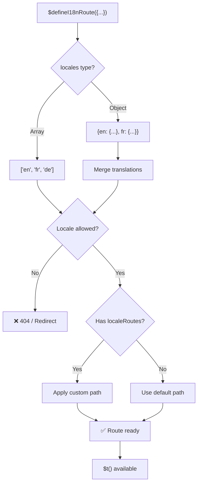
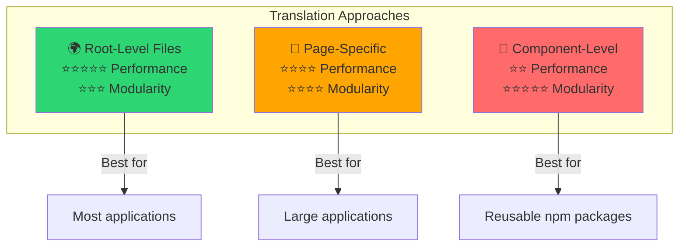

# 📖 Překlady na úrovni komponenty

Naučte se definovat překlady přímo uvnitř Vue komponent pomocí `$defineI18nRoute` pro modulární a udržovatelnou lokalizaci.

## 📖 Přehled

Překlady na úrovni komponenty v `Nuxt I18n Micro` vám umožňují definovat překlady přímo v konkrétních komponentách nebo stránkách pomocí funkce `$defineI18nRoute`. Tento přístup je ideální pro správu lokalizovaného obsahu, který je jedinečný pro jednotlivé komponenty, a poskytuje modulárnější a udržovatelnější metodu zpracování překladů.

## 🚀 Rychlý start

### Základní použití

```vue
<template>
  <div>
    <h1>{{ $t('greeting') }}</h1>
    <p>{{ $t('farewell') }}</p>
  </div>
</template>

<script setup lang="ts">
import { useNuxtApp } from '#imports'

const { $defineI18nRoute, $t } = useNuxtApp()

$defineI18nRoute({
  locales: {
    en: { greeting: 'Hello', farewell: 'Goodbye' },
    fr: { greeting: 'Bonjour', farewell: 'Au revoir' },
    de: { greeting: 'Hallo', farewell: 'Auf Wiedersehen' },
  },
})
</script>
```

### Vyžadované nastavení (`script setup`)

`$defineI18nRoute` je Nuxt app injection, ne globální makro.  
Vždy ji získejte z `useNuxtApp()` před voláním.

```ts
import { useNuxtApp } from '#imports'

const { $defineI18nRoute } = useNuxtApp()
```

## 🏗️ Meta routy v době buildu

V době buildu Vite unplugin skenuje `.vue` soubory stránek pro volání `defineI18nRoute(...)` / `$defineI18nRoute(...)` a extrahuje omezení locale, `localeRoutes` a `disableMeta` do metadat routy používaných `@i18n-micro/route-strategy`.

- **Build**: unplugin (`src/unplugin-define-i18n-route.ts`) běží během Vite transform a zapisuje `i18n-route-meta.json` pod Nuxt build adresář
- **Runtime**: define plugin (`03.define.ts`) stále vystavuje `$defineI18nRoute` v `script setup` pro vývoj a inline konfiguraci

`$defineI18nRoute` normálně voláte jen na stránkách. Modul zpracovává extrakci v době buildu automaticky.

## 🔧 Funkce `$defineI18nRoute`

Funkce `$defineI18nRoute` konfiguruje chování route na základě aktuálního locale a nabízí univerzální řešení pro:

- Řízení přístupu ke konkrétním routám podle dostupných locale
- Poskytování překladů pro konkrétní locale
- Nastavení vlastních rout pro různá locale
- Řízení generování meta tagů

### Jak to funguje



### Signatura metody

```typescript
const { $defineI18nRoute } = useNuxtApp();
$defineI18nRoute(routeDefinition: DefineI18nRouteConfig);
```

### Parametry

| Parametr       | Typ                                        | Popis                              |
| -------------- | ------------------------------------------ | ---------------------------------- |
| `locales`      | `string[] \| Record<string, Translations>` | Dostupné locale pro routu          |
| `localeRoutes` | `Record<string, string>`                   | Vlastní routy pro konkrétní locale |
| `disableMeta`  | `boolean \| string[]`                      | Řízení generování i18n meta tagů   |

### Podrobné popisy parametrů

#### `locales`

Definuje, která locale jsou pro routu dostupná:

<CodeGroup>
```typescript Formát pole
$defineI18nRoute({
  locales: ['en', 'fr', 'de'], // Simple array of locale codes
})
```

```typescript Formát objektu
$defineI18nRoute({
  locales: {
    en: { greeting: 'Hello', farewell: 'Goodbye' },
    fr: { greeting: 'Bonjour', farewell: 'Au revoir' },
    de: { greeting: 'Hallo', farewell: 'Auf Wiedersehen' },
    ru: {}, // Russian locale allowed but no translations provided
  },
})
```
</CodeGroup>

#### `localeRoutes`

Umožňuje vlastní routy pro konkrétní locale:

```typescript
$defineI18nRoute({
  localeRoutes: {
    en: '/welcome',
    fr: '/bienvenue',
    de: '/willkommen',
    ru: '/privet', // Custom route path for Russian locale
  },
})
```

#### `disableMeta`

Řídí generování i18n meta tagů:

<CodeGroup>
```typescript Vypnout všechny meta
$defineI18nRoute({
  locales: ['en', 'fr', 'de'],
  disableMeta: true, // Disables all i18n meta tags
})
```

```typescript Vypnout konkrétní locale
$defineI18nRoute({
  locales: ['en', 'fr', 'de'],
  disableMeta: ['en', 'fr'], // Only English and French won't have meta tags
})
```
</CodeGroup>

## 💡 Případy použití

### 1. Řízení přístupu na základě locale

Definujte, která locale jsou povolena pro konkrétní routy:

```typescript
$defineI18nRoute({
  locales: ['en', 'fr', 'de'], // Only these locales are allowed for this route
})
```

### 2. Poskytování překladů specifických pro komponentu

Použijte objekt `locales` k poskytnutí specifických překladů pro každou routu:

```typescript
$defineI18nRoute({
  locales: {
    en: {
      greeting: 'Hello',
      farewell: 'Goodbye',
      description: 'Welcome to our application',
    },
    fr: {
      greeting: 'Bonjour',
      farewell: 'Au revoir',
      description: 'Bienvenue dans notre application',
    },
    de: {
      greeting: 'Hallo',
      farewell: 'Auf Wiedersehen',
      description: 'Willkommen in unserer Anwendung',
    },
  },
})
```

### 3. Vlastní routování pro locale

Definujte vlastní cesty pro konkrétní locale:

```typescript
$defineI18nRoute({
  locales: ['en', 'fr', 'de'],
  localeRoutes: {
    en: '/welcome',
    fr: '/bienvenue',
    de: '/willkommen',
  },
})
```

### 4. Vypnutí meta tagů

Řiďte generování SEO meta tagů pro konkrétní routy nebo locale:

```typescript
// Disable meta tags for all locales
$defineI18nRoute({
  locales: ['en', 'fr', 'de'],
  disableMeta: true,
})

// Disable meta tags only for specific locales
$defineI18nRoute({
  locales: ['en', 'fr', 'de'],
  disableMeta: ['en', 'fr'],
})
```

## ✅ Podporované formáty konfigurace

Parser `$defineI18nRoute` podporuje různé JavaScript konfigurace:

### Statické konfigurace

<CodeGroup>
```typescript Statická pole
$defineI18nRoute({
  locales: ['en', 'de', 'fr'],
})
```

```typescript Statické objekty
$defineI18nRoute({
  locales: {
    en: { greeting: 'Hello' },
    de: { greeting: 'Hallo' },
  },
  localeRoutes: {
    en: '/welcome',
    de: '/willkommen',
  },
})
```
</CodeGroup>

### Dynamické konfigurace

<CodeGroup>
```typescript Proměnné a funkce
const locales = ['en', 'de', 'fr']
const routes = { en: '/welcome', de: '/willkommen' }

$defineI18nRoute({
  locales: locales,
  localeRoutes: routes,
})
```

```typescript Template literály
const prefix = 'api'

$defineI18nRoute({
  locales: [`${prefix}-en`, `${prefix}-de`],
  localeRoutes: {
    [`${prefix}-en`]: `/api/welcome`,
    [`${prefix}-de`]: `/api/willkommen`,
  },
})
```
</CodeGroup>

### Pokročilé konfigurace

<CodeGroup>
```typescript Spread operátor
const baseLocales = ['en', 'de']
const additionalLocales = ['fr', 'es']

$defineI18nRoute({
  locales: [...baseLocales, ...additionalLocales],
})
```

```typescript Pole objektů
$defineI18nRoute({
  locales: [
    { code: 'en', name: 'English' },
    { code: 'de', name: 'German' },
  ],
})
```
</CodeGroup>

### Podmíněná logika

```typescript
$defineI18nRoute({
  locales: process.env.NODE_ENV === 'production' ? ['en', 'de'] : ['en', 'de', 'fr', 'es'],
})
```

### Složité vnořené objekty

```typescript
$defineI18nRoute({
  locales: {
    'en-us': {
      region: 'US',
      currency: 'USD',
      format: {
        date: 'MM/DD/YYYY',
        time: '12h',
      },
    },
    'de-de': {
      region: 'DE',
      currency: 'EUR',
      format: {
        date: 'DD.MM.YYYY',
        time: '24h',
      },
    },
  },
})
```

### Komentáře a formátování

```typescript
$defineI18nRoute({
  // Supported locales for this component
  locales: [
    'en', // English
    'de', // German
    'fr', // French
  ],
  // Custom routes for each locale
  localeRoutes: {
    en: '/welcome',
    de: '/willkommen',
    fr: '/bienvenue',
  },
})
```

## ❌ Nepodporováno

Parser má omezení a nezvládne:

- **Externí importy** (`import` příkazy)
- **Async/await funkce**
- **Metody tříd**
- **Složitý control flow** (smyčky, try-catch, switch)
- **Arrow funkce** v konfiguraci
- **Generátorové funkce**

## 📝 Kompletní příklad

Zde je komplexní příklad ukazující všechny funkce:

```vue
<template>
  <div class="welcome-page">
    <header>
      <h1>{{ $t('title') }}</h1>
      <p>{{ $t('subtitle') }}</p>
    </header>

    <main>
      <section>
        <h2>{{ $t('features.title') }}</h2>
        <ul>
          <li v-for="feature in $t('features.list')" :key="feature">
            {{ feature }}
          </li>
        </ul>
      </section>

      <section>
        <h2>{{ $t('contact.title') }}</h2>
        <p>{{ $t('contact.description') }}</p>
        <a :href="$t('contact.email')">{{ $t('contact.email') }}</a>
      </section>
    </main>

    <footer>
      <p>{{ $t('footer.copyright') }}</p>
    </footer>
  </div>
</template>

<script setup lang="ts">
import { useNuxtApp } from '#imports'

const { $defineI18nRoute, $t } = useNuxtApp()

// Define comprehensive i18n route configuration
$defineI18nRoute({
  locales: {
    en: {
      title: 'Welcome to Our Platform',
      subtitle: 'The best solution for your needs',
      features: {
        title: 'Key Features',
        list: ['High Performance', 'Easy to Use', 'Scalable Architecture'],
      },
      contact: {
        title: 'Get in Touch',
        description: "We'd love to hear from you",
        email: 'mailto:contact@example.com',
      },
      footer: {
        copyright: '© 2024 Example Company. All rights reserved.',
      },
    },
    fr: {
      title: 'Bienvenue sur Notre Plateforme',
      subtitle: 'La meilleure solution pour vos besoins',
      features: {
        title: 'Fonctionnalités Clés',
        list: ['Haute Performance', 'Facile à Utiliser', 'Architecture Évolutive'],
      },
      contact: {
        title: 'Contactez-Nous',
        description: 'Nous aimerions avoir de vos nouvelles',
        email: 'mailto:contact@example.com',
      },
      footer: {
        copyright: '© 2024 Example Company. Tous droits réservés.',
      },
    },
    de: {
      title: 'Willkommen auf Unserer Plattform',
      subtitle: 'Die beste Lösung für Ihre Bedürfnisse',
      features: {
        title: 'Hauptfunktionen',
        list: ['Hohe Leistung', 'Einfach zu Verwenden', 'Skalierbare Architektur'],
      },
      contact: {
        title: 'Kontaktieren Sie Uns',
        description: 'Wir würden gerne von Ihnen hören',
        email: 'mailto:contact@example.com',
      },
      footer: {
        copyright: '© 2024 Example Company. Alle Rechte vorbehalten.',
      },
    },
  },
  localeRoutes: {
    en: '/welcome',
    fr: '/bienvenue',
    de: '/willkommen',
  },
  disableMeta: false, // Enable SEO meta tags
})
</script>

<style scoped>
.welcome-page {
  max-width: 800px;
  margin: 0 auto;
  padding: 2rem;
}

header {
  text-align: center;
  margin-bottom: 3rem;
}

section {
  margin-bottom: 2rem;
}

footer {
  text-align: center;
  margin-top: 3rem;
  padding-top: 2rem;
  border-top: 1px solid #eee;
}
</style>
```

## ⚡ Aspekty výkonu

Vkládání překladů do Single File Components (SFCs) může ovlivnit výkon:

### Potenciální problémy

- **Zvětšená velikost souboru**: Všechna locale sídlí v SFC, na rozdíl od samostatných souborů překladů, které umožňují locale-aware načítání
- **Pomalejší vykreslování**: Překlady v souboru se zpracovávají za běhu
- **Spotřeba paměti**: Všechny překlady se načítají bez ohledu na aktuální locale

### Osvědčené postupy

- **Používejte překlady na úrovni stránky** pro optimální výkon
- **Vyhraďte překlady na úrovni komponenty** pro konkrétní případy jako:
  - Znovupoužitelné komponenty publikované na npm
  - Překlady nevhodné pro kořenové soubory
  - Komponenty, které musí být soběstačné

### Výkon vs. modularita

Vyvažte potřeby projektu při volbě přístupu:



| Přístup              | Výkon       | Modularita | Případ použití          |
| -------------------- | ----------- | ---------- | ----------------------- |
| **Kořenové soubory** | ⭐⭐⭐⭐⭐  | ⭐⭐⭐     | Většina aplikací        |
| **Stránkově specifické** | ⭐⭐⭐⭐    | ⭐⭐⭐⭐   | Velké aplikace          |
| **Na úrovni komponenty** | ⭐⭐        | ⭐⭐⭐⭐⭐ | Znovupoužitelné komponenty |

## 🎯 Osvědčené postupy

### 1. Udržujte překlady blízko komponent

Definujte překlady přímo uvnitř relevantní komponenty, aby zůstal lokalizovaný obsah organizovaný a udržovatelný.

### 2. Používejte locale objekty pro flexibilitu

Používejte formát objektu pro vlastnost `locales`, když jsou vyžadovány specifické překlady nebo řízení přístupu na základě locale.

### 3. Dokumentujte vlastní routy

Jasně dokumentujte jakékoli vlastní routy nastavené pro různá locale, aby zůstala přehlednost a zjednodušil se vývoj a údržba.

### 4. Zvažte dopad na výkon

Zhodnoťte, zda jsou překlady na úrovni komponenty pro váš případ použití nezbytné, s ohledem na výkonnostní implikace.

### 5. Používejte TypeScript

Využijte TypeScript pro lepší typovou bezpečnost a IntelliSense:

```typescript
interface ComponentTranslations {
  title: string
  subtitle: string
  features: {
    title: string
    list: string[]
  }
}

$defineI18nRoute({
  locales: {
    en: {
      title: 'Welcome',
      subtitle: 'Subtitle',
      features: {
        title: 'Features',
        list: ['Feature 1', 'Feature 2'],
      },
    } as ComponentTranslations,
  },
})
```

## 📚 Související témata

- **[Rychlý start](/quickstart)**: Základní nastavení a konfigurace
- **[Reference API](/api/methods)**: Kompletní dokumentace metod
- **[Příklady](/examples)**: Ukázky reálného použití

## Shrnutí

Funkce Překlady na úrovni komponenty, poháněná funkcí `$defineI18nRoute`, nabízí výkonný a flexibilní způsob správy lokalizace v Nuxt aplikaci. Tím, že umožňuje definovat lokalizovaný obsah a routování na úrovni komponenty, pomáhá vytvářet vysoce přizpůsobený a uživatelsky přívětivý zážitek přizpůsobený jazykovým a regionálním preferencím vašeho publika.

Vyberte přístup, který nejlépe vyhovuje potřebám vašeho projektu, s ohledem na požadavky na výkon i udržovatelnost.
