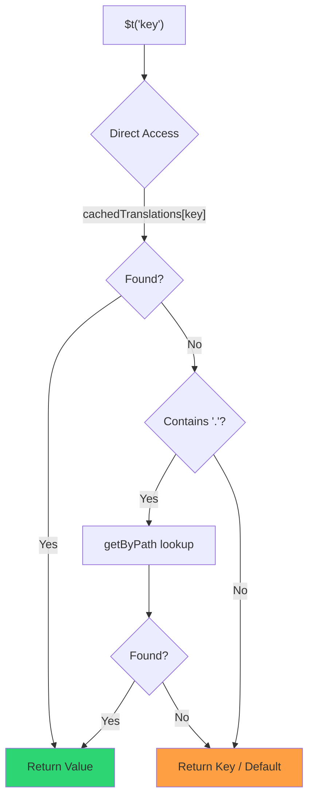

# 🚀 Průvodce výkonem

## 📖 Úvod

`Nuxt I18n Micro` je navržen s ohledem na výkon a nabízí významné zlepšení oproti tradičním modulům internacionalizace (i18n) jako `nuxt-i18n`. Tento průvodce poskytuje podrobný pohled na výkonnostní výhody použití `Nuxt I18n Micro` a jak se srovnává s jinými řešeními.

## 🤔 Proč se zaměřovat na výkon?

Ve velkých projektech a prostředích s vysokou návštěvností mohou výkonnostní úzká hrdla vést k pomalým buildům, zvýšené spotřebě paměti a špatné odezvě serveru. Tyto problémy se stávají výraznějšími u komplexních i18n nastavení s velkými překladovými soubory. `Nuxt I18n Micro` byl vytvořen, aby tyto výzvy řešil přímo optimalizací pro rychlost, efektivitu paměti a minimální dopad na velikost bundle vaší aplikace.

## 📊 Porovnání výkonu

Provedli jsme sérii testů na stejných fixtures přes `pnpm test:performance` (`pnpm -C scripts cli performance`) proti **`@nuxtjs/i18n@10.6.0`**. Kompletní metodologie a grafy: [Výsledky výkonnostních testů](/guides/performance-results).

Výchozí CLI profil: **4 locales** × **2 stránky** (`index`, `page`) × ~10k listových klíčů indexu. Zvyšte `--locales` / `--keys` pro těžší regression-radar zátěž. Report rozděluje **kód**, **překlady** (včetně `@nuxtjs/i18n` `chunks/raw/*`) a **celkový** nasazovaný výstup.

```bash
pnpm test:performance
pnpm -C scripts cli performance --only micro --skip-stress
pnpm -C scripts cli performance --locales 12 --keys 100000 --runs 3
```

### ⏱️ Doba buildu a spotřeba zdrojů

<Accordion title="**@nuxtjs/i18n v10.6**">
- **Code Bundle**: 2.16 MB
- **Translations**: 7.21 MB (message chunks + locale payloads)
- **Total deployable**: 9.37 MB
- **Max Memory Usage**: 1,821 MB
- **Elapsed Time**: 8.34s (mean of 3)
</Accordion>

<Tip>
- **Code Bundle**: 1.74 MB — **~19% smaller code than `@nuxtjs/i18n` v10.6**
- **Translations**: 6.8 MB (lazy-loaded JSON)
- **Total deployable**: 8.54 MB
- **Max Memory Usage**: 1,065 MB — **~41% less memory than `@nuxtjs/i18n` v10.6**
- **Elapsed Time**: 5.34s — **~36% faster than `@nuxtjs/i18n` v10.6** (≈ plain-nuxt baseline)
</Tip>

> Older docs that showed `@nuxtjs/i18n` “code ≈ 15 MB / translations 0 B” counted `chunks/raw` message files as app code. The current classifier separates them; the gap on **code** is smaller, and micro still leads on build time, peak RSS, and load tests.

See the [full benchmark report](/guides/performance-results) for charts, Autocannon results, and fixture details.

### 🌐 Výkon serveru pod zátěží

Artillery (6s@6 + 60s@60) and Autocannon (10c / 10s), mean of 3 consecutive runs per fixture.

<Accordion title="**@nuxtjs/i18n v10.6**">
- **Requests per Second (Artillery)**: 143 [#/sec]
- **Average Response Time**: 956 ms
- **Autocannon RPS / avg latency**: 72 / 139 ms
</Accordion>

<Tip>
- **Requests per Second (Artillery)**: 275 [#/sec] — **~93% more than `@nuxtjs/i18n` v10.6**
- **Average Response Time**: 483 ms — **~49% faster than `@nuxtjs/i18n` v10.6**
- **Autocannon RPS / avg latency**: 162 / 62 ms
</Tip>

### 📈 Vizuální porovnání

<Note>
Interactive chart omitted in Mintlify docs. See the benchmark tables on this page or the [VitePress docs](https://s00d.github.io/nuxt-i18n-micro/guide/performance-results) for chart: `chart`.
</Note>

<Note>
Interactive chart omitted in Mintlify docs. See the benchmark tables on this page or the [VitePress docs](https://s00d.github.io/nuxt-i18n-micro/guide/performance-results) for chart: `chart`.
</Note>

| Metric          | @nuxtjs/i18n v10.6 | i18n-micro | Improvement        |
| --------------- | ------------------ | ---------- | ------------------ |
| Build Time      | 8.34s              | 5.34s      | **~36% faster**    |
| Memory (build)  | 1,821 MB           | 1,065 MB   | **~41% less**      |
| Code Bundle     | 2.16 MB            | 1.74 MB    | **~19% smaller**   |
| Response Time   | 956 ms             | 483 ms     | **~49% faster**    |
| RPS (Artillery) | 143                | 275        | **~93% more**      |

### 🔍 Interpretace výsledků

Proti aktuálnímu `@nuxtjs/i18n` **v10.6** (výchozí CLI profil, průměr 3):

- 🗜️ **Menší graf kódu**: ~1.74 MB vs ~2.16 MB, když nejsou message chunky mylně označeny jako „kód".
- 🧠 **Nižší build RSS**: špičkově ~1.1 GB vs ~1.8 GB.
- 🕒 **Rychlejší buildy**: ~5.3s vs ~8.3s (micro na tomto profilu odpovídá baseline plain-Nuxt).
- ⚡ **Mnohem lepší pod zátěží**: ~275 vs ~143 Artillery RPS, ~162 vs ~72 Autocannon RPS, nižší průměrná latence.

Absolutní čísla se liší od starších publikovaných tabulek (menší slovníky, starší Nuxt a nefér rozdělení „0 B překladů" pro `@nuxtjs/i18n`). Směrově stejné: micro zůstává napřed v ceně buildu a propustnosti požadavků.

## ⚙️ Klíčové optimalizace

### 🛠️ Minimalistický design

`Nuxt I18n Micro` je postaven na minimalistické architektuře s malým jádrem a vyhrazenými balíčky strategií. To snižuje režii a zjednodušuje interní logiku, což vede k lepšímu výkonu.

### 🚦 Efektivní routování

Ve v3 je generování rout a runtime logika cest rozdělena do vyhrazených balíčků pro optimální tree-shaking:

- **`@i18n-micro/route-strategy`** — Generování rout při buildu: rozšiřuje Nuxt stránky o lokalizované routy. Zahrnuje se pouze zvolená strategie (`no_prefix`, `prefix`, `prefix_except_default`, `prefix_and_default`).
- **`@i18n-micro/path-strategy`** — Runtime řešení cest, přesměrování a generování odkazů. Používá čisté funkce a předpočítané kontextové flagy pro minimalizaci alokací na hot paths. Subpath exports (`/prefix`, `/no-prefix` atd.) zajišťují, že se do bundle dostává pouze zvolená implementace.

Tento přístup zachovává lehkou konfiguraci routování a zajišťuje rychlé řešení rout bez ohledu na počet locale.

### 📂 Zjednodušené načítání překladů

Modul podporuje pro překlady pouze JSON soubory s jasným oddělením mezi globálními soubory a soubory specifickými pro stránky. To zajišťuje, že v daném okamžiku jsou načtena pouze potřebná překladová data, což dále zvyšuje výkon.

### 🔒 GlobalThis singleton cache

Počínaje v3.0.0 modul používá vzor singleton na `globalThis` s `Symbol.for` k zaručení jediné instance cache v celém Node.js procesu. To zabraňuje:

- Duplikaci cache, když je stejný modul zabalen vícekrát
- Rekreaci objektů na požadavek, která způsobuje tlak na garbage collection
- Memory leakům z osamocených instancí cache

```mermaid
flowchart LR
    subgraph Process["Node.js Process"]
        G["globalThis[Symbol.for('CACHE')]"]

        subgraph R1["SSR Request 1"]
            P1[Plugin Instance] --> G
        end

        subgraph R2["SSR Request 2"]
            P2[Plugin Instance] --> G
        end

        subgraph R3["SSR Request 3"]
            P3[Plugin Instance] --> G
        end
    end

    G --> Cache["Single Map Instance"]
    Cache --> D1["en:index → translations"]
    Cache --> D2["en:about → translations"
```

```typescript
// Internal implementation pattern
const CACHE_KEY = Symbol.for('__NUXT_I18N_STORAGE_CACHE__')
if (!globalThis[CACHE_KEY]) {
  globalThis[CACHE_KEY] = new Map()
}
```

### ⚡ Optimalizovaná překladová funkce (tFast)

Funkce `$t()` používá strategii přímého vyhledávání optimalizovanou pro rychlost:

1. **Pre-computed context**: Locale and route name are calculated once during navigation, not on every `$t()` call
2. **Single-source lookup**: All translations (root + page-specific + fallback) are pre-merged at build time into a single file per page — no layered search needed
3. **Cumulative deep merge on navigation**: When navigating within the same locale, new page translations are deep-merged (2-level depth) into the active dictionary, so keys from the previous page remain visible during transition animations — even when pages share overlapping nested prefixes (e.g., both pages have keys under `common.*`)
4. **Garbage collection via `page:transition:finish`**: After the transition animation is fully complete, the merged dictionary is replaced with the clean translations for the new page only, freeing memory from old-page keys
5. **Direct property access**: Uses `obj[key]` instead of Map lookups for hot paths



```typescript
// Simplified lookup logic — single active dictionary
let val = cachedTranslations[key]
if (val === undefined && key.includes('.')) {
  val = getByPath(cachedTranslations, key)
}
```

### 💉 Načítání na straně serveru (bez HTML embed)

Translations loaded during SSR stay in **server memory** for `$t` during render. They are **not** copied into `nuxtApp.payload` / the HTML document (same idea as `@nuxtjs/i18n` with `experimental.preload: false`).

On the client, `01.plugin.ts` `await`s `switchContext`, which loads `/\{apiBaseUrl\}/:page/:locale/data.json` before the app continues — one request, not an 8 MB inline blob.

`NuxtI18n` still keeps the active merged dictionary (`cachedTranslations`) for `$t()` / `$has()`. Same-locale navigations deep-merge page chunks until `page:transition:finish` cleans up stale keys.

#### Where it stands today

The numbers below are read from the budget file `pnpm run budget:payload` measures and enforces.

{/* generated:payload-budget — do not edit; run `pnpm run docs:generate` */}

Measured on `playground` across `/`, `/de`:

| Measurement | Size |
| --- | --- |
| Translation sources on disk | 15.2 MB |
| Served as separate payload files | 76.3 MB |
| Largest inline `__NUXT_DATA__` | 6.9 MB |
| Client assets | 449.5 KB |

The playground carries a deliberately oversized dictionary, so these are not figures to expect from a real
application — they are a fixed point to measure against. The budget fails when they grow unexpectedly,
which is how an accidental change to what the payload carries gets noticed.

{/* /generated:payload-budget */}

### 💾 Cachování a pre-renderování

Translations pass through several caches, and knowing which one answered a request is the
difference between a five-minute and a five-hour debugging session. There are four, in the
order a request meets them:

| Layer | Where | Lifetime | Cleared by |
| --- | --- | --- | --- |
| Browser / CDN | `Cache-Control` on `/\{apiBaseUrl\}/**` | `httpCacheDuration`, `immutable` | a new `?v=` — i.e. a deploy that changed translations |
| Nitro route cache | `routeRules['/\{apiBaseUrl\}/**'].cache` | 60 s, stale-while-revalidate | server restart |
| Server loader | in-process `CacheControl`, keyed `locale:routeName` | process lifetime, or `cacheTtl` | server restart, HMR in dev |
| Client store | `translationStorage` + the active chunk in `NuxtI18n` | page lifetime | reload |

Two rules keep them from contradicting each other:

- **The Nitro route cache exists only when `?v=` does.** With a cache-buster each URL is
  unique to its content, so caching it server-side is free of staleness. Set
  `dateBuild: 0` and that layer is switched off, because the URL is then stable and the
  response says `must-revalidate` — a server-side cache would answer from a stale entry
  for up to a minute and quietly defeat it.
- **`immutable` also requires `?v=`.** Without a buster the header is
  `public, max-age=0, must-revalidate`, whatever `httpCacheDuration` says: a long
  `max-age` on a URL that never changes pins the first response a browser ever saw.

<Warning>
With `translationPayloads.publicAssets` (default in premerged mode) payloads are copied to
`public/<apiBaseUrl>/\{page\}/\{locale\}/data.json`. A platform that serves that directory itself
(Cloudflare Pages, Firebase Hosting, `npx serve`) applies its own headers — the Nitro
`routeRules` header only reaches responses that go through the server. Set cache policy for
those static files in the platform's own configuration.
</Warning>

🏁 **Pre-rendering**: in premerged mode, `publicAssets` already writes the client URL tree into
`public/`. Opt into `prerenderRoutes` only if you need Nitro to materialize handler routes when
that copy is disabled.

### 🗜️ Komprimované veřejné payloady

When `nitro.compressPublicAssets` is enabled, the translation payloads copied into the public
directory get `.gz` and `.br` siblings too:

```ts
export default defineNuxtConfig({
  nitro: { compressPublicAssets: true },
})
```

Nitro compresses public assets before the hook that copies the payloads, so without this they would
be the one uncompressed part of a static build. The module does not turn compression on by itself —
it only applies the setting you chose. Per-encoding selection (`\{ gzip: true, brotli: false \}`) is
respected.

Playground index payload: 6 651 984 B raw, 1 012 831 B gzip, 821 617 B brotli.

### ☁️ Výstup payloadu pro serverless

On **Node**, SSR reads translation JSON from `public/<apiBaseUrl>` (`readFile`, no Nitro `serverAssets` / Rollup `raw:`). On **Edge**, Nitro `serverAssets` embeds the same tree (prefer `mode: 'source'` for large catalogs).

```typescript
export default defineNuxtConfig({
  i18n: {
    translationPayloads: {
      serverAssets: true, // default — Node → public copy; Edge → serverAssets embed
      publicAssets: true, // default in premerged mode
    },
  },
})
```

Use `translationPayloads.mode: 'source'` for compact Edge embeds (and optional compact public copies):

```typescript
export default defineNuxtConfig({
  i18n: {
    translationPayloads: {
      mode: 'source',
    },
  },
})
```

`mode: 'source'` keeps layer-merged source files compact and merges root/page/fallback at runtime through the built-in `/_locales` route (or Edge `assets:i18n`). By default it disables public asset copies and prerendered payload routes.

<Warning>
`prerenderRoutes` defaults to `false`. With `mode: 'source'`, `publicAssets` also defaults to `false`. Pure static hosting without a Nitro/edge runtime therefore cannot load translations on the client unless you enable one of these outputs, keep `serverHandler` available at runtime, or host payloads externally.

Default premerged + `publicAssets` already places `/\{apiBaseUrl\}/\{page\}/\{locale\}/data.json` under `public/`, so static hosts can serve client fetches without Nitro.
</Warning>

<Warning>
Setting `apiBaseServerHost` or `apiBaseClientHost` moves payload serving to that origin, which comes with its own requirements — see [Configuration → External CDN hosts](/guides/configuration#external-cdn-hosts).
</Warning>

Or disable individual HTTP/public outputs and host payloads externally:

```typescript
export default defineNuxtConfig({
  i18n: {
    apiBaseClientHost: 'https://cdn.example.com',
    apiBaseServerHost: 'https://cdn.example.com',
    translationPayloads: {
      serverHandler: false,
      publicAssets: false,
      prerenderRoutes: false,
    },
  },
})
```

Keep `serverHandler` enabled when you rely on the built-in local `/\{apiBaseUrl\}/:page/:locale/data.json` route. Disable it when payloads are hosted externally and `apiBaseServerHost` points at that external origin. Enable `prerenderRoutes` only when you need Nitro to materialize static payload routes and `publicAssets` did not already write them.

During build, the module warns when generated payload output exceeds `translationPayloads.warnFileCount` (default 500) or `translationPayloads.warnSizeBytes` (default 10 MB). It also warns when all local outputs are disabled without external payload hosts configured.

## 📝 Tipy pro maximalizaci výkonu

Zde je několik tipů, jak z `Nuxt I18n Micro` dostat nejlepší výkon:

- 📉 **Omezte data locale**: Zahrňte do svého projektu pouze locale, které potřebujete, abyste udrželi velikost bundle malou.
- 🗂️ **Používejte překlady specifické pro stránky**: Organizujte překladové soubory podle stránek, abyste předešli načítání zbytečných dat.
- 💾 **Povolte cachování**: Využijte funkce cachování ke snížení zátěže serveru a zlepšení doby odezvy.
- 🏁 **Využijte pre-renderování**: Pre-renderujte své překlady k urychlení načítání stránek a snížení runtime režie.

Podrobné výsledky výkonnostních testů najdete v [Výsledcích výkonnostních testů](/guides/performance-results).
