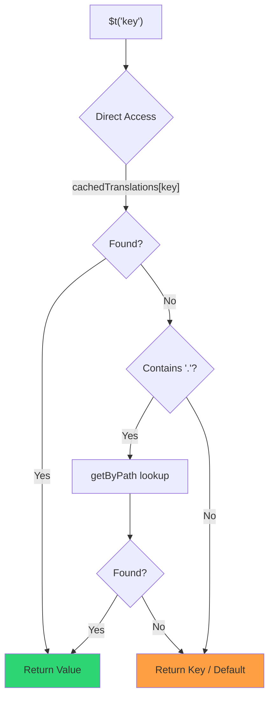

# 🚀 Průvodce výkonem

## 📖 Úvod

`Nuxt I18n Micro` je navržen s ohledem na výkon a nabízí významné zlepšení oproti tradičním internacionalizačním (i18n) modulům jako `nuxt-i18n`. Tento průvodce poskytuje detailní pohled na výkonové výhody použití `Nuxt I18n Micro` a jak se srovnává s jinými řešeními.

## 🤔 Proč se zaměřit na výkon?

Ve velkých projektech a prostředích s vysokým provozem mohou úzká místa výkonu vést k pomalým buildům, zvýšené spotřebě paměti a špatným odezvám serveru. Tyto problémy se výrazněji projeví u složitých i18n nastavení s velkými soubory překladů. `Nuxt I18n Micro` byl postaven, aby tyto výzvy přímo řešil optimalizací rychlosti, paměťové efektivity a minimálního dopadu na velikost bundlu vaší aplikace.

## 📊 Srovnání výkonu

Provedli jsme sérii testů na identických fixtures přes `pnpm test:performance` (`pnpm -C scripts cli performance`) proti **`@nuxtjs/i18n@10.6.0`**. Kompletní metodologii a grafy najdete v [Výsledcích výkonnostních testů](/guides/performance-results).

Výchozí CLI profil: **4 locale** × **2 stránky** (`index`, `page`) × ~10k listových klíčů pro index. Zvyšte `--locales` / `--keys` pro těžší zátěž regression-radaru. Report rozděluje **code**, **translations** (včetně `@nuxtjs/i18n` `chunks/raw/*`) a **total** deployable výstup.

```bash
pnpm test:performance
pnpm -C scripts cli performance --only micro --skip-stress
pnpm -C scripts cli performance --locales 12 --keys 100000 --runs 3
```

### ⏱️ Doba buildu a spotřeba zdrojů

<Accordion title="**@nuxtjs/i18n v10.6**">
- **Code Bundle**: 2.16 MB
- **Translations**: 7.21 MB (message chunks + locale payloads)
- **Total deployable**: 9.37 MB
- **Max Memory Usage**: 1,821 MB
- **Elapsed Time**: 8.34s (mean of 3)
</Accordion>

<Tip>
- **Code Bundle**: 1.74 MB — **~19 % menší kód než `@nuxtjs/i18n` v10.6**
- **Translations**: 6.8 MB (lazy-loaded JSON)
- **Total deployable**: 8.54 MB
- **Max Memory Usage**: 1,065 MB — **~41 % méně paměti než `@nuxtjs/i18n` v10.6**
- **Elapsed Time**: 5.34s — **~36 % rychlejší než `@nuxtjs/i18n` v10.6** (≈ baseline plain-nuxt)
</Tip>

> Starší dokumentace ukazovaly u `@nuxtjs/i18n` „code ≈ 15 MB / translations 0 B“, protože soubory zpráv `chunks/raw` počítaly jako kód aplikace. Aktuální klasifikátor je odděluje; propad v **code** je menší, ale micro stále vede v době buildu, špičkovém RSS a v load testech.

Kompletní benchmark report s grafy, výsledky Autocannon a detaily fixtures najdete v [Výsledcích výkonnostních testů](/guides/performance-results).

### 🌐 Výkon serveru pod zátěží

Artillery (6s@6 + 60s@60) a Autocannon (10c / 10s), průměr 3 po sobě jdoucích běhů na fixture.

<Accordion title="**@nuxtjs/i18n v10.6**">
- **Requests per Second (Artillery)**: 143 [#/sec]
- **Average Response Time**: 956 ms
- **Autocannon RPS / avg latency**: 72 / 139 ms
</Accordion>

<Tip>
- **Requests per Second (Artillery)**: 275 [#/sec] — **~93 % více než `@nuxtjs/i18n` v10.6**
- **Average Response Time**: 483 ms — **~49 % rychlejší než `@nuxtjs/i18n` v10.6**
- **Autocannon RPS / avg latency**: 162 / 62 ms
</Tip>

### 📈 Vizuální srovnání

<Note>
Interaktivní graf je v Mintlify dokumentaci vynechán. Podívejte se na tabulky benchmarků na této stránce nebo do [VitePress dokumentace](https://s00d.github.io/nuxt-i18n-micro/guide/performance-results) pro graf: `chart`.
</Note>

<Note>
Interaktivní graf je v Mintlify dokumentaci vynechán. Podívejte se na tabulky benchmarků na této stránce nebo do [VitePress dokumentace](https://s00d.github.io/nuxt-i18n-micro/guide/performance-results) pro graf: `chart`.
</Note>

| Metrika         | @nuxtjs/i18n v10.6 | i18n-micro | Zlepšení           |
| --------------- | ------------------ | ---------- | ------------------ |
| Doba buildu     | 8.34s              | 5.34s      | **~36 % rychlejší** |
| Paměť (build)   | 1,821 MB           | 1,065 MB   | **~41 % méně**     |
| Code Bundle     | 2.16 MB            | 1.74 MB    | **~19 % menší**    |
| Doba odezvy     | 956 ms             | 483 ms     | **~49 % rychlejší** |
| RPS (Artillery) | 143                | 275        | **~93 % více**     |

### 🔍 Interpretace výsledků

Proti aktuální `@nuxtjs/i18n` **v10.6** (výchozí CLI profil, průměr 3):

- 🗜️ **Menší graf kódu**: ~1.74 MB vs ~2.16 MB, když se message chunky nesprávně neoznačují jako „code“.
- 🧠 **Nižší build RSS**: ~1.1 GB špička vs ~1.8 GB.
- 🕒 **Rychlejší buildy**: ~5.3s vs ~8.3s (micro na tomto profilu odpovídá baseline plain-Nuxt).
- ⚡ **Výrazně lepší pod zátěží**: ~275 vs ~143 Artillery RPS, ~162 vs ~72 Autocannon RPS, nižší průměrná latence.

Absolutní čísla se liší od starších publikovaných tabulek (menší slovníky, starší Nuxt a nespravedlivé „0 B translations“ rozdělení pro `@nuxtjs/i18n`). Směrově je to stejné: micro zůstává vpředu v ceně buildu a propustnosti požadavků.

## ⚙️ Klíčové optimalizace

### 🛠️ Minimalistický design

`Nuxt I18n Micro` je postaven kolem minimalistické architektury s malým jádrem a vyhrazenými strategy balíčky. To snižuje režii a zjednodušuje interní logiku, což vede ke zlepšenému výkonu.

### 🚦 Efektivní routování

Ve v3 jsou generování rout a runtime logika cest rozděleny do vyhrazených balíčků pro optimální tree-shaking:

- **`@i18n-micro/route-strategy`**: Generování rout v době buildu, rozšiřuje Nuxt stránky o lokalizované routy. Zahrnuta je jen zvolená strategie (`no_prefix`, `prefix`, `prefix_except_default`, `prefix_and_default`).
- **`@i18n-micro/path-strategy`**: Runtime resolvování cest, přesměrování a generování odkazů. Používá čisté funkce a předpočítané context flagy pro minimalizaci alokací na hot paths. Subpath exporty (`/prefix`, `/no-prefix` a další) zajišťují, že se do bundlu dostane jen zvolená implementace.

Tento přístup udržuje konfiguraci routování odlehčenou a zajišťuje rychlé resolvování rout bez ohledu na počet locale.

### 📂 Zjednodušené načítání překladů

Modul podporuje pouze JSON soubory pro překlady, s jasným oddělením mezi globálními a stránkově specifickými soubory. Tím zajišťuje, že se v daný okamžik načítají jen potřebná data překladů, což dále zvyšuje výkon.

### 🔒 Singleton cache přes GlobalThis

Od v3.0.0 modul používá vzor singletonu přes `globalThis` s `Symbol.for`, aby zaručil jedinou instanci cache napříč celým Node.js procesem. Tím se zabrání:

- Duplikaci cache, když se stejný modul bundluje vícekrát
- Vytváření objektů per-request, které způsobuje tlak na garbage collection
- Únikům paměti kvůli osiřelým instancím cache

```mermaid
flowchart LR
    subgraph Process["Node.js Process"]
        G["globalThis[Symbol.for('CACHE')]"]

        subgraph R1["SSR Request 1"]
            P1[Plugin Instance] --> G
        end

        subgraph R2["SSR Request 2"]
            P2[Plugin Instance] --> G
        end

        subgraph R3["SSR Request 3"]
            P3[Plugin Instance] --> G
        end
    end

    G --> Cache["Single Map Instance"]
    Cache --> D1["en:index → translations"]
    Cache --> D2["en:about → translations"
```

```typescript
// Internal implementation pattern
const CACHE_KEY = Symbol.for('__NUXT_I18N_STORAGE_CACHE__')
if (!globalThis[CACHE_KEY]) {
  globalThis[CACHE_KEY] = new Map()
}
```

### ⚡ Optimalizovaná funkce překladu (tFast)

Funkce `$t()` používá strategii přímého lookupu optimalizovanou pro rychlost:

1. **Předpočítaný kontext**: Locale a název route se počítají jednou během navigace, ne při každém volání `$t()`
2. **Lookup z jednoho zdroje**: Všechny překlady (root + page-specific + fallback) jsou předsloučené v době buildu do jednoho souboru na stránku. Žádné vrstvené vyhledávání není potřeba.
3. **Kumulativní deep merge při navigaci**: Při navigaci v rámci stejného locale se nové překlady stránky deep-mergují (hloubka 2) do aktivního slovníku, takže klíče z předchozí stránky zůstávají viditelné během přechodových animací. Funguje to i tehdy, když stránky sdílí překrývající se vnořené prefixy (například obě stránky mají klíče pod `common.*`).
4. **Garbage collection přes `page:transition:finish`**: Po plném dokončení přechodové animace se sloučený slovník nahradí čistými překlady jen pro novou stránku a uvolní se paměť po klíčích ze staré stránky.
5. **Přímý přístup k vlastnostem**: Používá `obj[key]` místo Map lookupů pro hot paths.



```typescript
// Simplified lookup logic — single active dictionary
let val = cachedTranslations[key]
if (val === undefined && key.includes('.')) {
  val = getByPath(cachedTranslations, key)
}
```

### 💉 Načítání na straně serveru (bez vkládání do HTML)

Překlady načtené během SSR zůstávají v **paměti serveru** pro `$t` během renderu. **Nekopírují se** do `nuxtApp.payload` / HTML dokumentu (stejná myšlenka jako `@nuxtjs/i18n` s `experimental.preload: false`).

Na klientu `01.plugin.ts` `await`uje na `switchContext`, který načte `/\{apiBaseUrl\}/:page/:locale/data.json`, než aplikace pokračuje. Jeden request, ne 8 MB inline blob.

`NuxtI18n` stále drží aktivní sloučený slovník (`cachedTranslations`) pro `$t()` / `$has()`. Navigace v rámci stejného locale deep-mergují chunky stránek, dokud `page:transition:finish` neuklidí zastaralé klíče.

#### Kde to dnes stojí

Čísla níže se čtou z rozpočtového souboru, který `pnpm run budget:payload` měří a vynucuje.

{/* generated:payload-budget — do not edit; run `pnpm run docs:generate` */}

Měřeno na `playground` napříč `/`, `/de`:

| Měření | Velikost |
| --- | --- |
| Zdroje překladů na disku | 15.2 MB |
| Servírováno jako samostatné payload soubory | 76.3 MB |
| Největší inline `__NUXT_DATA__` | 6.9 MB |
| Klientská aktiva | 449.5 KB |

Playground záměrně nese předimenzovaný slovník, takže tyto hodnoty nejsou reálná očekávání pro produkční aplikaci. Jsou to pevné body, vůči kterým se měří. Rozpočet selže, když nečekaně vzrostou, takže se náhodná změna toho, co payload nese, hned zaznamená.

{/* /generated:payload-budget */}

### 💾 Cachování a předrenderování

Překlady procházejí několika cache a vědět, která odpověděla na request, je rozdíl mezi pětiminutovým a pětihodinovým debuggingem. Jsou čtyři, v pořadí, ve kterém je request potká:

| Vrstva | Kde | Životnost | Vymazává |
| --- | --- | --- | --- |
| Prohlížeč / CDN | `Cache-Control` na `/\{apiBaseUrl\}/**` | `httpCacheDuration`, `immutable` | nové `?v=` (deploy, který změnil překlady) |
| Nitro route cache | `routeRules['/\{apiBaseUrl\}/**'].cache` | 60 s, stale-while-revalidate | restart serveru |
| Server loader | in-process `CacheControl`, klíčováno `locale:routeName` | doba života procesu, nebo `cacheTtl` | restart serveru, HMR ve vývoji |
| Klientský store | `translationStorage` + aktivní chunk v `NuxtI18n` | doba života stránky | reload |

Dvě pravidla je udržují od vzájemného rozporu:

- **Nitro route cache existuje jen tehdy, když existuje `?v=`.** S cache-busterem je každá URL unikátní pro svůj obsah, takže cachování na serveru je bez rizika zastaralosti. Nastavte `dateBuild: 0` a tato vrstva se vypne, protože URL je pak stabilní a odpověď říká `must-revalidate`. Serverová cache by na dobu až minuty odpovídala ze zastaralého záznamu a tiše by tuto direktivu porazila.
- **`immutable` také vyžaduje `?v=`.** Bez busteru je hlavička `public, max-age=0, must-revalidate`, ať už `httpCacheDuration` říká cokoli: dlouhé `max-age` na URL, která se nikdy nemění, připne první odpověď, kterou prohlížeč kdy viděl.

<Warning>
S `translationPayloads.publicAssets` (výchozí v premerged režimu) se payloady kopírují do `public/<apiBaseUrl>/\{page\}/\{locale\}/data.json`. Platforma, která tento adresář servíruje sama (Cloudflare Pages, Firebase Hosting, `npx serve`), aplikuje své vlastní hlavičky. Hlavička z Nitro `routeRules` se dostane jen k odpovědím, které jdou přes server. Politiku cache pro tyto statické soubory nastavte v konfiguraci samotné platformy.
</Warning>

🏁 **Předrenderování**: v premerged režimu `publicAssets` už zapisuje strom klientských URL do `public/`. Přihlaste se k `prerenderRoutes` jen tehdy, když potřebujete Nitro pro materializaci handler rout a tato kopie je vypnutá.

### 🗜️ Komprimované veřejné payloady

Když je zapnutý `nitro.compressPublicAssets`, dostanou payloady překladů zkopírované do veřejného adresáře také `.gz` a `.br` sourozence:

```ts
export default defineNuxtConfig({
  nitro: { compressPublicAssets: true },
})
```

Nitro komprimuje veřejná aktiva před hookem, který kopíruje payloady, takže bez tohoto nastavení by to byla jediná nekomprimovaná část statického buildu. Modul kompresi sám nezapíná, jen aplikuje volbu, kterou jste zvolili. Selekce per-encoding (`\{ gzip: true, brotli: false \}`) je respektována.

Playground index payload: 6 651 984 B raw, 1 012 831 B gzip, 821 617 B brotli.

### ☁️ Serverless payload output

Na **Node** čte SSR JSON překladů z `public/<apiBaseUrl>` (`readFile`, bez Nitro `serverAssets` / Rollup `raw:`). Na **Edge** Nitro `serverAssets` embeduje stejný strom (preferujte `mode: 'source'` pro velké katalogy).

```typescript
export default defineNuxtConfig({
  i18n: {
    translationPayloads: {
      serverAssets: true, // default — Node → public copy; Edge → serverAssets embed
      publicAssets: true, // default in premerged mode
    },
  },
})
```

Pro kompaktní Edge embedy (a volitelné kompaktní veřejné kopie) použijte `translationPayloads.mode: 'source'`:

```typescript
export default defineNuxtConfig({
  i18n: {
    translationPayloads: {
      mode: 'source',
    },
  },
})
```

`mode: 'source'` udržuje vrstvami sloučené zdrojové soubory kompaktní a slučuje root/page/fallback za běhu přes vestavěnou routu `/_locales` (nebo Edge `assets:i18n`). Ve výchozím stavu vypíná kopie veřejných aktiv a předrenderované payload routy.

<Warning>
`prerenderRoutes` má výchozí hodnotu `false`. S `mode: 'source'` má také `publicAssets` výchozí hodnotu `false`. Čistý statický hosting bez Nitro/edge runtime tedy nemůže načíst překlady na klientu, dokud nezapnete jeden z těchto výstupů, neponecháte `serverHandler` dostupný za běhu, nebo nehostujete payloady externě.

Výchozí premerged + `publicAssets` už umisťuje `/\{apiBaseUrl\}/\{page\}/\{locale\}/data.json` pod `public/`, takže statické hosty mohou obsluhovat klientské fetch bez Nitro.
</Warning>

<Warning>
Nastavení `apiBaseServerHost` nebo `apiBaseClientHost` přesouvá obsluhu payloadů na tento origin, což s sebou nese vlastní požadavky. Viz [Konfigurace → Externí CDN hostitelé](/guides/configuration#external-cdn-hosts).
</Warning>

Nebo vypněte jednotlivé HTTP/veřejné výstupy a hostujte payloady externě:

```typescript
export default defineNuxtConfig({
  i18n: {
    apiBaseClientHost: 'https://cdn.example.com',
    apiBaseServerHost: 'https://cdn.example.com',
    translationPayloads: {
      serverHandler: false,
      publicAssets: false,
      prerenderRoutes: false,
    },
  },
})
```

Ponechte `serverHandler` zapnutý, když se spoléháte na vestavěnou lokální routu `/\{apiBaseUrl\}/:page/:locale/data.json`. Vypněte ji, když jsou payloady hostované externě a `apiBaseServerHost` míří na externí origin. Zapněte `prerenderRoutes` jen tehdy, když potřebujete, aby Nitro materializovalo statické payload routy a `publicAssets` je už nezapsalo.

Během buildu modul varuje, když vygenerovaný payload output překročí `translationPayloads.warnFileCount` (výchozí 500) nebo `translationPayloads.warnSizeBytes` (výchozí 10 MB). Také varuje, když jsou všechny lokální výstupy vypnuté bez nakonfigurovaných externích hostitelů pro payloady.

## 📝 Tipy pro maximalizaci výkonu

Zde je několik tipů, jak dostat nejlepší výkon z `Nuxt I18n Micro`:

- 📉 **Omezte data locale**: Do projektu zahrňte jen locale, které potřebujete, aby velikost bundlu zůstala malá.
- 🗂️ **Používejte stránkově specifické překlady**: Organizujte soubory překladů podle stránek, abyste se vyhnuli načítání zbytečných dat.
- 💾 **Zapněte cachování**: Využijte funkce cachování pro snížení zátěže serveru a zlepšení doby odezvy.
- 🏁 **Využijte předrenderování**: Předrenderujte překlady pro zrychlení načítání stránek a snížení runtime režie.

Podrobné výsledky výkonnostních testů najdete v [Výsledcích výkonnostních testů](/guides/performance-results).
