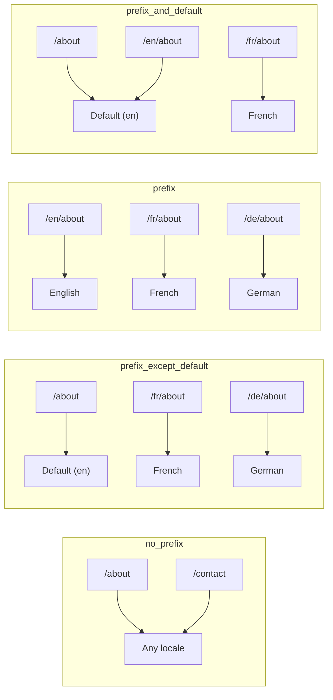
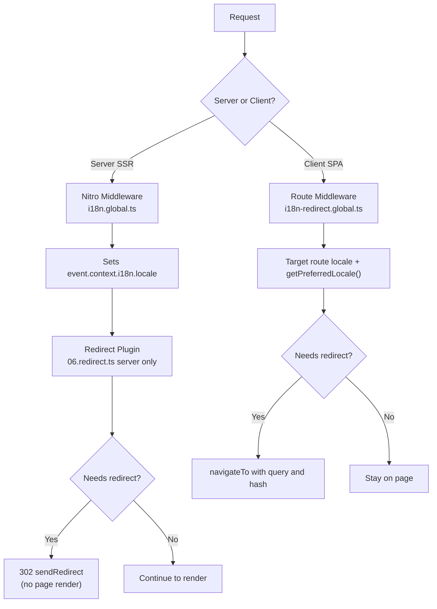

# 🗂️ Strategie routování v Nuxt I18n Micro

## 📖 Přehled

Nuxt I18n Micro řídí, jak se v URL objevují prefixy locale, přes volbu `strategy`. Pod kapotou to implementují dva balíčky:

- **`@i18n-micro/route-strategy`**: generování rout v době buildu (rozšiřuje Nuxt stránky o lokalizované routy)
- **`@i18n-micro/path-strategy`**: runtime resolvování cest, přesměrování, SEO atributy a generování odkazů

Nuxt modul vybírá správnou strategy třídu v době buildu a aliasuje ji přes `#i18n-strategy`, takže se do bundlu dostane jen zvolená implementace.

## 🚦 Dostupné strategie

{/* generated:option:strategy — do not edit; run `pnpm run docs:generate` */}

**Typ** `Strategies` · **Výchozí** `'prefix_except_default'`

Strategie routování URL pro prefixy locale.

- `'no_prefix'`: bez locale v URL; locale uložený v cookie.
- `'prefix_except_default'`: prefix pro všechna locale kromě výchozího.
- `'prefix'`: vždy prefix, včetně výchozího locale.
- `'prefix_and_default'`: jako `prefix`, ale výchozí locale je dostupný i bez prefixu.

{/* /generated:option:strategy */}

### Srovnání strategií



### 🛑 `no_prefix`

URL nemají žádný segment locale. Locale se určuje z cookies, ze stavu `useI18nLocale()` nebo detekcí prohlížečem.

- **Routy**: `/about`, `/contact`. Stejný URL vzor pro všechna locale (bez prefixu `/en/`, `/fr/`)
- **Perzistence locale**: Přes `localeCookie` (automaticky nastaveno na `'user-locale'`, pokud není zadáno)
- **Vlastní cesty**: Podporovány přes [`globalLocaleRoutes`](/guides/configuration#globallocaleroutes) a [`defineI18nRoute`](/guides/custom-locale-routes). Lokalizované slugy se generují bez přidávání prefixu locale k URL (například `/about` vs `/ueber-uns`). Vnořené routy, aliasy a per-locale omezení jsou jednodušší než v `prefix_except_default`.

<Tip>
Při použití `no_prefix` je `localeCookie` automaticky nastaveno na `'user-locale'`, pokud není zadáno. To je vyžadováno, protože URL neobsahuje žádné informace o locale.
</Tip>

```typescript
i18n: {
  strategy: 'no_prefix'
  // localeCookie is automatically set to 'user-locale'
}
```

### 🚧 `prefix_except_default`

Všechny routy mají prefix locale **kromě** výchozího locale.

- **Výchozí locale**: `/about`, `/contact`
- **Ostatní locale**: `/fr/about`, `/de/contact`
- **Výchozí locale s prefixem vrací 404**: `/en/about` → 404 (když je `en` výchozí)

```typescript
i18n: {
  strategy: 'prefix_except_default' // This is the default
}
```

### 🌍 `prefix`

Každá routa má prefix locale, včetně výchozího.

- **Všechna locale**: `/en/about`, `/fr/about`, `/de/about`
- **Kořen `/`**: Přesměrovává na `/\{locale\}/` podle preference uživatele

```typescript
i18n: {
  strategy: 'prefix'
}
```

### 🔄 `prefix_and_default`

Výchozí locale je dostupný jak s prefixem, tak bez něj. Ne-výchozí locale mají vždy prefix.

- **Výchozí locale**: platné jsou obě `/about` i `/en/about`
- **Ostatní locale**: `/fr/about`, `/de/about`
- **Žádné přesměrování z `/`**: `/` i `/en/` servírují výchozí locale

```typescript
i18n: {
  strategy: 'prefix_and_default'
}
```

## 🔀 Architektura přesměrování (v3)

Ve v3 je logika přesměrování rozdělena do dvou vrstev pro optimální výkon:

### Jak to funguje



### Na straně serveru (bez flashů)

1. **Nitro middleware** (`i18n.global.ts`) běží první. Detekuje locale z URL, cookie nebo hlavičky `Accept-Language` a nastaví `event.context.i18n.locale`
2. **Redirect plugin** (`06.redirect.ts`, pouze na serveru) zkontroluje, zda aktuální cesta potřebuje přesměrování pomocí `i18nStrategy.getClientRedirect()`, a vydá 302 **před** jakýmkoli renderem stránky
3. Tím se zabrání „error flash“, kdy uživatelé krátce vidí špatnou stránku před přesměrováním

### Na straně klienta (SPA navigace)

1. Globální route middleware (`i18n-redirect.global.ts`) běží při každé klientské navigaci, když je `redirects` zapnuto
2. Nejprve odvozuje preferovaný locale z **cílové routy**, pak se vrací k `useI18nLocale().getPreferredLocale()`
3. Používá `i18nStrategy.getClientRedirect()` pro rozhodnutí, zda je přesměrování potřeba
4. Při přesměrování zachovává `query` a `hash`

### Pořadí priority locale

Na serveru redirect plugin určuje preferovaný locale v tomto pořadí:

1. **`useState('i18n-locale')`**: nejvyšší priorita (nastaveno programově přes `useI18nLocale().setLocale()`)
2. **Cookie**: pokud je `localeCookie` nakonfigurováno
3. **Hlavička `Accept-Language`**: pokud `autoDetectLanguage: true`
4. **`defaultLocale`**: finální fallback

Na klientu route middleware preferuje locale z cílové routy, pak používá stejný fallback řetězec state/cookie.

### Chování přesměrování podle strategie

| Strategie               | Chování `GET /`                                 | Cookie vyžadována? |
| ----------------------- | ----------------------------------------------- | ---------------- |
| `no_prefix`             | Bez přesměrování (locale z cookie/state)        | Nastaveno automaticky |
| `prefix`                | 302 → `/\{locale\}/`                              | Doporučeno       |
| `prefix_except_default` | 302 → `/\{locale\}/` pokud locale ≠ výchozí       | Doporučeno       |
| `prefix_and_default`    | Bez přesměrování (obě `/` i `/\{locale\}/` platné) | Volitelné        |

### Vypnutí přesměrování

```typescript
i18n: {
  redirects: false // Disables automatic locale redirects
}
```

Když `redirects: false`, automatická přesměrování locale jsou vypnutá:

- **Server**: redirect plugin (`06.redirect.ts`, pouze na serveru) zůstává zaregistrován, ale přeskakuje logiku přesměrování. Stále provádí **kontroly 404** pro nevalidní prefixy locale (například `/xx/about`, kde `xx` není platný locale) a **synchronizaci cookie** z URL prefixu (například návštěva `/fr/about` synchronizuje cookie na `fr`)
- **Klient**: globální route middleware `i18n-redirect` **není zaregistrován**. Žádné SPA auto-přesměrování

## 🍪 Perzistence locale přes cookie

<Warning>
Při použití `prefix` nebo `prefix_except_default` s `redirects: true` (výchozí) **musíte** nastavit `localeCookie`, aby přesměrování fungovala správně. Bez cookie si redirect plugin nemůže zapamatovat preferenci locale uživatele napříč reloady stránky.

```typescript
i18n: {
  strategy: 'prefix_except_default',
  localeCookie: 'user-locale' // Required for redirects to work properly
}
```
</Warning>

**Jak `localeCookie` funguje ve v3:**

- Spravuje ho interně `useI18nLocale()`. **Nenastavujte ho ručně** přes `useCookie()`
- Když uživatel navštíví URL s prefixem (například `/fr/about`), cookie se automaticky synchronizuje na `fr`
- Při další návštěvě `/` se hodnota cookie použije pro přesměrování na `/\{locale\}/`
- Pokud cookie obsahuje nevalidní locale (není v seznamu `locales`), použije se fallback na `defaultLocale`

| Strategie               | Výchozí `localeCookie` | Poznámky                             |
| ----------------------- | ---------------------- | ------------------------------------ |
| `no_prefix`             | Auto: `'user-locale'`  | Vyžadováno; nastaveno automaticky    |
| `prefix`                | `null` (vypnuto)       | Nastavte na `'user-locale'` pro přesměrování |
| `prefix_except_default` | `null` (vypnuto)       | Nastavte na `'user-locale'` pro přesměrování |
| `prefix_and_default`    | `null` (vypnuto)       | Volitelné                            |

## 🔍 `autoDetectLanguage` a `autoDetectPath`

### `autoDetectLanguage`

{/* generated:option:autoDetectLanguage — do not edit; run `pnpm run docs:generate` */}

**Typ** `boolean` · **Výchozí** `true`

Automaticky detekuje preferovaný jazyk uživatele z HTTP hlavičky `Accept-Language`. Používá se v kombinaci s `autoDetectPath` pro rozhodnutí, kdy detekce probíhá.

{/* /generated:option:autoDetectLanguage */}

Kontrola běží v serverovém middleware a je fallbackem: cookie nebo existující state vyhrává.

```typescript
i18n: {
  autoDetectLanguage: true
}
```

### `autoDetectPath`

{/* generated:option:autoDetectPath — do not edit; run `pnpm run docs:generate` */}

**Typ** `string` · **Výchozí** `'/'`

Kde mohou přesměrování podle cookie / Accept-Language běžet (když je `redirects` zapnuto).

- `'/'`: pouze `/` (deep linky v výchozím locale zůstávají dosažitelné; výchozí)
- `'no_prefix'`: pouze cesty bez prefixu locale
- `'*'`: každá cesta, včetně přepsání explicitního prefixu locale (například `/fr/about` → `/de/about`, když cookie preferuje `de`)

- jakýkoli jiný řetězec: přesná shoda cesty (například `'/welcome'`)

Úklid prefixované strategie (například `/en` → `/` pod `prefix_except_default`) není podmíněný.

{/* /generated:option:autoDetectPath */}

```typescript
i18n: {
  autoDetectPath: '/' // Default: only root
  // autoDetectPath: '*' // All paths — redirects even /fr/about to /de/about
}
```

<Warning>
S `autoDetectPath: '*'` budou přesměrovány i URL s explicitním prefixem locale (například `/fr/about`), pokud se preferovaný locale uživatele liší. To může být užitečné pro doménová nastavení, ale může mást uživatele, kteří URL sdílí.
</Warning>

S výchozím `autoDetectPath: '/'` a cookie locale:

| požadavek | cookie | výsledek |
| --- | --- | --- |
| `/` | `de` | 302 → `/de` |
| `/about` | `de` | 200, výchozí locale (bez přepsání) |

```typescript
i18n: {
  localeCookie: 'user-locale',
  strategy: 'prefix_except_default',
  // Default — remember language on entry, keep deep links stable
  autoDetectPath: '/',
  // Or redirect on every unprefixed path (but not /de/… → /fr/…):
  // autoDetectPath: 'no_prefix',
}
```

## ⚠️ Známé problémy a osvědčené postupy

### 1. Hydratační neshoda ve strategii `no_prefix`

Při použití `no_prefix` se locale určuje dynamicky. Pokud server a klient nesouhlasí na locale, uvidíte hydratační neshodu.

**Řešení**: Použijte `useI18nLocale().setLocale()` v serverovém pluginu (s `order: -10`) pro nastavení locale před inicializací i18n:

```ts
// plugins/i18n-loader.server.ts
export default defineNuxtPlugin({
  name: 'i18n-custom-loader',
  enforce: 'pre',
  order: -10,
  setup() {
    const { setLocale } = useI18nLocale()
    setLocale('ja') // Your detection logic here
  },
})
```

Podrobné příklady najdete v [Vlastní detekci jazyka](/guides/custom-language-detection).

### 2. Používejte pojmenované routy s `localeRoute`

Routování založené na cestě může způsobit problémy s resolvingem routy:

```typescript
// May cause issues
$localeRoute('/page')

// Preferred approach
$localeRoute({ name: 'page' })
```

### 3. Použití `pages: false` s i18n

Při použití Nuxtu s `pages: false`:

```typescript
export default defineNuxtConfig({
  pages: false,
  i18n: {
    strategy: 'no_prefix', // Recommended
    disablePageLocales: true, // Required
    localeCookie: 'user-locale', // Required for persistence
  },
})
```

**Omezení s `pages: false`:**

- Žádná automatická přesměrování
- Žádná detekce locale na základě URL
- Přepínání locale na klientu vyžaduje reload stránky nebo manuální načtení překladů

### 4. Zpracování nevalidní cookie

Pokud cookie obsahuje nevalidní locale (není v seznamu `locales`), modul se elegantně vrátí k `defaultLocale`. Žádné chyby se nevyhazují.

## 📝 Shrnutí osvědčených postupů

| Doporučení                | Detaily                                                                             |
| ------------------------- | ----------------------------------------------------------------------------------- |
| **Nastavte `localeCookie`** | Vždy nastavte pro prefixové strategie s `redirects: true`                          |
| **Používejte `useI18nLocale()`** | Centralizovaný způsob správy stavu locale (nahrazuje manuální `useState`/`useCookie`) |
| **Používejte pojmenované routy** | `$localeRoute(\{ name: 'page' \})` místo `$localeRoute('/page')`                      |
| **Programový locale**     | Používejte `useI18nLocale().setLocale()` v serverovém pluginu s `order: -10`        |
| **Vyhněte se manuálním cookies** | Nepoužívejte `useCookie('user-locale')` přímo. To spravuje `useI18nLocale()`       |
