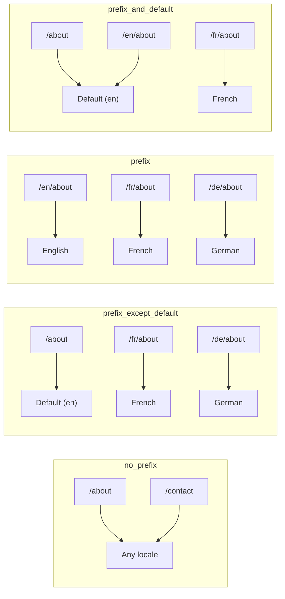
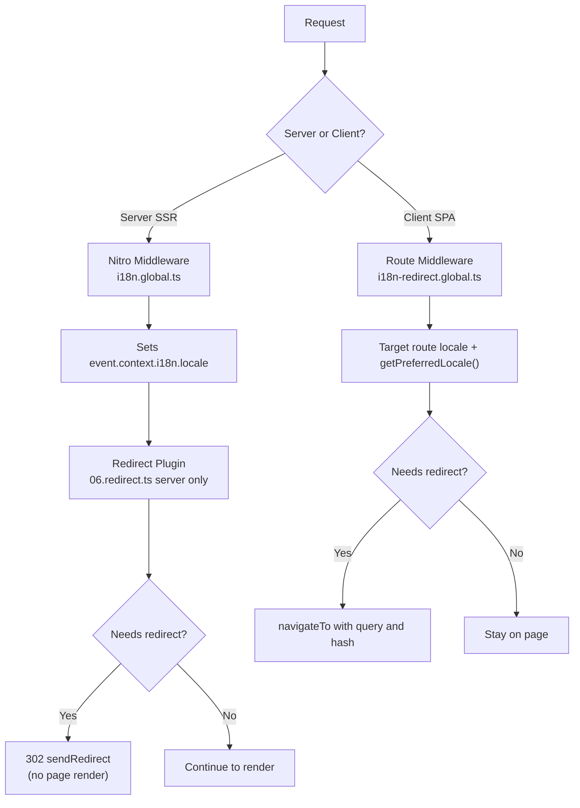

# 🗂️ Strategie routování v Nuxt I18n Micro

## 📖 Přehled

Nuxt I18n Micro řídí, jak se v URL objevují prefixy locale, pomocí volby `strategy`. Pod kapotou to implementují dva balíčky:

- **`@i18n-micro/route-strategy`** — generování rout při buildu (rozšiřuje Nuxt stránky o lokalizované routy)
- **`@i18n-micro/path-strategy`** — runtime řešení cest, přesměrování, SEO atributy a generování odkazů

Nuxt modul vybírá správnou třídu strategie při buildu a aliasuje ji přes `#i18n-strategy`, takže se do bundle dostává pouze zvolená implementace.

## 🚦 Dostupné strategie

{/* generated:option:strategy — do not edit; run `pnpm run docs:generate` */}

**Typ** `Strategies` · **Výchozí** `'prefix_except_default'`

Strategie routování URL pro prefixy locale.

- `'no_prefix'` — v URL není locale; locale uloženo v cookie.
- `'prefix_except_default'` — prefix pro všechny locale kromě výchozího.
- `'prefix'` — vždy prefix, včetně výchozího locale.
- `'prefix_and_default'` — jako `prefix`, ale výchozí locale je také dostupný bez prefixu.

{/* /generated:option:strategy */}

### Porovnání strategií



### 🛑 `no_prefix`

URL nemají segment locale. Locale se určuje pomocí cookies, stavu `useI18nLocale()` nebo detekce prohlížeče.

- **Routy**: `/about`, `/contact` — stejný vzor URL pro všechny locale (žádný prefix `/en/`, `/fr/`)
- **Perzistence locale**: Přes `localeCookie` (automaticky nastaveno na `'user-locale'`, pokud není specifikováno)
- **Vlastní cesty**: Podporovány přes [`globalLocaleRoutes`](/guides/configuration#globallocaleroutes) a [`defineI18nRoute`](/guides/custom-locale-routes) — lokalizované slugy se generují bez přidání prefixu locale do URL (např. `/about` vs `/ueber-uns`). Vnořené routy, aliasy a per-locale omezení jsou jednodušší než u `prefix_except_default`.

<Tip>
Při použití `no_prefix` je `localeCookie` automaticky nastaven na `'user-locale'`, pokud není specifikován. To je nutné, protože URL neobsahuje žádné informace o locale.
</Tip>

```typescript
i18n: {
  strategy: 'no_prefix'
  // localeCookie is automatically set to 'user-locale'
}
```

### 🚧 `prefix_except_default`

Všechny routy mají prefix locale **kromě** výchozího locale.

- **Výchozí locale**: `/about`, `/contact`
- **Ostatní locale**: `/fr/about`, `/de/contact`
- **Výchozí locale s prefixem vrací 404**: `/en/about` → 404 (když je `en` výchozí)

```typescript
i18n: {
  strategy: 'prefix_except_default' // This is the default
}
```

### 🌍 `prefix`

Každá routa má prefix locale, včetně výchozího locale.

- **Všechna locale**: `/en/about`, `/fr/about`, `/de/about`
- **Root `/`**: Přesměruje na `/\{locale\}/` na základě preferencí uživatele

```typescript
i18n: {
  strategy: 'prefix'
}
```

### 🔄 `prefix_and_default`

Výchozí locale je dostupné s prefixem i bez něj. Non-default locale mají vždy prefix.

- **Výchozí locale**: platné jsou obě `/about` i `/en/about`
- **Ostatní locale**: `/fr/about`, `/de/about`
- **Bez přesměrování z `/`**: Jak `/`, tak `/en/` obsluhují výchozí locale

```typescript
i18n: {
  strategy: 'prefix_and_default'
}
```

## 🔀 Architektura přesměrování (v3)

Ve v3 je logika přesměrování rozdělena do dvou vrstev pro optimální výkon:

### Jak to funguje



### Na straně serveru (bez „flashe")

1. **Nitro middleware** (`i18n.global.ts`) se spouští jako první — detekuje locale z URL, cookie nebo hlavičky `Accept-Language` a nastavuje `event.context.i18n.locale`
2. **Redirect plugin** (`06.redirect.ts`, pouze server) kontroluje pomocí `i18nStrategy.getClientRedirect()`, zda aktuální cesta potřebuje přesměrování, a vydá 302 **před** jakýmkoli vykreslením stránky
3. To zabraňuje „error flashi", při kterém by uživatelé krátce viděli nesprávnou stránku před přesměrováním

### Na straně klienta (SPA navigace)

1. Globální route middleware (`i18n-redirect.global.ts`) se spouští při každé klientské navigaci, když je `redirects` povoleno
2. Odvozuje preferované locale nejprve z **cílové routy**, poté spadá zpět na `useI18nLocale().getPreferredLocale()`
3. Používá `i18nStrategy.getClientRedirect()` k rozhodnutí, zda je potřeba přesměrování
4. Při přesměrování zachovává `query` a `hash`

### Pořadí priority locale

Na serveru redirect plugin určuje preferované locale v tomto pořadí:

1. **`useState('i18n-locale')`** — nejvyšší priorita (nastaveno programově přes `useI18nLocale().setLocale()`)
2. **Cookie** — pokud je nakonfigurována `localeCookie`
3. **Hlavička `Accept-Language`** — pokud `autoDetectLanguage: true`
4. **`defaultLocale`** — finální fallback

Na klientu route middleware preferuje locale z cílové routy, poté používá stejný fallback řetězec state/cookie.

### Chování přesměrování podle strategie

| Strategie               | Chování `GET /`                               | Vyžadována cookie? |
| ----------------------- | --------------------------------------------- | ------------------ |
| `no_prefix`             | Bez přesměrování (locale z cookie/stavu)      | Auto-set           |
| `prefix`                | 302 → `/\{locale\}/`                          | Doporučeno         |
| `prefix_except_default` | 302 → `/\{locale\}/` pokud locale ≠ výchozí   | Doporučeno         |
| `prefix_and_default`    | Bez přesměrování (`/` i `/\{locale\}/` platné) | Volitelné          |

### Zakázání přesměrování

```typescript
i18n: {
  redirects: false // Disables automatic locale redirects
}
```

Když `redirects: false`, automatická přesměrování locale jsou zakázána:

- **Server**: redirect plugin (`06.redirect.ts`, pouze server) zůstává registrován, ale přeskakuje logiku přesměrování. Stále provádí **kontroly 404** pro neplatné prefixy locale (např. `/xx/about`, kde `xx` není platný locale) a **synchronizaci cookie** z prefixu URL (např. návštěva `/fr/about` synchronizuje cookie na `fr`)
- **Klient**: globální route middleware `i18n-redirect` **není registrován** — žádné SPA auto-přesměrování

## 🍪 Perzistence locale pomocí cookie

<Warning>
Při použití `prefix` nebo `prefix_except_default` s `redirects: true` (výchozí) **musíte** nastavit `localeCookie`, aby přesměrování fungovala správně. Bez cookie si redirect plugin nemůže zapamatovat preferenci locale uživatele mezi znovunačteními stránky.

```typescript
i18n: {
  strategy: 'prefix_except_default',
  localeCookie: 'user-locale' // Required for redirects to work properly
}
```
</Warning>

**Jak `localeCookie` funguje ve v3:**

- Spravováno interně přes `useI18nLocale()` — **nenastavujte ji ručně** přes `useCookie()`
- Když uživatel navštíví prefixovanou URL (např. `/fr/about`), cookie je automaticky synchronizována na `fr`
- Při další návštěvě `/` se hodnota cookie použije k přesměrování na `/\{locale\}/`
- Pokud cookie obsahuje neplatné locale (není v seznamu `locales`), spadne zpět na `defaultLocale`

| Strategie               | Výchozí `localeCookie`   | Poznámky                            |
| ----------------------- | ------------------------ | ----------------------------------- |
| `no_prefix`             | Auto: `'user-locale'`    | Vyžadováno; nastaveno automaticky   |
| `prefix`                | `null` (zakázáno)        | Nastavte na `'user-locale'` pro přesměrování |
| `prefix_except_default` | `null` (zakázáno)        | Nastavte na `'user-locale'` pro přesměrování |
| `prefix_and_default`    | `null` (zakázáno)        | Volitelné                           |

## 🔍 `autoDetectLanguage` a `autoDetectPath`

### `autoDetectLanguage`

{/* generated:option:autoDetectLanguage — do not edit; run `pnpm run docs:generate` */}

**Typ** `boolean` · **Výchozí** `true`

Automaticky detekuje preferovaný jazyk uživatele z HTTP hlavičky `Accept-Language`.
Používá se v kombinaci s `autoDetectPath` k rozhodnutí, kdy detekce probíhá.

{/* /generated:option:autoDetectLanguage */}

Kontrola probíhá v serverovém middleware a je fallbackem: cookie nebo existující stav vyhrává.

```typescript
i18n: {
  autoDetectLanguage: true
}
```

### `autoDetectPath`

{/* generated:option:autoDetectPath — do not edit; run `pnpm run docs:generate` */}

**Typ** `string` · **Výchozí** `'/'`

Kde mohou probíhat přesměrování podle preference cookie / Accept-Language (když je `redirects` povoleno).

- `'/'` — pouze `/` (deep linky ve výchozím locale zůstávají dosažitelné; výchozí)
- `'no_prefix'` — pouze cesty bez prefixu locale
- `'*'` — každá cesta, včetně přepisu explicitního prefixu locale
  (např. `/fr/about` → `/de/about`, když cookie preferuje `de`)

- jakýkoli jiný řetězec — přesná shoda cesty (např. `'/welcome'`)

Úklid prefixové strategie (např. `/en` → `/` pod `prefix_except_default`) není gated.

{/* /generated:option:autoDetectPath */}

```typescript
i18n: {
  autoDetectPath: '/' // Default: only root
  // autoDetectPath: '*' // All paths — redirects even /fr/about to /de/about
}
```

<Warning>
S `autoDetectPath: '*'` budou přesměrovány i URL s explicitním prefixem locale (např. `/fr/about`), pokud se preferované locale uživatele liší. To může být užitečné pro nastavení založená na doméně, ale může zmást uživatele, kteří sdílejí URL.
</Warning>

S výchozí `autoDetectPath: '/'` a locale cookie:

| požadavek | cookie | výsledek |
| --- | --- | --- |
| `/` | `de` | 302 → `/de` |
| `/about` | `de` | 200, výchozí locale (bez přepisu) |

```typescript
i18n: {
  localeCookie: 'user-locale',
  strategy: 'prefix_except_default',
  // Default — remember language on entry, keep deep links stable
  autoDetectPath: '/',
  // Or redirect on every unprefixed path (but not /de/… → /fr/…):
  // autoDetectPath: 'no_prefix',
}
```

## ⚠️ Známé problémy a osvědčené postupy

### 1. Nesoulad při hydrataci ve strategii `no_prefix`

Při použití `no_prefix` je locale určeno dynamicky. Pokud se server a klient neshodnou na locale, uvidíte nesoulad při hydrataci.

**Řešení**: Použijte `useI18nLocale().setLocale()` v serverovém pluginu (s `order: -10`) k nastavení locale před inicializací i18n:

```ts
// plugins/i18n-loader.server.ts
export default defineNuxtPlugin({
  name: 'i18n-custom-loader',
  enforce: 'pre',
  order: -10,
  setup() {
    const { setLocale } = useI18nLocale()
    setLocale('ja') // Your detection logic here
  },
})
```

Podrobné příklady viz [Vlastní detekce jazyka](/guides/custom-language-detection).

### 2. Používejte pojmenované routy s `localeRoute`

Routování založené na cestě může způsobovat problémy s řešením rout:

```typescript
// May cause issues
$localeRoute('/page')

// Preferred approach
$localeRoute({ name: 'page' })
```

### 3. Použití `pages: false` s i18n

Při použití Nuxt s `pages: false`:

```typescript
export default defineNuxtConfig({
  pages: false,
  i18n: {
    strategy: 'no_prefix', // Recommended
    disablePageLocales: true, // Required
    localeCookie: 'user-locale', // Required for persistence
  },
})
```

**Omezení s `pages: false`:**

- Bez automatických přesměrování
- Bez detekce locale založené na URL
- Přepínání locale na straně klienta vyžaduje znovunačtení stránky nebo ruční načtení překladů

### 4. Zpracování neplatné cookie

Pokud cookie obsahuje neplatné locale (není v seznamu `locales`), modul elegantně spadne zpět na `defaultLocale`. Nejsou vyvolány žádné chyby.

## 📝 Souhrn osvědčených postupů

| Doporučení                 | Detaily                                                                             |
| -------------------------- | ----------------------------------------------------------------------------------- |
| **Nastavte `localeCookie`** | Vždy nastavte pro prefix strategie s `redirects: true`                             |
| **Používejte `useI18nLocale()`** | Centralizovaný způsob správy stavu locale (nahrazuje ruční `useState`/`useCookie`) |
| **Používejte pojmenované routy** | `$localeRoute(\{ name: 'page' \})` místo `$localeRoute('/page')`                    |
| **Programové locale**       | Použijte `useI18nLocale().setLocale()` v serverovém pluginu s `order: -10`         |
| **Vyhněte se ručním cookies** | Nepoužívejte `useCookie('user-locale')` přímo — `useI18nLocale()` to spravuje       |
