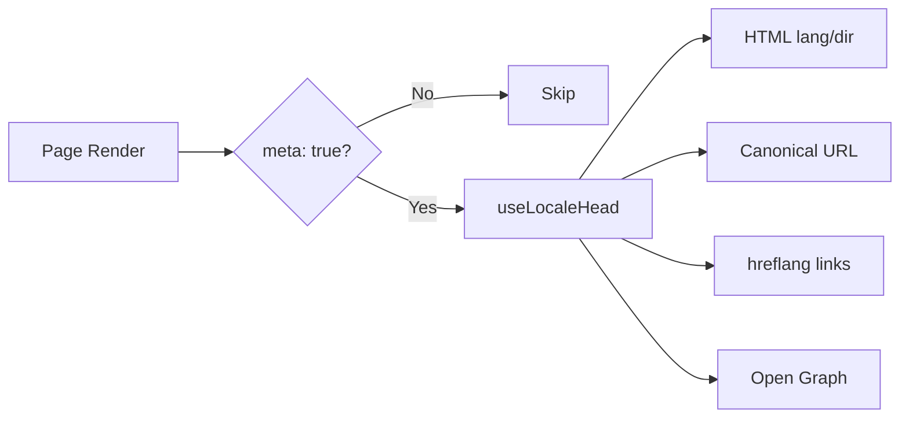

# 🌐 Průvodce SEO pro Nuxt I18n Micro

## 📖 Úvod

Efektivní SEO (Search Engine Optimization) je zásadní pro zajištění, že váš vícejazyčný web je přístupný a viditelný pro uživatele po celém světě přes vyhledávače. `Nuxt I18n Micro` zjednodušuje proces správy SEO pro vícejazyčné weby automatickým generováním nezbytných meta tagů a atributů, které informují vyhledávače o struktuře a obsahu vašeho webu.

Tento průvodce vysvětluje, jak `Nuxt I18n Micro` zpracovává SEO pro zlepšení viditelnosti webu a uživatelské zkušenosti bez potřeby další konfigurace.

## ⚙️ Automatické zpracování SEO

### Tok generování SEO meta



**Generované tagy:**

| Tag             | Příklad                                                  |
| --------------- | -------------------------------------------------------- |
| HTML atributy   | `<html lang="en" dir="ltr">`                             |
| Canonical       | `<link rel="canonical" href="...">`                      |
| hreflang        | `<link rel="alternate" hreflang="en" href="...">`        |
| x-default       | `<link rel="alternate" hreflang="x-default" href="...">` |
| Open Graph      | `<meta property="og:locale" content="en_US">`            |

#### `og` per locale (`og:locale` vs BCP 47)

`<html lang>` a `hreflang` používají **BCP 47** přes `locale.iso` (například `ar-AE`).  
Open Graph vyžaduje **`language_TERRITORY`** s **podtržítkem** (`ar_AE`) podle [OG protokolu](https://ogp.me/).

Ve výchozím stavu se `og:locale` odvozuje z `iso`, když je mapování jednoznačné (`en-US` → `en_US`).  
Explicitní řetězec **`og`** nastavte, když potřebujete vlastní hodnotu (například `zh-Hans` → `zh_CN`).  
Pokud není k dispozici ani `og`, ani převoditelné `iso`, `og:locale` tagy se negenerují. Ve vývoji dostanete konzolové varování (respektuje `missingWarn`).

```typescript
i18n: {
  meta: true,
  locales: [
    { code: 'ar', iso: 'ar-AE', og: 'ar_AE', dir: 'rtl' },
    { code: 'en', iso: 'en-US' }, // og:locale → en_US
    { code: 'zh', iso: 'zh-Hans', og: 'zh_CN' }, // script tags need explicit og
  ],
}
```

### 🔑 Klíčové SEO funkce

Když je v `Nuxt I18n Micro` zapnutá volba `meta`, modul automaticky spravuje následující aspekty SEO:

1. **🌍 Atributy jazyka a směru**:
   - Modul nastavuje atributy `lang` a `dir` na tagu `<html>` podle aktuálního locale a směru textu (například `ltr` pro angličtinu nebo `rtl` pro arabštinu).

2. **🔗 Canonical URL**:
   - Modul generuje canonical link (`<link rel="canonical">`) pro každou stránku a zajišťuje, že vyhledávače rozpoznají primární verzi obsahu.

3. **🌐 Alternativní jazykové odkazy (`hreflang`)**:
   - Modul automaticky generuje tagy `<link rel="alternate" hreflang="">` pro všechny dostupné locale. To pomáhá vyhledávačům pochopit, které jazykové verze obsahu jsou dostupné, a zlepšuje uživatelskou zkušenost pro globální publikum.
   - Každý locale emituje **jeden** tag: `hreflang = iso || code`. Když je nastaveno `iso`, routovací `code` se jako `hreflang` nikdy nepoužívá (takže market klíče jako `mx` se nestanou nevalidními jazykovými tagy).
   - Volitelně `hreflangBaseLanguage: true` emituje také holý jazykový tag odvozený z `iso` (například `es-ES` → `es`), který získá první regionální locale v `locales`.

4. **🌏 `x-default` Hreflang**:
   - Modul automaticky generuje tag `<link rel="alternate" hreflang="x-default">` směřující na URL výchozího locale. Ten sděluje vyhledávačům, kterou URL zobrazit uživatelům, jejichž jazyk neodpovídá žádnému z definovaných locale. Žádná další konfigurace není potřeba, funguje automaticky, když je nastaveno `meta: true`.

5. **🔖 Open Graph metadata**:
   - Modul generuje Open Graph meta tagy (`og:locale`, `og:url` a další) pro každý locale, což je obzvláště užitečné pro sdílení na sociálních sítích a indexaci ve vyhledávačích.

### 🛠️ Konfigurace

Chcete-li tyto SEO funkce zapnout, ujistěte se, že je volba `meta` v souboru `nuxt.config.ts` nastavena na `true`:

```typescript
export default defineNuxtConfig({
  modules: ['nuxt-i18n-micro'],
  i18n: {
    locales: [
      { code: 'en', iso: 'en-US', dir: 'ltr' },
      { code: 'fr', iso: 'fr-FR', dir: 'ltr' },
      { code: 'ar', iso: 'ar-SA', dir: 'rtl' },
    ],
    defaultLocale: 'en',
    translationDir: 'locales',
    meta: true, // Enables automatic SEO management
  },
})
```

### 🌍 Dynamický `metaBaseUrl` pro multi-doménová nasazení

Když je `metaBaseUrl` nenastavené, absolutní SEO URL se řeší v tomto pořadí (#240):

1. `site.url` z [`nuxt-site-config`](https://nuxtseo.com/docs/site-config) (pokud je tento modul přítomen, například přes `@nuxtjs/seo`)
2. Jinak hostname z aktuálního requestu (`useRequestURL()` / `window.location.origin`)

Fallback na origin requestu respektuje hlavičky reverzní proxy (`X-Forwarded-Host`, `X-Forwarded-Proto`), takže funguje správně za nginx, Cloudflare, AWS ALB a podobnými proxy.

To znamená, že aplikace nastavující `site.url` pro sitemap / robots / schema.org **nepotřebují** druhou deklaraci `metaBaseUrl`:

```typescript
export default defineNuxtConfig({
  site: {
    url: process.env.NUXT_SITE_URL, // also used by micro for canonical / og:url / hreflang
  },
  i18n: {
    meta: true,
    // metaBaseUrl omitted — picks up site.url, then request origin
  },
})
```

Bez `site.url` může jedna instance aplikace stále servírovat **více domén** se správnými SEO tagy pro každou přes origin requestu:

```typescript
export default defineNuxtConfig({
  i18n: {
    meta: true,
    // metaBaseUrl is undefined by default — resolved dynamically from the request
  },
})
```

Například request na `https://site-a.com/en/about` vytvoří:

```html
<link rel="canonical" href="https://site-a.com/en/about" /> <meta property="og:url" content="https://site-a.com/en/about" />
```

Zatímco stejná aplikace servírující `https://site-b.com/en/about` vytvoří:

```html
<link rel="canonical" href="https://site-b.com/en/about" /> <meta property="og:url" content="https://site-b.com/en/about" />
```

Pokud potřebujete pevnou base URL, která vždy vyhraje nad `site.url`, předejte statický řetězec:

```typescript
metaBaseUrl: 'https://example.com'
```

### 🔍 Whitelist canonical query

Ve výchozím stavu se query parametry z canonical a `og:url` odstraňují, aby se předešlo duplicitnímu obsahu. Můžete whitelistovat konkrétní query parametry, které by měly zůstat zachovány:

```typescript
i18n: {
  canonicalQueryWhitelist: ['page', 'sort', 'filter', 'search', 'q', 'query', 'tag']
}
```

V canonical URL se objeví jen parametry uvedené v `canonicalQueryWhitelist`. Všechny ostatní query parametry (například tracking, session ID) jsou odstraněny.

### 🚫 Vypnutí meta tagů pro jednotlivé stránky

Generování SEO meta tagů můžete pro konkrétní stránky vypnout pomocí `defineI18nRoute()`:

```vue
<script setup>
// Disable all SEO meta tags for this page
defineI18nRoute({
  disableMeta: true,
})
</script>
```

Meta můžete vypnout také jen pro konkrétní locale:

```vue
<script setup>
// Disable meta tags only for English locale on this page
defineI18nRoute({
  disableMeta: ['en'],
})
</script>
```

Když je `disableMeta` aktivní, pro postiženou stránku/locale se nevygenerují žádné tagy `hreflang`, `canonical`, `og:locale`, `og:url` ani `x-default`.

### 🔇 Vypnutá locale

Locale s `disabled: true` jsou automaticky vyloučena ze všech generování SEO tagů. Pro ně se nevytváří žádné `hreflang`, `og:locale:alternate` ani alternativní odkazy:

```typescript
i18n: {
  locales: [
    { code: 'en', iso: 'en-US' },
    { code: 'fr', iso: 'fr-FR', disabled: true }, // excluded from SEO tags
  ]
}
```

### 🙈 Opt-out locale (`seo: false`)

Pro locale, které mají zůstat routovatelné a přeložené, ale nemají se objevovat v discovery tazích napříč locale, nastavte `seo: false`. Tyto locale se vynechají z `hreflang` alternativ a `og:locale:alternate`. Pokud má váš nakonfigurovaný **výchozí** locale `seo: false`, nevygeneruje se ani odkaz `x-default`.

```typescript
i18n: {
  locales: [
    { code: 'en', iso: 'en-US' },
    { code: 'ru', iso: 'ru-RU', seo: false }, // internal / non-indexed locale
  ]
}
```

### 📌 Chování podle strategie

| Strategie               | hreflang odkazy  | x-default             | canonical      | og:url |
| ----------------------- | ---------------- | --------------------- | -------------- | ------ |
| `prefix`                | ✅ Všechny locale | ✅ URL výchozího locale | ✅ Aktuální URL | ✅     |
| `prefix_except_default` | ✅ Všechny locale | ✅ URL bez prefixu    | ✅ Aktuální URL | ✅     |
| `prefix_and_default`    | ✅ Všechny locale | ✅ URL výchozího locale | ✅ Aktuální URL | ✅     |
| `no_prefix`             | ❌ Negeneruje se | ❌ Negeneruje se      | ✅ Aktuální URL | ✅     |

Pro strategii `no_prefix` se generují jen `canonical`, `og:url`, `og:locale` a atributy `html` (`lang`, `dir`). Alternativní jazykové odkazy (`hreflang`) a `x-default` se negenerují, protože pro jednotlivé locale neexistují oddělené URL.

## Přepisy na úrovni stránky (`useI18nHead`)

Pro **články, průvodce nebo jakýkoli CMS obsah**, kde neexistuje každý locale nebo kde URL pocházejí z API, použijte na stránce místo vlastního i18n head pluginu [`useI18nHead`](/api/composables/use-i18n-head).

### Článek s částečnými překlady

```vue
<script setup lang="ts">
const article = await loadArticle()
// article.locales = { en: '...', de: '...' } — only translated locales

useI18nHead({
  meta: [{ property: 'og:title', content: article.title }],
  replace: {
    hreflang: Object.entries(article.locales).map(([locale, href]) => ({
      rel: 'alternate',
      hreflang: locale,
      href,
    })),
    ogAlternates: Object.keys(article.locales),
  },
})
</script>
```

### Per-locale slugy s `$setI18nRouteParams`

Když se slugy pro jednotlivé jazyky liší, nastavte nejprve parametry route a pak přepište alternativy skutečnými URL:

```vue
<script setup lang="ts">
const { $defineI18nRoute, $setI18nRouteParams } = useNuxtApp()
const { data: article } = await useFetch(`/api/articles/${slug}`)

$defineI18nRoute({
  localeRoutes: { en: '/blog/[slug]', de: '/de/blog/[slug]' },
})

$setI18nRouteParams({
  en: { slug: article.value.slugEn },
  de: { slug: article.value.slugDe },
})

useI18nHead({
  replace: {
    hreflang: ['en', 'de'].map((locale) => ({
      rel: 'alternate',
      hreflang: locale,
      href: article.value.urls[locale],
    })),
    ogAlternates: ['en', 'de'],
  },
})
</script>
```

### HTTPS origin za proxy

Pro správné absolutní URL na SSR bez vlastního composablu pro origin:

```ts
i18n: {
  meta: true,
  metaBaseUrl: undefined,
  metaTrustForwardedHost: true,
  metaTrustForwardedProto: true,
}
```

Více příkladů (přepis canonical, `x-default`, reaktivní fetch, sdílení pomocníků): [composable useI18nHead](/api/composables/use-i18n-head).

### ⚠️ Koncové lomítko

Modul generuje canonical a `hreflang` URL na základě skutečné cesty z `useRoute().fullPath`. Pokud vaše aplikace používá koncová lomítka (například přes `router.options` Nuxtu), vygenerované URL to budou odrážet. `$switchLocalePath` však může cesty normalizovat a koncová lomítka odstranit. Pokud je konzistence koncového lomítka pro vaše SEO kritická, ověřte, že vygenerované URL odpovídají URL struktuře vaší aplikace.

### 🎯 Výhody

Zapnutím volby `meta` získáte:

- **📈 Zlepšené řazení ve vyhledávačích**: Vyhledávače mohou váš web lépe indexovat a pochopit vztahy mezi různými jazykovými verzemi.
- **👥 Lepší uživatelská zkušenost**: Uživatelům se servíruje správná jazyková verze podle jejich preferencí, což vede k personalizovanějšímu zážitku.
- **🔧 Snížená manuální konfigurace**: Modul zpracovává SEO úlohy automaticky a zbavuje vás potřeby ručně přidávat meta tagy a atributy související se SEO.

## 🔗 Nuxt SEO (`@nuxtjs/seo`)

[`@nuxtjs/seo`](https://nuxtseo.com/) sdružuje sitemap, robots, schema.org, OG obrázky a související moduly. Integruje se s **nuxt-i18n-micro** přes [`nuxt-site-config`](https://nuxtseo.com/docs/site-config/guides/i18n) (v4+).

### Požadavky

- **`@nuxtjs/seo` 3+** (aktuální vydání používají `nuxt-site-config` 4+, který registruje plugin `nuxt-site-config:i18n` pro micro)
- **`i18n.meta: true`** (doporučeno; micro dodává locale-aware head tagy, Nuxt SEO přidává sitemap, schema.org atd.)

### Pořadí modulů

Uveďte **nuxt-i18n-micro před `@nuxtjs/seo`**, aby site config mohl přečíst vaše nastavení locale:

```typescript
export default defineNuxtConfig({
  modules: ['nuxt-i18n-micro', '@nuxtjs/seo'],
  site: {
    url: 'https://example.com',
    name: 'My Site',
  },
  i18n: {
    meta: true,
    defaultLocale: 'en',
    locales: [
      { code: 'en', iso: 'en-US' },
      { code: 'de', iso: 'de-DE' },
    ],
  },
})
```

### Přeložený název webu a popis

Nuxt Site Config čte volitelné klíče překladů z vašich locale souborů:

```json
{
  "nuxtSiteConfig": {
    "name": "My Site",
    "description": "My site description"
  }
}
```

Per-locale hodnoty v `locales/en.json`, `locales/de.json` atd. se přejímají automaticky.

### Řešení problémů

Pokud vidíte `Plugin nuxt-seo:defaults depends on nuxt-site-config:i18n but they are not registered`, upgradujte **`@nuxtjs/seo` na 3+** (viz [issue #133](https://github.com/s00d/nuxt-i18n-micro/issues/133)). Starší `nuxt-site-config` 3.x zapojoval i18n jen pro `@nuxtjs/i18n`, ne pro micro.

Více: [Sitemap i18n guide](https://nuxtseo.com/docs/sitemap/guides/i18n), [Site Config i18n guide](https://nuxtseo.com/docs/site-config/guides/i18n).
